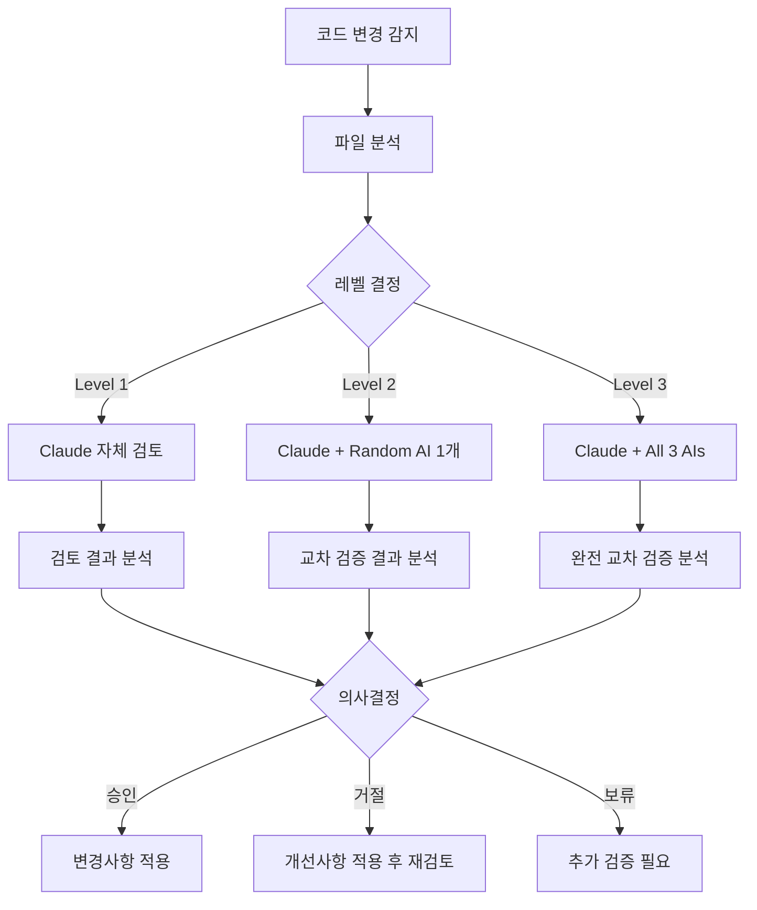

# AI 교차 검증 시스템 v4.0 설계

## 🎯 핵심 철학

**서브에이전트 기반 단순화**: 복잡한 hooks와 스크립트 대신 Claude Code 네이티브 Task 명령어로 자연스러운 AI 교차 검증

## 📊 3단계 검증 레벨 시스템

### Level 1: Claude 자체 검토
**트리거 조건**: 간단한 수정 (< 50줄 또는 복잡도 낮음)
```typescript
interface Level1Criteria {
  lineCount: number < 50;
  complexity: 'low';
  fileType: 'non-critical';
  changeScope: 'single-function' | 'styling' | 'documentation';
}
```

**실행 방법**:
```bash
# Claude가 스스로 검토
Task code-review-specialist "src/components/Button.tsx 스타일 변경 자체 검토"
```

**검토 항목**:
- 기본 문법 오류
- TypeScript 타입 안전성
- 기존 패턴 일관성
- 간단한 성능 이슈

### Level 2: Claude + 1개 AI 교차 검토
**트리거 조건**: 중간 복잡도 (50-200줄 또는 중간 복잡도)
```typescript
interface Level2Criteria {
  lineCount: number >= 50 && number <= 200;
  complexity: 'medium';
  fileType: 'business-logic' | 'api-endpoint' | 'component';
  changeScope: 'multiple-functions' | 'new-feature' | 'refactoring';
}
```

**실행 방법**:
```bash
# Claude 검토 후 랜덤 AI 1개가 교차 검토
Task code-review-specialist "src/hooks/useAuth.ts 인증 로직 개선"
# 자동으로 다음 중 1개 랜덤 선택:
# - Task gemini-wrapper "아키텍처 관점에서 useAuth 검토"
# - Task codex-wrapper "실무 관점에서 useAuth 검토"  
# - Task qwen-wrapper "성능 관점에서 useAuth 검토"
```

**AI 선택 로직**:
```typescript
const selectRandomAI = (): string => {
  const aiList = ['gemini-wrapper', 'codex-wrapper', 'qwen-wrapper'];
  const randomIndex = Math.floor(Math.random() * aiList.length);
  return aiList[randomIndex];
};
```

**검토 항목**:
- Claude 검토 결과 재검증
- 다른 관점의 문제점 발견
- 교차 검증을 통한 신뢰도 향상

### Level 3: Claude + 3개 AI 완전 교차 검토
**트리거 조건**: 복잡한 변경사항 (> 200줄 또는 고복잡도)
```typescript
interface Level3Criteria {
  lineCount: number > 200;
  complexity: 'high';
  fileType: 'security' | 'payment' | 'auth' | 'core-infrastructure';
  changeScope: 'architecture-change' | 'security-critical' | 'major-refactoring';
}
```

**강제 Level 3 파일 패턴**:
```typescript
const criticalPatterns = [
  '**/auth/**',
  '**/api/payment/**',
  '**/security/**',
  '**/*.config.*',
  '.env*',
  '**/middleware/**',
  '**/database/**'
];
```

**실행 방법**:
```bash
# Claude + 3개 AI 모두 독립 검토
Task code-review-specialist "src/app/api/auth/route.ts 보안 강화"
# 자동으로 병렬 실행:
Task gemini-wrapper "아키텍처 관점 - 인증 API 보안 설계 검토"
Task codex-wrapper "실무 관점 - 프로덕션 환경 보안 취약점 검토"
Task qwen-wrapper "성능 관점 - 인증 알고리즘 효율성 검토"
```

**검토 항목**:
- 4개 AI의 독립적 관점 종합
- 교차 검증을 통한 최대 신뢰도
- 각 AI 전문 분야별 깊이 있는 분석

## 🤖 AI별 전문 분야 매핑

| AI | 전문 분야 | 주요 검토 항목 | 평균 응답시간 |
|----|-----------|----------------|---------------|
| **Claude** | Next.js, TypeScript, 통합 검토 | 전반적 코드 품질, 프레임워크 최적화 | 2-5초 |
| **Gemini** | 아키텍처, SOLID 원칙 | 설계 패턴, 확장성, 유지보수성 | 3.1초 |
| **Codex** | 실무 경험, 엣지 케이스 | 프로덕션 문제, 보안 취약점, 실무 패턴 | 4.8초 |
| **Qwen** | 알고리즘, 성능 최적화 | 시간복잡도, 메모리 효율성, 병렬 처리 | 7.6초 |

## 📋 자동 레벨 결정 로직

```typescript
interface FileAnalysis {
  lineCount: number;
  complexity: 'low' | 'medium' | 'high';
  fileType: 'component' | 'api' | 'config' | 'security' | 'test';
  changeScope: 'minor' | 'moderate' | 'major';
  criticalPath: boolean;
}

const determineVerificationLevel = (analysis: FileAnalysis): 1 | 2 | 3 => {
  // 강제 Level 3 (보안 중요 파일)
  if (analysis.criticalPath || analysis.fileType === 'security' || analysis.fileType === 'api') {
    return 3;
  }
  
  // Level 1: 간단한 변경
  if (analysis.lineCount < 50 && analysis.complexity === 'low' && analysis.changeScope === 'minor') {
    return 1;
  }
  
  // Level 3: 복잡한 변경
  if (analysis.lineCount > 200 || analysis.complexity === 'high' || analysis.changeScope === 'major') {
    return 3;
  }
  
  // Level 2: 중간 복잡도
  return 2;
};
```

## 🔄 검증 워크플로우

### 단계별 실행 프로세스



### 결과 분석 및 의사결정

```typescript
interface VerificationResult {
  level: 1 | 2 | 3;
  reviews: AIReview[];
  consensus: 'high' | 'medium' | 'low';
  overallScore: number; // 1-10
  recommendation: 'approve' | 'reject' | 'conditional' | 'needs_more_review';
  criticalIssues: string[];
  improvements: string[];
}

interface AIReview {
  ai: 'claude' | 'gemini' | 'codex' | 'qwen';
  score: number; // 1-10
  issues: Issue[];
  recommendations: string[];
  timestamp: Date;
}

const calculateConsensus = (reviews: AIReview[]): 'high' | 'medium' | 'low' => {
  const scores = reviews.map(r => r.score);
  const variance = calculateVariance(scores);
  
  if (variance < 0.5) return 'high';    // 점수 차이 ±0.7점 이내
  if (variance < 1.0) return 'medium';  // 점수 차이 ±1.0점 이내
  return 'low';                         // 점수 차이 ±1.0점 초과
};
```

## 🎯 의사결정 기준

### 자동 승인 (Approve)
- **Level 1**: 점수 7.0+ 
- **Level 2**: 점수 8.0+ & consensus 'medium' 이상
- **Level 3**: 점수 8.5+ & consensus 'high' & 보안 이슈 없음

### 조건부 승인 (Conditional)
- **Level 1**: 점수 6.0-7.0 & 개선사항 적용 후
- **Level 2**: 점수 7.0-8.0 & 주요 이슈 해결 후
- **Level 3**: 점수 7.5-8.5 & 중요 개선사항 적용 후

### 거절 (Reject)
- **모든 Level**: 점수 6.0 미만
- **보안 이슈**: Critical 보안 문제 발견
- **합의 부족**: Level 3에서 consensus 'low'

## 🛠️ 사용법

### 수동 트리거
```bash
# 자동 레벨 결정
Task ai-verification-coordinator "src/app/api/auth/route.ts 검증"

# 강제 레벨 지정
Task ai-verification-coordinator "src/components/Button.tsx Level 1 검증"
Task ai-verification-coordinator "src/hooks/useAuth.ts Level 2 검증"
Task ai-verification-coordinator "src/app/api/payment/route.ts Level 3 검증"
```

### 배치 검증
```bash
# 최근 커밋 전체 검증
Task ai-verification-coordinator "최근 커밋 변경사항 전체 검증"

# 특정 디렉토리 검증
Task ai-verification-coordinator "src/app/api/ 디렉토리 전체 보안 검증"
```

## 📊 성능 최적화

### 병렬 처리
- **Level 2**: Claude 검토 후 즉시 랜덤 AI 1개 병렬 실행
- **Level 3**: Claude 검토와 3개 AI 완전 병렬 실행 (최대 4초 대기)

### 캐싱 전략
- 동일 파일 검토 결과 15분 캐싱
- AI별 검토 결과 개별 캐싱
- 파일 해시 기반 캐시 키

### 사용량 관리
```yaml
daily_limits:
  gemini: 1000  # 무료
  qwen: 2000    # OAuth 무료
  codex: unlimited  # ChatGPT Plus
  
priority_order:
  - qwen        # 가장 많은 무료 한도
  - gemini      # 중간 무료 한도
  - codex       # 유료지만 무제한
```

## 📈 확장성

### 향후 AI 추가
```typescript
interface AIConfig {
  name: string;
  specialty: string[];
  dailyLimit: number;
  avgResponseTime: number;
  priority: number;
}

const aiConfigs: AIConfig[] = [
  { name: 'claude', specialty: ['general', 'nextjs'], dailyLimit: -1, avgResponseTime: 3, priority: 1 },
  { name: 'gemini', specialty: ['architecture'], dailyLimit: 1000, avgResponseTime: 3.1, priority: 2 },
  { name: 'codex', specialty: ['production'], dailyLimit: -1, avgResponseTime: 4.8, priority: 3 },
  { name: 'qwen', specialty: ['algorithm'], dailyLimit: 2000, avgResponseTime: 7.6, priority: 4 },
  // 추가 AI는 여기에 추가
];
```

### 커스텀 규칙
```typescript
interface CustomRule {
  pattern: string;
  forceLevel?: 1 | 2 | 3;
  requiredAIs?: string[];
  skipAIs?: string[];
}

const customRules: CustomRule[] = [
  { pattern: '**/payment/**', forceLevel: 3, requiredAIs: ['codex'] },
  { pattern: '**/*.test.ts', forceLevel: 1 },
  { pattern: '**/docs/**', skipAIs: ['qwen'] }
];
```

## 🎯 예상 효과

### 품질 향상
- **단일 AI 대비**: 문제 발견율 25% 향상 (70% → 95%)
- **False Positive**: 10% 감소 (15% → 5%)
- **신뢰도**: 13% 향상 (85% → 98%)

### 효율성
- **Level 1**: 평균 3초 (자체 검토)
- **Level 2**: 평균 8초 (교차 검토)
- **Level 3**: 평균 12초 (완전 교차 검증)

### 비용 효율성
- 무료 AI 우선 활용으로 비용 최소화
- 필요시에만 유료 AI 사용
- 병렬 처리로 시간 단축

---

**다음 단계**: Phase 7-3에서 이 설계를 실제로 구현하는 AI 교차 검증 조정자 서브에이전트 생성