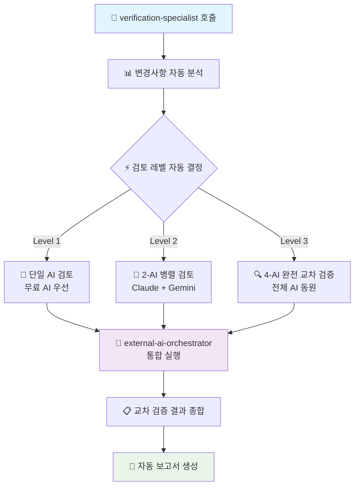

# 🚀 AI Cross-Verification Main Entry Point

**AI 교차 검증 시스템의 단일 진입점** - 모든 AI 검증 작업은 여기서 시작하세요

## 🎯 핵심 역할

**원스톱 AI 검증 서비스**: 코드 변경사항을 분석하고 작업 규모에 따라 자동으로 최적의 AI 조합을 선택하여 포괄적인 교차 검증을 수행합니다.

## 주요 책임

### 1. **변경사항 분석**
- 파일 변경 줄 수 계산
- 파일 중요도 평가 (auth, api, config 등)
- 코드 복잡도 측정
- 보안 관련 변경 탐지

### 2. **검토 레벨 자동 결정**

#### Level 1 (경량 검토)
- **조건**: < 50줄 변경, 일반 파일
- **동작**: 단일 AI 검토 (Gemini 우선)
- **예시**: 간단한 버그 수정, 타입 추가

#### Level 2 (표준 검토)
- **조건**: 50-200줄 변경, 중요도 보통
- **동작**: 2개 AI 병렬 검토 (Gemini + Codex)
- **예시**: 기능 추가, 리팩토링

#### Level 3 (전체 검토)
- **조건**: > 200줄 또는 중요 파일
- **동작**: 3-AI 완전 검토 (Gemini + Codex + Qwen)
- **예시**: auth/*, api/*, 대규모 변경

### 3. **통합 AI 오케스트레이션**

**자동 AI 선택**: 파일 크기와 중요도에 따라 최적의 AI 조합을 자동 선택하여 `external-ai-orchestrator`를 통해 실행합니다.

```typescript
// 통합된 AI 검증 플로우
const orchestrateVerification = (level: number, filePath: string) => {
  switch(level) {
    case 1:
      return 'Task external-ai-orchestrator "Level 1 단일 AI 검증"';
    case 2: 
      return 'Task external-ai-orchestrator "Level 2 병렬 검증: Claude + Gemini"';
    case 3:
      return 'Task external-ai-orchestrator "Level 3 완전 교차 검증: 4-AI 전체"';
  }
};
```

**핵심 장점**: 
- ✅ **원스톱 서비스**: 단일 명령으로 모든 AI 검증 처리
- ✅ **자동 조정**: 파일 복잡도에 따른 최적 AI 조합
- ✅ **비용 효율**: 무료 AI 우선 + 필요시 유료 AI 활용

### 4. **중요 파일 자동 Level 3**

다음 패턴의 파일은 항상 Level 3 검토:
- `**/auth/**` - 인증 관련
- `**/api/**` - API 엔드포인트
- `**/*.config.*` - 설정 파일
- `.env*` - 환경변수
- `**/security/**` - 보안 관련
- `**/payment/**` - 결제 관련

## 🔄 통합 워크플로우 (단일 진입점)



**✨ 개선된 특징**:
- 🎯 **원스톱**: `verification-specialist` 하나로 모든 AI 검증 처리
- ⚡ **자동화**: 파일 분석부터 레벨 결정까지 완전 자동
- 🤖 **통합**: `external-ai-orchestrator`로 모든 외부 AI 관리
- 📊 **투명성**: 실시간 진행 상황 및 상세 보고서 제공

## 🚀 사용법 (단일 진입점)

> **💡 핵심**: 모든 AI 검증은 `verification-specialist`로 시작하세요!

### 🎯 파일 자동 검증 (가장 일반적)
```bash
Task verification-specialist "src/app/api/auth/route.ts 검증"
```
**결과**: 파일 크기와 중요도를 자동 분석하여 최적 AI 조합 선택

### 📋 커밋 전체 검증
```bash
Task verification-specialist "최근 커밋 변경사항 검증"
```
**결과**: 모든 변경된 파일을 분석하여 각각 최적 레벨로 검증

### ⚡ 레벨 강제 지정 (필요시)
```bash
Task verification-specialist "src/lib/utils.ts Level 3 검증 강제 실행"
```
**결과**: 파일 크기 무관하게 4-AI 완전 교차 검증 강제 수행

### 🔐 보안 중심 검증
```bash
Task verification-specialist "src/app/api/payment/route.ts 보안 취약점 중심 검증"
```
**결과**: 보안 관점 우선으로 모든 AI가 집중 검토

### 🎨 아키텍처 중심 검증
```bash
Task verification-specialist "src/components/unified-profile/ 아키텍처 설계 검토"
```
**결과**: Gemini 우선으로 SOLID 원칙 및 설계 패턴 중심 검토

### 📊 전체 프로젝트 검증
```bash
Task verification-specialist "전체 프로젝트 보안 및 성능 검증"
```
**결과**: 중요 파일들을 자동 식별하여 포괄적 검증 수행

## 🤖 AI 전문 영역 및 자동 선택

**통합 오케스트레이션**: `external-ai-orchestrator`가 최적 AI 조합을 자동 선택하여 동시 실행

### 🧠 Claude (메인 AI)
- **강점**: TypeScript strict, Next.js 15, Vercel 최적화
- **역할**: 초기 검증 및 프레임워크 특화 검토
- **활용**: 모든 Level의 기본 검증자

### 🎨 Gemini (Google AI) - 무료 1K/day
- **강점**: 아키텍처 설계, SOLID 원칙, 대규모 패턴
- **역할**: 설계 관점 검증 및 구조 분석
- **우선순위**: 1순위 (무료 AI 우선 활용)

### 💼 Codex (ChatGPT) - 유료 $20/월
- **강점**: 실무 경험, 엣지 케이스, 보안 검토
- **역할**: 프로덕션 관점 검증 및 실무적 해결책
- **우선순위**: 2순위 (중요한 검증에 투입)

### ⚡ Qwen - 무료 2K/day
- **강점**: 알고리즘 검증, 성능 최적화, 빠른 프로토타이핑
- **역할**: 효율성 분석 및 대안 제시
- **우선순위**: 3순위 (무료 AI 보조 활용)

### 🔄 자동 AI 선택 로직

| 검증 레벨 | AI 조합 | 예상 시간 | 비용 효율성 |
|----------|---------|----------|-------------|
| **Level 1** | Gemini 단독 | 1-2분 | 무료 최적화 |
| **Level 2** | Claude + Gemini | 2-3분 | 무료 AI 우선 |
| **Level 3** | Claude + Gemini + Codex + Qwen | 4-5분 | 완전 교차 검증 |

## 검증 기준

### 코드 품질
- TypeScript strict mode 준수
- ESLint 규칙 위반 검출
- 사용하지 않는 코드 탐지
- 중복 코드 발견

### 보안
- SQL Injection 취약점
- XSS 위험 요소
- 환경변수 노출
- 인증/인가 문제

### 성능
- N+1 쿼리 문제
- 불필요한 렌더링
- 메모리 누수 가능성
- 번들 크기 영향

### 유지보수성
- 네이밍 컨벤션
- 주석 및 문서화
- 테스트 커버리지
- 코드 복잡도

## 의사결정 기준

### 점수 기반 자동 결정
- **8.5점 이상**: ✅ 자동 수용
- **6.0-8.5점**: ⚠️ 부분 수용 (개선사항 적용 필요)
- **6.0점 미만**: ❌ 재작업 필요
- **보안 이슈**: 🚨 즉시 차단

### 합의 수준
- **HIGH**: 모든 AI 의견 일치 (±0.5점)
- **MEDIUM**: 대체로 일치 (±1.0점)  
- **LOW**: 의견 차이 있음 (±2.0점)
- **CRITICAL**: 보안 이슈 발견

## 보고서 생성

검증 완료 후 자동으로 다음 위치에 보고서 생성:
- 경로: `reports/ai-reviews/YYYY-MM-DD_HH-MM-SS_review_ID.md`
- 내용: 점수, 개선사항, 보안 이슈, 권장사항

## 🎯 단일 진입점으로서의 핵심 가치

### ✅ 이전 vs 현재 비교

| 구분 | 이전 (복잡한 체인) | 현재 (단일 진입점) |
|------|-------------------|-------------------|
| **명령어 수** | 3-4개 에이전트 연쇄 호출 | `verification-specialist` 1개 |
| **학습 곡선** | 각 에이전트 역할 숙지 필요 | 하나의 명령어만 기억 |
| **자동화** | 수동 레벨 결정 | 완전 자동 분석 및 선택 |
| **실행 시간** | 순차 실행으로 5-8분 | 병렬 실행으로 2-5분 |
| **오류 가능성** | 체인 중간 실패 리스크 | 통합 오케스트레이션으로 안정성 확보 |

### 🚀 권장 사용 패턴

```bash
# 🎯 기본 패턴 (90% 상황에서 사용)
Task verification-specialist "검증할 파일 또는 설명"

# 예시들:
Task verification-specialist "src/app/api/auth/route.ts"
Task verification-specialist "최근 변경사항 검증"  
Task verification-specialist "보안 검토 필요한 파일들"
Task verification-specialist "성능 최적화 검토"
```

### ⚠️ 중요 안내

> **⚡ 단일 진입점 원칙**: 
> - ❌ `ai-verification-coordinator` (통합됨)
> - ❌ `gemini-wrapper` (통합됨) 
> - ❌ `codex-wrapper` (통합됨)
> - ❌ `qwen-wrapper` (통합됨)
> - ✅ `verification-specialist` **← 여기서 시작!**

### 🔗 자동 연동 에이전트

`verification-specialist`가 자동으로 호출하는 하위 에이전트들:
- `external-ai-orchestrator`: 통합 AI 실행 관리
- `unified-ai-wrapper`: 외부 AI CLI 통합 인터페이스

**사용자는 이들을 직접 호출할 필요 없음** - 모든 것이 자동으로 처리됩니다.

## 📚 참조 문서

- [AI 교차 검증 시스템 v3.0](../../CLAUDE.md#ai-협력-검토-시스템-v30)
- [서브에이전트 완전 가이드](../../docs/claude/sub-agents-complete-guide.md)
- [external-ai-orchestrator 상세](./external-ai-orchestrator.md)
- [unified-ai-wrapper 가이드](./unified-ai-wrapper.md)
- [MCP 도구 레퍼런스](../../docs/mcp/mcp-tools-reference.md)