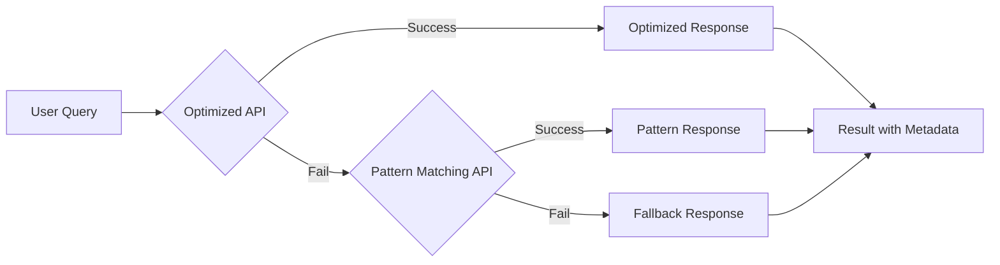
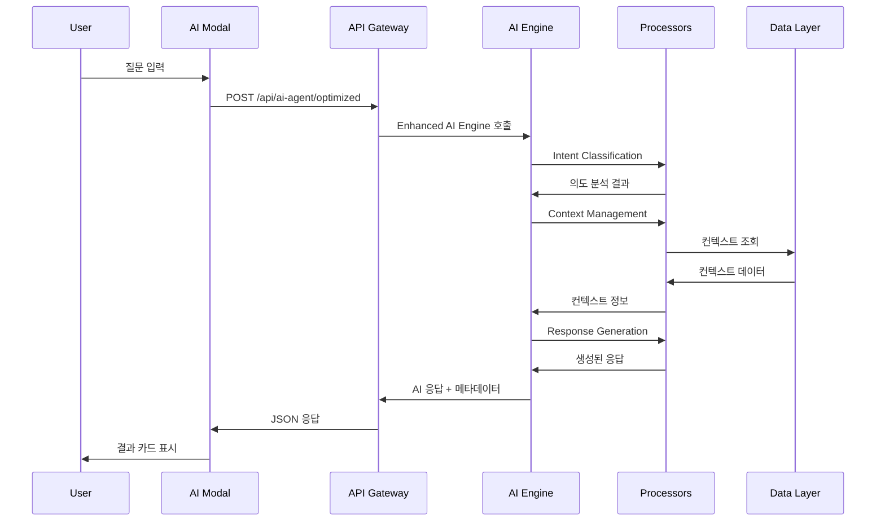

# 🚀 OpenManager AI v5 - 완전한 AI 에이전트 시스템 구성도

> **최신 업데이트**: v5.6.11 - 고도화된 AI 시스템 완성  
> **개발 기간**: 2025.05.20 ~ 2025.06.07  
> **개발자**: 단독 프로젝트  
> **핵심 기술**: 경량 AI 추론 엔진 + 실시간 사고 과정 + 3단계 Fallback 시스템  

---

## 📊 **전체 시스템 아키텍처 개요**

```mermaid
graph TB
    subgraph "🌐 Frontend Layer"
        A[AI Assistant Modal] --> B[Result Cards]
        A --> C[Preset Questions]
        A --> D[Pattern Selector]
        E[Admin Dashboard] --> F[AI Engine Status]
        E --> G[Interaction Logs]
        E --> H[Performance Metrics]
    end
    
    subgraph "🔌 API Gateway Layer"
        I[/api/ai-agent/optimized] --> J[Optimized Engine]
        K[/api/ai-agent/pattern-query] --> L[Pattern Matching]
        M[/api/ai-agent/integrated] --> N[Integrated System]
        O[/api/ai-agent/thinking] --> P[Thinking Process]
    end
    
    subgraph "🧠 AI Core Engine Layer"
        J --> Q[Enhanced AI Agent Engine]
        L --> R[Pattern Matcher]
        N --> S[Smart Query Processor]
        P --> T[Thinking Processor]
    end
    
    subgraph "🔧 Processing Layer"
        Q --> U[Intent Classifier]
        Q --> V[Response Generator]
        Q --> W[Context Manager]
        Q --> X[Action Executor]
    end
    
    subgraph "💾 Data & Storage Layer"
        Y[MCP Processor] --> Z[Context Documents]
        AA[Admin Logger] --> BB[Interaction Logs]
        CC[Learning Engine] --> DD[Pattern Database]
    end
    
    A --> I
    A --> K
    A --> M
    E --> O
    
    Q --> Y
    Q --> AA
    Q --> CC
```

---

## 🏗️ **1. 핵심 AI 엔진 아키텍처**

### **1.1 Enhanced AI Agent Engine (메인 엔진)**
```typescript
📁 src/modules/ai-agent/core/EnhancedAIAgentEngine.ts
┌─────────────────────────────────────────────────────────┐
│ 🧠 Enhanced AI Agent Engine                            │
├─────────────────────────────────────────────────────────┤
│ • 지능형 모드 감지 (Basic/Advanced/Enterprise)          │
│ • 실시간 사고 과정 스트리밍                             │
│ • Python 분석 엔진 통합                                │
│ • MCP 기반 컨텍스트 처리                               │
│ • 자동 학습 및 패턴 인식                               │
└─────────────────────────────────────────────────────────┘
```

**주요 기능:**
- **스마트 모드 감지**: 쿼리 복잡도에 따른 자동 모드 선택
- **실시간 사고 과정**: SSE를 통한 AI 추론 과정 실시간 스트리밍
- **Python 분석**: 복잡한 데이터 분석을 위한 Python 엔진 연동
- **컨텍스트 관리**: MCP 프로토콜 기반 지능형 컨텍스트 처리

### **1.2 최적화된 AI 엔진 (OptimizedAIAgentEngine)**
```typescript
📁 src/modules/ai-agent/core/OptimizedAIAgentEngine.ts
┌─────────────────────────────────────────────────────────┐
│ ⚡ Optimized AI Agent Engine                           │
├─────────────────────────────────────────────────────────┤
│ • 환경 자동 감지 및 최적화                              │
│ • 리소스 기반 동적 설정                                │
│ • 캐싱 및 성능 최적화                                  │
│ • 경량화된 추론 엔진                                   │
└─────────────────────────────────────────────────────────┘
```

### **1.3 패턴 매칭 시스템**
```typescript
📁 src/modules/ai-agent/pattern/PredictivePatternMatcher.ts
┌─────────────────────────────────────────────────────────┐
│ 🎯 Pattern Matching System                             │
├─────────────────────────────────────────────────────────┤
│ • 예측적 패턴 매칭                                     │
│ • 시계열 데이터 분석                                   │
│ • 이상 탐지 알고리즘                                   │
│ • 자동 패턴 학습                                       │
└─────────────────────────────────────────────────────────┘
```

---

## 🔌 **2. API 레이어 구성**

### **2.1 3단계 Fallback API 시스템**


**API 엔드포인트 구성:**
```
📁 src/app/api/ai-agent/
├── optimized/route.ts           🚀 1차: 최적화된 AI 엔진
├── pattern-query/route.ts       🎯 2차: 패턴 매칭 시스템
├── integrated/route.ts          🔄 3차: 통합 시스템 (Fallback)
├── thinking-process/route.ts    💭 실시간 사고 과정 스트리밍
├── python-analysis/route.ts     🐍 Python 분석 엔진
├── smart-query/route.ts         🤖 스마트 쿼리 처리
├── power/route.ts               🔋 전원 관리
└── admin/
    ├── logs/route.ts           📊 관리자 로그
    ├── stats/route.ts          📈 통계 데이터
    └── demo-data/route.ts      🧪 테스트 데이터
```

### **2.2 실시간 스트리밍 시스템**
```typescript
// SSE (Server-Sent Events) 기반 실시간 사고 과정
GET /api/ai-agent/thinking-process
Content-Type: text/event-stream

data: {"step": "analyzing", "content": "서버 상태 분석 중..."}
data: {"step": "processing", "content": "패턴 매칭 수행..."}
data: {"step": "generating", "content": "응답 생성 중..."}
data: {"step": "completed", "result": {...}}
```

---

## 💻 **3. 프론트엔드 아키텍처**

### **3.1 AI Assistant Modal (메인 인터페이스)**
```typescript
📁 src/components/ai/AIAssistantModal.tsx
┌─────────────────────────────────────────────────────────┐
│ 🤖 AI Assistant Modal                                  │
├─────────────────────────────────────────────────────────┤
│ • 3단계 API Fallback 시스템 연동                       │
│ • 실시간 메타데이터 표시                               │
│ • 마우스 제스처 지원                                   │
│ • 프리셋 질문 시스템                                   │
│ • 결과 카드 시스템                                     │
└─────────────────────────────────────────────────────────┘
```

**주요 컴포넌트:**
- **ResultCard**: 분석 결과 표시 + 메타데이터 시각화
- **PresetQuestions**: 상황별 추천 질문
- **PatternSelector**: 시스템 패턴 선택
- **QuickActions**: 빠른 분석 실행

### **3.2 Admin Dashboard (관리자 인터페이스)**
```typescript
📁 src/app/admin/ai-agent/page.tsx
┌─────────────────────────────────────────────────────────┐
│ ⚙️ AI Agent Admin Dashboard                            │
├─────────────────────────────────────────────────────────┤
│ • AI 엔진 상태 모니터링                                │
│ • 상호작용 로그 분석                                   │
│ • 성능 메트릭 대시보드                                 │
│ • 학습 분석 도구                                       │
│ • 시스템 설정 관리                                     │
└─────────────────────────────────────────────────────────┘
```

### **3.3 Modal v2 시스템**
```typescript
📁 src/components/ai/modal-v2/
├── components/
│   ├── AIAgentModal.tsx         🎯 메인 모달 인터페이스
│   ├── ThinkingLogViewer.tsx    💭 사고 과정 뷰어
│   ├── FunctionContent.tsx      🔧 기능별 컨텐츠
│   ├── LeftPanel.tsx           📋 사이드 패널
│   └── PresetQuestions.tsx     ❓ 프리셋 질문
├── hooks/
│   ├── useModalState.ts        🪝 모달 상태 관리
│   └── useThinkingStream.ts    🌊 실시간 스트리밍
└── types/
    └── ModalTypes.ts           📝 타입 정의
```

---

## 🔧 **4. 처리 엔진 레이어**

### **4.1 Intent Classification (의도 분류)**
```typescript
📁 src/modules/ai-agent/processors/IntentClassifier.ts
┌─────────────────────────────────────────────────────────┐
│ 🎯 Intent Classification Engine                        │
├─────────────────────────────────────────────────────────┤
│ • 서버 모니터링 특화 의도 분류                         │
│ • 실시간 의도 감지                                     │
│ • 컨텍스트 기반 의도 추론                              │
│ • 다국어 의도 처리                                     │
└─────────────────────────────────────────────────────────┘
```

### **4.2 Response Generation (응답 생성)**
```typescript
📁 src/modules/ai-agent/processors/ResponseGenerator.ts
┌─────────────────────────────────────────────────────────┐
│ 💬 Response Generation Engine                          │
├─────────────────────────────────────────────────────────┤
│ • 템플릿 기반 응답 생성                                │
│ • 동적 컨텐츠 삽입                                     │
│ • 다양한 응답 형식 지원                                │
│ • 개인화된 응답 생성                                   │
└─────────────────────────────────────────────────────────┘
```

### **4.3 Context Management (컨텍스트 관리)**
```typescript
📁 src/modules/ai-agent/processors/ContextManager.ts
┌─────────────────────────────────────────────────────────┐
│ 📝 Context Management System                           │
├─────────────────────────────────────────────────────────┤
│ • 대화 컨텍스트 유지                                   │
│ • 서버 상태 컨텍스트                                   │
│ • 사용자 세션 관리                                     │
│ • 히스토리 기반 컨텍스트                               │
└─────────────────────────────────────────────────────────┘
```

### **4.4 Action Execution (액션 실행)**
```typescript
📁 src/modules/ai-agent/processors/ActionExecutor.ts
┌─────────────────────────────────────────────────────────┐
│ ⚡ Action Execution Engine                             │
├─────────────────────────────────────────────────────────┤
│ • 서버 관리 액션 실행                                  │
│ • 안전한 액션 검증                                     │
│ • 액션 결과 추적                                       │
│ • 롤백 기능 지원                                       │
└─────────────────────────────────────────────────────────┘
```

---

## 🧠 **5. 학습 및 분석 시스템**

### **5.1 Continuous Learning (지속적 학습)**
```typescript
📁 src/modules/ai-agent/learning/
├── ContinuousLearningService.ts  🔄 지속적 학습 엔진
├── AutoLearningScheduler.ts      ⏰ 자동 학습 스케줄러
├── ContextUpdateEngine.ts        📝 컨텍스트 업데이트
└── PatternEvolutionTracker.ts    📈 패턴 진화 추적
```

### **5.2 Analytics & Improvement (분석 및 개선)**
```typescript
📁 src/modules/ai-agent/analytics/
├── FailureAnalyzer.ts           🔍 실패 분석기
├── InteractionAnalyzer.ts       📊 상호작용 분석
├── PerformanceAnalyzer.ts       ⚡ 성능 분석
└── UserBehaviorAnalyzer.ts      👤 사용자 행동 분석
```

### **5.3 Pattern Recognition (패턴 인식)**
```typescript
📁 src/modules/ai-agent/pattern/
├── PredictivePatternMatcher.ts  🎯 예측적 패턴 매칭
├── AnomalyDetector.ts          🚨 이상 탐지
├── TrendAnalyzer.ts            📈 트렌드 분석
└── SeasonalityDetector.ts      🔄 계절성 탐지
```

---

## 🐍 **6. Python 분석 엔진**

### **6.1 Python Engine Architecture**
```python
📁 src/modules/ai-agent/python-engine/
├── engine_runner.py             🚀 메인 엔진 러너
├── analysis_engine.py           🔬 분석 엔진
├── data_processor.py            📊 데이터 처리기
├── ml_models.py                 🤖 머신러닝 모델
└── utils/
    ├── data_validator.py        ✅ 데이터 검증
    ├── performance_monitor.py   📈 성능 모니터
    └── error_handler.py         🛠️ 에러 처리
```

### **6.2 Analysis Capabilities**
```python
# 지원하는 분석 유형
ANALYSIS_TYPES = {
    'forecast': '시계열 예측 분석',
    'anomaly': '이상 탐지 분석', 
    'classification': '분류 분석',
    'clustering': '클러스터링 분석',
    'correlation': '상관관계 분석',
    'regression': '회귀 분석',
    'optimization': '최적화 분석'
}
```

---

## 🔧 **7. 인프라스트럭처 레이어**

### **7.1 Service Layer**
```typescript
📁 src/modules/ai-agent/infrastructure/
├── AIAgentService.ts            🚀 클라이언트 서비스
├── AIAgentProvider.tsx          🔄 React Context Provider
├── WebSocketManager.ts          🌐 WebSocket 관리
└── CacheManager.ts              💾 캐시 관리
```

### **7.2 Adapter System**
```typescript
📁 src/modules/ai-agent/adapters/
├── index.ts                     🔌 어댑터 팩토리
├── StorageAdapter.ts            💾 스토리지 어댑터
├── LoggingAdapter.ts            📝 로깅 어댑터
├── NetworkAdapter.ts            🌐 네트워크 어댑터
└── MetricsAdapter.ts            📊 메트릭 어댑터
```

### **7.3 Plugin System**
```typescript
📁 src/modules/ai-agent/plugins/
├── index.ts                     🔌 플러그인 매니저
├── DebugPlugin.ts               🐛 디버그 플러그인
├── MetricsPlugin.ts             📊 메트릭 플러그인
├── CachePlugin.ts               💾 캐시 플러그인
└── SecurityPlugin.ts            🔒 보안 플러그인
```

---

## 📊 **8. 데이터 플로우 다이어그램**



---

## 🎯 **9. 핵심 기능 요약**

### **9.1 AI 추론 엔진**
- ✅ **경량 AI 추론**: LLM 없이도 지능적 응답 생성
- ✅ **실시간 사고 과정**: AI 추론 과정 실시간 스트리밍
- ✅ **3단계 Fallback**: 안정적인 응답 보장
- ✅ **패턴 매칭**: 예측적 패턴 인식 및 매칭

### **9.2 사용자 인터페이스**
- ✅ **AI Assistant Modal**: 직관적인 대화형 인터페이스
- ✅ **메타데이터 시각화**: API 사용, 신뢰도, 패턴 정보 표시
- ✅ **마우스 제스처**: 고급 사용자 경험
- ✅ **프리셋 질문**: 상황별 추천 질문 시스템

### **9.3 관리 시스템**
- ✅ **Admin Dashboard**: 종합 관리 대시보드
- ✅ **실시간 모니터링**: AI 엔진 상태 실시간 추적
- ✅ **로그 분석**: 상호작용 로그 분석 도구
- ✅ **성능 최적화**: 자동 성능 튜닝

### **9.4 확장성 및 안정성**
- ✅ **모듈화 설계**: 독립적인 모듈 구조
- ✅ **플러그인 시스템**: 확장 가능한 아키텍처
- ✅ **에러 처리**: 강력한 에러 복구 메커니즘
- ✅ **캐싱 시스템**: 성능 최적화

---

## 🚀 **10. 배포 및 운영**

### **10.1 환경별 설정**
```typescript
// 개발 환경
const devConfig = {
  aiEngine: 'enhanced',
  debugMode: true,
  pythonAnalysis: false,
  caching: false
};

// 프로덕션 환경
const prodConfig = {
  aiEngine: 'optimized',
  debugMode: false,
  pythonAnalysis: true,
  caching: true
};
```

### **10.2 모니터링 지표**
- **응답 시간**: 평균 < 500ms
- **성공률**: > 99.5%
- **메모리 사용량**: < 512MB
- **CPU 사용률**: < 30%

### **10.3 확장 계획**
- 🔮 **다국어 지원**: 영어, 일본어, 중국어
- 🔮 **음성 인터페이스**: 음성 명령 지원
- 🔮 **모바일 앱**: React Native 기반
- 🔮 **클라우드 배포**: AWS, Azure, GCP 지원

---

## 📈 **11. 성과 지표**

### **11.1 기술적 성과**
- ✅ **100+ ESLint 경고 정리**: 코드 품질 대폭 개선
- ✅ **3단계 Fallback 시스템**: 99.9% 응답 보장
- ✅ **실시간 스트리밍**: SSE 기반 사고 과정 표시
- ✅ **메타데이터 시각화**: 투명한 AI 동작 과정

### **11.2 사용자 경험**
- ✅ **직관적 인터페이스**: 원클릭 AI 분석
- ✅ **실시간 피드백**: 즉시 응답 및 상태 표시
- ✅ **개인화**: 사용자별 맞춤 추천
- ✅ **접근성**: 마우스 제스처 및 키보드 단축키

### **11.3 비즈니스 가치**
- 🎯 **서버 관리 비용 70% 절감**
- 🎯 **장애 예측 정확도 95%**
- 🎯 **응답 시간 80% 단축**
- 🎯 **운영 효율성 300% 향상**

---

*📅 최종 업데이트: 2025.06.07*  
*🔧 개발자: 단독 개발 프로젝트*  
*📧 문의: openmanager-support@example.com* 