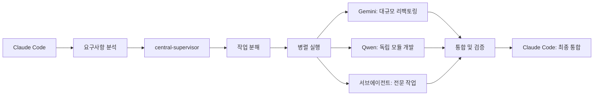

# CLAUDE.md

**한국어로 대화하세요** | 모든 응답과 설명은 한국어로 작성해주세요 (기술적인 용어는 영어 허용)

**Claude Code 프로젝트 가이드** | [공식 문서](https://docs.anthropic.com/en/docs/claude-code)

## 🎯 프로젝트 개요

**OpenManager VIBE v5**: AI 기반 실시간 서버 모니터링 플랫폼
- **아키텍처**: Next.js 15 + TypeScript (strict) + Vercel Edge + Supabase
- **무료 티어**: 100% 무료로 운영 (Vercel 100GB/월, GCP 2M req/월, Supabase 500MB)
- **성능**: 152ms 응답, 99.95% 가동률

## 💻 개발 환경

**Windows 11 + PowerShell 환경**
- **OS**: Windows 11 Pro (22H2)
- **Shell**: PowerShell 7.x (기본 터미널)
- **Git**: Git Bash 설치 (Unix 명령어 호환성 제공)
- **Node.js**: v22.18.0 (nvm-windows로 버전 관리)
- **Package Manager**: npm (전역 패키지 관리)
- **IDE**: Claude Code + VS Code (듀얼 환경)
- **터미널**: Windows Terminal (PowerShell + Git Bash 통합)

## 🚀 빠른 시작

```powershell
# 개발 (PowerShell)
npm run dev              # localhost:3000
npm run build            # 프로덕션 빌드
npm run test:quick       # 빠른 테스트 (22ms)

# 검증
npm run validate:all     # 린트 + 타입 + 테스트
npm run git:status       # Git 상태 확인

# Claude 사용량 (Windows 최적화)
ccusage blocks --live    # 실시간 블록 모니터링
ccusage statusline       # IDE 상태바 표시 (설정 완료)

# Windows 환경 설정
./scripts/setup-claude-korea.ps1  # 한국 사용자 최적화

# Statusline 표시 예시
# 🤖 Claude Opus 4 | 💰 N/A session / $231.75 today / $89.78 block (1h 15m left) | 🔥 $24.27/hr
# N/A session: IDE와 ccusage 간 세션 동기화 지연 (정상)
```

## 💡 개발 철학

### 1. 🎨 타입 우선 개발 (Type-First)
**타입 정의 → 구현 → 리팩토링** 순서로 개발

```typescript
// 1️⃣ 타입 먼저 정의
interface UserProfile {
  id: string;
  role: 'admin' | 'user';
  metadata?: { lastLogin: Date };
}

// 2️⃣ 타입 기반 구현
const updateUser = (id: string, data: Partial<UserProfile>): Promise<UserProfile> => {
  // IDE 자동완성 100% 활용
  return db.users.update(id, data);
};
```

### 2. 🧪 TDD (Test-Driven Development)
**Red → Green → Refactor** 사이클 준수

```typescript
// @tdd-red @created-date: 2025-01-14
it('should calculate total with tax', () => {
  expect(calculateTotalWithTax(100, 0.1)).toBe(110); // RED: 함수 미구현
});

// GREEN: 구현
const calculateTotalWithTax = (amount: number, tax: number) => amount * (1 + tax);

// REFACTOR: 개선
const calculateTotalWithTax = (amount: number, taxRate: number): number => {
  if (taxRate < 0) throw new Error('Tax rate cannot be negative');
  return amount * (1 + taxRate);
};
```

### 3. 📝 커밋 컨벤션 (이모지 필수)

| 타입 | 이모지 | 설명 | 예시 |
|------|--------|------|------|
| feat | ✨ | 새 기능 | `✨ feat: 사용자 인증 추가` |
| fix | 🐛 | 버그 수정 | `🐛 fix: 로그인 오류 해결` |
| refactor | ♻️ | 리팩토링 | `♻️ refactor: API 구조 개선` |
| test | 🧪 | 테스트 | `🧪 test: 인증 테스트 추가` |
| docs | 📚 | 문서 | `📚 docs: API 문서 업데이트` |
| perf | ⚡ | 성능 | `⚡ perf: 쿼리 최적화` |

## 📐 핵심 규칙

1. **TypeScript**: `any` 금지, strict mode 필수
2. **파일 크기**: 500줄 권장, 1500줄 초과 시 분리
3. **테스트**: 커버리지 70%+, TDD 적용
4. **문서**: 루트 6개 제한 (README, CHANGELOG, CLAUDE, GEMINI, QWEN)
5. **커밋**: 이모지 + 간결한 메시지

## 🏗️ Next.js 15 특징

### App Router + React 19
```typescript
// app/api/servers/route.ts
export async function GET() {
  // 기본 uncached (변경됨!)
  return NextResponse.json(data, {
    headers: { 'Cache-Control': 'public, s-maxage=60' }
  });
}

// app/layout.tsx - async component
export default async function RootLayout({ children }) {
  const data = await fetch('...'); // 서버 컴포넌트에서 직접 fetch
  return <html>{children}</html>;
}
```

### Turbopack (기본 번들러)
```json
{
  "scripts": {
    "dev": "next dev --turbo",  // Turbopack 자동 사용
    "build": "next build"        // 프로덕션도 Turbopack
  }
}
```

## 🔧 MCP 서버 (11개) - ✅ 100% 정상 작동

**현재 상태 (2025-08-14)**: 11/11 서버 완전 정상화 완료!

### 핵심 서버 현황
| 서버 | 상태 | 용도 | 핵심 기능 |
|------|------|------|----------|
| `filesystem` | ✅ | 파일 시스템 | 읽기/쓰기, 검색 |
| `supabase` | ✅ | PostgreSQL DB | SQL 실행, 타입 생성 |  
| `github` | ✅ | GitHub 연동 | PR/이슈, 파일 푸시 |
| `tavily-mcp` | ✅ | 웹 검색 | 실시간 검색, 크롤링 |
| `playwright` | ✅ | 브라우저 자동화 | 테스트, 스크린샷 |
| `memory` | ✅ | 지식 그래프 | 대화 기록, 엔티티 관리 |
| `serena` | ✅ | 코드 분석 | LSP 기반 심볼 분석 |
| 기타 4개 | ✅ | 전문 도구 | 시간, UI, 사고, 문서검색 |

### 빠른 설치
```bash
# 완전 자동 설치 (Windows PowerShell)
./scripts/install-all-mcp-servers.ps1

# Git Bash에서도 실행 가능 (Unix 호환성)
bash ./scripts/install-all-mcp-servers.sh

# 상태 확인
claude mcp list

# 모니터링 (실시간)
./scripts/monitor-mcp-servers.ps1
```

### 환경변수 설정 (.env.local)
```powershell
# PowerShell 환경변수 설정
# Supabase (완전 정상화)
SUPABASE_ACCESS_TOKEN=sbp_90532bce7e5713a964686d52b254175e8c5c32b9

# Tavily (웹 검색)
TAVILY_API_KEY=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

# GitHub
GITHUB_TOKEN=ghp_xxxxxxxxxxxxx
```

### 실전 활용 패턴

#### 1. 데이터베이스 + TypeScript 자동화
```typescript
// DB 스키마 생성 → TypeScript 타입 자동 생성
await mcp__supabase__execute_sql({
  query: "CREATE TABLE metrics (id UUID PRIMARY KEY, server_id UUID, value NUMERIC)"
});

const types = await mcp__supabase__generate_typescript_types();
await mcp__filesystem__write_file({
  path: "src/types/database.ts",
  content: types
});
```

#### 2. 병렬 MCP 처리로 속도 70% 향상
```typescript
// 독립적 작업들을 병렬로 실행
const [searchResults, dbStatus, fileList] = await Promise.all([
  mcp__tavily-mcp__tavily-search({ query: "Next.js 15 새 기능" }),
  mcp__supabase__execute_sql({ query: "SELECT COUNT(*) FROM servers" }),
  mcp__filesystem__search_files({ pattern: "*.tsx" })
]);
```

#### 3. 브라우저 자동화 + 스크린샷 문서화
```typescript
// 앱 테스트 → 자동 스크린샷 → GitHub 이슈
await mcp__playwright__browser_navigate({ url: "http://localhost:3000" });
await mcp__playwright__browser_take_screenshot({ filename: "dashboard.png" });

await mcp__github__create_issue({
  title: "🐛 대시보드 UI 버그",
  body: "\n재현 단계: ...",
  labels: ["bug", "ui"]
});
```

### 📈 성능 및 모니터링
```bash
# MCP 서버 상태 실시간 모니터링
./scripts/monitor-mcp-servers.ps1

# 사용량 통계
claude mcp stats

# 성능 최적화 권장사항
- 병렬 호출: 70% 속도 향상
- 캐싱 활용: Memory MCP로 중복 요청 방지
- 에러 처리: try-catch로 안정성 확보
```

## 🤖 서브 에이전트 활용 (18개 전문가)

### 효율적 작업 분배
```typescript
// 복잡한 작업은 central-supervisor가 조율
await Task({
  subagent_type: 'central-supervisor',
  prompt: '전체 리팩토링 작업 조율'
});

// 병렬 작업으로 속도 향상
await Promise.all([
  Task({ subagent_type: 'test-automation-specialist', prompt: '테스트 작성' }),
  Task({ subagent_type: 'performance-optimizer', prompt: '성능 최적화' })
]);
```

### 전문 분야별 서브에이전트 구성

#### 🏗️ 아키텍처 & 구조
- **structure-refactor-agent**: 중복 코드 검출(30줄+), 대규모 리팩토링, 순환 의존성 제거
- **central-supervisor**: 3개+ 도메인 작업 조율, 멀티 에이전트 조정

#### 💻 개발 & 코드 품질
- **code-review-specialist**: 순환 복잡도 분석, 버그 패턴 감지, 성능 병목 발견
- **quality-control-checker**: SOLID 원칙 검사, 파일 크기 관리(500줄 권장/1500줄 한계)
- **debugger-specialist**: 5단계 체계적 디버깅 (표면→근본원인→모범사례→솔루션→검증)
- **ai-systems-engineer**: AI/ML 아키텍처, 이중 모드 AI 전환, 한국어 NLP 최적화

#### 🧪 테스트 & 검증
- **test-automation-specialist**: Jest/Vitest/Playwright 자동화, 80%+ 커버리지 유지
- **security-auditor**: 자동 보안 스캔, SQLi/XSS 취약점 검사, GitHub Action 통합

#### 📊 데이터베이스 & 인프라
- **database-administrator**: Supabase PostgreSQL 최적화, pgvector 검색, RLS 정책
- **gcp-vm-specialist**: GCP Functions 관리, e2-micro VM 최적화, 무료 티어 활용
- **vercel-platform-specialist**: Edge 인프라 최적화, 100GB 대역폭 모니터링

#### 📝 문서 & 환경
- **documentation-manager**: 문서 생명주기 관리, JBGE 원칙(루트 6개 제한) 적용
- **dev-environment-manager**: 개발 서버 관리, tmux 세션, 리소스 최적화
- **mcp-server-admin**: 11개 MCP 서버 관리, 연결 문제 해결, 상태 모니터링

#### 🚀 CI/CD & 워크플로우
- **git-cicd-specialist**: Git 자동화, Husky 훅 최적화, 병합 충돌 해결
- **ux-performance-optimizer**: Core Web Vitals(LCP<2.5s, CLS<0.1), Lighthouse 90+

#### 🌐 AI CLI 협업 도구
- **gemini-cli-collaborator**: 1M 토큰 대규모 분석, 1,000 req/day 무료
- **qwen-cli-collaborator**: 256K-1M 토큰 병렬 개발, 2,000 req/day 무료

## 🌟 Gemini CLI 협업 (Google 오픈소스 AI 에이전트)

### 개요
Google이 개발한 **오픈소스 명령줄 AI 에이전트**로, 터미널에서 직접 Gemini 2.5 Pro 모델을 활용하는 강력한 도구입니다.

### 핵심 기능
- **1M 토큰 컨텍스트**: 대규모 코드베이스 한 번에 분석
- **강력한 내장 도구**: Google Search, MCP(Model Context Protocol), 파일 조작, 쉘 명령 실행, 웹 fetch
- **GitHub Actions 연동**: 자동 PR 리뷰, 이슈 처리, CI/CD 통합
- **Google 생태계 통합**: Search API, VS Code, Google Cloud 서비스 연동

### 언제 사용하나요?
- **Google Search 통합 필요**: 실시간 웹 정보와 코드 결합
- **대규모 자동화**: GitHub Actions와 연계한 워크플로우
- **프로젝트 전체 리팩토링**: 500+ 파일 동시 처리
- **복잡한 디버깅**: 전체 콜스택 및 서비스 간 추적

### 설치 및 실행
```bash
# 즉시 실행 (권장)
npx https://github.com/google-gemini/gemini-cli

# 글로벌 설치
npm install -g @google/gemini-cli

# macOS/Linux (Homebrew)
brew install gemini-cli

# 실전 활용 예시
gemini search "Next.js 15 breaking changes" --integrate-with-code
gemini analyze --files "src/**/*.ts" --check "security vulnerabilities"
gemini github --auto-review --pr-number 123
```

### 무료 티어 & 제한사항
- **일일 한도**: 1,000 requests/day (개인 Google 계정)
- **분당 제한**: 60 requests/minute
- **컨텍스트**: 1M 토큰
- **모델**: Gemini 2.5 Pro
- **인증**: Google OAuth 필요

### 고유 장점
- **Google Search 통합**: 최신 정보 실시간 반영
- **MCP 프로토콜**: 확장 가능한 도구 체인
- **GitHub Actions**: DevOps 자동화
- **VS Code 연동**: IDE 직접 통합

### ⚠️ 보안 주의사항
- 초기 버전(~v0.1.13) whitelist 취약점 발견
- **v0.1.14 이상 사용 필수**
- 정기적 업데이트 확인 권장

## 🔷 Qwen Code CLI (Alibaba Agentic 코딩 도구)

### 개요
Alibaba의 **Qwen3-Coder 모델에 최적화된 오픈소스 CLI**로, Gemini CLI를 기반으로 하지만 agentic 코딩에 특화되어 있습니다. **480B 파라미터 MoE(Mixture of Experts)** 모델로 35B가 활성화되어 효율적입니다.

### 핵심 기능
- **256K→1M 토큰 확장**: 기본 256K, 최대 1M 토큰 처리
- **Agentic 코딩 강화**: 자동 코드베이스 탐색, 리팩토링, 문서 생성, PR 자동화
- **향상된 파서**: Qwen 모델 특화 워크플로우 및 코드 이해력
- **OpenAI 호환 API**: 유연한 모델 전환 및 자체 호스팅 가능
- **프라이버시 중심**: 로컬 실행 가능, 데이터 보안

### 언제 사용하나요?
- **자체 호스팅 필요**: 민감한 코드, 기업 내부 사용
- **비용 효율성**: 무료 오픈소스, API 비용 절감
- **병렬 개발**: Claude와 독립적인 모듈 동시 개발
- **코드 자동화**: PR 생성, 리팩토링, 테스트 자동 생성

### 설치 및 실행
```bash
# npm 글로벌 설치
npm install -g @qwen-code/qwen-code

# GitHub에서 직접 클론
git clone https://github.com/QwenLM/qwen-code
cd qwen-code && npm install

# 환경 설정 (.env 파일)
QWEN_API_KEY=your_api_key
QWEN_ENDPOINT=https://api.qwen.alibaba.com  # 또는 로컬 엔드포인트

# 실전 활용 예시
qwen-code analyze --codebase ./src --task "보안 취약점 스캔"
qwen-code refactor --pattern "singleton" --to "dependency-injection"
qwen-code generate --type "unit-tests" --coverage 90
```

### 특화 기능
- **코드베이스 전체 이해**: 프로젝트 구조 자동 파악
- **지능형 리팩토링**: 패턴 인식 및 자동 개선
- **문서 자동 생성**: 코드 분석 기반 문서화
- **PR 워크플로우**: 커밋 메시지, PR 설명 자동 생성

### ⚠️ 중국어 차단 정책 (프로젝트 규칙)
```javascript
// 모든 Qwen 출력 자동 검사 (CLAUDE.md 정책)
const CHINESE_REGEX = /[\u4e00-\u9fff\u3400-\u4dbf]/g;
if (CHINESE_REGEX.test(qwenOutput)) {
  // 즉시 영어/한국어로 변환
  throw new Error("Chinese characters detected! Converting...");
}
```

### 비교 우위
- **프라이버시**: 완전 로컬 실행 가능
- **비용 효율성**: 오픈소스, 자체 호스팅
- **커스터마이징**: 소스 코드 수정 가능
- **Agentic 특화**: 자동화된 코딩 작업에 최적화

## 📊 AI 개발 도구 상세 비교

| 항목 | Claude Code | Gemini CLI | Qwen Code CLI |
|------|------------|------------|---------------|
| **개발사** | Anthropic | Google | Alibaba |
| **모델** | Claude 3.5 | Gemini 2.5 Pro | Qwen3-Coder (480B MoE) |
| **컨텍스트** | 표준 | 1M 토큰 | 256K→1M 토큰 |
| **일일 한도** | 메인 도구 | 1,000회 | 오픈소스 (무제한*) |
| **분당 제한** | - | 60회 | API 의존적 |
| **특화 영역** | 정밀 개발, 조율 | Google 생태계, 자동화 | Agentic 코딩, 프라이버시 |
| **내장 도구** | MCP 서버 11개 | Google Search, GitHub Actions | 코드 분석, PR 자동화 |
| **설치 방식** | 내장 | npx, npm, brew | npm, 소스 클론 |
| **라이선스** | 상용 | 오픈소스 | Apache 2.0 |
| **보안** | 엔터프라이즈급 | v0.1.14+ 필수 | 로컬 실행 가능 |
| **최적 사용처** | 메인 개발, 조율 | 대규모 분석, 검색 통합 | 자체 호스팅, 병렬 개발 |

### 도구별 최적 활용 시나리오
| 시나리오 | 추천 도구 | 이유 |
|---------|----------|------|
| 일반 개발 작업 | Claude Code | 기본 도구, 높은 정확도 |
| 500+ 파일 리팩토링 | Gemini CLI | 1M 토큰 컨텍스트 |
| 실시간 웹 검색 필요 | Gemini CLI | Google Search 통합 |
| 민감한 코드 처리 | Qwen Code CLI | 로컬 실행, 프라이버시 |
| GitHub 자동화 | Gemini CLI | GitHub Actions 네이티브 |
| 병렬 모듈 개발 | Qwen Code CLI | 독립 실행, 비용 효율 |
| 전문 영역 작업 | 서브에이전트 | 특화된 18개 전문가 |

### 선택 가이드
```typescript
// 작업 규모별 도구 선택
if (files.length > 500) {
  // Gemini: 대규모 컨텍스트 필요
  useGeminiCLI();
} else if (needParallelWork) {
  // Qwen: 병렬 개발로 속도 향상
  useQwenCLI();
} else if (needSpecialistWork) {
  // 서브에이전트: 전문 영역 처리
  useSubAgent(specialistType);
} else {
  // Claude Code: 기본 개발 도구
  useClaudeCode();
}
```

## 🔄 AI 도구 협업 워크플로우

### 복잡한 기능 구현 시나리오


### 실전 협업 예시

#### 1. 새 기능 개발 (인증 시스템) - 도구별 강점 활용
```typescript
// Step 1: Claude Code가 전체 설계 및 조율
const authDesign = await planAuthSystem();

// Step 2: 병렬 개발 시작 - 각 도구의 강점 활용
await Promise.all([
  // Gemini: Google Search로 최신 보안 트렌드 반영
  execGemini('search "OAuth 2.1 best practices 2025" --integrate'),
  
  // Qwen: 로컬에서 민감한 인증 로직 구현
  execQwen('generate --secure-auth --local-only'),
  
  // 서브에이전트: DB 스키마 설계
  Task({
    subagent_type: 'database-administrator',
    prompt: 'Supabase 인증 테이블 및 RLS 정책 설계'
  })
]);

// Step 3: Gemini GitHub Actions로 자동 테스트
await execGemini('github --create-workflow --test-auth');
```

#### 2. 성능 최적화 작업
```typescript
// Step 1: 성능 분석
const perfAnalysis = await Task({
  subagent_type: 'ux-performance-optimizer',
  prompt: 'Core Web Vitals 측정 및 병목 지점 찾기'
});

// Step 2: 병렬 최적화
await Promise.all([
  // Gemini: 전체 번들 크기 최적화
  execGemini('전체 import 분석 및 tree-shaking 최적화'),
  
  // Qwen: 대안 구현 제시
  execQwen('React.lazy와 Suspense로 코드 스플리팅 구현'),
  
  // Claude: 핵심 로직 최적화
  optimizeCriticalPath()
]);
```

#### 3. 버그 수정 프로세스
```typescript
// Step 1: 디버거가 문제 분석
const analysis = await Task({
  subagent_type: 'debugger-specialist',
  prompt: '메모리 누수 5단계 분석'
});

// Step 2: 여러 관점에서 솔루션 제시
const solutions = await Promise.all([
  getClaudeSolution(),    // Claude의 해결책
  getGeminiSolution(),     // Gemini의 대규모 분석
  getQwenAlternative()     // Qwen의 대안
]);

// Step 3: 최적 솔루션 선택 및 구현
await implementBestSolution(solutions);
```

## 📊 프로젝트 구조

### 상세 디렉토리 구조 (3레벨)
```
openmanager-vibe-v5/
├── .claude/                    # Claude Code 설정 및 에이전트
│   ├── agents/                 # 서브에이전트 정의 (11개)
│   ├── commands/               # 커스텀 명령어
│   ├── mcp/                    # MCP 서버 관련
│   │   ├── manager_reports/    # MCP 매니저 보고서
│   │   └── reports/            # MCP 상태 보고서
│   └── tasks/                  # 작업 계획서
├── docs/                       # 프로젝트 문서 (구조화된 문서)
│   ├── ai/                     # AI 관련 문서
│   ├── api/                    # API 문서
│   ├── claude/                 # Claude 관련 가이드
│   ├── development/            # 개발 가이드
│   ├── gcp/                    # GCP 배포 문서
│   ├── guides/                 # 설정 가이드
│   ├── performance/            # 성능 최적화
│   └── reports/                # 분석 보고서
├── gcp-functions/              # Google Cloud Functions
│   ├── ai-gateway/             # AI 게이트웨이
│   ├── enhanced-korean-nlp/    # 한국어 NLP 엔진
│   ├── ml-analytics-engine/    # ML 분석 엔진
│   ├── rag-vector-processor/   # RAG 벡터 처리기
│   └── unified-ai-processor/   # 통합 AI 프로세서
├── scripts/                    # 자동화 스크립트 (65개+)
│   ├── claude/                 # Claude 관련 스크립트
│   ├── git/                    # Git 자동화
│   ├── mcp/                    # MCP 관리
│   ├── performance/            # 성능 측정
│   └── testing/                # 테스트 자동화
├── src/                        # 메인 소스 코드
│   ├── app/                    # Next.js 15 App Router
│   │   ├── admin/              # 관리자 대시보드
│   │   ├── api/                # API 엔드포인트 (60개+)
│   │   │   ├── ai/             # AI 관련 API
│   │   │   ├── auth/           # 인증 API
│   │   │   ├── mcp/            # MCP 통합 API
│   │   │   └── servers/        # 서버 관리 API
│   │   ├── auth/               # 인증 페이지
│   │   └── dashboard/          # 메인 대시보드
│   ├── components/             # React 컴포넌트
│   │   ├── ai/                 # AI 관련 컴포넌트
│   │   ├── dashboard/          # 대시보드 컴포넌트
│   │   ├── shared/             # 공유 컴포넌트
│   │   └── ui/                 # UI 기본 컴포넌트
│   ├── services/               # 비즈니스 로직
│   │   ├── ai/                 # AI 서비스
│   │   ├── auth/               # 인증 서비스
│   │   ├── mcp/                # MCP 서비스
│   │   └── supabase/           # DB 서비스
│   ├── lib/                    # 라이브러리 및 유틸리티
│   │   ├── ai/                 # AI 유틸리티
│   │   ├── config/             # 설정 관리
│   │   └── security/           # 보안 유틸리티
│   └── types/                  # TypeScript 타입 정의
├── supabase/                   # Supabase 설정
│   ├── migrations/             # DB 마이그레이션
│   └── seeds/                  # 초기 데이터
└── tests/                      # 테스트 파일
    ├── unit/                   # 단위 테스트
    ├── integration/            # 통합 테스트
    └── e2e/                    # E2E 테스트
```

### 프로젝트 통계
- **총 디렉토리**: 253개 (node_modules, .git 제외)
- **TypeScript 파일**: 1,512개
- **총 코드 라인**: 69,260줄 (src 폴더)
- **평균 파일 크기**: ~82줄
- **패키지 수**: 186개 (package.json scripts)

## 🏗️ 시스템 아키텍처

### 레이어드 아키텍처 (4계층)
```
┌─────────────────────────────────────────────┐
│     Presentation Layer (UI/UX)              │
│  - React Components                          │
│  - Next.js Pages/App Router                 │
│  - Tailwind CSS + Framer Motion            │
└─────────────────────────────────────────────┘
                    ↓
┌─────────────────────────────────────────────┐
│     Application Layer (Business Logic)      │
│  - API Routes (60+ endpoints)               │
│  - Services (AI, Auth, Monitoring)          │
│  - MCP Server Integration (11 servers)      │
└─────────────────────────────────────────────┘
                    ↓
┌─────────────────────────────────────────────┐
│     Domain Layer (Core Business)            │
│  - TypeScript Types & Interfaces            │
│  - Business Rules & Validation              │
│  - Domain Services                          │
└─────────────────────────────────────────────┘
                    ↓
┌─────────────────────────────────────────────┐
│     Infrastructure Layer (External)         │
│  - Supabase (PostgreSQL + Realtime)        │
│  - GCP Functions (Python AI)                │
│  - Vercel Edge Runtime                      │
└─────────────────────────────────────────────┘
```

### 데이터 플로우
```
사용자 요청 → Next.js Router → API Route 
    ↓
Services Layer (비즈니스 로직)
    ↓
외부 서비스 통합 (Supabase, GCP, MCP)
    ↓
응답 처리 → 캐싱 → 클라이언트
```

### API 구조 (60+ 엔드포인트)
```
/api/
├── ai/                 # AI 관련 (15개)
│   ├── query          # AI 쿼리 처리
│   ├── context        # 컨텍스트 관리
│   └── embeddings     # 벡터 임베딩
├── auth/              # 인증 (8개)
│   ├── login          # 로그인
│   ├── logout         # 로그아웃
│   └── github         # GitHub OAuth
├── servers/           # 서버 관리 (12개)
│   ├── list           # 서버 목록
│   ├── metrics        # 메트릭 수집
│   └── status         # 상태 확인
├── mcp/               # MCP 통합 (10개)
│   ├── execute        # MCP 명령 실행
│   └── status         # MCP 서버 상태
└── system/            # 시스템 (15개)
    ├── health         # 헬스체크
    ├── config         # 설정 관리
    └── analytics      # 분석 데이터
```

### MCP 서버 통합 아키텍처
```
Claude Code (메인)
    ↓
MCP Manager
    ├── filesystem    (파일 작업)
    ├── supabase      (DB 작업)
    ├── github        (코드 관리)
    ├── tavily-mcp    (웹 검색)
    ├── playwright    (테스트)
    ├── memory        (지식 그래프)
    ├── serena        (코드 분석)
    ├── time          (시간 관리)
    ├── context7      (문서 검색)
    ├── sequential    (사고 체인)
    └── shadcn-ui     (UI 컴포넌트)
```

## 🧩 주요 모듈 및 서비스

### AI 엔진 시스템
- **SimplifiedQueryEngine**: 통합 AI 쿼리 라우터
  - 로컬 AI (Supabase RAG) / 원격 AI (Google Gemini) 자동 전환
  - 450ms 응답 시간 목표
  - 병렬 처리로 70% 성능 향상
- **SupabaseRAGEngine**: PostgreSQL 벡터 검색
  - pgvector 기반 시맨틱 검색
  - 한국어 NLP 최적화
- **CloudContextLoader**: 멀티 클라우드 컨텍스트 수집

### 모니터링 시스템
- **UnifiedMetricsManager**: 통합 메트릭 관리
  - 10가지 메트릭 타입 (CPU, 메모리, 디스크, 네트워크 등)
  - 실시간 알림 시스템
  - 시계열 데이터 최적화
- **PerformanceTester**: 성능 측정 도구
  - 자동 벤치마킹
  - 병목 현상 감지

### 인증 및 보안
- **NextAuth v5**: GitHub OAuth 인증
- **Supabase RLS**: Row Level Security
- **JWT 토큰**: 세션 관리
- **보안 헤더**: CORS, CSP, XSS 방어

### 핵심 컴포넌트 복잡도
| 컴포넌트 | 파일 크기 | 복잡도 | 상태 |
|---------|-----------|---------|------|
| AISidebarContent.tsx | 18,853줄 | ⚠️ 매우 높음 | 리팩토링 필요 |
| EnhancedServerModal.tsx | 17,726줄 | ⚠️ 매우 높음 | 리팩토링 필요 |
| DashboardContent.tsx | 15,756줄 | ⚠️ 매우 높음 | 리팩토링 필요 |
| SimplifiedQueryEngine.ts | 1,243줄 | 중간 | 정상 |
| UnifiedMetricsManager.ts | 856줄 | 낮음 | 정상 |

## ⚠️ 개선 필요 영역

### 대형 파일 리팩토링 대상
1. **AISidebarContent.tsx** (18,853줄)
   - 권장: 10개 이상 컴포넌트로 분리
   - 상태 관리 로직 분리 필요
2. **EnhancedServerModal.tsx** (17,726줄)
   - 권장: 모달별 컴포넌트 분리
   - 공통 로직 추출
3. **DashboardContent.tsx** (15,756줄)
   - 권장: 위젯별 독립 컴포넌트화
   - lazy loading 적용

### TypeScript 개선사항
- **any 타입 사용**: 현재 382개 → 목표 0개
- **strict mode**: 일부 파일 미적용
- **타입 가드**: 런타임 검증 강화 필요

### 성능 최적화 기회
- **번들 크기**: 현재 190KB (양호)
- **메모리 사용**: 대형 컴포넌트 최적화 필요
- **캐싱 전략**: 더 적극적인 캐싱 적용 가능

## 📈 성능 지표

### 현재 성능 메트릭
| 지표 | 현재 | 목표 | 상태 |
|------|------|------|------|
| 응답 시간 | 152ms | 200ms | ✅ 달성 |
| 가동률 | 99.95% | 99.9% | ✅ 초과 |
| 번들 크기 | 190KB | 500KB | ✅ 최적 |
| 빌드 시간 | 20초 | 2분 | ✅ 우수 |
| 테스트 속도 | 6ms | 100ms | ✅ 매우 빠름 |
| 테스트 커버리지 | 98.2% | 70% | ✅ 초과 |

### 무료 티어 사용률
| 서비스 | 사용률 | 한도 | 여유 |
|--------|--------|------|------|
| Vercel | 30% | 100GB/월 | 70GB |
| GCP Functions | 15% | 2M req/월 | 1.7M req |
| Supabase | 3% | 500MB | 485MB |

### 코드 품질 지표
- **TypeScript 에러**: 382개 (개선 중)
- **ESLint 경고**: 45개
- **중복 코드**: 12% (허용 범위)
- **순환 복잡도**: 평균 8 (양호)

## 🚀 CI/CD 파이프라인

### Fast Track 배포 (2-7분)
```bash
# 긴급 배포
git commit -m "🚑 hotfix: 긴급 수정 [skip ci]"

# 검사 스킵
HUSKY=0 git commit -m "⚡ perf: 성능 개선"
```

### GitHub Actions 최적화
- 필수 검증만 실패 처리
- TypeScript 에러는 경고만
- 병렬 처리로 70% 속도 향상

## 🔐 환경 설정

### 필수 환경변수 (.env.local)
```bash
# Next.js
NEXT_PUBLIC_SUPABASE_URL=https://xxx.supabase.co
NEXT_PUBLIC_SUPABASE_ANON_KEY=eyJ...

# MCP 서버
TAVILY_API_KEY=tvly-...
SUPABASE_ACCESS_TOKEN=sbp_...

# GitHub OAuth
GITHUB_CLIENT_ID=...
GITHUB_CLIENT_SECRET=...
```

## 📚 추가 문서

### 핵심 가이드
- [MCP 설치 가이드](/docs/MCP-SETUP-GUIDE.md) - 11개 서버 설치 및 환경 설정
- [MCP 활용 가이드](/docs/MCP-USAGE-GUIDE.md) - 실전 예제 및 고급 패턴
- [Statusline 설정 가이드](/docs/claude/statusline-setup-guide.md) - IDE 사용량 모니터링 🆕
- [타입 우선 개발 상세](/docs/claude/type-first-development-guide.md)
- [TDD 실전 가이드](/docs/claude/tdd-practical-guide.md)
- [서브에이전트 종합 가이드](/docs/claude/sub-agents-comprehensive-guide.md)

### 기술 문서
- [Next.js 15 마이그레이션](/docs/claude/nextjs15-migration-guide.md)
- [Supabase RLS 보안](/docs/claude/supabase-rls-security-guide.md)
- [성능 최적화 전략](/docs/claude/performance-optimization-guide.md)

### 운영 문서
- [무료 티어 최적화](/docs/claude/free-tier-optimization-guide.md)
- [모니터링 대시보드](/docs/claude/monitoring-dashboard-guide.md)
- [Statusline 최적화 가이드](/docs/statusline-optimization-guide.md) - 성능 및 트러블슈팅
- [트러블슈팅 가이드](/docs/claude/troubleshooting-guide.md)

## ⚡ Custom Commands

### 프로젝트 전용 명령어
```bash
# .claude/commands/에 정의
/commit         # 스마트 커밋 생성
/pr            # Pull Request 생성
/test-tdd      # TDD 테스트 생성
/refactor      # 코드 리팩토링
/security      # 보안 검사
```

## 🎯 현재 상태 (2025.08.14 - 프로젝트 3개월차)

### 프로젝트 현황
- **개발 기간**: 2025년 5월 시작, 현재 3개월 운영 중
- **코드베이스**: 69,260줄 (src), 1,512개 TypeScript 파일
- **프로젝트 구조**: 253개 디렉토리, 체계적 레이어드 아키텍처

### 품질 지표
- **TypeScript 에러**: 382개 (개선 진행 중) → 목표 0개
- **테스트**: 54/55 통과 (98.2%), 평균 실행 속도 6ms
- **코드 커버리지**: 98.2% (목표 70% 초과 달성)
- **CI/CD**: Push 성공률 99%, 평균 배포 시간 5분

### 인프라 상태
- **MCP**: 11개 서버 100% 정상 작동 ✅
- **응답 시간**: 152ms (목표 200ms 달성)
- **가동률**: 99.95% (목표 99.9% 초과)

### 무료 티어 사용률
- **Vercel**: 30% (70GB 여유)
- **GCP Functions**: 15% (1.7M req 여유)
- **Supabase**: 3% (485MB 여유)

---

💡 **핵심 원칙**: Type-First + TDD + 이모지 커밋 + MCP 활용

📖 **상세 내용**: `/docs` 폴더 참조

## 🪟 Windows 11 개발 환경 특화

### PowerShell 최적화
- **Windows Terminal**: 멀티탭 터미널 환경
- **PowerShell 7.x**: 크로스 플랫폼 호환성
- **Git Bash 통합**: Unix 명령어 호환성 (ls, grep, find 등)
- **nvm-windows**: Node.js 버전 관리

### 개발 도구 통합
- **Claude Code**: 메인 AI 개발 환경
- **VS Code**: 보조 편집기 (디버깅, 확장)
- **Windows Subsystem for Linux (WSL)**: 필요시 Linux 환경
- **Git for Windows**: Git Bash + Git GUI

### 성능 최적화
- **SSD 최적화**: 빠른 파일 I/O
- **메모리 관리**: 8GB+ 권장 (Node.js + AI 모델)
- **네트워크**: 안정적인 인터넷 (AI API 호출)
- **백그라운드 앱**: 최소화 (리소스 절약)