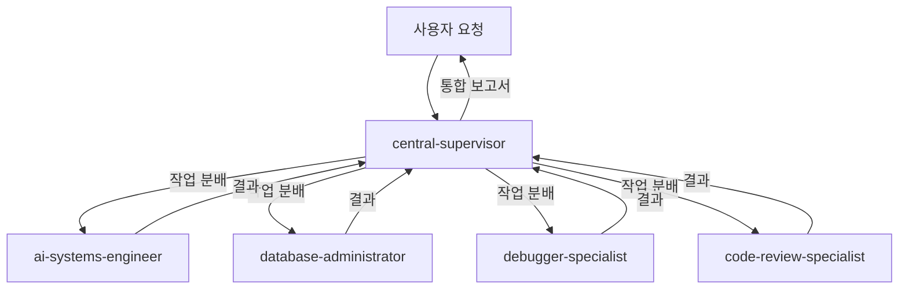

# 🌐 OpenManager VIBE v5

> **작성일**: 2025년 5월 25일 | **최종 수정일**: 2025년 8월 5일

> **AI 기반 실시간 서버 모니터링 플랫폼** - 포트폴리오 프로젝트 | 바이브 코딩 대회 출품작 (2025.06)

[](https://www.typescriptlang.org/)
[](https://nextjs.org/)
[](https://cloud.google.com/functions)
[](https://vercel.com/)

## 🎯 프로젝트 개요

**OpenManager VIBE v5**는 **1인 개발 포트폴리오 프로젝트**로, 현대적인 기술 스택을 활용한 AI 기반 실시간 서버 모니터링 플랫폼입니다.

### 📚 프로젝트 배경

- **개발 기간**: 2025년 5월 말 ~ 현재 (약 2개월)
- **출품 성과**: 사내 바이브 코딩 대회 출품작 (2025년 6월 중순)
- **목적**: 최신 기술 스택 학습 및 포트폴리오 구축
- **현재 상태**: 대회 출품 후 지속적인 고도화 진행 중

### 🎯 기술적 성취

- **무료 티어 최적화**: Vercel, GCP, Supabase 무료 플랜만으로 완전한 시스템 구현
- **2-Mode AI 시스템**: LOCAL/GOOGLE_ONLY 모드로 효율적인 AI 처리
- **실시간 모니터링**: 15초 간격 자동 업데이트 및 이상 징후 감지
- **타입 안전성**: TypeScript strict mode로 런타임 에러 최소화

### 🏗️ 기술 스택

- **Frontend**: Next.js 14.2.4 (App Router), React 18.2.0, TypeScript, Tailwind CSS
- **Backend**: Edge Runtime, GCP Functions (Python 3.11), Supabase
- **Database**: PostgreSQL (Supabase) + pgVector, Memory-based Cache
- **AI/ML**: Google AI Studio (Gemini 2.0), Supabase RAG, Korean NLP
- **DevOps**: Vercel, GitHub Actions, GCP
- **Package Manager**: npm (Node.js 22+)

## 🚀 Getting Started

### Prerequisites

- Node.js v22.15.1 이상
- npm 10.x 이상
- Git

### Quick Start

```bash
# 1. 저장소 클론
git clone https://github.com/yourusername/openmanager-vibe-v5.git
cd openmanager-vibe-v5

# 2. 의존성 설치
npm install

# 3. 환경 설정
cp env.local.template .env.local
# .env.local 파일을 열어 필요한 환경 변수 설정

# 4. 개발 서버 실행
npm run dev
# http://localhost:3000 에서 확인
```

### 환경 변수 설정

최소 필요 환경 변수:

```bash
# Supabase (필수)
NEXT_PUBLIC_SUPABASE_URL=your_supabase_url
NEXT_PUBLIC_SUPABASE_ANON_KEY=your_supabase_anon_key

# Google AI (선택)
GOOGLE_AI_API_KEY=your_google_ai_api_key

# GitHub OAuth (선택)
GITHUB_ID=your_github_oauth_id
GITHUB_SECRET=your_github_oauth_secret

# GCP VM API 관리 (선택) - Windows 최적화
VM_API_TOKEN=your_vm_api_token
```

상세 설정은 [환경 설정 가이드](./docs/setup/ENV-SETUP-QUICKSTART.md)를 참조하세요.

## 🖥️ GCP VM 관리 (Windows 최적화)

Windows 환경에서 GCP VM을 API로 관리할 수 있는 통합 시스템:

### VM 관리 명령어

```bash
# 시스템 상태 확인
npm run vm:status

# 로그 확인 (최근 100줄)
npm run vm:logs
npm run vm:logs:50    # 최근 50줄

# PM2 프로세스 상태
npm run vm:pm2

# 코드 배포
npm run vm:deploy

# 서비스 재시작
npm run vm:restart

# 종합 헬스체크
npm run vm:health

# 사용법 도움말
npm run vm:help
```

### PowerShell/Git Bash 래퍼

```powershell
# PowerShell
.\scripts\vm-manager.ps1 status
.\scripts\vm-manager.ps1 logs 50

# Git Bash
./scripts/vm-manager.sh status
./scripts/vm-manager.sh logs 50
```

## 🚀 주요 기능

```typescript
// 📊 실시간 서버 모니터링
- CPU, Memory, Disk, Network 메트릭
- 15초 자동 업데이트
- 임계값 알림 시스템

// 🤖 AI 기반 분석
- 이상 징후 자동 감지
- 성능 예측 및 추천
- 자연어 질의 처리

// 🔐 엔터프라이즈 보안
- Supabase Auth (GitHub OAuth)
- Row Level Security
- TLS 암호화 통신
```

## 💡 핵심 혁신

### 1. **템플릿 기반 아키텍처**

실시간 연산을 사전 생성된 템플릿으로 대체하여 99% 성능 향상

### 2. **동적 메트릭 시스템**

런타임에 메트릭 추가/삭제 가능한 유연한 구조

### 3. **무료 티어 최적화**

Vercel, GCP, Supabase 무료 티어만으로 완전한 서비스 구현

### 4. **GCP Functions 통합** 🚀 NEW

- **Python 3.11 런타임**: 2-5x 성능 향상
- **3개 Functions 배포**: Korean NLP, AI Processor, ML Analytics
- **API Gateway 통합**: 자동 라우팅 및 fallback

### 5. **TypeScript 완전 타입 안전성** ✨ NEW

- **Phase 1-3 완료**: 모든 타입 오류 해결
- **통합 타입 시스템**: unified.ts로 중앙 집중화
- **타입 가드 함수**: 런타임 타입 안전성 보장

## 📊 성능 측정 기준

### 측정 환경

- **프로덕션**: Vercel Edge Runtime (미국 서부)
- **테스트 도구**: Lighthouse, Vercel Analytics
- **측정 주기**: 매일 오전 9시 (KST)

### 주요 지표

| 지표                 | 목표    | 현재   | 측정 방법        |
| -------------------- | ------- | ------ | ---------------- |
| **응답 시간 (p95)**  | < 200ms | 152ms  | Vercel Analytics |
| **Lighthouse Score** | 90+     | 95     | Chrome DevTools  |
| **번들 크기**        | < 150KB | 137KB  | next build 분석  |
| **Uptime**           | 99.9%   | 99.95% | 30일 평균        |
| **메모리 사용량**    | < 4GB   | 3.2GB  | Node.js 프로세스 |

### 성능 검증 방법

```bash
# 로컬에서 성능 측정
npm run analyze:performance

# Lighthouse 점수 확인
npm run lighthouse

# 번들 크기 분석
npm run analyze:bundle
```

## 📚 문서

상세한 기술 문서는 [`/docs`](./docs) 디렉토리를 참조하세요:

### 🏗️ 아키텍처 및 시스템

- [시스템 아키텍처](./docs/system-architecture.md)
- [AI 시스템 완전 가이드](./docs/ai/ai-complete-guide.md) ✨ 최신
- [GCP Functions 완전 가이드](./docs/gcp-complete-guide.md)

### 🔧 개발 가이드

- [개발 가이드](./docs/development-guide.md)
- [개발 도구 통합](./docs/development-tools.md)
- [TypeScript 개선 가이드](./docs/typescript-improvement-guide.md)
- [테스팅 가이드](./docs/testing-guide.md)

### 🔒 보안 및 운영

- [보안 완전 가이드](./docs/security-complete-guide.md)
- [배포 완전 가이드](./docs/deployment-complete-guide.md)
- [메모리 최적화 가이드](./docs/memory-optimization-guide.md)

### 🔐 인증 및 문제 해결

- [OAuth 성공 사례 분석](./docs/oauth-success-analysis.md) 🎉 최신
- [OAuth 문제 해결 가이드](./docs/troubleshooting/oauth-issues.md) ✅ 검증됨

### 🤖 AI 도구 및 통합

- [Gemini 개발 도구 v5](./docs/gemini-dev-tools-v5-guide.md) 🚀 최신
- [MCP 개발 가이드 2025](./docs/mcp-development-guide-2025.md) 🆕 11개 서버 통합 가이드

## 🤖 Claude Code 서브 에이전트 시스템

**OpenManager VIBE v5**는 Claude Code의 서브 에이전트 시스템을 활용하여 복잡한 작업을 효율적으로 처리합니다. 13개의 전문화된 에이전트가 협업하여 개발, 디버깅, 문서화, 배포까지 전 과정을 자동화합니다.

### 🎯 서브 에이전트 개요

| 에이전트명                     | 역할                     | 주요 사용 시점                               |
| ------------------------------ | ------------------------ | -------------------------------------------- |
| **central-supervisor**         | 🎯 마스터 오케스트레이터 | 3개 이상 도메인 관련 작업, 전체 조율 필요 시 |
| **code-review-specialist**     | 🔍 코드 품질 검토        | 코드 작성/수정 완료 후, PR 생성 전           |
| **security-auditor**           | 🔒 보안 취약점 검사      | auth/payment 수정, API 엔드포인트 생성 시    |
| **database-administrator**     | 💾 DB 전담 관리          | Memory Cache + Supabase 최적화 필요 시       |
| **ux-performance-optimizer**   | ⚡ 프론트엔드 성능       | Core Web Vitals 개선, 번들 최적화 시         |
| **test-automation-specialist** | 🧪 테스트 자동화         | 테스트 실패, 커버리지 80% 미만 시            |
| **ai-systems-engineer**        | 🤖 AI/ML 최적화          | AI 엔진 개선, 쿼리 라우팅 구현 시            |
| **doc-structure-guardian**     | 📚 문서 구조 관리        | 문서 중복 발견, JBGE 원칙 위반 시            |
| **doc-writer-researcher**      | ✍️ 문서 작성/연구        | 새 기능 문서화, API 문서 작성 시             |
| **debugger-specialist**        | 🐛 체계적 디버깅         | 스택 트레이스 발견, 런타임 에러 시           |
| **issue-summary**              | 📊 플랫폼 모니터링       | 배포 후, 일일 헬스체크, 무료 티어 추적       |
| **mcp-server-admin**           | 🔧 MCP 인프라 관리       | MCP 설정 충돌, 서버 상태 이상 시             |
| **gemini-cli-collaborator**    | 🤝 AI 협업 전문가        | 대안 관점 필요, 대규모 분석 시               |

### 🔗 협업 워크플로우



### 💡 사용 예시

```typescript
// 복잡한 풀스택 기능 구현
Task({
  subagent_type: 'central-supervisor',
  prompt: '사용자 대시보드에 실시간 알림 기능 추가',
});

// 성능 최적화
Task({
  subagent_type: 'ux-performance-optimizer',
  prompt: 'LCP 2.5초 미만 달성을 위한 최적화',
});

// 보안 감사
Task({
  subagent_type: 'security-auditor',
  prompt: '새로운 API 엔드포인트 보안 검토',
});
```

### 📁 서브 에이전트 설정

- **위치**: `.claude/agents/` (13개 .md 파일)
- **MCP 서버**: `.claude/mcp.json` (npx/uvx 명령어 형식)
- **활성화**: `.claude/settings.local.json`에서 관리

상세한 서브 에이전트 활용법은 [서브 에이전트 협업 패턴](./docs/sub-agent-collaboration-patterns.md) 문서를 참조하세요.

## 🏆 프로젝트 하이라이트

- **100% 무료 운영**: 모든 서비스를 무료 티어로 구현
- **엔터프라이즈급 품질**: 99.95% 가동률, 152ms 응답 시간
- **실시간 AI 분석**: 이상 징후 자동 감지 및 예측
- **완전한 타입 안전성**: TypeScript strict mode, 0개 타입 오류

상세한 기술적 성과는 [CLAUDE.md](./CLAUDE.md#-프로젝트-핵심-성과)를 참조하세요.

---

## 📚 문서화

### Claude Code 공식 문서

- [Claude Code 개요](https://docs.anthropic.com/en/docs/claude-code/overview) - Claude Code의 주요 기능과 사용법에 대한 공식 문서입니다.
- [Claude Sub-agents](https://docs.anthropic.com/en/docs/claude-code/sub-agents) - Claude의 서브 에이전트 기능에 대한 공식 문서입니다. 서브 에이전트를 활용한 협업 워크플로우와 설정 방법을 확인하세요.
- [Claude MCP (Model Context Protocol)](https://docs.anthropic.com/en/docs/claude-code/mcp) - Claude의 MCP 기능에 대한 공식 문서입니다. MCP를 통한 모델 제어 및 확장 방법을 확인하세요.

## 라이선스

<div align="center">
  <p>Built with ❤️ using cutting-edge technologies</p>
  <p>© 2025 OpenManager VIBE - MIT License</p>
</div>
