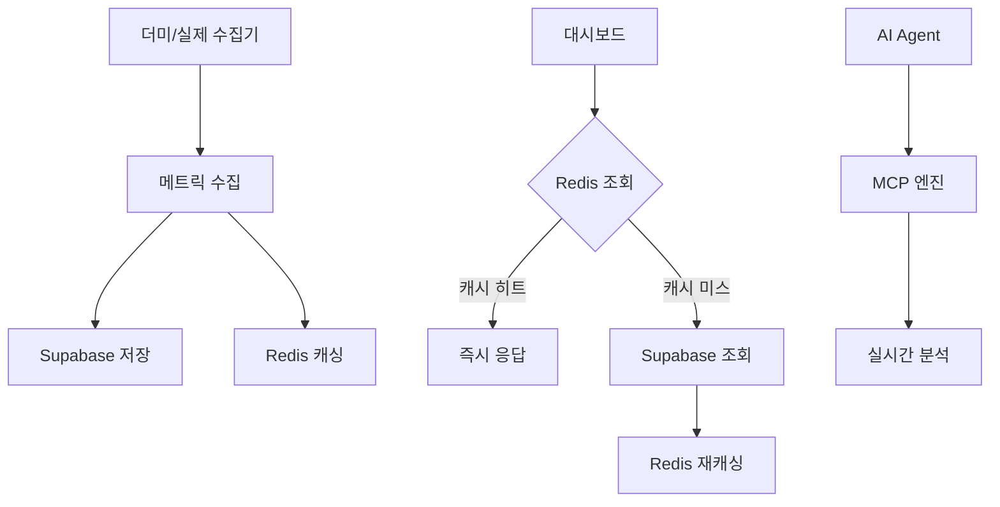

# 🚀 OpenManager Vibe v5 - 실제 서버 모니터링 플랫폼

**AI 기반 실시간 서버 모니터링 및 분석 시스템**  
**더미 데이터에서 실제 수집기로 완벽 전환 가능**

[](https://nextjs.org/)
[](https://www.typescriptlang.org/)
[](https://tailwindcss.com/)
[](https://supabase.com/)
[](https://redis.io/)

## 🎯 **프로젝트 개요**

OpenManager Vibe v5는 **더미 시뮬레이터에서 출발하여 실제 서버 모니터링으로 완벽 전환**이 가능한 차세대 인프라 관리 플랫폼입니다. 

### 🎉 **핵심 설계 원칙**

> **"더미 데이터 생성기는 단지 입력값 공급자일 뿐"**  
> **"수집 → 저장 → 조회 → 분석 → 응답 과정은 모두 실제 환경과 동일"**

- ✅ **플러그형 수집기**: 더미 → Prometheus → CloudWatch → Custom API 즉시 교체
- ✅ **이중화 저장소**: Supabase (24시간 보존) + Redis (실시간 캐시)
- ✅ **지능형 조회**: Redis → Supabase Fallback 구조
- ✅ **AI 기반 분석**: MCP 엔진 기반 실시간 인과관계 분석

---

## 🏗️ **시스템 아키텍처**

### 📊 **데이터 플로우**


### 🔧 **수집기 아키텍처**
```typescript
interface MetricCollector {
  collectMetrics(serverId: string): Promise<ServerMetrics>;
  getServerList(): Promise<string[]>;
  isServerOnline(serverId: string): Promise<boolean>;
}

// 지원하는 수집기들
✅ DummyCollector      // 개발/테스트용
✅ PrometheusCollector // Kubernetes 클러스터
✅ CloudWatchCollector // AWS EC2 인스턴스
✅ CustomAPICollector  // 온프레미스 서버
```

---

## 🎮 **모드별 운영 가이드**

### 🧪 **더미 모드** (개발/테스트용)
```bash
# 환경변수 설정
COLLECTOR_MODE=dummy

# 특징
- 30대 서버 시뮬레이션 (K8s 10대 + AWS 10대 + 온프레미스 10대)
- 실시간 데이터 변화 (시간별/노이즈 변동)
- 외부 의존성 없음
- 빠른 개발/테스트 가능
```

### 🚀 **프로덕션 모드** (실제 운영)
```bash
# 환경변수 설정
COLLECTOR_MODE=production

# 활성화되는 수집기들
PROMETHEUS_ENDPOINT=http://prometheus:9090     # K8s 모니터링
AWS_ACCESS_KEY_ID=your-key                     # EC2 모니터링  
ONPREM_API_ENDPOINT=https://monitoring.com     # 온프레미스 모니터링
```

---

## 🗄️ **저장소 구조**

### 📦 **Supabase (영구 저장소)**
```sql
-- 24시간 보존, 자동 정리, 인덱스 최적화
CREATE TABLE server_metrics (
  server_id VARCHAR(50),
  timestamp TIMESTAMP WITH TIME ZONE,
  cpu_usage NUMERIC(5,2),
  memory_usage NUMERIC(5,2),
  disk_usage NUMERIC(5,2),
  -- ... 전체 메트릭
  raw_data JSONB
);
```

### ⚡ **Redis (실시간 캐시)**
```bash
# 키 구조: server:{hostname}:latest
# TTL: 300초 (5분)
# 용도: 최신 메트릭 즉시 응답
```

### 🔍 **지능형 조회 전략**
```typescript
async getLatestMetrics(serverId: string) {
  // 1. Redis 우선 조회 (빠른 응답)
  const cached = await redis.get(`server:${serverId}:latest`);
  if (cached) return cached;
  
  // 2. Supabase 조회 (정확한 데이터)
  const latest = await supabase.getLatest(serverId);
  
  // 3. Redis 재캐싱 (다음 요청 최적화)
  await redis.setex(`server:${serverId}:latest`, 300, latest);
  return latest;
}
```

---

## 🤖 **AI 분석 엔진**

### 🧠 **MCP 기반 질의 처리**
```typescript
// 자연어 → 구조화된 분석
"DB-EU-002 서버에 문제가 있나요?"
↓
{
  intent: "server_health_check",
  entities: { serverId: "DB-EU-002" },
  analysis: "CPU 85%, 메모리 92% - 즉시 확인 필요"
}
```

### 📊 **실시간 인과관계 분석**
- **성능 병목점 식별**: 리소스 사용 패턴 분석
- **이상 징후 탐지**: 임계치 기반 조기 경고
- **연관성 분석**: 서버 간 의존성 추론
- **예측적 분석**: 트렌드 기반 리소스 예측

---

## 🔄 **실제 수집기로 전환하기**

### 1️⃣ **Prometheus 연동** (Kubernetes)
```bash
# 환경변수 추가
COLLECTOR_MODE=production
PROMETHEUS_ENDPOINT=http://prometheus.kube-system:9090
PROMETHEUS_API_KEY=optional-bearer-token

# 자동으로 활성화됨
✅ node_exporter 메트릭 수집
✅ PromQL 기반 CPU/메모리/디스크 조회
✅ 서비스 디스커버리 지원
```

### 2️⃣ **CloudWatch 연동** (AWS EC2)
```bash
# AWS 자격증명 설정
AWS_ACCESS_KEY_ID=your-access-key
AWS_SECRET_ACCESS_KEY=your-secret-key
AWS_REGION=us-east-1

# 자동으로 활성화됨
✅ EC2 인스턴스 자동 발견
✅ CloudWatch 메트릭 수집
✅ EBS 볼륨 및 네트워크 분석
```

### 3️⃣ **Custom API 연동** (온프레미스)
```bash
# API 엔드포인트 설정
ONPREM_API_ENDPOINT=https://monitoring.company.local
ONPREM_API_KEY=your-api-key

# 필요한 API 엔드포인트
GET /api/servers                    # 서버 목록
GET /api/servers/{id}/metrics       # 메트릭 조회
GET /api/servers/{id}/status        # 상태 확인
```

---

## 🚦 **빠른 시작**

### **🧪 더미 모드로 체험하기**
```bash
# 1. 저장소 클론
git clone https://github.com/your-username/openmanager-vibe-v5.git
cd openmanager-vibe-v5

# 2. 의존성 설치
npm install

# 3. 더미 모드 설정
echo "COLLECTOR_MODE=dummy" > .env.local
echo "REDIS_URL=redis://localhost:6379" >> .env.local

# 4. 개발 서버 시작
npm run dev
```

### **🚀 프로덕션 모드로 전환**
```bash
# 1. Supabase 데이터베이스 설정
psql -h your-project.supabase.co -f scripts/setup-database.sql

# 2. 환경변수 설정
cp docs/environment-setup.md .env.local  # 가이드 참조

# 3. 프로덕션 빌드
npm run build
npm start
```

---

## 📁 **프로젝트 구조**

```
📁 openmanager-vibe-v5/
├── 🗄️ scripts/
│   └── setup-database.sql         # Supabase 스키마
├── 📚 docs/
│   └── environment-setup.md       # 환경설정 가이드
├── 🧱 src/
│   ├── 🔧 config/
│   │   └── collectors.ts          # 수집기 중앙 설정
│   ├── ⚙️ services/
│   │   ├── storage.ts             # Supabase + Redis 통합
│   │   ├── collection-manager.ts  # 글로벌 수집 관리자
│   │   └── 📡 collectors/
│   │       ├── collector-factory.ts      # 수집기 팩토리
│   │       ├── dummy-collector.ts        # 더미 데이터 생성
│   │       ├── prometheus-collector.ts   # Prometheus 연동
│   │       ├── cloudwatch-collector.ts   # CloudWatch 연동
│   │       └── custom-api-collector.ts   # Custom API 연동
│   ├── 🎨 components/
│   │   ├── dashboard/             # 서버 모니터링 UI
│   │   └── ai/                    # AI 에이전트 UI
│   ├── 🔗 app/api/
│   │   ├── servers/[id]/route.ts  # 서버 상세 API
│   │   └── status/route.ts        # 수집기 상태 API
│   └── 📊 types/
│       ├── collector.ts           # 수집기 인터페이스
│       └── server.ts              # 서버 타입 정의
```

---

## 🔍 **모니터링 대상**

### **🐳 Kubernetes 클러스터** (Prometheus)
- **노드 메트릭**: CPU, 메모리, 디스크, 네트워크
- **파드 상태**: 실행, 중지, 에러 상태
- **서비스 디스커버리**: 자동 노드 감지

### **☁️ AWS EC2 인스턴스** (CloudWatch)
- **기본 메트릭**: CPUUtilization, NetworkIn/Out
- **상세 메트릭**: 메모리, 디스크 (CloudWatch Agent 필요)
- **인스턴스 메타데이터**: 타입, 리전, 태그

### **🏢 온프레미스 서버** (Custom API)
- **시스템 메트릭**: OS별 최적화된 수집
- **서비스 상태**: systemd, Windows Service
- **커스텀 메트릭**: 애플리케이션 특화 지표

---

## 🛡️ **보안 및 성능**

### **🔒 보안 특징**
- **환경변수 분리**: 민감 정보 외부 저장
- **API 키 관리**: 역할별 최소 권한
- **네트워크 격리**: VPC 내부 통신 권장

### **⚡ 성능 최적화**
- **Redis 캐싱**: 5분 TTL, 즉시 응답
- **병렬 수집**: 다중 수집기 동시 실행
- **인덱스 최적화**: Supabase 쿼리 성능
- **자동 정리**: 24시간 데이터 보존

---

## 🤝 **기여하기**

### **🔧 수집기 추가하기**
```typescript
// 1. 새로운 수집기 구현
export class YourCollector implements MetricCollector {
  async collectMetrics(serverId: string): Promise<ServerMetrics> {
    // 수집 로직 구현
  }
}

// 2. 팩토리에 등록
case 'your-type':
  return new YourCollector(config);

// 3. 설정에 추가
COLLECTOR_MODE=production
YOUR_ENDPOINT=https://your-monitoring-system.com
```

### **📊 분석 모듈 확장**
- MCP 엔진 인텐트 추가
- 새로운 시각화 컴포넌트
- AI 분석 알고리즘 개선

---

## 📋 **로드맵**

### **✅ 완료된 기능**
- [x] 플러그형 수집기 아키텍처
- [x] Supabase + Redis 이중화 저장소
- [x] Prometheus, CloudWatch, Custom API 수집기
- [x] 더미/프로덕션 모드 전환
- [x] 실시간 대시보드 UI
- [x] MCP 기반 AI 분석

### **🚧 진행 중**
- [ ] 알림 시스템 (이메일, Slack, SMS)
- [ ] 커스텀 대시보드 빌더
- [ ] 메트릭 집계 및 롤업

### **🎯 계획 중**
- [ ] Grafana 연동
- [ ] 머신러닝 기반 이상 탐지
- [ ] Multi-tenant 지원
- [ ] 모바일 앱

---

## 📞 **지원 및 문의**

- **📧 이메일**: support@openmanager.ai
- **💬 Discord**: [커뮤니티 참여](https://discord.gg/openmanager)
- **📖 문서**: [상세 가이드](https://docs.openmanager.ai)
- **🐛 버그 리포트**: [GitHub Issues](https://github.com/your-repo/issues)

---

## 📄 **라이선스**

MIT License - 자유롭게 사용, 수정, 배포 가능

---

**🎉 OpenManager Vibe v5로 서버 모니터링의 새로운 경험을 시작하세요!**  
**더미 데이터에서 실제 인프라로, 단 하나의 환경변수 변경으로!**
