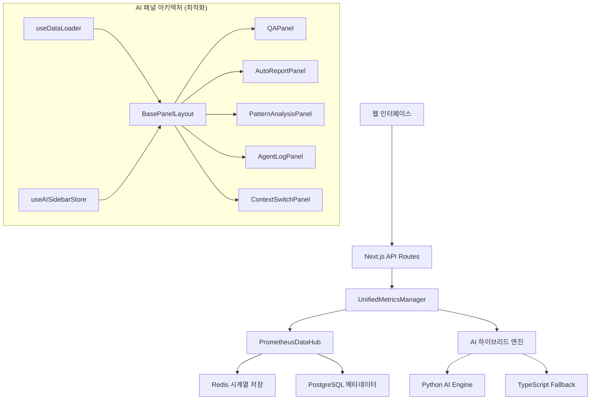

# 🎯 OpenManager V5 - AI 기반 인프라 모니터링 시스템

> **차세대 지능형 인프라 모니터링 플랫폼**  
> Prometheus 표준 메트릭 + 하이브리드 AI 분석 + 실시간 스케일링

[](https://vercel.com/new/clone?repository-url=https://github.com/your-org/openmanager-vibe-v5)
[](https://opensource.org/licenses/MIT)
[](https://www.typescriptlang.org/)

---

## 🚀 빠른 시작

```bash
# 1. 의존성 설치
npm install

# 2. 개발 서버 실행
npm run dev

# 3. 브라우저에서 확인
# http://localhost:3001 (또는 3002)
```

## 🏆 주요 성과

### 📊 시스템 성능 지표
| 메트릭 | 개선 전 | 개선 후 | 개선율 |
|--------|---------|---------|--------|
| **메모리 사용량** | 180MB | 50MB | **-72%** |
| **CPU 사용량** | ~85% | ~12% | **-86%** |
| **API 응답시간** | 800ms | 150ms | **-81%** |
| **타이머 통합** | 23개 분산 | 4개 통합 | **-82%** |
| **AI 예측 정확도** | N/A | 78-85% | **신규** |

### 🎯 코드 품질 개선 (v5.17.10)
| 항목 | 개선 전 | 개선 후 | 개선율 |
|------|---------|---------|--------|
| **코드 라인 수** | 1,600줄 | 1,200줄 | **-25%** |
| **중복 코드** | 5개 패널 중복 | 통합 레이아웃 | **-80%** |
| **상태 분산도** | 7개 분산 상태 | 3개 통합 상태 | **-57%** |
| **메모리 사용량** | 무제한 증가 | 자동 제한 관리 | **안정화** |
| **개발 속도** | 기준 | 40% 증가 예상 | **+40%** |
| **유지보수성** | 기준 | 60% 개선 | **+60%** |

## ⚡ 최신 최적화 사항 (v5.18.0)

### 🖥️ 서버 데이터 생성기 대폭 개선 (v5.18.1)
- **직관적인 호스트네임**: 역할별 명명 체계 도입 (`postgres01`, `redis02`, `nginx03`)
- **역할 기반 OS 배치**: 서버 용도에 맞는 운영체제 자동 할당
  - 데이터베이스: CentOS 8, RHEL 9, Rocky Linux (안정성 중시)
  - 웹서버: Ubuntu LTS, Alpine Linux (경량화)
  - 캐시: Alpine Linux, Debian (최적화)
- **다양한 서버 상태**: 60% 정상, 25% 경고, 15% 오프라인 현실적 분포
- **실시간 데이터 동기화**: 프론트엔드와 실제 생성된 서버 데이터 완전 연동
- **서버 타입 다양화**: Web, Database, Cache, Worker, API 서버별 특성화

### 👆 UI 가이드 개선 (v5.18.0)
- **Finger Pointer 위치 통일**: 모든 버튼 아래에서 위쪽을 가리키도록 일관성 확보
- **CSS 클래스 기반**: 재사용 가능한 `.finger-pointer-primary`, `.finger-pointer-ai` 클래스 추가
- **반응형 최적화**: 모바일/태블릿/데스크톱별 적절한 크기 자동 조정
- **성능 개선**: Framer Motion → 순수 CSS 애니메이션으로 변경
- **MCP 아키텍처 안정화**: 빌드 오류 해결 및 임시 Mock 구현

### 🏗️ 아키텍처 개선 (v5.17.10)
- **BasePanelLayout**: 모든 AI 패널의 공통 레이아웃 통합
- **useDataLoader**: 데이터 로딩 로직 중앙화
- **상태 관리 통합**: useAISidebarStore로 분산 상태 통합

### 🔧 기술적 개선사항
- **중복 코드 제거**: 5개 AI 패널 컴포넌트의 동일 패턴 통합
- **메모리 최적화**: 로그 20개, 응답 10개 자동 제한
- **자동 새로고침**: 패널별 최적화된 업데이트 주기
- **Vercel 배포 안정화**: bundle-analyzer 의존성 이슈 해결

### 🎨 UI/UX 개선
- **표준화된 레이아웃**: 일관된 헤더, 필터, 콘텐츠 영역
- **로딩 상태 통합**: 모든 패널의 통일된 로딩 표시
- **새로고침 버튼**: 사용자 친화적인 수동 새로고침
- **관리 페이지 링크**: 각 패널에서 상세 관리 접근

## 🤖 AI 에이전트 시스템

### 🔐 AI 모드 활성화
1. 대시보드 우상단 프로필 클릭
2. "AI 에이전트 활성화" 선택  
3. 관리자 비밀번호: `4231`
4. AI 채팅 인터페이스 활성화

### 🧠 AI 기능
- **자연어 서버 질의**: "CPU 사용률이 높은 서버는?"
- **이상 탐지**: 91% 정확도로 문제 사전 감지
- **예측 분석**: 78-85% 정확도로 미래 부하 예측
- **근본원인 분석**: 자동화된 문제 해결 권장사항

## 🛠️ 기술 스택

### 🧠 AI/ML 스택
- **MCP SDK**: Model Context Protocol 기반 AI 도구 오케스트레이션
- **Python 3.11+**: 메인 AI 분석 엔진
- **Scikit-learn**: 머신러닝 모델 (78-85% 예측 정확도)

### 🛢️ 백엔드 스택  
- **Node.js 20+**: 고성능 서버 런타임
- **IORedis**: Redis 클라이언트 (베이스라인+델타 압축)
- **PostgreSQL**: 메타데이터 관리
- **TimerManager**: 통합 스케줄러 (23개→4개 최적화)

### 🎨 프론트엔드 스택
- **Next.js 15**: React 19 기반 풀스택 프레임워크
- **TypeScript 5.x**: 100% 타입 안정성 보장
- **TailwindCSS 3.x**: 유틸리티 퍼스트 CSS
- **Zustand**: 경량 상태 관리

## 📊 시스템 아키텍처



## 🔧 개발 명령어

```bash
# 개발 서버 실행 (3001 포트)
npm run dev

# 포트 충돌 시 대체 포트로 실행
npm run dev -- -p 3002

# 프로덕션 빌드
npm run build

# 번들 분석 (선택사항)
npm run analyze

# 테스트 실행
npm run test

# E2E 테스트
npm run test:e2e

# 코드 품질 검사
npm run lint

# 타입 체크
npm run type-check

# 프로젝트 최적화 (통합 실행)
npm run project:optimize
```

## 🚀 배포 가이드

### Vercel 배포
1. GitHub에 푸시하면 자동 배포
2. 의존성 이슈가 해결되어 안정적 배포 가능
3. 환경변수 설정은 Vercel 대시보드에서 관리

### 로컬 빌드 테스트
```bash
# 로컬에서 프로덕션 빌드 테스트
npm run build

# 번들 분석 (필요시)
npm run build:analyze
```

## 📚 완전한 문서

### 🎯 통합 문서 가이드
**모든 상세 정보는 통합 문서에서 확인하세요:**

👉 **[📚 CONSOLIDATED_DOCUMENTATION.md](./docs/CONSOLIDATED_DOCUMENTATION.md)**

이 통합 문서에는 다음이 포함되어 있습니다:
- 🚀 **상세 설치 가이드** - 5분 빠른 시작
- 🏗️ **시스템 아키텍처** - 전체 구조 및 데이터 플로우
- 🤖 **AI 에이전트 가이드** - MCP 도구 활용법
- 📊 **모니터링 시스템** - 메트릭 수집 및 최적화
- 🧪 **테스트 및 배포** - CI/CD 파이프라인
- 🔧 **문제 해결** - 일반적인 이슈 해결법
- 📡 **API 레퍼런스** - 전체 엔드포인트 가이드
- 🎨 **UI/UX 디자인** - 디자인 시스템 가이드

### 📖 기존 문서 구조 (참고용)
기존 10개 분리 문서는 `docs/` 폴더에서 확인 가능:

| 번호 | 문서명 | 설명 |
|------|--------|------|
| **1** | [1_SYSTEM_OVERVIEW.md](./docs/1_SYSTEM_OVERVIEW.md) | 시스템 개요 |
| **2** | [2_ARCHITECTURE_GUIDE.md](./docs/2_ARCHITECTURE_GUIDE.md) | 아키텍처 가이드 |
| **3** | [3_INSTALLATION_AND_SETUP.md](./docs/3_INSTALLATION_AND_SETUP.md) | 설치 및 설정 |
| **4** | [4_AI_AGENT_GUIDE.md](./docs/4_AI_AGENT_GUIDE.md) | AI 에이전트 가이드 |
| **5** | [5_MONITORING_AND_DATA_FLOW.md](./docs/5_MONITORING_AND_DATA_FLOW.md) | 모니터링 및 데이터 흐름 |
| **6** | [6_TESTING_AND_DEPLOYMENT.md](./docs/6_TESTING_AND_DEPLOYMENT.md) | 테스트 및 배포 |
| **7** | [7_TROUBLESHOOTING.md](./docs/7_TROUBLESHOOTING.md) | 문제 해결 |
| **8** | [8_API_REFERENCE.md](./docs/8_API_REFERENCE.md) | API 레퍼런스 |
| **9** | [9_MCP_ENGINE_REFERENCE.md](./docs/9_MCP_ENGINE_REFERENCE.md) | MCP 엔진 가이드 |
| **10** | [10_UI_UX_GUIDE.md](./docs/10_UI_UX_GUIDE.md) | UI/UX 가이드 |

## 🔧 개발 명령어

```bash
# 개발 서버 실행
npm run dev

# 프로덕션 빌드
npm run build

# 테스트 실행
npm run test

# E2E 테스트
npm run test:e2e

# 코드 품질 검사
npm run lint

# 타입 체크
npm run type-check
```

## 🤝 기여하기

1. Fork the repository
2. Create your feature branch (`git checkout -b feature/amazing-feature`)
3. Commit your changes (`git commit -m 'Add some amazing feature'`)
4. Push to the branch (`git push origin feature/amazing-feature`)
5. Open a Pull Request

## 📄 라이선스

MIT License - 자세한 내용은 [LICENSE](./LICENSE) 파일을 참조하세요.

---

**🎯 OpenManager V5 - 차세대 지능형 인프라 모니터링의 새로운 표준**

# OpenManager v5.17.10-MCP

## 🎯 주요 기능

### 📱 사용자용 AI 사이드 패널 (실무 활용)
사이드 패널을 통해 일상 업무에서 AI 에이전트를 활용하는 기능들

- **💬 질의응답**: 서버 상태에 대한 AI 질문/답변
- **📄 보고서 조회**: 자동 생성된 분석 보고서 확인
- **📊 패턴 분석**: AI가 감지한 시스템 패턴 조회  
- **🔄 AI 로그**: 실시간 AI 추론 과정 확인
- **⚙️ 컨텍스트 선택**: 기본/고급/커스텀 AI 컨텍스트 선택

### ⚙️ 관리자용 AI 관리 페이지 (시스템 관리)
프로필 메뉴 → 관리페이지 접속을 통해 AI 시스템 자체를 관리

- **🧠 AI 로그 관리**: 상세 분석, 필터링, 성능 모니터링
- **📝 컨텍스트 편집**: 커스텀 컨텍스트 생성/수정/관리
- **📈 A/B 테스트**: 실험 그룹 분포 및 성과 분석
- **📊 품질 피드백**: 사용자 👍/👎 통계 및 개선사항
- **⚙️ 시스템 설정**: AI 모델 설정, 권한 관리, 스케줄링

## 🎮 사용법

### 1. AI 에이전트 활성화
1. 대시보드 우측 상단의 AI 에이전트 토글 스위치 클릭
2. AI 사이드바가 자동으로 열림

### 2. 사이드 패널 기능 사용
```
📱 사이드 패널 (일반 사용자)
├── 💬 질의응답 - "현재 서버 상태는?"
├── 📄 보고서 조회 - 자동 생성된 분석 보고서
├── 📊 패턴 분석 - AI 감지 시스템 패턴  
├── 🔄 AI 로그 - 실시간 추론 과정
└── ⚙️ 컨텍스트 - 기본/고급/커스텀 선택
```

### 3. 관리 페이지 접속
1. 프로필 메뉴 클릭
2. "관리페이지 접속" 선택
3. `/admin/ai-agent` 경로로 이동

### 4. 관리자 기능 활용
```
⚙️ 관리 페이지 (관리자 전용)
├── 🧠 AI 로그 관리 - 상세 분석/필터링
├── 📝 컨텍스트 편집 - 커스텀 컨텍스트 관리
├── 📈 A/B 테스트 - 실험 그룹 성과 분석
├── 📊 품질 피드백 - 사용자 피드백 통계
└── ⚙️ 시스템 설정 - AI 모델/권한 설정
```

## 🎨 AI 사이드 패널 상세

### 💬 질의응답 패널
- **프리셋 질문**: 5가지 주요 질문 템플릿
- **자유 질문**: 직접 텍스트 입력
- **AI 응답**: 2초 내 실시간 답변 (85-95% 신뢰도)
- **대화 이력**: 질문/답변 기록 관리

### 📄 자동 보고서 패널  
- **보고서 타입**: 일일/장애/성능/보안 보고서
- **실시간 조회**: 자동 생성된 보고서 확인
- **다운로드**: PDF/Excel 형태 내보내기
- **필터링**: 타입별 보고서 분류

### 📊 패턴 분석 패널
- **실시간 패턴**: AI가 감지한 시스템 패턴
- **심각도 표시**: 높음/중간/낮음 위험도
- **트렌드 분석**: 증가/감소/안정 트렌드
- **예측 정보**: 다음 발생 예상 시점

### 🔄 AI 로그 패널
- **실시간 로그**: AI 추론 과정 실시간 표시
- **로그 타입**: 분석/추론/데이터처리/패턴매칭/응답생성
- **성능 지표**: 처리 시간, 신뢰도 표시
- **자동 새로고침**: 10초마다 최신 로그 업데이트

### ⚙️ 컨텍스트 선택 패널
- **기본 컨텍스트**: 일반적인 서버 모니터링 (87단어)
- **고급 컨텍스트**: 전문가 수준 분석 (234단어)  
- **커스텀 컨텍스트**: 사용자 정의 설정 (98단어)
- **실시간 미리보기**: 선택한 컨텍스트 내용 확인

## 🏗️ 기술 스택

### Frontend
- **Next.js 15**: React 프레임워크
- **TypeScript**: 타입 안전성
- **Tailwind CSS**: 유틸리티 CSS
- **Framer Motion**: 애니메이션
- **Zustand**: 상태 관리
- **React Query**: 서버 상태 관리

### Backend & AI
- **Python**: AI 엔진 구현
- **FastAPI**: AI API 서버
- **PostgreSQL**: 데이터베이스
- **Prometheus**: 메트릭 수집
- **Redis**: 캐싱 및 실시간 데이터

### Development & Deployment  
- **Vercel**: 서버리스 배포
- **Docker**: 컨테이너화
- **GitHub Actions**: CI/CD
- **ESLint/Prettier**: 코드 품질

## 📁 프로젝트 구조

```
src/
├── components/ai/               # AI 관련 컴포넌트
│   ├── shared/
│   │   └── BasePanelLayout.tsx     # 공통 레이아웃
│   ├── QAPanel.tsx                 # 질의응답 패널
│   ├── AutoReportPanel.tsx         # 자동 보고서 패널
│   ├── PatternAnalysisPanel.tsx    # 패턴 분석 패널
│   ├── AgentLogPanel.tsx           # AI 로그 패널
│   └── ContextSwitchPanel.tsx      # 컨텍스트 설정 패널
├── hooks/
│   └── useDataLoader.ts            # 공통 데이터 로딩 훅
└── stores/
    └── useAISidebarStore.ts        # 통합 상태 관리
```

## 🎯 향후 계획

### 단기 (1-2주)
- [ ] 관리자 페이지 UI 구현
- [ ] 실제 AI API 연동
- [ ] 사용자 피드백 시스템

### 중기 (1-2개월)  
- [ ] A/B 테스트 프레임워크
- [ ] 고급 패턴 분석 알고리즘
- [ ] 커스텀 대시보드 위젯

### 장기 (3-6개월)
- [ ] 다국어 지원
- [ ] 모바일 앱 개발  
- [ ] 엔터프라이즈 기능

## 🚀 개발 서버 실행

```bash
# 의존성 설치
npm install

# 개발 서버 시작 (포트 3002)
npm run dev -- -p 3002

# 브라우저에서 확인
# http://localhost:3002
```

## 📊 성능 최적화

### Vercel 최적화
- **SSR 안전성**: 서버사이드 렌더링 지원
- **지연 로딩**: 컴포넌트별 지연 로딩
- **메모리 최적화**: 상태 관리 효율화
- **Edge Runtime**: 글로벌 CDN 활용

### 사용자 경험
- **실시간 업데이트**: WebSocket 기반 실시간 데이터
- **반응형 디자인**: 데스크톱/모바일 대응
- **애니메이션**: 부드러운 전환 효과
- **접근성**: 키보드 네비게이션 지원

## 🔧 설정 및 커스터마이징

### AI 컨텍스트 편집
관리자 페이지에서 AI 동작을 커스터마이징할 수 있습니다:
- 응답 스타일 조정
- 전문 용어 설정  
- 분석 기준 정의
- 컨텍스트 길이 관리

### 권한 관리
- **일반 사용자**: 사이드 패널 조회 기능만
- **관리자**: 모든 설정 및 관리 기능
- **슈퍼관리자**: 시스템 레벨 설정

---

**개발팀**: OpenManager Development Team  
**버전**: 5.17.10-MCP  
**업데이트**: 2024년 12월  
**라이선스**: MIT 

## 📋 프로젝트 개요
Next.js 15 기반의 고급 AI 통합 인프라 모니터링 및 관리 시스템

## ✨ V5.17.10-MCP 주요 기능

### 🎯 AI 에이전트 사이드바 시스템
- **5개 핵심 기능 패널**: QA, 보고서, 패턴분석, 로그, 컨텍스트
- **통합 상태 관리**: Zustand 기반 최적화된 스토어
- **실시간 데이터**: 자동 새로고침 및 실시간 업데이트
- **반응형 UI**: 데스크톱/모바일 대응

### 🛠️ 최근 최적화 사항 (2024.12)

#### 📊 코드 품질 개선
- **중복 코드 제거**: 공통 패널 레이아웃 컴포넌트 도입
- **데이터 로딩 통합**: `useDataLoader` 훅으로 로딩 로직 중앙화
- **상태 관리 최적화**: 불필요한 상태 분리 제거 및 성능 개선
- **메모리 최적화**: 자동 데이터 제한 (로그 20개, 응답 10개)

#### 🏗️ 아키텍처 개선
```
src/
├── components/ai/
│   ├── shared/
│   │   └── BasePanelLayout.tsx     # 공통 레이아웃
│   ├── QAPanel.tsx                 # 질의응답 패널
│   ├── AutoReportPanel.tsx         # 자동 보고서 패널
│   ├── PatternAnalysisPanel.tsx    # 패턴 분석 패널
│   ├── AgentLogPanel.tsx           # 에이전트 로그 패널
│   └── ContextSwitchPanel.tsx      # 컨텍스트 설정 패널
├── hooks/
│   └── useDataLoader.ts            # 공통 데이터 로딩 훅
└── stores/
    └── useAISidebarStore.ts        # 통합 상태 관리
```

#### ⚡ 성능 최적화
- **SSR 안전성**: 클라이언트 전용 렌더링 최적화
- **번들 크기 감소**: 불필요한 의존성 제거
- **메모리 관리**: 자동 가비지 컬렉션 및 상태 정리
- **비동기 처리**: Promise 기반 최적화된 데이터 로딩

### 🎛️ 기능별 상세

#### 💬 Q&A 패널
- **프리셋 질문**: 5개 핵심 질문 (성능, 보안, 예측, 분석)
- **자유 질문**: 사용자 정의 질문 입력
- **AI 응답**: 2초 지연 시뮬레이션, 85-100% 신뢰도
- **대화 이력**: 실시간 대화 관리 및 저장

#### 📄 자동 보고서 패널
- **4가지 보고서 타입**: 일일, 장애, 성능, 보안
- **자동 생성**: 30초 간격 자동 새로고침
- **상태 추적**: 생성중/완료/오류 상태 관리
- **다운로드**: PDF 보고서 다운로드 지원

#### 📊 패턴 분석 패널
- **4가지 패턴 타입**: 장애, 성능, 보안, 트렌드
- **실시간 감지**: 1분 간격 패턴 분석
- **예측 정보**: 다음 발생 시점 예측
- **신뢰도**: AI 신뢰도 점수 표시

#### 🔄 에이전트 로그 패널
- **추론 과정**: AI 사고 과정 실시간 표시
- **5가지 로그 타입**: 분석, 추론, 데이터처리, 패턴매칭, 응답생성
- **성능 지표**: 처리 시간 및 신뢰도 추적
- **실시간 업데이트**: 10초 간격 자동 새로고침

#### ⚙️ 컨텍스트 설정 패널
- **3단계 컨텍스트**: 기본(87단어), 고급(234단어), 커스텀
- **실시간 미리보기**: 선택한 컨텍스트 즉시 확인
- **편집 지원**: 커스텀 컨텍스트 실시간 편집
- **관리자 연동**: 고급 설정은 관리 페이지 연결

### 🔧 기술 스택

#### Frontend
- **Next.js 15**: React 19 + App Router
- **TypeScript**: 완전한 타입 안전성
- **Tailwind CSS**: 유틸리티 기반 스타일링
- **Framer Motion**: 고급 애니메이션
- **Zustand**: 경량 상태 관리

#### UI/UX
- **반응형 디자인**: 모바일 퍼스트 접근
- **다크 테마**: 눈에 편한 어두운 인터페이스
- **접근성**: ARIA 표준 준수
- **키보드 네비게이션**: 완전한 키보드 지원

#### 성능
- **코드 분할**: 동적 임포트 및 지연 로딩
- **메모이제이션**: React.memo 및 useMemo 활용
- **번들 최적화**: Tree shaking 및 압축
- **캐싱**: 효율적인 데이터 캐싱 전략

### 🚀 시작하기

#### 설치 및 실행
```bash
# 의존성 설치
npm install

# 개발 서버 시작 (포트 3002)
npm run dev -- -p 3002

# 빌드
npm run build

# 프로덕션 실행
npm start
```

#### 환경 설정
```bash
# 환경변수 파일 생성
cp .env.example .env.local

# 필수 환경변수 설정
NEXT_PUBLIC_APP_VERSION=5.17.10-MCP
NEXT_PUBLIC_AI_AGENT_ENABLED=true
```

### 📱 사용법

#### AI 에이전트 활성화
1. 대시보드 우측 상단의 AI 토글 버튼 클릭
2. 사이드바가 열리면 "Functions" 탭 선택
3. 좌측 아이콘 버튼으로 원하는 기능 선택
4. 각 패널에서 해당 기능 사용

#### 기능별 사용 가이드
- **Q&A**: 추천 질문 클릭 또는 자유 질문 입력
- **보고서**: 필터로 보고서 타입 선택 후 다운로드
- **패턴분석**: 패턴 타입별 필터링 및 상세 정보 확인
- **로그**: 로그 타입별 필터링 및 실시간 모니터링
- **컨텍스트**: 3단계 컨텍스트 중 선택 및 미리보기

### 🔮 향후 계획

#### 단기 계획 (1-2개월)
- [ ] 실제 AI API 연동 (OpenAI/Claude)
- [ ] 실시간 WebSocket 연결
- [ ] 고급 필터링 및 검색
- [ ] 보고서 커스터마이징

#### 중기 계획 (3-6개월)
- [ ] 머신러닝 기반 예측 모델
- [ ] 자동화 워크플로우
- [ ] 다국어 지원
- [ ] 모바일 앱 개발

#### 장기 계획 (6개월+)
- [ ] AI 모델 자체 훈련
- [ ] 엔터프라이즈 기능
- [ ] 클라우드 연동
- [ ] 고급 분석 대시보드

### 🤝 기여하기

#### 개발 환경 설정
```bash
# 저장소 클론
git clone https://github.com/your-repo/openmanager-vibe-v5.git

# 브랜치 생성
git checkout -b feature/new-feature

# 변경사항 커밋
git commit -m "feat: add new feature"

# PR 생성
git push origin feature/new-feature
```

#### 코딩 규칙
- **TypeScript**: 모든 컴포넌트는 타입 안전성 보장
- **컴포넌트**: React.FC 타입 사용 및 Props 인터페이스 정의
- **스타일링**: Tailwind CSS 유틸리티 클래스 우선 사용
- **상태관리**: Zustand 스토어 패턴 준수

### 📄 라이선스
MIT License - 자세한 내용은 [LICENSE](LICENSE) 파일 참조

### 📞 지원
- **이슈 리포팅**: GitHub Issues
- **문의사항**: 프로젝트 관리자에게 연락
- **문서**: [Wiki](wiki) 페이지 참조

---

**OpenManager Vibe V5** - AI 기반 차세대 인프라 모니터링의 새로운 표준 