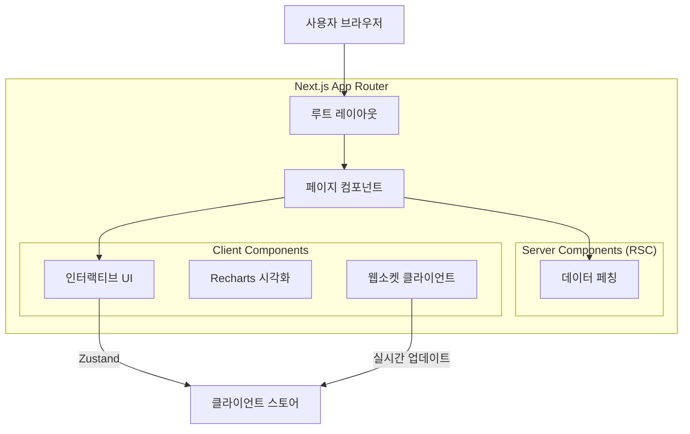
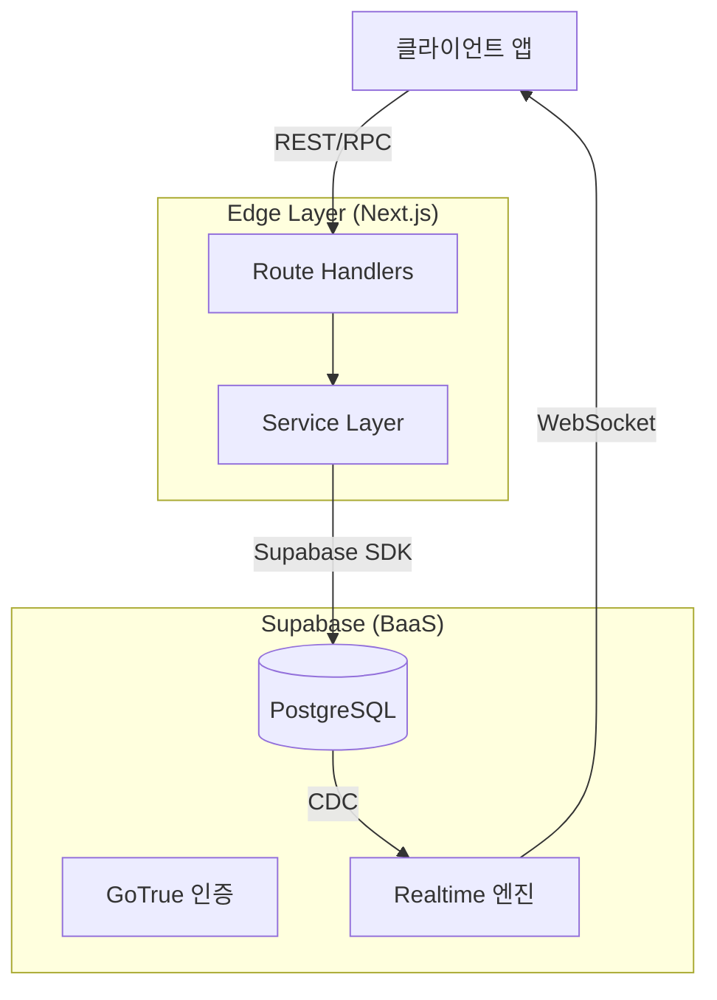
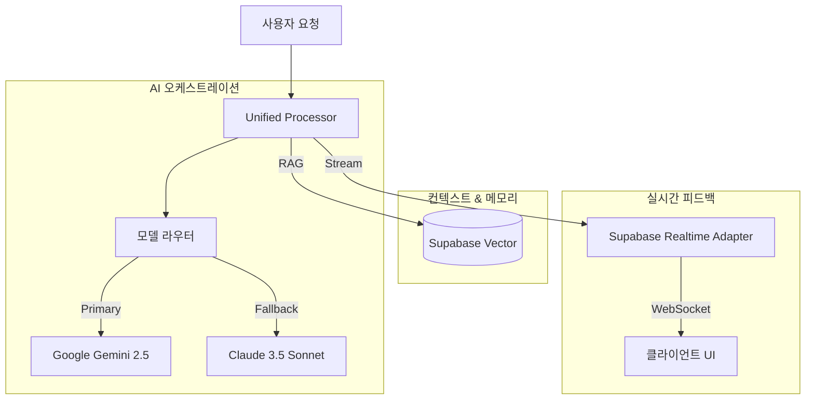

# OpenManager VIBE v5

> **AI-Native 서버 모니터링 PoC**
> **Vibe Coding**을 통해 DevOps의 미래인 **AX (AI Experience)**를 탐구합니다.

[](https://nextjs.org/)
[](https://supabase.com/)
[](https://ai.google.dev/)
[](https://biomejs.dev/)
[](https://www.typescriptlang.org/)

## 👨‍💻 프로젝트 철학

이 프로젝트는 단순한 서버 모니터링 도구가 아닙니다. **인간과 AI의 협업(Vibe Coding)**이 만들어낼 수 있는 풀스택 개발의 가능성을 증명하는 **Proof of Concept (PoC)**입니다.

기존의 "수동적 모니터링"을 넘어, **AI(Gemini)**가 워크플로우에 직접 통합되어 **"예측하고 상호작용하는 운영(Predictive & Interactive Operations)"** 경험을 제공합니다.

## 🏗️ 시스템 아키텍처

이벤트 기반 아키텍처(Event-Driven Architecture)를 통해 실시간성과 AI 분석 능력을 극대화했습니다.

### 1. 🌐 웹 아키텍처 (Frontend)

Next.js 15 App Router와 React Server Components를 활용하여 초기 로딩 속도와 검색 엔진 최적화(SEO)를 잡았으며, 클라이언트 상호작용은 Zustand와 React Query로 최적화했습니다.



### 2. 🔙 백엔드 아키텍처 (Backend)

Supabase를 BaaS로 활용하여 인증, 데이터베이스, 실시간 구독을 처리하며, 비즈니스 로직은 Next.js Edge Functions의 Service Layer로 캡슐화했습니다.



### 3. 🧠 AI 엔진 아키텍처 (Intelligence)

**Unified Processor** 아키텍처를 통해 모든 AI 요청을 중앙에서 처리하며, 상황에 따라 Gemini(Primary), Claude, GPT(Fallback) 모델을 유연하게 전환하여 가용성을 보장합니다.



## ✨ 핵심 기능

### 1. ⚡ 실시간 성능 (Real-time Performance)
- **GPU 가속 UI**: 하드웨어 가속을 통한 부드러운 120fps 애니메이션.
- **WebSocket 통합**: 100ms 미만의 지연 시간으로 메트릭 업데이트.
- **최적화된 렌더링**: RSC와 클라이언트 하이드레이션의 조화.

### 2. 🤖 AI 기반 운영 (AI Operations)
- **Unified AI Engine**: Google Gemini 2.5 Flash 기반의 지능형 처리.
- **자동 코드 리뷰**: 여러 AI 모델이 교차 검증하는 고가용성 리뷰 시스템.
- **문맥 인식 분석**: 현재 시스템 상태와 로그를 이해하고 상관관계를 분석.
- **RAG 트러블슈팅**: 벡터 검색을 통해 과거 사례와 문서를 즉시 참조하여 해결책 제시.

### 3. 🛡️ 개발 품질 (Development Quality)
- **Strict TypeScript**: `any` 타입 사용을 배제한 철저한 타입 안정성.
- **현대적 툴체인**: Biome(린트/포맷), Vitest(단위 테스트), Playwright(E2E).
- **CI/CD 파이프라인**: Vercel을 통한 자동화된 검증 및 배포.

## 🛠️ 기술 스택

| 카테고리 | 기술 | 선정 이유 |
|----------|------|-----------|
| **Frontend** | Next.js 15 (App Router) | 서버 컴포넌트, 스트리밍, 엣지 런타임 |
| **State** | Zustand + React Query | 서버 상태 동기화, 낙관적 업데이트 |
| **Database** | Supabase (PostgreSQL) | 실시간 구독, 벡터 검색 (pgvector) |
| **AI Engine** | Google Gemini 2.5 Flash | 긴 컨텍스트 윈도우, 빠른 응답 속도 |
| **Testing** | Vitest + Playwright | 빠른 단위 테스트, 신뢰성 높은 E2E |
| **Code Quality** | Biome + TypeScript Strict | 압도적인 린팅 속도, 타입 안정성 |
| **Styling** | Tailwind CSS + Shadcn/UI | 유틸리티 퍼스트 CSS, 접근성 높은 컴포넌트 |

## 📚 문서 (Documentation)

- [**Docker Ecosystem**](docs/environment/DOCKER_ECOSYSTEM.md): 로컬 Docker 컨테이너(App + Supabase + Mock AI) 전체 목록 및 역할
- [**Deployment Guide**](gcp-functions/deployment/deploy-instructions.md): Cloud Run 배포 가이드

## 🚀 시작하기

**필수 요구사항**: Node.js v22+, npm v10+

```bash
# 1. 클론 및 설치
git clone https://github.com/your-username/openmanager-vibe-v5.git
cd openmanager-vibe-v5
npm install

# 2. 환경 설정
cp .env.example .env.local
# SUPABASE_URL, SUPABASE_ANON_KEY, GOOGLE_AI_KEY 설정

# 3. 개발 서버 실행
npm run dev:stable
```

---

<div align="center">
  <sub>Built with 💜 using Vibe Coding methodologies.</sub>
</div>
