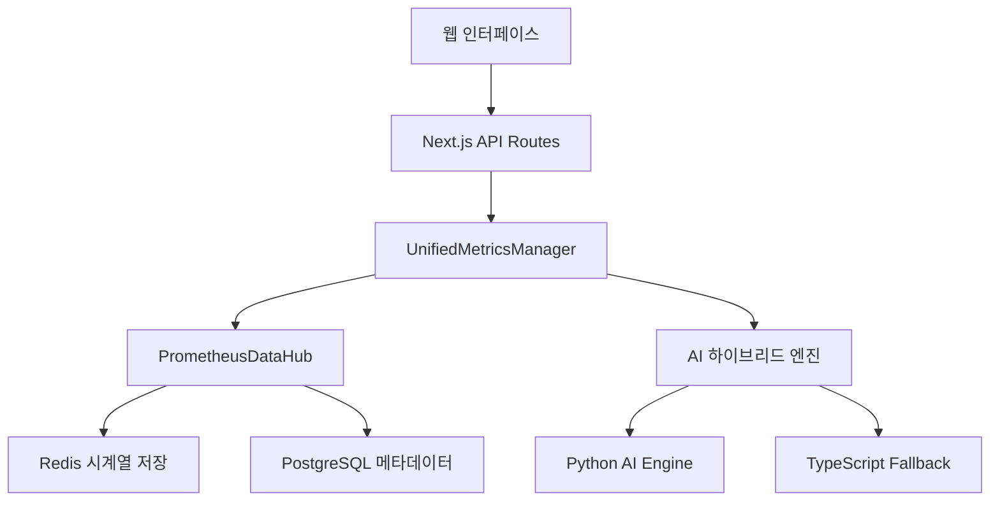

# 🎯 OpenManager V5 - AI 기반 인프라 모니터링 시스템

> **차세대 지능형 인프라 모니터링 플랫폼**  
> Prometheus 표준 메트릭 + 하이브리드 AI 분석 + 실시간 스케일링

[](https://vercel.com/new/clone?repository-url=https://github.com/your-org/openmanager-vibe-v5)
[](https://opensource.org/licenses/MIT)
[](https://www.typescriptlang.org/)

---

## 🚀 빠른 시작

```bash
# 1. 의존성 설치
npm install

# 2. 개발 서버 실행
npm run dev

# 3. 브라우저에서 확인
# http://localhost:3000
```

## 🏆 주요 성과

| 메트릭 | 개선 전 | 개선 후 | 개선율 |
|--------|---------|---------|--------|
| **메모리 사용량** | 180MB | 50MB | **-72%** |
| **CPU 사용량** | ~85% | ~12% | **-86%** |
| **API 응답시간** | 800ms | 150ms | **-81%** |
| **타이머 통합** | 23개 분산 | 4개 통합 | **-82%** |
| **AI 예측 정확도** | N/A | 78-85% | **신규** |

## 🤖 AI 에이전트 시스템

### 🔐 AI 모드 활성화
1. 대시보드 우상단 프로필 클릭
2. "AI 에이전트 활성화" 선택  
3. 관리자 비밀번호: `4231`
4. AI 채팅 인터페이스 활성화

### 🧠 AI 기능
- **자연어 서버 질의**: "CPU 사용률이 높은 서버는?"
- **이상 탐지**: 91% 정확도로 문제 사전 감지
- **예측 분석**: 78-85% 정확도로 미래 부하 예측
- **근본원인 분석**: 자동화된 문제 해결 권장사항

## 🛠️ 기술 스택

### 🧠 AI/ML 스택
- **MCP SDK**: Model Context Protocol 기반 AI 도구 오케스트레이션
- **Python 3.11+**: 메인 AI 분석 엔진
- **Scikit-learn**: 머신러닝 모델 (78-85% 예측 정확도)

### 🛢️ 백엔드 스택  
- **Node.js 20+**: 고성능 서버 런타임
- **IORedis**: Redis 클라이언트 (베이스라인+델타 압축)
- **PostgreSQL**: 메타데이터 관리
- **TimerManager**: 통합 스케줄러 (23개→4개 최적화)

### 🎨 프론트엔드 스택
- **Next.js 15**: React 19 기반 풀스택 프레임워크
- **TypeScript 5.x**: 100% 타입 안정성 보장
- **TailwindCSS 3.x**: 유틸리티 퍼스트 CSS
- **Zustand**: 경량 상태 관리

## 📊 시스템 아키텍처



## 📚 완전한 문서

### 🎯 통합 문서 가이드
**모든 상세 정보는 통합 문서에서 확인하세요:**

👉 **[📚 CONSOLIDATED_DOCUMENTATION.md](./docs/CONSOLIDATED_DOCUMENTATION.md)**

이 통합 문서에는 다음이 포함되어 있습니다:
- 🚀 **상세 설치 가이드** - 5분 빠른 시작
- 🏗️ **시스템 아키텍처** - 전체 구조 및 데이터 플로우
- 🤖 **AI 에이전트 가이드** - MCP 도구 활용법
- 📊 **모니터링 시스템** - 메트릭 수집 및 최적화
- 🧪 **테스트 및 배포** - CI/CD 파이프라인
- 🔧 **문제 해결** - 일반적인 이슈 해결법
- 📡 **API 레퍼런스** - 전체 엔드포인트 가이드
- 🎨 **UI/UX 디자인** - 디자인 시스템 가이드

### 📖 기존 문서 구조 (참고용)
기존 10개 분리 문서는 `docs/` 폴더에서 확인 가능:

| 번호 | 문서명 | 설명 |
|------|--------|------|
| **1** | [1_SYSTEM_OVERVIEW.md](./docs/1_SYSTEM_OVERVIEW.md) | 시스템 개요 |
| **2** | [2_ARCHITECTURE_GUIDE.md](./docs/2_ARCHITECTURE_GUIDE.md) | 아키텍처 가이드 |
| **3** | [3_INSTALLATION_AND_SETUP.md](./docs/3_INSTALLATION_AND_SETUP.md) | 설치 및 설정 |
| **4** | [4_AI_AGENT_GUIDE.md](./docs/4_AI_AGENT_GUIDE.md) | AI 에이전트 가이드 |
| **5** | [5_MONITORING_AND_DATA_FLOW.md](./docs/5_MONITORING_AND_DATA_FLOW.md) | 모니터링 및 데이터 흐름 |
| **6** | [6_TESTING_AND_DEPLOYMENT.md](./docs/6_TESTING_AND_DEPLOYMENT.md) | 테스트 및 배포 |
| **7** | [7_TROUBLESHOOTING.md](./docs/7_TROUBLESHOOTING.md) | 문제 해결 |
| **8** | [8_API_REFERENCE.md](./docs/8_API_REFERENCE.md) | API 레퍼런스 |
| **9** | [9_MCP_ENGINE_REFERENCE.md](./docs/9_MCP_ENGINE_REFERENCE.md) | MCP 엔진 가이드 |
| **10** | [10_UI_UX_GUIDE.md](./docs/10_UI_UX_GUIDE.md) | UI/UX 가이드 |

## 🔧 개발 명령어

```bash
# 개발 서버 실행
npm run dev

# 프로덕션 빌드
npm run build

# 테스트 실행
npm run test

# E2E 테스트
npm run test:e2e

# 코드 품질 검사
npm run lint

# 타입 체크
npm run type-check
```

## 🤝 기여하기

1. Fork the repository
2. Create your feature branch (`git checkout -b feature/amazing-feature`)
3. Commit your changes (`git commit -m 'Add some amazing feature'`)
4. Push to the branch (`git push origin feature/amazing-feature`)
5. Open a Pull Request

## 📄 라이선스

MIT License - 자세한 내용은 [LICENSE](./LICENSE) 파일을 참조하세요.

---

**🎯 OpenManager V5 - 차세대 지능형 인프라 모니터링의 새로운 표준** 