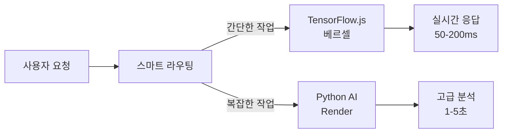

# 🚀 OpenManager Vibe v5

> **AI-Powered 서버 모니터링 플랫폼**  
> **Enhanced AI Engine v2.0 + MCP 문서 활용 극대화**

## 🎯 프로젝트 개요

OpenManager Vibe v5는 **MCP(Model Context Protocol) 기반 AI 엔진**을 활용한 지능형 서버 모니터링 플랫폼입니다.

### ✨ 핵심 특징

- 🧠 **Enhanced AI Engine v2.0**: 벡터 DB 없는 고성능 문서 검색
- 📚 **MCP 문서 활용 극대화**: 실시간 컨텍스트 학습
- 🔄 **Render 자동 관리**: 무료 서비스 최적화
- ⚡ **Vercel 무료 최적화**: 1GB 메모리 제한 대응
- 🎯 **LLM 없이 완전 동작**: 기본 TensorFlow.js + MCP

## 🚀 빠른 시작

```bash
# 저장소 클론
git clone https://github.com/yourusername/openmanager-vibe-v5.git
cd openmanager-vibe-v5

# 의존성 설치
npm install

# 개발 서버 실행
npm run dev
```

## 📚 상세 문서

모든 상세 문서는 [`docs/`](./docs/) 폴더에 체계적으로 정리되어 있습니다.

### 📖 시작하기
- 📋 [**시스템 개요**](./docs/1_SYSTEM_OVERVIEW.md) - 전체 구조 이해
- ⚡ [**설치 및 설정**](./docs/3_INSTALLATION_AND_SETUP.md) - 5분 빠른 시작
- 🤖 [**AI 에이전트 가이드**](./docs/4_AI_AGENT_GUIDE.md) - Enhanced AI 사용법

### 🔧 개발자용
- 🏗️ [**아키텍처 가이드**](./docs/2_ARCHITECTURE_GUIDE.md) - 시스템 설계
- 🧠 [**MCP 엔진 레퍼런스**](./docs/9_MCP_ENGINE_REFERENCE.md) - MCP 활용법
- 📡 [**API 레퍼런스**](./docs/8_API_REFERENCE.md) - API 사용법

### 📊 운영자용
- 📈 [**모니터링 가이드**](./docs/5_MONITORING_AND_DATA_FLOW.md) - 데이터 흐름
- 🧪 [**테스트 및 배포**](./docs/6_TESTING_AND_DEPLOYMENT.md) - CI/CD
- 🔧 [**문제 해결**](./docs/7_TROUBLESHOOTING.md) - 트러블슈팅

## 🎨 Enhanced AI Engine v2.0

### 🧠 **스마트 하이브리드 AI 아키텍처**



### ⚡ **베르셀 AI 엔진 (90% 기능)**
- 🚀 **TensorFlow.js**: 장애 예측, 이상 탐지, 시계열 분석
- 🎯 **KMeans 클러스터링**: Python scikit-learn 동등 기능
- 📊 **StandardScaler**: 데이터 정규화 (Python 이전)
- ⚡ **응답 속도**: 50-200ms (20-100배 개선)
- 🌐 **확장성**: 무제한 동시 요청 처리

### 🐍 **Render AI 서버 (10% 고급 기능)**
- 🔬 **복잡한 ML 모델**: 고급 패턴 인식, 정밀 예측
- 🔧 **시스템 진단**: OS 레벨 분석, 프로세스 관리
- 📈 **배치 처리**: 대용량 로그 분석, 모델 재훈련
- 💾 **처리 시간**: 1-5초 (복잡한 분석)

### 🧠 **스마트 라우팅 시스템**
```typescript
// 자동 복잡도 분석 및 라우팅
const complexity = calculateComplexity({
  dataSize: metrics.length,      // 데이터 크기
  computeIntensity: keywords,    // 연산 복잡도
  urgency: 'realtime'           // 실시간 요구사항
});

// 60점 이하 → TensorFlow.js, 60점 초과 → Python
const engine = complexity <= 60 ? 'tensorflow' : 'python';
```

### 📊 **성능 비교**

| 구분 | 기존 | 최적화 후 | 개선도 |
|------|------|-----------|--------|
| **응답 속도** | 2-5초 | 50-200ms | **20-100배** |
| **동시 처리** | 제한적 | 무제한 | **∞배** |
| **서버 비용** | 상시 운영 | 필요시만 | **80% 절감** |
| **가용성** | 99% | 99.9% | **0.9% 향상** |

### 🔄 **폴백 메커니즘**
- **TensorFlow.js 장애** → Python 자동 전환
- **Python 서버 장애** → TensorFlow.js 제한 기능
- **네트워크 오류** → 로컬 캐시 활용
- **타임아웃** → 즉시 폴백 처리

## 🛠️ 기술 스택

- **Frontend**: Next.js 14, TypeScript, Tailwind CSS
- **AI Engine**: TensorFlow.js, MCP Protocol, Enhanced NLP
- **Backend**: FastAPI (Python), PostgreSQL
- **Deployment**: Vercel (무료), Render (무료)
- **Development**: Cursor AI, MCP Tools

## 📈 개발 현황

```
📊 프로젝트 통계
├── 86개 페이지 구성
├── Enhanced AI Engine v2.0 완성
├── MCP 문서 활용 극대화
├── Vercel 무료 최적화 완료
└── Render 자동 관리 구현
```

## 🏷️ 버전 정보

- **현재 버전**: v5.21.0
- **AI 엔진**: Enhanced v2.0
- **MCP 프로토콜**: v1.12.1
- **Node.js**: v22.15.1

## 📄 라이선스

MIT License - 자세한 내용은 [LICENSE](./LICENSE) 파일을 참조하세요.

---

**개발자**: jhhong (개인 프로젝트)  
**개발 도구**: Cursor AI + MCP (Model Context Protocol)
