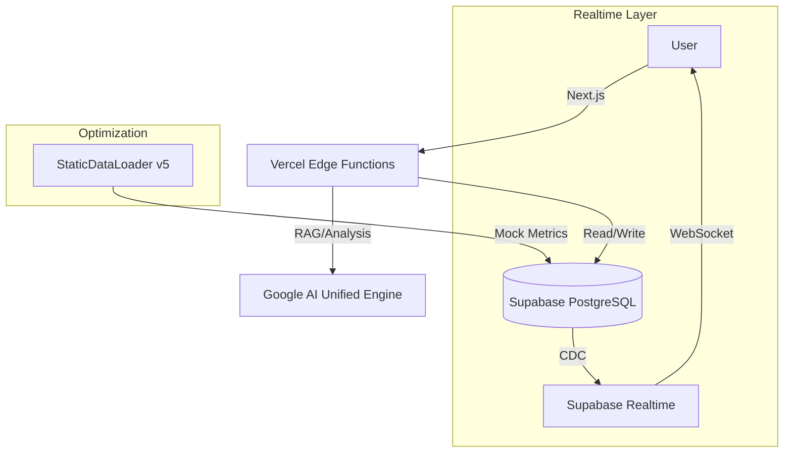

# OpenManager VIBE v5

> **AI-Native Server Monitoring PoC**
> Exploring the future of **AX (AI Experience)** in DevOps through **Vibe Coding**.

[](https://nextjs.org/)
[](https://supabase.com/)
[](https://ai.google.dev/)
[](https://biomejs.dev/)
[](https://www.typescriptlang.org/)

## 👨‍💻 Project Philosophy

This project is a **Proof of Concept (PoC)** designed to demonstrate advanced full-stack capabilities and the potential of **Human-AI Collaboration (Vibe Coding)**.

It reimagines traditional server monitoring by integrating **AI** directly into the workflow, shifting from "Reactive Monitoring" to **"Predictive & Interactive Operations"**.

## 🏗️ System Architecture

Event-driven architecture optimized for real-time operations and AI-powered insights.



### Key Technical Achievements

- **Event-Driven Architecture**: Scalable real-time monitoring with WebSocket-based updates.
- **StaticDataLoader v5**: Custom simulation engine with optimized CPU usage through intelligent caching.
- **AI-Driven Operations**:
    - **RAG Troubleshooting**: Vector search for instant error resolution.
    - **Anomaly Prediction**: Real-time analysis of metric trends.
    - **Multi-AI Validation**: Automated code review with fallback mechanisms.

## ✨ Core Features

### 1. ⚡ Real-time Performance
- **GPU-Accelerated UI**: Smooth animations with hardware acceleration.
- **WebSocket Integration**: Low-latency metric updates.
- **Optimized Rendering**: React Server Components with intelligent hydration.

### 2. 🤖 AI-Powered Operations
- **Unified AI Engine**: Google Gemini 2.5 Flash with intelligent fallback routing.
- **Automated Code Review**: Multi-AI cross-validation system with high availability.
- **Context-Aware Analysis**: AI understands current system status and correlates data.
- **RAG Integration**: Vector search for instant troubleshooting and documentation lookup.

### 3. 🛡️ Development Quality
- **Strict TypeScript**: Zero `any` policy with comprehensive type safety.
- **Modern Tooling**: Biome (Lint/Format), Vitest (Unit/Integration), Playwright (E2E).
- **Automated Testing**: Comprehensive test coverage with E2E validation.
- **CI/CD Pipeline**: Continuous validation and deployment automation.

## 🛠️ Tech Stack

| Category | Technology | Key Capabilities |
|----------|------------|------------------|
| **Frontend** | Next.js 15 (App Router) | Server Components, Streaming, Edge Runtime |
| **State** | Zustand + React Query | Optimistic updates, Server state sync |
| **Database** | Supabase (PostgreSQL) | Real-time subscriptions, Vector search (pgvector) |
| **AI Engine** | Google Gemini 2.5 Flash | Large context window, Function calling, RAG |
| **Testing** | Vitest + Playwright | Unit/Integration testing, E2E automation |
| **Code Quality** | Biome + TypeScript Strict | Fast linting/formatting, Type safety |
| **Styling** | Tailwind CSS + Shadcn/UI | Utility-first CSS, Accessible components |

## 🚀 Getting Started

**Prerequisites**: Node.js v22+, npm v10+

```bash
# 1. Clone & Install
git clone https://github.com/your-username/openmanager-vibe-v5.git
cd openmanager-vibe-v5
npm install

# 2. Setup Environment
cp .env.example .env.local
# Add SUPABASE_URL, SUPABASE_ANON_KEY, GOOGLE_AI_KEY

# 3. Run Development Server
npm run dev:stable
```

---

<div align="center">
  <sub>Built with 💜 using Vibe Coding methodologies.</sub>
</div>
