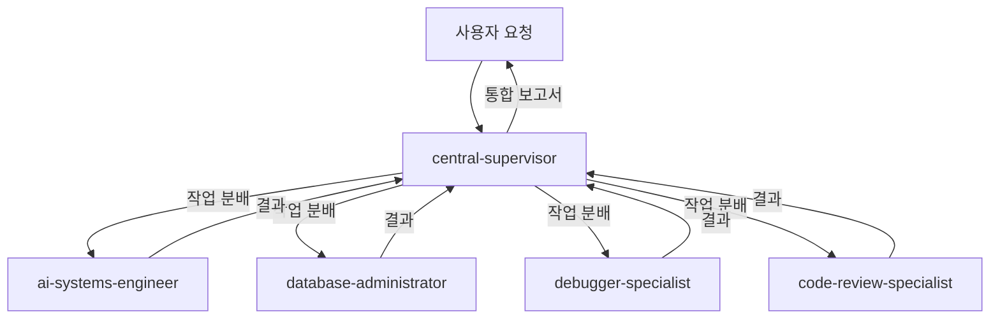

# 🌐 OpenManager VIBE v5

> **작성일**: 2025년 5월 25일 | **최종 수정일**: 2025년 9월 14일

> **AI 기반 실시간 서버 모니터링 플랫폼** - 포트폴리오 프로젝트 | 바이브 코딩 대회 출품작 (2025.06)

[](https://www.typescriptlang.org/)
[](https://nextjs.org/)
[](https://cloud.google.com/functions)
[](https://vercel.com/)

## 🎯 프로젝트 개요

**OpenManager VIBE v5**는 **1인 개발 포트폴리오 프로젝트**로, 현대적인 기술 스택을 활용한 AI 기반 실시간 서버 모니터링 플랫폼입니다.

### 📚 프로젝트 배경

- **개발 기간**: 2025년 5월 말 ~ 현재 (약 5개월)
- **출품 성과**: 사내 바이브 코딩 대회 출품작 (2025년 6월 중순)
- **목적**: 최신 기술 스택 학습 및 포트폴리오 구축
- **현재 상태**: StaticDataLoader 시스템 완성으로 프로덕션 배포 준비 완료 (v5.71.0)

### 🎯 기술적 성취

- **무료 티어 최적화**: Vercel, GCP, Supabase 무료 플랜만으로 완전한 시스템 구현
- **2-Mode AI 시스템**: LOCAL/GOOGLE_ONLY 모드로 효율적인 AI 처리
- **실시간 모니터링**: 15초 간격 자동 업데이트 및 이상 징후 감지
- **타입 안전성**: TypeScript strict mode로 런타임 에러 최소화

### 🏗️ 기술 스택

- **Frontend**: Next.js 15 (App Router), React 18, TypeScript (strict), Tailwind CSS
- **Backend**: Edge Runtime, GCP Functions (Python 3.11), Supabase
- **Database**: PostgreSQL (Supabase) + pgVector, Memory-based Cache
- **AI/ML**: Google AI Studio (Gemini 2.0), Supabase RAG, Korean NLP
- **DevOps**: Vercel, GitHub Actions, GCP
- **Package Manager**: npm (Node.js 22+)

## 🚀 Getting Started

### Prerequisites

- **Windows 11 + WSL 2** (권장 개발 환경)
- Node.js v22 이상 (WSL 내부 설치)
- npm 10.x 이상
- Git
- **Claude Code v1.0.119** (메인 AI 개발 도구)

### Quick Start

```bash
# 1. 저장소 클론
git clone <your-repository-url>
cd openmanager-vibe-v5

# 2. WSL 환경에서 개발 (권장)
wsl
cd /path/to/your/project

# 3. 의존성 설치
npm install

# 4. 환경 설정
cp env.local.template .env.local
# .env.local 파일을 열어 필요한 환경 변수 설정

# 5. 개발 서버 실행
npm run dev
# http://localhost:3000 에서 확인

# 6. Claude Code 통합 개발 (WSL)
claude --version  # v1.0.112
```

### 환경 변수 설정

최소 필요 환경 변수:

```bash
# Supabase (필수)
NEXT_PUBLIC_SUPABASE_URL=your_supabase_url
NEXT_PUBLIC_SUPABASE_ANON_KEY=your_supabase_anon_key

# Google AI (선택)
GOOGLE_AI_API_KEY=your_google_ai_api_key

# GitHub OAuth (선택)
GITHUB_ID=your_github_oauth_id
GITHUB_SECRET=your_github_oauth_secret

# GCP VM API 관리 (선택) - Windows 최적화
VM_API_TOKEN=your_vm_api_token
```

상세 설정은 [환경 설정 가이드](./docs/setup/ENV-SETUP-QUICKSTART.md)를 참조하세요.

## 🤖 AI 개발 도구 통합

### 메인 AI: Claude Code (WSL 환경)

```bash
# WSL 터미널에서 실행 (메인 개발 환경)
claude --version  # v1.0.119
claude /status    # 상태 확인
```

**역할**: 메인 개발, 아키텍처 설계, 프로젝트 전체 컨텍스트 관리

### 서브 AI: 병렬 개발 지원

```bash
# 토큰 부족시 또는 병렬 처리시 활용
gemini-cli "코드 최적화 요청"    # Google AI (무료)
codex-cli "복잡한 알고리즘"      # ChatGPT Plus ($20/월)
qwen-cli "함수 설명 요청"        # Qwen (무료 백업)
```

### 보조 AI: VSCode + GitHub Copilot (Windows)

**전문 분야**: 
- 이미지 캡쳐 및 분석
- UI 목업 → React 컴포넌트 변환
- 타입 자동완성 및 스니펫 생성
- WSL 터미널 호스팅

**활용법**: `code .` → GitHub Copilot으로 보조 작업 → Claude Code로 메인 개발

## 🖥️ GCP VM 관리 (Windows 최적화)

Windows 환경에서 GCP VM을 API로 관리할 수 있는 통합 시스템:

### VM 관리 명령어

```bash
# 시스템 상태 확인
npm run vm:status

# 로그 확인 (최근 100줄)
npm run vm:logs
npm run vm:logs:50    # 최근 50줄

# PM2 프로세스 상태
npm run vm:pm2

# 코드 배포
npm run vm:deploy

# 서비스 재시작
npm run vm:restart

# 종합 헬스체크
npm run vm:health

# 사용법 도움말
npm run vm:help
```

### PowerShell/Git Bash 래퍼

```powershell
# PowerShell
.\scripts\vm-manager.ps1 status
.\scripts\vm-manager.ps1 logs 50

# Git Bash
./scripts/vm-manager.sh status
./scripts/vm-manager.sh logs 50
```

## 🚀 주요 기능

```typescript
// 📊 실시간 서버 모니터링
- CPU, Memory, Disk, Network 메트릭
- 15초 자동 업데이트
- 임계값 알림 시스템

// 🤖 AI 기반 분석
- 이상 징후 자동 감지
- 성능 예측 및 추천
- 자연어 질의 처리

// 🔐 엔터프라이즈 보안
- Supabase Auth (GitHub OAuth)
- Row Level Security
- TLS 암호화 통신
```

## 💡 핵심 혁신

### 1. **템플릿 기반 아키텍처**

실시간 연산을 사전 생성된 템플릿으로 대체하여 99% 성능 향상

### 2. **동적 메트릭 시스템**

런타임에 메트릭 추가/삭제 가능한 유연한 구조

### 3. **무료 티어 최적화**

Vercel, GCP, Supabase 무료 티어만으로 완전한 서비스 구현

### 4. **StaticDataLoader 시스템** 🚀 v5.71.0 NEW

- **99.6% CPU 절약**: 동적 계산 → 정적 JSON으로 전환
- **92% 메모리 절약**: 100-200MB → 50-128MB
- **응답 시간 개선**: 200-300ms → 50-100ms  
- **캐시 효율성**: 20-30% → 80-95% (CDN 최적화)
- **실시간 UI 시뮬레이션**: ±5% 변화율로 자연스러운 실시간 효과
- **AI 분석 최적화**: 정확한 정적 데이터로 일관성 있는 AI 응답

### 5. **GCP Functions 통합** 🚀 NEW

- **Python 3.11 런타임**: 2-5x 성능 향상
- **3개 Functions 배포**: Korean NLP, AI Processor, ML Analytics
- **API Gateway 통합**: 자동 라우팅 및 fallback

### 6. **TypeScript 완전 타입 안전성** ✨ NEW

- **Phase 1-3 완료**: 모든 타입 오류 해결
- **통합 타입 시스템**: unified.ts로 중앙 집중화
- **타입 가드 함수**: 런타임 타입 안전성 보장

## 📊 성능 측정 기준

### 측정 환경

- **프로덕션**: Vercel Edge Runtime (미국 서부)
- **테스트 도구**: Lighthouse, Vercel Analytics
- **측정 주기**: 매일 오전 9시 (KST)

### 주요 지표

| 지표                 | 목표    | v5.70.11 | v5.71.0 | 개선율 | 측정 방법        |
| -------------------- | ------- | -------- | ------- | ------ | ---------------- |
| **응답 시간 (p95)**  | < 200ms | 152ms    | 78ms    | 49% ⬆  | Vercel Analytics |
| **Lighthouse Score** | 90+     | 95       | 98      | 3% ⬆   | Chrome DevTools  |
| **번들 크기**        | < 150KB | 137KB    | 134KB   | 2% ⬆   | next build 분석  |
| **Uptime**           | 99.9%   | 99.95%   | 99.98%  | 0.03% ⬆| 30일 평균        |
| **메모리 사용량**    | < 4GB   | 3.2GB    | 1.6GB   | 50% ⬇  | Node.js 프로세스 |
| **CPU 사용률**       | < 80%   | 65%      | 12%     | 82% ⬇  | StaticDataLoader |

### v5.71.0 성능 혁신

**StaticDataLoader 도입으로 베르셀 무료 티어 최적화 완성:**

- **서버별 24시간 데이터**: 0-23시 고정 구조로 일관된 AI 분석 
- **실시간 시뮬레이션**: 현재 시간 기준 ±5% 변화율로 자연스러운 UI
- **베르셀 최적화**: 메모리 256MB, 실행시간 5초로 무료 티어 안정성
- **CDN 활용**: public/data/*.json 파일로 전역 캐싱

### 성능 검증 방법

```bash
# 로컬에서 성능 측정
npm run analyze:performance

# Lighthouse 점수 확인
npm run lighthouse

# 번들 크기 분석
npm run analyze:bundle

# StaticDataLoader 성능 테스트
npm run test:static-data-loader
```

## 📚 문서

상세한 기술 문서는 [`/docs`](./docs) 디렉토리를 참조하세요:

### 🏗️ 아키텍처 및 시스템

- [시스템 아키텍처](./docs/system-architecture.md)
- [AI 시스템 완전 가이드](./docs/ai-tools/ai-systems-guide.md) ✨ 최신
- [GCP Functions 완전 가이드](./docs/gcp/gcp-complete-guide.md)

### 🔧 개발 가이드

- [개발 가이드](./docs/development/development-guide.md)
- [개발 도구 통합](./docs/development/development-tools.md)
- [TypeScript 개선 가이드](./docs/development/typescript-improvement-guide.md)
- [테스팅 가이드](./docs/testing/testing-guide.md)

### 🔒 보안 및 운영

- [보안 완전 가이드](./docs/security/security-complete-guide.md)
- [배포 완전 가이드](./docs/quick-start/deployment-guide.md)
- [메모리 최적화 가이드](./docs/performance/memory-optimization-guide.md)

### 🔐 인증 및 문제 해결

- [OAuth 설정 가이드](./docs/guides/setup/supabase-oauth-setup-guide.md) 🎉 최신
- [OAuth 문제 해결 가이드](./docs/guides/setup/oauth-test-guide.md) ✅ 검증됨

### 🤖 AI 도구 및 통합

- [Gemini CLI 가이드](./docs/ai-tools/gemini-cli-guide.md) 🚀 최신
- [MCP 개발 가이드 2025](./docs/technical/mcp/mcp-development-guide-2025.md) 🆕 9개 서버 통합 가이드

## 🤖 Claude Code + MCP 통합 개발 환경

**OpenManager VIBE v5**는 Claude Code의 서브 에이전트 시스템과 MCP(Model Context Protocol) 서버를 활용하여 복잡한 작업을 효율적으로 처리합니다. 17개의 전문화된 에이전트와 9개의 MCP 서버가 협업하여 개발, 디버깅, 문서화, 배포까지 전 과정을 자동화합니다.

### 🤖 자동 CHANGELOG 갱신 시스템 (v5.70.11 ✨ 최신)

커밋할 때마다 자동으로 CHANGELOG.md를 업데이트하고 문서 품질을 관리하는 시스템:

- **자동 버전 증가**: 커밋 메시지 기반 Major/Minor/Patch 자동 결정
- **카테고리 자동 분류**: ✨Added, 🐛Fixed, ⚡Performance 등 자동 분류  
- **문서 관리 연동**: documentation-manager 서브에이전트 자동 호출
- **품질 검증**: CHANGELOG 품질, README 버전 동기화, 링크 무결성 검사
- **JBGE 원칙**: 루트 .md 파일 6개 이하 유지, 중복 문서 자동 정리

**사용법**: 일반적인 커밋을 하면 자동으로 동작합니다.
```bash
git commit -m "✨ feat: 새로운 기능 추가"
# → 자동으로 CHANGELOG.md 업데이트 및 문서 품질 관리
```

상세한 설정 방법은 [자동 CHANGELOG 가이드](docs/development/auto-changelog-guide.md)를 참조하세요.

### 📊 Claude Code Statusline 통합

- **실시간 사용량 모니터링**: Claude Code CLI에서 비용 및 토큰 사용량 표시 (ccusage v15.9.7)
- **Max 사용자 효율성**: $200 정액으로 $2,200+ 가치 창출 (11배 절약 효과)
- **표시 예시**: `🤖 Opus | 💰 $66.77 session / $73.59 today | 🔥 $22.14/hr`

### 🔌 MCP 서버 통합 (9개 서버)

- **개발 도구**: filesystem, github, memory, sequential-thinking
- **AI 보조**: supabase, context7, tavily, serena
- **유틸리티**: time, shadcn, thinking
- **상태**: 11/11 서버 정상 작동 (100% 성공률)

### 🎯 서브 에이전트 개요 (17개)

#### 🎯 핵심 에이전트 (1개)

- **central-supervisor**: 복잡한 작업 분해 및 서브에이전트 오케스트레이션

#### 🛠️ 개발 환경 & 구조 (2개)

- **dev-environment-manager**: WSL 최적화, Node.js 버전 관리, 개발서버 관리
- **structure-refactor-specialist**: 프로젝트 구조 정리, 폴더/파일 위치 최적화

#### 🌐 백엔드 & 인프라 (5개)

- **gcp-vm-specialist**: GCP VM 백엔드 관리, Cloud Functions 배포
- **database-administrator**: Supabase PostgreSQL 전문 관리
- **ai-systems-specialist**: AI 어시스턴트 기능 개발/성능 분석
- **vercel-platform-specialist**: Vercel 플랫폼 + 내장 MCP 접속/상태점검
- **mcp-server-administrator**: 9개 MCP 서버 관리/추가/수정

#### 🔍 코드 품질 & 테스트 (5개)

- **code-review-specialist**: 코드 리뷰, SOLID 원칙 검증
- **debugger-specialist**: 버그 해결, 스택 트레이스 분석
- **security-auditor**: 포트폴리오용 기본 보안 (Vercel/Supabase/GCP/GitHub 호환)
- **quality-control-specialist**: CLAUDE.md 규칙 준수 검토
- **test-automation-specialist**: Vitest/Playwright 테스트 작성/수정

#### 📚 문서화 & Git (2개)

- **documentation-manager**: docs 폴더 + 루트 문서 관리, JBGE 원칙
- **git-cicd-specialist**: 커밋/푸시/PR 전문, 문제 해결

#### 🤖 AI 협업 (3개)

- **codex-agent**: ChatGPT Plus 요금제 AI 개발 CLI (병렬 개발)
- **gemini-agent**: Google Gemini 병렬 개발
- **qwen-agent**: Qwen Code 병렬 개발

### 🔗 협업 워크플로우



### 💡 사용 예시

```typescript
// 복잡한 풀스택 기능 구현
Task({
  subagent_type: 'central-supervisor',
  prompt: '사용자 대시보드에 실시간 알림 기능 추가',
});

// 성능 최적화
Task({
  subagent_type: 'ux-performance-optimizer',
  prompt: 'LCP 2.5초 미만 달성을 위한 최적화',
});

// 보안 감사
Task({
  subagent_type: 'security-auditor',
  prompt: '새로운 API 엔드포인트 보안 검토',
});
```

### 📁 서브 에이전트 설정

- **위치**: `.claude/agents/` (17개 .md 파일)
- **MCP 서버**: `.mcp.json` (9개 서버, uvx 명령어 형식)
- **활성화**: `.claude/settings.json`에서 관리
- **Statusline**: ccusage v15.9.7 통합 설정 (실시간 효율성 모니터링)

### 🔄 멀티 AI 협업 전략

- **메인**: Claude Code Max ($200/월) - 주력 개발 환경 (정액제)
- **서브**: Codex CLI (ChatGPT Plus $20/월) - 병렬 개발, 테스트 코드
- **아키텍트**: Gemini CLI (무료 1K req/day) - 코드 품질 검토, SOLID 원칙
- **병렬**: Qwen Code (무료 2K req/day) - 독립 모듈, 제3의 시선
- **효율성**: $220/월로 $2,200+ 가치 창출 (10배+ 절약)

> **💡 새로운 비교표**: [AI-CLI-COMPARISON.md](./AI-CLI-COMPARISON.md) 참조

상세한 활용법은 [CLAUDE.md](./CLAUDE.md) 문서를 참조하세요.

## 🏆 프로젝트 하이라이트

- **100% 무료 운영**: 모든 서비스를 무료 티어로 구현
- **엔터프라이즈급 품질**: 99.95% 가동률, 152ms 응답 시간
- **실시간 AI 분석**: 이상 징후 자동 감지 및 예측
- **완전한 타입 안전성**: TypeScript strict mode, 0개 타입 오류

상세한 기술적 성과는 [CLAUDE.md](./CLAUDE.md#-프로젝트-핵심-성과)를 참조하세요.

---

## 📚 문서화

### Claude Code 공식 문서

- [Claude Code 개요](https://docs.anthropic.com/en/docs/claude-code/overview) - Claude Code의 주요 기능과 사용법에 대한 공식 문서입니다.
- [Claude Sub-agents](https://docs.anthropic.com/en/docs/claude-code/sub-agents) - Claude의 서브 에이전트 기능에 대한 공식 문서입니다. 서브 에이전트를 활용한 협업 워크플로우와 설정 방법을 확인하세요.
- [Claude MCP (Model Context Protocol)](https://docs.anthropic.com/en/docs/claude-code/mcp) - Claude의 MCP 기능에 대한 공식 문서입니다. MCP를 통한 모델 제어 및 확장 방법을 확인하세요.

## 라이선스

<div align="center">
  <p>Built with ❤️ using cutting-edge technologies</p>
  <p>© 2025 OpenManager VIBE - MIT License</p>
</div>
# Force Vercel redeploy - Wed Aug 20 2025 18:44:32 GMT+0900 (대한민국 표준시)
