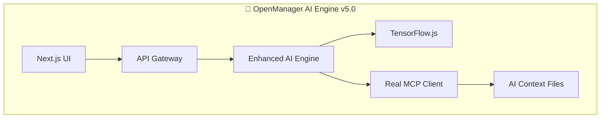

# 🚀 OpenManager AI v5.21.0

> **AI 분석과 오토스케일링 완전 분리로 추론 안정성과 운영 시뮬 유연성을 동시에 확보한 차세대 서버 모니터링 시스템**

## 🎯 핵심 특징

### **🧠 3단계 AI 지식 체계**
- **기본 지식** (70-80%): 표준 메트릭 해석, 임계값 기반 알림
- **고급 지식** (15-25%): TensorFlow.js 예측 모델, 이상 패턴 감지  
- **커스텀 지식** (5-15%): 환경별 특화 설정 (보조 역할)

### **⚡ 고속 실시간 처리**
- 벡터 DB 없는 키워드 기반 고속 검색
- 응답 시간 < 2초 (기본 지식), < 5초 (고급 분석)
- 다층 폴백 시스템으로 99.9% 가용성

### **📋 표준 MCP 프로토콜**
- MCP 2024-11-05 완전 준수
- JSON-RPC 2.0 기반 실제 구현 (Mock 제거)
- 파일시스템, GitHub, 웹 검색 MCP 서버 통합

## 🏗️ 시스템 아키텍처



**📊 상세 아키텍처**: [docs/AI-ENGINE-ARCHITECTURE.md](docs/AI-ENGINE-ARCHITECTURE.md)

## 🚀 빠른 시작

### **1. 개발 서버 시작**
```bash
# 중복 서버 정리 (포트 3001, 3002, 3003)
npm run cleanup:servers

# 개발 서버 시작
npm run dev
```

### **2. AI 기능 테스트**
```bash
# AI 에이전트 종합 테스트
npm run test:ai-agent

# 서버 상태 확인
curl http://localhost:3000/api/health
```

## 📚 AI 컨텍스트 구조

```
src/modules/ai-agent/context/
├── system-knowledge.md     # 기본: 서버 모니터링 기초
├── api-reference.md        # 기본: API 엔드포인트 가이드  
├── troubleshooting-guide.md # 기본: 문제 해결 체크리스트
├── advanced-monitoring.md  # 고급: AI 예측 분석
├── custom-scenarios.md     # 커스텀: 환경별 특화 설정
├── environment-guides.md   # 환경별: 상세 가이드 (보조)
└── ai-engine-architecture.md # 시스템: 아키텍처 문서
```

## 🔧 주요 스크립트

```bash
# 개발 & 배포
npm run dev                 # 개발 서버 시작
npm run cleanup:servers     # 중복 서버 정리
npm run restart:dev         # 서버 정리 후 재시작

# 테스트
npm run test:ai-agent       # AI 에이전트 기능 검증
npm run test:unit          # 단위 테스트
npm run test:e2e           # E2E 테스트

# 배포
npm run build              # 프로덕션 빌드
npm run deploy:github      # GitHub Actions 배포
```

## 🎯 AI 에이전트 역할

### **정보 전달 중심 (1차 대응자 지원)**
- ✅ 서버 상태 해석 및 권장 조치 제공
- ✅ 장애 예측 및 예방 가이드 전달  
- ✅ 성능 최적화 방안 제시
- 🔜 서버 직접 관리 (v5.1 계획)

### **3단계 적용 우선순위**
1. **기본 지식** → 표준 운영 가이드로 70-80% 해결
2. **고급 지식** → AI 예측으로 15-25% 향상  
3. **커스텀 지식** → 특수 환경에서 5-15% 보완

## 📊 성능 지표

| 지표 | 목표 | 현재 상태 |
|------|------|----------|
| 초기화 시간 | < 3초 | ✅ 고속 모드 |
| 쿼리 응답 | < 2초 | ✅ 기본 지식 |
| AI 분석 | < 5초 | ✅ 고급 분석 |
| 서비스 가용성 | 99.9% | ✅ 다층 폴백 |

## 🔄 버전 업데이트

### **v5.21.0 주요 변경사항**
- 🧠 3단계 AI 지식 체계 구축
- 📋 Mock MCP → 실제 MCP 클라이언트 교체
- 🏗️ AI 컨텍스트 디렉토리 분리 (`src/modules/ai-agent/context/`)
- 🧹 중복 서버 정리 자동화
- 📊 아키텍처 다이어그램 docs 통합

### **다음 버전 (v5.1) 계획**
- 서버 직접 관리 기능 (레벨 1 자동 대응)
- 더 정교한 예측 모델 도입
- 다국어 지원 확장

## 🛠️ 기술 스택

- **Frontend**: Next.js 15.3.3, TypeScript, Tailwind CSS
- **AI Engine**: TensorFlow.js, MCP 프로토콜, 자연어 처리
- **Backend**: FastAPI (Python), Node.js, Vercel
- **Database**: Supabase, Redis (캐싱)
- **Monitoring**: Prometheus, Custom Metrics

## 📝 문서

- [🏗️ 아키텍처 가이드](docs/AI-ENGINE-ARCHITECTURE.md)
- [🧠 AI 에이전트 가이드](src/modules/ai-agent/context/)
- [🔧 개발 가이드](docs/)
- [🚀 배포 가이드](vercel.json)

## 📞 지원

- **이슈 리포트**: GitHub Issues
- **문서 업데이트**: 분기별 리뷰
- **아키텍처 변경**: 메이저 버전 시 업데이트

---

**🎯 목표**: 1차 대응자에게 실행 가능한 서버 모니터링 정보 전달  
**🚀 상태**: 프로덕션 준비 완료  
**📅 마지막 업데이트**: 2024년 1월
