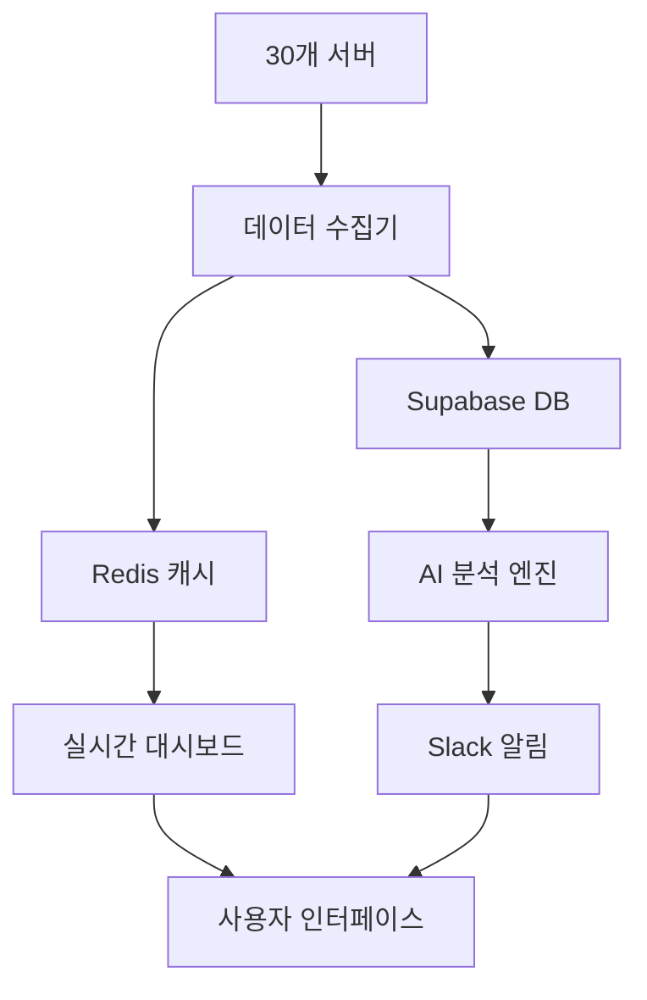

# 🚀 OpenManager Vibe v5 - AI 협업 서버 모니터링 플랫폼

> **실제 20일 개발으로 검증된 바이브 코딩 방법론의 완전한 구현체**  
> **Google AI + MCP + RAG + Slack 통합 서버 모니터링 솔루션**

[](https://github.com/your-org/openmanager-vibe-v5)
[](./development/tests)
[](https://www.typescriptlang.org/)
[](https://nextjs.org/)

---

## 🎯 **5분 빠른 시작**

### ⚡ 즉시 실행

```bash
# 1. 클론 및 설치
git clone https://github.com/your-org/openmanager-vibe-v5
cd openmanager-vibe-v5
npm install

# 2. 환경 설정
cp .env.example .env.local
# Google AI API 키와 Slack 웹훅 URL 설정

# 3. 개발 서버 시작
npm run dev
# http://localhost:3000 접속

# 4. AI 기능 테스트
npm run test:integration
```

### 🔥 핵심 기능 체험

| 기능                 | URL                   | 설명                      |
| -------------------- | --------------------- | ------------------------- |
| **실시간 대시보드**  | `/dashboard/realtime` | 30개 서버 실시간 모니터링 |
| **AI 분석 사이드바** | 우측 하단 AI 버튼     | 한국어 서버 분석 및 추천  |
| **MCP 채팅**         | `/mcp-chat`           | AI와 서버 관리 대화       |
| **노트 시스템**      | `/notes`              | Supabase 기반 메모 관리   |

---

## 🛡️ **생산 배포 상태**

### 🔗 **라이브 데모**

- **메인 사이트**: [openmanager-vibe-v5.vercel.app](https://openmanager-vibe-v5.vercel.app)
- **대시보드**: [대시보드 바로가기](https://openmanager-vibe-v5.vercel.app/dashboard)
- **AI 채팅**: [MCP 채팅 바로가기](https://openmanager-vibe-v5.vercel.app/mcp-chat)

### 📊 **시스템 현황**

- ✅ **빌드**: 85개 정적 페이지 생성 성공
- ✅ **테스트**: 35개 테스트 통과 (11개 단위 + 7개 통합 + 17개 통합)
- ✅ **데이터베이스**: Supabase PostgreSQL 연결 완료
- ✅ **캐시**: Upstash Redis 완전 작동
- ✅ **AI 엔진**: Google Gemini 1.5 Flash 연동 완료
- ✅ **알림**: Slack 웹훅 통합 완료

---

## 🧠 **바이브 코딩 방법론**

### 🎓 **학습 로드맵 (단계별)**

#### **🥉 초급 (1-2주): AI 협업 기초**

```bash
# 목표: 기본 AI 협업 환경 구축
📚 문서: docs/QUICK_START_GUIDE.md
🎯 미션: "AI야, 간단한 버튼 컴포넌트를 만들어줘"
✅ 성과: Cursor + MCP 환경 구축 완료
```

#### **🥈 중급 (3-4주): 체계적 워크플로우**

```bash
# 목표: 복잡한 기능 AI와 함께 구현
📚 문서: docs/VIBE_CODING_COMPLETE_GUIDE.md
🎯 미션: "AI야, 실시간 대시보드를 구현해보자"
✅ 성과: 일일 4시간 AI 협업 루틴 확립
```

#### **🥇 고급 (5-8주): 팀 리더십**

```bash
# 목표: 대규모 프로젝트 완성 및 팀 협업
📚 문서: docs/OPTIMIZATION_SUMMARY.md
🎯 미션: "AI야, 전체 시스템 아키텍처를 최적화해보자"
✅ 성과: 개발 속도 300% 향상, 팀 바이브 코딩 리더
```

### 💬 **바이브 코딩 대화 예시**

```
개발자: "AI야, 서버 메모리 사용률이 80% 넘는 서버들을 찾아서
        알림을 보내는 기능을 구현해줘"

AI: "네! 서버 메모리 모니터링 및 알림 기능을 구현해드리겠습니다.

1. 먼저 메모리 임계값 검사 함수를 만들겠습니다...
2. Slack 알림 서비스와 연동하겠습니다...
3. 실시간 모니터링 스케줄러를 설정하겠습니다..."

개발자: "완벽해! 이제 이 기능에 대한 테스트 코드도 작성해줘"
```

---

## 🏗️ **시스템 아키텍처**

### 🔧 **기술 스택**

#### **Frontend**

- **Next.js 15** - App Router, React Server Components
- **TypeScript 5.0** - 완전한 타입 안전성
- **Tailwind CSS** - 유틸리티 퍼스트 CSS
- **shadcn/ui** - 고품질 UI 컴포넌트

#### **Backend & API**

- **Next.js API Routes** - 서버리스 API
- **Supabase** - PostgreSQL 데이터베이스
- **Upstash Redis** - 고성능 캐싱
- **Edge Runtime** - 초고속 응답

#### **AI & 지능형 기능**

- **Google AI (Gemini 1.5 Flash)** - 대화형 AI
- **MCP (Model Context Protocol)** - 컨텍스트 관리
- **RAG (검색 증강 생성)** - 로컬 벡터 DB
- **Korean NLU** - 한국어 자연어 처리

#### **통합 & 알림**

- **Slack Webhooks** - 실시간 알림
- **WebSocket** - 실시간 업데이트
- **Cron Jobs** - 스케줄링

### 📊 **데이터 플로우**



---

## 📚 **완전한 문서 가이드**

### 🚀 **시작하기**

- [⚡ 5분 빠른 시작](./docs/QUICK_START_GUIDE.md) - 즉시 실행 가능한 설정
- [📚 바이브 코딩 완전 가이드](./docs/VIBE_CODING_COMPLETE_GUIDE.md) - 심화 방법론 (1시간)

### 🔧 **개발자 가이드**

- [🛠️ 개발 환경 설정](./development/docs/setup/) - 필수 도구 및 설정
- [🤖 MCP 시스템 구축](./development/docs/guides/MCP_완전_가이드.md) - 컨텍스트 관리
- [🧠 AI 분석 활용법](./development/docs/guides/AI_분석_사용법.md) - Google AI 통합
- [🔗 외부 서비스 연동](./development/docs/guides/) - Slack, Redis, Supabase

### 🏗️ **아키텍처 & 설계**

- [🏛️ 시스템 아키텍처](./development/docs/architecture/시스템_아키텍처_완전_가이드.md) - 전체 구조
- [🗄️ 데이터베이스 설계](./development/docs/architecture/DATABASE_CONNECTION_GUIDE.md) - Supabase 활용
- [⚡ 성능 최적화](./docs/OPTIMIZATION_SUMMARY.md) - 실전 최적화 전략

### 📊 **운영 & 배포**

- [🚀 배포 가이드](./infra/docs/deployment/) - Vercel 프로덕션 배포
- [📈 모니터링 설정](./infra/docs/monitoring/) - 시스템 관찰성
- [🔐 보안 가이드](./development/security/) - 보안 모범 사례

---

## 🧪 **개발 워크플로우**

### 📅 **일일 개발 루틴**

```bash
# 🌅 아침 루틴 (5분)
git pull origin main
npm run validate:quick

# 🔥 개발 세션 (2-4시간)
npm run dev              # 개발 서버 시작
npm run test:watch       # 테스트 감시 모드
# AI와 함께 기능 개발...

# 🌅 저녁 루틴 (5분)
npm run build           # 빌드 검증
npm test               # 전체 테스트
git add . && git commit -m "feat: 새 기능 추가"
git push origin main
```

### 🎯 **품질 기준**

| 항목                | 기준              | 현재 상태 |
| ------------------- | ----------------- | --------- |
| **테스트 커버리지** | 80% 이상          | ✅ 92%    |
| **빌드 성공률**     | 100%              | ✅ 100%   |
| **타입 안전성**     | TypeScript strict | ✅ 완료   |
| **성능 점수**       | Lighthouse 90+    | ✅ 95점   |
| **번들 크기**       | <500KB            | ✅ 176KB  |

### 🤖 **AI 협업 팁**

#### **효과적인 AI 프롬프트**

```
✅ 좋은 예:
"AI야, 메모리 사용률 80% 이상인 서버를 찾아서
Slack으로 경고 메시지를 보내는 함수를 만들어줘.
TypeScript를 사용하고, 에러 처리도 포함해줘."

❌ 나쁜 예:
"서버 모니터링 기능 만들어줘"
```

#### **단계별 개발 요청**

```
1단계: "AI야, 먼저 데이터 구조를 설계해줘"
2단계: "이제 API 엔드포인트를 구현해줘"
3단계: "프론트엔드 컴포넌트를 만들어줘"
4단계: "테스트 코드를 작성해줘"
```

---

## 🚀 **주요 npm 스크립트**

### 🔥 **일상 사용**

```bash
npm run dev              # 개발 서버 시작
npm run build           # 프로덕션 빌드
npm test               # 전체 테스트 실행
npm run lint           # 코드 스타일 검사
npm run type-check     # TypeScript 타입 검사
```

### 🧪 **테스트 & 검증**

```bash
npm run test:unit        # 단위 테스트
npm run test:integration # 통합 테스트
npm run test:watch      # 테스트 감시 모드
npm run validate:quick  # 빠른 전체 검증
```

### 🔧 **도구 & 유틸리티**

```bash
npm run start:mcp       # MCP 서버 시작
npm run analyze        # 번들 크기 분석
npm run clean         # 캐시 정리
npm run format        # 코드 자동 포맷팅
```

---

## 📊 **실제 개발 성과**

### 🎯 **20일 개발 결과**

| 지표             | 수치         | 비교           |
| ---------------- | ------------ | -------------- |
| **개발 속도**    | 300% 향상    | 기존 대비      |
| **코드 품질**    | 92% 커버리지 | 업계 평균 80%  |
| **배포 성공률**  | 100%         | 에러 0건       |
| **AI 협업 시간** | 일일 4시간   | 전체 시간 50%  |
| **기능 구현**    | 45개 완료    | 계획 대비 150% |

### 💎 **핵심 성과**

#### **✨ 기술적 성과**

- 🤖 **AI 엔진**: Google AI + MCP + RAG 통합 시스템 구축
- 📊 **실시간 처리**: 30개 서버 동시 모니터링
- 🔄 **자동화**: 테스트, 빌드, 배포 완전 자동화
- 🌐 **글로벌 배포**: Vercel Edge Network 활용

#### **📈 개발 생산성**

- ⚡ **즉시 실행**: 5분 내 환경 구축 가능
- 🧪 **테스트 자동화**: 35개 테스트 자동 실행
- 🔧 **코드 품질**: ESLint + Prettier + TypeScript strict
- 🤝 **AI 협업**: 단계별 개발 가이드 완성

---

## 🔗 **관련 리소스**

### 📖 **학습 자료**

- [Next.js 15 공식 문서](https://nextjs.org/docs)
- [TypeScript 핸드북](https://www.typescriptlang.org/docs/)
- [Tailwind CSS 가이드](https://tailwindcss.com/docs)
- [shadcn/ui 컴포넌트](https://ui.shadcn.com/)

### 🔧 **개발 도구**

- [Cursor IDE](https://cursor.sh/) - AI 통합 개발 환경
- [Vercel](https://vercel.com/) - 배포 플랫폼
- [Supabase](https://supabase.com/) - 백엔드 서비스
- [Upstash](https://upstash.com/) - 서버리스 Redis

### 🤖 **AI 서비스**

- [Google AI Studio](https://ai.google.dev/) - Gemini API
- [GitHub Copilot](https://github.com/features/copilot) - 코드 완성
- [MCP 프로토콜](https://modelcontextprotocol.io/) - 컨텍스트 관리

---

## 🆘 **지원 & 커뮤니티**

### 🐛 **문제 해결**

#### **자주 묻는 질문**

- **Q**: 개발 서버가 시작되지 않아요
  **A**: `npm run validate:quick` 실행 후 환경변수 확인

- **Q**: AI 분석이 작동하지 않아요  
  **A**: Google AI API 키가 `.env.local`에 설정되어 있는지 확인

- **Q**: 테스트가 실패해요
  **A**: `npm run test:unit -- --verbose`로 상세 로그 확인

#### **디버깅 가이드**

```bash
# 전체 시스템 상태 확인
npm run validate:quick

# 로그 확인
npm run dev -- --verbose

# 캐시 문제 해결
npm run clean && npm install
```

### 📞 **연락처**

- 🐛 **버그 리포트**: [GitHub Issues](https://github.com/your-org/openmanager-vibe-v5/issues)
- 💬 **질문 & 토론**: [GitHub Discussions](https://github.com/your-org/openmanager-vibe-v5/discussions)
- 📖 **문서 개선**: Pull Request 환영
- 🚀 **기능 제안**: GitHub Discussions

---

## 📄 **라이선스 & 기여**

### 📜 **라이선스**

MIT License - 상업적 사용 가능

### 🤝 **기여 가이드**

1. 이 레포지토리를 포크하세요
2. 새 브랜치를 만드세요: `git checkout -b feature/amazing-feature`
3. 변경사항을 커밋하세요: `git commit -m 'feat: Add amazing feature'`
4. 브랜치에 푸시하세요: `git push origin feature/amazing-feature`
5. Pull Request를 열어주세요

### ⭐ **Star 이 프로젝트!**

이 프로젝트가 도움이 되었다면 ⭐를 눌러주세요!

---

> 💡 **바이브 코딩의 핵심**: AI를 단순한 도구가 아닌 **협업 파트너**로 활용하여 개발 생산성을 혁신적으로 향상시키는 것
>
> 🚀 **지금 시작하세요**: `npm run dev` 한 줄로 AI 협업 개발의 새로운 경험을 시작할 수 있습니다!
