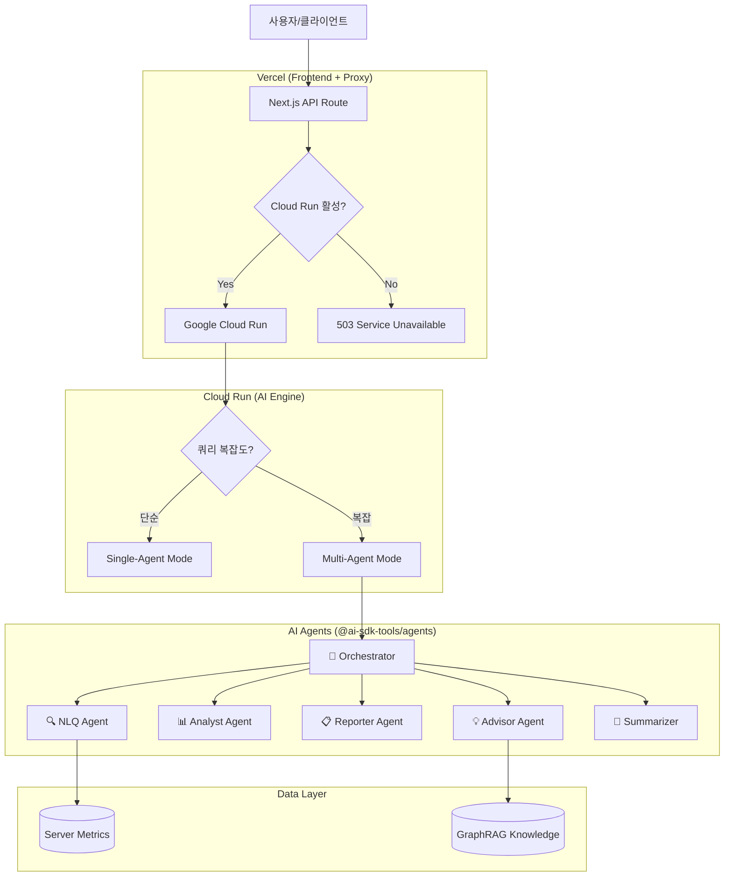

# OpenManager VIBE v5

> **AI-Native 서버 모니터링 PoC**
> **Vibe Coding**을 통해 DevOps의 미래인 **AX (AI Experience)**를 탐구합니다.

[](https://nextjs.org/)
[](https://react.dev/)
[](https://www.typescriptlang.org/)
[](https://supabase.com/)
[](https://sdk.vercel.ai/)
[](https://biomejs.dev/)

## 🚀 Quick Start

```bash
# 의존성 설치
npm install

# 개발 서버 실행
npm run dev:network

# 전체 검증 (lint + typecheck + test)
npm run validate:all
```

## 👨‍💻 프로젝트 철학

이 프로젝트는 단순한 서버 모니터링 도구가 아닙니다. **인간과 AI의 협업(Vibe Coding)**이 만들어낼 수 있는 풀스택 개발의 가능성을 증명하는 **Proof of Concept (PoC)**입니다.

기존의 "수동적 모니터링"을 넘어, **Multi-LLM AI Engine (Cerebras/Groq/Mistral/OpenRouter)**이 워크플로우에 직접 통합되어 **"예측하고 상호작용하는 운영(Predictive & Interactive Operations)"** 경험을 제공합니다.

## 🛠️ Tech Stack

| Category | Technology |
|----------|------------|
| **Frontend** | Next.js 16.1.1, React 19, TypeScript 5.9 |
| **Styling** | Tailwind CSS 4, Radix UI, Framer Motion |
| **State** | Zustand, TanStack Query |
| **Backend** | Supabase (PostgreSQL + Auth + Realtime) |
| **AI Engine** | Vercel AI SDK, @ai-sdk-tools/agents |
| **Cache** | Upstash Redis (Serverless) |
| **Testing** | Vitest, Playwright |
| **Lint** | Biome |

## 🤖 AI Features

3가지 AI 기능이 6개의 전문 에이전트를 활용합니다:

| Feature | Description | Primary Agent |
|---------|-------------|---------------|
| **💬 AI Chat** | 자연어로 서버 상태 질의, 분석 요청 | Orchestrator → 5 Agents |
| **📋 Auto Report** | 장애 보고서 자동 생성 | Reporter Agent |
| **📊 Intelligent Monitoring** | 이상 탐지, 트렌드 예측 | Analyst Agent |

### Agent Stack (6 Agents)

```
Orchestrator (Cerebras) ─┬─► NLQ Agent (Cerebras→Groq)      : 서버 메트릭 질의
                         ├─► Analyst Agent (Groq→Cerebras)  : 이상 탐지, 예측
                         ├─► Reporter Agent (Groq→Cerebras) : 보고서 생성
                         ├─► Advisor Agent (Mistral)        : 트러블슈팅, RAG
                         └─► Summarizer Agent (OpenRouter)  : 빠른 요약
```

### Free Tier Limits

| Provider | Limit | Usage |
|----------|-------|-------|
| Cerebras | 1M tokens/day | Orchestrator, NLQ |
| Groq | ~1K requests/day | Analyst, Reporter |
| Mistral | Limited | Advisor, Verifier |
| OpenRouter | 50 requests/day | Summarizer |

## 🏗️ 시스템 아키텍처

### Hybrid Architecture (Vercel + Cloud Run)



### Service Deployment

| 서비스 | 배포 환경 | 역할 |
|--------|----------|------|
| **Next.js App** | Vercel (Serverless) | Frontend + API Proxy |
| **AI Engine** | Google Cloud Run | Multi-Agent Backend |
| **Database** | Supabase Cloud | PostgreSQL + Auth + Realtime |
| **Cache** | Upstash Redis | Response Caching, Job Queue |

## ✨ 핵심 기능

### 1. ⚡ 실시간 성능 (Real-time Performance)
- **GPU 가속 UI**: 하드웨어 가속을 통한 부드러운 120fps 애니메이션
- **WebSocket 통합**: 100ms 미만의 지연 시간으로 메트릭 업데이트
- **최적화된 렌더링**: RSC와 클라이언트 하이드레이션의 조화

### 2. 🤖 AI 기반 운영 (AI Operations)
- **Multi-Agent System**: 6개 전문 에이전트가 협업하여 복잡한 질의 처리
- **Dual-Mode Supervisor**: 단순 쿼리(Single-Agent) / 복잡 쿼리(Multi-Agent) 자동 선택
- **GraphRAG**: 벡터 검색 + 그래프 탐색으로 과거 사례 참조
- **Circuit Breaker**: Provider 장애 시 자동 폴백

### 3. 🛡️ 개발 품질 (Development Quality)
- **Strict TypeScript**: `any` 타입 사용 배제
- **현대적 툴체인**: Biome(린트/포맷), Vitest(단위 테스트), Playwright(E2E)
- **CI/CD 파이프라인**: Vercel을 통한 자동화된 검증 및 배포

## 📚 문서 (Documentation)

| 문서 | 설명 |
|-----|------|
| [Getting Started](docs/getting-started/README.md) | 빠른 시작 가이드 |
| [AI Engine Architecture](docs/reference/architecture/ai/ai-engine-architecture.md) | Multi-Agent 아키텍처 |
| [Project Status](docs/status.md) | 기술 스택 및 현황 |

## 🧪 Project Status

이 프로젝트는 **개인 연구용 토이 프로젝트(PoC)**입니다.
AI-Native DevOps와 차세대 웹 기술(Next.js 16, Vercel AI SDK)의 가능성을 탐구하기 위한 기술 시연용으로 제작되었습니다.

**Not intended for production use**

---

<div align="center">
  <sub>Built with 💜 using Vibe Coding methodologies.</sub>
  <br/>
  <sub>Version 5.83.14 | Last Updated: 2026-01-04</sub>
</div>
