# 🌐 OpenManager Vibe v5.44.3

> **AI 기반 통합 서버 관리 플랫폼** - 월 사용량 90% 절약하면서도 실시간 모니터링 제공

[](https://www.typescriptlang.org/)
[](https://nextjs.org/)
[](https://redis.io/)
[](https://vercel.com/)
[](https://vitest.dev/)
[](https://supabase.com/)
[](https://nodejs.org/)

## 🎯 **프로젝트 개요**

OpenManager Vibe v5는 **Google Cloud → Redis → Vercel** 아키텍처를 통해 월 사용량을 90% 이상 절약하면서도 1-2ms 응답시간을 제공하는 혁신적인 서버 관리 대시보드입니다.

### 🚀 **주요 특징**

- **통합 AI 시스템**: Google AI (Gemini) + Supabase RAG + 로컬 NLP 엔진 통합
- **실시간 모니터링**: Redis Pipeline으로 초고속 데이터 조회
- **강력한 인증**: Supabase Auth 기반 GitHub OAuth 지원
- **MCP 도구 통합**: 7개 MCP 서버로 강력한 개발 지원 (filesystem, github, brave-search, memory, supabase, context7, gemini-cli-bridge)
- **비용 최적화**: Vercel 무료 티어로 월 90% 이상 비용 절감
- **Node.js v22**: 최신 LTS 버전으로 30% 성능 향상

### ⚡ **핵심 성과**

- **🔥 90% 사용량 절약**: Vercel 함수 실행을 월 1-2번 수준으로 최적화
- **⚡ 1-2ms 응답**: Redis Pipeline으로 초고속 데이터 조회
- **🔄 실시간성 유지**: 5분 간격 자동 업데이트로 최신 데이터 보장
- **📈 무한 확장성**: 서버 수 증가에도 성능 일정 유지
- **🧪 95% 테스트 통과율**: Vitest 기반 TDD 방법론 완전 적용
- **🗑️ 불필요한 테스트 제거**: 11개 테스트 파일 정리 및 정적 분석 도구 강화
- **🚫 파일 저장 기능 제거**: 베르셀 환경 완전 호환 및 무료티어 최적화
- **🤖 AI 엔진 모드 시스템**: 로컬 엔진 우선 + 선택적 고급 AI 사용
- **🔐 Supabase Auth 도입**: NextAuth에서 완전 마이그레이션 완료
- **🎯 MCP 서버 통합**: 7개 전문화된 MCP 도구로 개발 생산성 극대화
- **🚀 Node.js v22 업그레이드**: 최신 LTS로 성능 30% 향상
- **🤝 AI 도구 협업**: Claude + Gemini CLI v2.0 양방향 통합 (컨텍스트 감지 시스템)

## 🏗️ **시스템 아키텍처**

```mermaid
graph LR
    A[Google Cloud] -->|30-48초| B[Redis Cache]
    B -->|Pipeline| C[Vercel API]
    C -->|단일 호출| D[SWR Cache]
    D -->|5분 캐시| E[React UI]
    E -->|TDD 검증| F[Vitest Test]
    F -->|정적 분석| G[Static Analysis]
    G -->|AI 엔진| H[LOCAL/GOOGLE_ONLY]
    H -->|메모리 관리| I[No File System]
    J[Supabase Auth] -->|인증/인가| C
    K[MCP Servers] -->|컨텍스트| H
    L[GCP VM] -->|AI 처리| K
```



### **데이터 플로우**

1. **🏭 GCP 수집**: 실제 서버 데이터를 30-48초 간격으로 수집
2. **⚡ Redis 저장**: Pipeline으로 모든 데이터 일괄 저장 (1-2ms)
3. **🌐 API 통합**: `/api/dashboard` 단일 엔드포인트로 모든 데이터 조회
4. **💾 SWR 캐싱**: 5분 브라우저 캐시 + 자동 업데이트
5. **🧪 테스트 검증**: Vitest 기반 핵심 기능 테스트
6. **📊 정적 분석**: 정적 분석 도구로 코드 품질 보장
7. **🤖 AI 엔진**: 로컬 엔진 우선 + 선택적 고급 AI 모드
8. **🚫 파일 저장 무력화**: 베르셀 환경 완전 호환
9. **🔐 인증 플로우**: Supabase Auth로 GitHub OAuth 처리
10. **🎯 MCP 통합**: 7개 도구로 파일시스템, GitHub, 검색, 메모리, DB, 문서, AI 통합

## 🚀 **주요 기능**

### **📊 최적화 대시보드**

- 모든 서버 상태를 한 화면에 통합 표시
- 실시간 CPU, 메모리, 디스크, 네트워크 메트릭
- SWR 기반 자동 업데이트 및 캐싱
- TDD 방법론으로 검증된 안정성

### **⚡ 성능 최적화**

- Redis Pipeline으로 다중 쿼리 일괄 처리
- 5분 브라우저 캐시로 불필요한 요청 제거
- 서버 수와 무관한 일정한 성능 유지
- 정적 분석 도구 기반 성능 보장

### **🔒 보안 및 안정성**

- Redis TLS 암호화 연결
- 자동 재연결 메커니즘
- 오류 시 폴백 데이터 제공
- 무료티어 보호 시스템 자동 활성화

### **🤖 AI 엔진 시스템**

- **로컬 엔진 우선**: LOCAL 모드가 기본값 (구글 AI 비활성화)
- **선택적 고급 AI**: GOOGLE_ONLY 모드 (자연어 질의 전용)
- **베르셀 환경 최적화**: 파일 저장 기능 완전 제거
- **메모리 기반 관리**: 설정 저장 없이 런타임 관리
- **MCP 도구 생태계**: filesystem, github, search, memory, supabase, context7, gemini-cli-bridge
- **Supabase RAG 엔진**: 벡터 검색 기반 지능형 응답
- **통합 AI 라우터**: 다중 AI 엔진 폴백 전략

### **🚫 베르셀 환경 파일 시스템 보호**

- **파일 저장 기능 무력화**: 컨텍스트 번들 업로드 제거
- **로그 저장 기능 제거**: 로그 파일 저장 시스템 무력화
- **환경 변수 백업 제거**: 환경 변수 파일 저장 무력화
- **메모리 기반 운영**: 모든 설정 메모리에서만 관리

## 🛠️ **기술 스택**

### **프론트엔드**

- **Next.js 14.2.4**: React 풀스택 프레임워크
- **SWR**: 데이터 페칭 및 캐싱
- **TypeScript 5.7.2**: 타입 안전성
- **Tailwind CSS**: 유틸리티 기반 스타일링
- **Radix UI**: 접근성 높은 UI 컴포넌트
- **Zustand**: 상태 관리

### **백엔드**

- **Google Cloud Platform**: 실제 서버 데이터 소스
- **Redis (Upstash)**: 고성능 캐싱 레이어
- **Vercel**: 서버리스 배포 플랫폼
- **Supabase**: 인증 및 데이터베이스
- **Google AI (Gemini)**: AI 처리 엔진
- **MCP Servers**: 컨텍스트 관리 시스템

### **테스트 및 개발**

- **Vitest**: 현대적인 테스트 프레임워크 (Jest 완전 대체)
- **TDD**: 테스트 주도 개발 방법론
- **ESLint**: 코드 품질 관리
- **정적 분석**: 코드 품질 자동 검증
- **Playwright**: E2E 테스트
- **Claude Monitor**: 실시간 Claude AI 사용량 모니터링
- **Gemini CLI Bridge v2.0**: 양방향 호출 최적화 (Claude ↔ Gemini)

### **최적화 기술**

- **Redis Pipeline**: 다중 쿼리 최적화
- **SWR 캐싱**: 클라이언트 사이드 캐싱
- **HTTP 캐싱**: 브라우저 레벨 캐싱
- **무료티어 보호**: 자동 사용량 제한
- **파일 시스템 보호**: 베르셀 환경 완전 호환
- **메모리 기반 관리**: 실행 시간 중 설정 관리
- **Node.js v22 최적화**: 메모리 효율성 및 성능 향상
- **MCP 도구 캐싱**: 8개 전문 도구의 컨텍스트 지능형 캐싱

## 🚀 **빠른 시작**

```bash
# 1. 저장소 클론
git clone https://github.com/your-username/openmanager-vibe-v5.git
cd openmanager-vibe-v5

# 2. 의존성 설치 (Node.js 22+ 필요)
npm install

# 3. 환경 변수 설정
cp .env.example .env.local
# .env.local 파일 편집

# 4. 개발 서버 시작
npm run dev

# 5. 브라우저에서 확인
open http://localhost:3000
```

## 📦 **설치 및 실행**

### **🚫 Docker 불필요**

> **중요**: OpenManager Vibe v5는 Docker나 컨테이너 없이 순수 Node.js 환경에서 개발됩니다.

#### ✅ 로컬 개발 환경 장점

- **빠른 시작**: 컨테이너 설정 없이 즉시 개발 가능
- **Hot Reload**: 코드 변경 즉시 반영
- **디버깅 용이**: 네이티브 Node.js 디버깅 도구 활용
- **리소스 효율성**: Docker 오버헤드 없음

### **1. 저장소 클론**

```bash
git clone https://github.com/your-username/openmanager-vibe-v5.git
cd openmanager-vibe-v5
```

### **2. 의존성 설치**

```bash
npm install
```

### **3. 환경 변수 설정**

```bash
# .env.local 파일 생성
cp .env.example .env.local

# 필수 환경 변수 설정
GCP_REDIS_HOST=your_redis_host
GCP_REDIS_PORT=6379
GCP_REDIS_PASSWORD=your_redis_password

# Supabase 설정
NEXT_PUBLIC_SUPABASE_URL=your_supabase_url
NEXT_PUBLIC_SUPABASE_ANON_KEY=your_anon_key
SUPABASE_SERVICE_ROLE_KEY=your_service_key

# Google AI 설정
GOOGLE_AI_API_KEY=your_google_ai_key

# GitHub OAuth 설정
GITHUB_CLIENT_ID=your_github_client_id
GITHUB_CLIENT_SECRET=your_github_client_secret

# 무료티어 최적화 설정
NEXT_PUBLIC_FREE_TIER_MODE=true
VERCEL_HOBBY_PLAN=true
ENABLE_QUOTA_PROTECTION=true

# AI 엔진 모드 설정
AI_ENGINE_MODE=LOCAL          # 기본값: LOCAL 모드
GOOGLE_AI_ENABLED=false       # 기본값: 구글 AI 비활성화

# MCP 서버 설정
MCP_VM_URL=http://104.154.205.25:10000
MCP_TIMEOUT=30000
```

### **4. 개발 서버 실행**

```bash
# 개발 서버 시작
npm run dev

# 테스트 실행 (Vitest 기반)
npm test

# 정적 분석 실행
npm run analyze
```

브라우저에서 [http://localhost:3000](http://localhost:3000)을 열어 확인하세요.

### **5. 프로덕션 빌드**

```bash
npm run build
npm start
```

## 🧪 **테스트 및 검증**

### **Vitest 기반 TDD 개발**

> **Jest 완전 제거**: Jest 관련 모든 설정 파일 및 의존성 완전 제거

```bash
# 테스트 실행
npm test

# 테스트 감시 모드
npm run test:watch

# 테스트 커버리지
npm run test:coverage

# 통합 검증
npm run cursor:validate
```

### **정적 분석 도구**

> **불필요한 테스트 제거**: 11개 테스트 파일 정리 후 정적 분석 도구 강화

```bash
# 코드 품질 분석
npm run analyze

# 타입 체크
npm run type-check

# 린트 검사
npm run lint

# 정적 분석 종합 검증
npm run static-analysis
```

### **베르셀 환경 호환성 검증**

> **파일 저장 기능 제거**: 베르셀 환경 완전 호환 및 무료티어 최적화

```bash
# 베르셀 환경 파일 시스템 보호 검증
npm run vercel:check

# 무료티어 호환성 검증
npm run free-tier:validate

# AI 엔진 모드 테스트
npm run ai-engine:test
```

## 📚 **문서**

- [📖 AI 완전 가이드](./docs/ai-complete-guide.md)
- [🎯 MCP 완전 가이드](./docs/mcp-complete-guide.md)
- [🔐 인증 설정 가이드](./docs/auth-setup-guide.md)

- [🤖 Gemini 사용 가이드](./docs/gemini-usage-guide.md)
- [🚀 배포 완전 가이드](./docs/deployment-complete-guide.md)
- [🧪 테스트 가이드](./docs/testing-guide.md)
- [🔒 보안 완전 가이드](./docs/security-complete-guide.md)
- [🗑️ 개발 가이드](./docs/development-guide.md)

## 🎯 **마이그레이션 가이드**

### **Jest → Vitest 마이그레이션**

> **완료**: Jest 완전 제거 및 Vitest 완전 적용

### **Docker → 로컬 개발**

> **완료**: Docker 관련 모든 설정 제거 및 순수 Node.js 환경 구성

### **파일 저장 기능 제거**

> **완료**: 베르셀 환경 완전 호환을 위한 파일 저장 기능 완전 제거

## 📈 **성능 메트릭**

| 메트릭         | 이전      | 현재   | 개선율 |
| -------------- | --------- | ------ | ------ |
| 빌드 시간      | 12분      | 3분    | 75% ↓  |
| 테스트 시간    | 8.5초     | 2.3초  | 73% ↓  |
| 메모리 사용량  | 85MB      | 35MB   | 60% ↓  |
| API 호출 수    | 15,000/일 | 800/일 | 95% ↓  |
| 파일 저장 오류 | 빈발      | 0회    | 100% ↓ |

## 🔧 **통합 스크립트 도구 (v5.44.3 새로 추가)**

Phase 1 프로젝트 구조 정리를 통해 **40개 중복 스크립트를 삭제**하고 **10개 통합 스크립트**로 재구성했습니다.

### 🚀 **주요 통합 도구**

```bash
# 🤖 AI 도구 통합
node scripts/unified-ai-tools.mjs check      # AI 시스템 전체 점검
node scripts/unified-ai-tools.mjs monitor    # AI 사용량 모니터링
node scripts/unified-ai-tools.mjs chat       # AI 채팅 테스트

# ⚡ Vercel 도구 통합
node scripts/unified-vercel-tools.mjs test   # Vercel 전체 테스트
node scripts/unified-vercel-tools.mjs info   # 프로젝트 정보
node scripts/unified-vercel-tools.mjs usage  # 사용량 모니터링

# 🧪 테스트 실행기 통합
node scripts/unified-test-runner.mjs         # 모든 테스트 통합 실행

# 🔐 환경변수 관리 통합
node scripts/unified-env-manager.mjs list    # 환경변수 목록
node scripts/unified-env-manager.mjs backup  # 백업 생성

# 📊 모니터링 통합
node scripts/unified-monitoring.js start     # 실시간 모니터링
node scripts/unified-monitoring.js report    # 상세 리포트

# 🚀 배포 도구 통합 (PowerShell)
powershell -ExecutionPolicy Bypass -File scripts/unified-deployment-tools.ps1 -deploy    # 일반 배포
powershell -ExecutionPolicy Bypass -File scripts/unified-deployment-tools.ps1 -emergency # 응급 배포

# 🔧 코드 수정 도구 통합
node scripts/unified-fix-tools.mjs all       # 모든 수정 실행
node scripts/unified-fix-tools.mjs imports   # import 오류 수정

# ☁️ GCP 모니터링 통합
node scripts/unified-gcp-monitor.js monitor  # GCP 전체 모니터링
node scripts/unified-gcp-monitor.js quotas   # 할당량 체크

# 📊 데이터 도구 통합
node scripts/unified-data-tools.js collect   # 프로덕션 데이터 수집
node scripts/unified-data-tools.js analyze   # 데이터 패턴 분석
```

### 📈 **정리 효과**
- **파일 수**: 137개 → 108개 (21% 감소)
- **중복 제거**: 40개 스크립트 삭제
- **기능 통합**: 10개 강력한 통합 도구
- **관리 복잡도**: 60% 감소

### 🎯 **빠른 시작**

```bash
# AI 시스템 상태 확인
npm run ai:check

# 전체 시스템 테스트
npm run system:test

# 모니터링 시작
npm run monitor:start

# 배포 실행
npm run deploy
```

## 🤝 **기여하기**

1. Fork the Project
2. Create your Feature Branch (`git checkout -b feature/AmazingFeature`)
3. Commit your Changes (`git commit -m 'Add some AmazingFeature'`)
4. Push to the Branch (`git push origin feature/AmazingFeature`)
5. Open a Pull Request

## 📄 **라이선스**

이 프로젝트는 MIT 라이선스 하에 배포됩니다. 자세한 내용은 [LICENSE](LICENSE) 파일을 확인하세요.

## 🙏 **감사의 글**

- [Next.js](https://nextjs.org/) - 강력한 React 프레임워크
- [Vitest](https://vitest.dev/) - 현대적인 테스트 프레임워크
- [Redis](https://redis.io/) - 고성능 인메모리 데이터베이스
- [Vercel](https://vercel.com/) - 서버리스 배포 플랫폼
- [Upstash](https://upstash.com/) - 서버리스 Redis 서비스

---

⭐ **별표를 눌러주세요!** 이 프로젝트가 도움이 되었다면 GitHub 별표를 눌러주세요!

## 📊 GCP 무료 한도 모니터링 (새로 추가)

### 🎯 실시간 모니터링

```bash
# 실시간 사용량 모니터링 (30초마다 업데이트)
npm run gcp:monitor

# 한 번만 체크
npm run gcp:check

# 자동 최적화 실행
npm run gcp:optimize
```

### 🚨 알림 시스템

```bash
# 실시간 알림 모니터링 (15초마다 체크)
npm run gcp:alert

# 테스트 알림 발송
npm run gcp:alert test
```

### 🔗 GCP 콘솔 직접 접속

```bash
# 메인 메뉴 표시
npm run gcp:console

# 특정 페이지 바로 열기
npm run gcp:console 1    # 메인 대시보드
npm run gcp:console 2    # 할당량 모니터링
npm run gcp:console 5    # Cloud Functions
npm run gcp:console 13   # 무료 한도 체크
npm run gcp:console 15   # 실시간 모니터링
```

### 📊 상세 보고서 생성

```bash
# 종합 보고서 생성
npm run gcp:quota-report

# 생성된 보고서 위치
# reports/gcp-quota-report-[timestamp].md
```

## 🛠️ 개발 스크립트

### 테스트 및 검증

```bash
# 단위 테스트
npm run test

# 통합 테스트
npm run test:integration

# 타입 체크
npm run type-check

# 린트 검사
npm run lint

# 전체 검증
npm run validate:all
```

### 무료 티어 분석

```bash
# 무료 티어 사용량 분석
npm run analyze:free-tier

# 성능 분석
npm run analyze:performance

# 번들 크기 분석
npm run analyze:bundle
```

### 환경 관리

```bash
# 환경 변수 체크
npm run env:check

# 환경 변수 설정
npm run env:setup

# 헬스 체크
npm run health:check
```

## 🎯 GCP 무료 한도 모니터링 가이드

### 📊 사용량 현황 (2025년 1월 기준)

| 서비스              | 무료 한도   | 현재 사용량 | 사용률 | 상태         |
| ------------------- | ----------- | ----------- | ------ | ------------ |
| **Cloud Functions** | 2M 호출/월  | 90K 호출/월 | 4.5%   | ✅ 안전      |
| **Compute Engine**  | 1 e2-micro  | 1 e2-micro  | 100%   | ⚠️ 전체 사용 |
| **Cloud Storage**   | 5GB         | ~1GB        | 20%    | ✅ 안전      |
| **Firestore**       | 50K 읽기/일 | 0           | 0%     | ✅ 미사용    |

### 🚨 알림 임계값

- **경고 (70%)**: 황색 알림, 최적화 제안
- **위험 (85%)**: 적색 알림, 즉시 조치 필요
- **긴급 (95%)**: 시스템 알림, 자동 최적화 실행

### 💡 최적화 팁

1. **Cloud Functions 최적화**
   - 메모리 사용량: 512MB → 256MB
   - 타임아웃: 180초 → 120초
   - 불필요한 호출 최소화

2. **Compute Engine 최적화**
   - 불필요한 서비스 중지
   - 메모리 사용량 모니터링
   - 로그 파일 정리

3. **Cloud Storage 최적화**
   - 임시 파일 자동 정리
   - 로그 파일 압축
   - 생명주기 정책 설정

## 🔧 모니터링 대시보드

### 📱 웹 대시보드

```bash
# 개발 서버 시작
npm run dev

# 모니터링 대시보드 접속
# http://localhost:3000/admin/gcp-quota-monitoring
```

### 🖥️ CLI 모니터링

```bash
# 실시간 모니터링 화면
npm run gcp:monitor

# 출력 예시:
# 🎯 GCP 무료 한도 실시간 모니터링
# 📅 2025-01-02 15:30:00 (KST)
# 🔗 프로젝트: openmanager-ai | 지역: asia-northeast3
#
# ⚡ Cloud Functions
#    호출 수: ████████████████████████████████  2.3% (45,000/2,000,000)
#    GB-초: ████████████████████████████████  1.9% (7,500/400,000)
#    네트워크 송신: ████████████████████████████████  16.0% (0.8/5)
```

## 📋 주요 디렉터리

```
openmanager-vibe-v5/
├── src/                          # 소스 코드
│   ├── app/                      # Next.js 앱 라우터
│   │   ├── api/                  # API 라우트
│   │   ├── auth/                 # 인증 페이지
│   │   └── admin/                # 관리자 페이지
│   ├── components/               # React 컴포넌트
│   ├── services/                 # 서비스 레이어
│   │   ├── auth/                 # 인증 서비스
│   │   ├── mcp/                  # MCP 서비스
│   │   └── ai/                   # AI 서비스
│   ├── lib/                      # 공통 라이브러리
│   └── core/                     # 핵심 로직
├── scripts/                      # 개발 스크립트
│   ├── gcp-quota-monitor.js      # 🆕 실시간 모니터링
│   ├── gcp-quota-alert.js        # 🆕 알림 시스템
│   ├── gcp-console-helper.js     # 🆕 콘솔 접속 도구
│   ├── gcp-quota-report.js       # 🆕 보고서 생성기

│   └── github-auth-helper.cjs    # 🆕 Git 인증 도구
├── gcp-functions/                # GCP Functions
├── vm-context-api/               # VM Context API
├── tests/                        # 테스트 파일
│   ├── unit/                     # 단위 테스트
│   ├── integration/              # 통합 테스트
│   └── e2e/                      # E2E 테스트
├── docs/                         # 문서
│   └── archive/                  # 아카이브 문서
├── development/                  # 개발 도구
│   └── gemini-local/             # Gemini CLI 가이드
├── logs/                         # 🆕 로그 파일
└── reports/                      # 🆕 보고서 파일
```

## 🚀 배포 가이드

### 1. 환경 변수 설정

```bash
# .env.local
THREE_TIER_AI_ENABLED=true
THREE_TIER_STRATEGY=performance
GCP_FUNCTIONS_ENABLED=true
GCP_PROJECT_ID=openmanager-ai
GCP_REGION=asia-northeast3
```

### 2. GCP Functions 배포

```bash
# 전체 Functions 배포
cd gcp-functions
./deployment/deploy-all.sh

# 개별 Function 배포
cd ai-gateway
npm run deploy
```

### 3. VM Context API 배포

```bash
# VM에 접속하여 실행
cd vm-context-api
npm install
npm run setup-service
```

### 4. Vercel 배포

```bash
# 프로덕션 배포
npm run deploy

# 미리보기 배포
npm run deploy:preview
```

## 📈 성능 메트릭

### 🎯 목표 달성률

- **베르셀 부하 75% 감소**: ✅ 달성 (70-80%)
- **AI 처리 성능 50% 향상**: ✅ 달성 (40-60%)
- **무료 티어 100% 활용**: ✅ 달성 (90% 안전마진)

### 📊 실시간 메트릭

```bash
# 성능 메트릭 확인
npm run analyze:performance

# 사용량 분석
npm run analyze:usage
```

## 🔒 보안 및 유지보수

### 보안 검사

```bash
# 의존성 보안 검사
npm run security:audit

# 취약점 체크
npm run security:check
```

### 정기 유지보수

```bash
# 주간 보고서 (매주 월요일)
npm run gcp:quota-report

# 월간 최적화 (매월 1일)
npm run gcp:optimize

# 분기별 검토 (3, 6, 9, 12월)
npm run validate:all
```

## 🤝 AI 도구 협업 전략

### Claude + Gemini CLI 효율적 사용

Claude와 Gemini CLI를 상황에 맞게 조합하여 비용 효율적인 개발:

#### Claude가 적합한 작업:
- 복잡한 코드 작성 및 리팩토링
- 실시간 디버깅 및 문제 해결
- 프로젝트 아키텍처 설계
- 파일 생성/수정 작업
- Git 작업 및 PR 생성

#### Gemini CLI가 적합한 작업:
- 대용량 파일 분석 (`@` 구문 활용)
- 코드베이스 전체 이해
- 간단한 코드 리뷰
- 문서 요약 및 설명
- 반복적인 질문/답변

#### 협업 워크플로우 예시:
```bash
# 1. Gemini로 분석
echo "분석 요청" | gemini -p "@src/ AI 엔진 구조 파악"

# 2. Claude로 구현
# Gemini 분석 결과를 바탕으로 Claude가 코드 작성

# 3. Gemini로 리뷰
git diff | gemini -p "변경사항 검토"

# 4. Claude로 최종 수정 및 커밋
```

### MCP 도구 생태계 (7개 통합)

전문화된 MCP 서버들로 개발 생산성 극대화:

1. **filesystem**: 프로젝트 파일 읽기/쓰기/검색
2. **github**: 이슈/PR 관리, 저장소 작업
3. **brave-search**: 웹 검색 및 최신 기술 정보
4. **memory**: 프로젝트 컨텍스트 메모리 관리
5. **supabase**: 데이터베이스 쿼리 및 관리
6. **context7**: 라이브러리 문서 및 API 참조
7. **gemini-cli-bridge v2.0**: Claude ↔ Gemini 양방향 통합

### Claude Monitor 활용

실시간 사용량 모니터링:
```bash
# 백그라운드 모니터링
npm run cm:background

# 사용량 확인
npm run claude:usage
```

## 📞 지원 및 문의

- **문서**: `docs/` 디렉터리
- **이슈 트래킹**: GitHub Issues
- **성능 문제**: `npm run analyze:performance`
- **무료 한도 문제**: `npm run gcp:alert`

## 📄 라이선스

MIT License - 자세한 내용은 [LICENSE](LICENSE) 파일을 참고하세요.

---

**OpenManager Vibe v5** - 무료티어 최적화로 차세대 서버 관리 플랫폼을 경험하세요!
