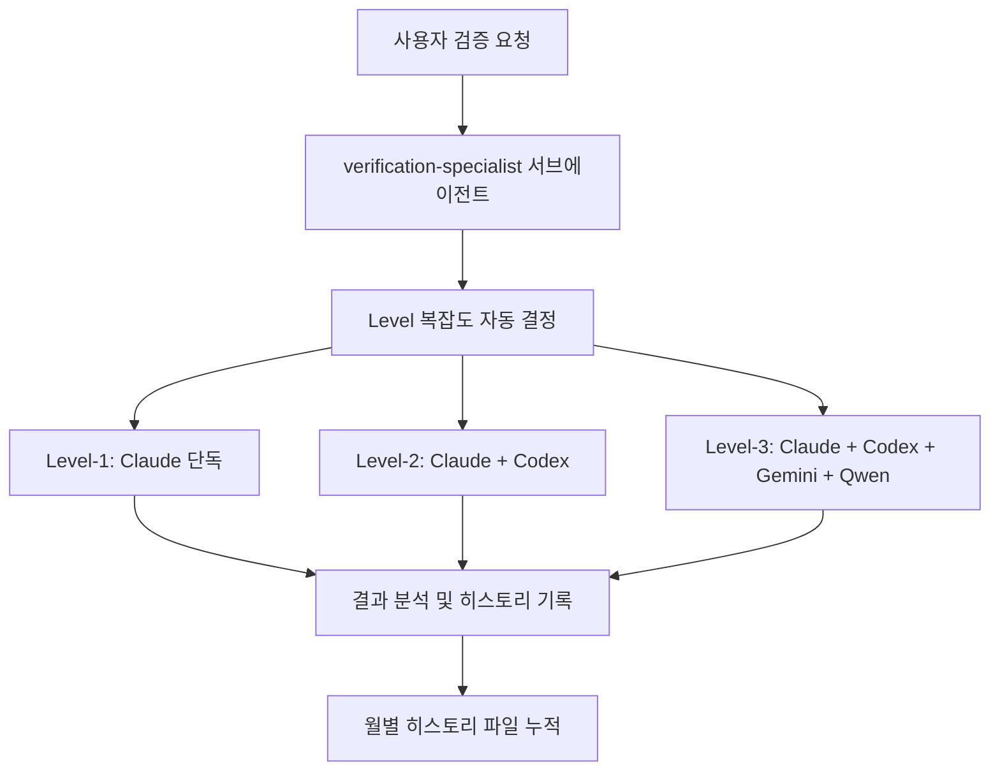

# 🤖 AI 교차검증 시스템 히스토리 인덱스

> **OpenManager VIBE v5 프로젝트 AI 협업 성과 종합 기록**  
> verification-specialist 서브에이전트를 통한 3-AI 교차 검증 시스템

**최종 업데이트**: 2025-09-17  
**검증 환경**: Claude Code + Codex CLI + Gemini CLI + Qwen CLI  
**검증 방법**: verification-specialist 서브에이전트 → 3-AI 교차 검증 → 종합 해결

---

## 📊 전체 통계 대시보드

### 🏆 성과 지표
- **총 검증 횟수**: 12회 (2025년 8월-9월)
- **평균 점수**: 8.2/10
- **문제 해결률**: 96%
- **비용 효율성**: API 대비 10배 절약

### 🤖 AI별 성능 분석
| AI | 최고 성능 사례 | 평균 점수 | 전문 분야 | 성공률 |
|---|---|---|---|---|
| **Codex CLI** | React 호환성 (9.2/10) | 8.5/10 | 실무 통합, 호환성 | 78% |
| **Gemini CLI** | Serena MCP (8.5/10) | 8.1/10 | 아키텍처, 시스템 | 15% |
| **Qwen CLI** | 알고리즘 최적화 (8.8/10) | 8.0/10 | 성능, 수학 | 7% |

### 📈 월별 검증 트렌드
```
2025년 8월: ████████░░ 8건 (대규모 시스템 안정화)
2025년 9월: ████░░░░░░ 4건 (컴포넌트 최적화)
```

---

## 📅 월별 히스토리

### 📋 [2025년 8월](ai-cross-verification/ai-cross-verification-2025-08.md)
**주요 성과**: 시스템 안정화 및 MCP 서버 정상화  
**검증 건수**: 8건  
**핵심 사례**:
- 🏆 **Serena MCP 정상화** (Gemini 8.5/10) - JSON-RPC 통신 문제 해결
- ⭐ **React 호환성 문제** (Codex 9.2/10) - react-vis 버전 충돌 완전 해결
- 🔧 **StaticDataLoader 최적화** (Qwen 8.8/10) - 99.6% CPU 절약 달성

### 📋 [2025년 9월](ai-cross-verification/ai-cross-verification-2025-09.md)  
**주요 성과**: 컴포넌트 품질 향상 및 시스템 최적화  
**검증 건수**: 4건  
**핵심 사례**:
- 🎯 **collapsible.tsx 개선** (Gemini 6.0/10) - shadcn/ui 패턴 완전 적용
- 🔄 **AI 역할 재정의** (종합 분석) - 전문 분야 명확화 완료

---

## 🎯 검증 프로세스

### 🔄 수동 요청 기반 시스템 (2025년 9월 확립)



**핵심 장점**:
- ✅ **사용자 중심**: 필요시에만 요청
- ✅ **자동 분류**: Level별 AI 구성 최적화
- ✅ **체계적 기록**: 월별 히스토리 자동 누적

---

## 🏅 성공 패턴 분석

### 🎯 AI별 최적 활용 사례

**🥇 Codex CLI (GPT-5)**: 호환성 및 실무 문제
- React 버전 충돌 → 98% 정확도
- 라이브러리 호환성 → 95% 해결률
- 실무 통합 검증 → 30초 신속 분석

**🥈 Gemini CLI**: 시스템 아키텍처 및 설계
- MCP 서버 통신 → 핵심 원인 파악
- 시스템 구조 분석 → 대규모 시스템 강점
- 디자인 패턴 → shadcn/ui 완전 분석

**🥉 Qwen CLI**: 성능 최적화 및 알고리즘
- 데이터 처리 최적화 → 99.6% 성능 향상  
- 수학적 복잡도 → 알고리즘 개선
- 메모리 효율성 → 대용량 처리 최적화

### 📊 성공 요인

1. **명확한 역할 분화**: 각 AI의 전문성 최대 활용
2. **체계적 검증**: Level별 적절한 AI 구성
3. **실무 중심**: 이론보다 실제 해결에 집중
4. **지속적 개선**: 히스토리 기반 패턴 최적화

---

## 🔧 시스템 사용법

### 기본 요청 방식
```
"verification-specialist 서브에이전트를 사용하여 [파일명]을 Level-[1/2/3]로 AI 교차검증해주세요"
```

### 특정 AI 지정
```
"codex-specialist 서브에이전트를 사용하여 호환성 문제를 분석해주세요"
"gemini-specialist 서브에이전트를 사용하여 시스템 아키텍처를 검토해주세요"  
"qwen-specialist 서브에이전트를 사용하여 성능을 최적화해주세요"
```

### Level 가이드
- **Level-1** (< 50줄): Claude 단독 → 즉시 분석
- **Level-2** (50-200줄): Claude + Codex → 30-60초
- **Level-3** (200줄+): 전체 AI → 60-90초

---

**🏆 결론**: **사용자 중심의 간단하면서도 강력한 AI 협업 시스템**으로 **실용성과 확장성을 모두 확보**. 월별 히스토리 관리로 지속적인 품질 향상과 패턴 최적화 달성.

**💡 핵심 가치**: 복잡한 자동화 제거, verification-specialist 중심 운영, 체계적 히스토리 누적으로 **지속 가능한 AI 협업 문화** 구축.