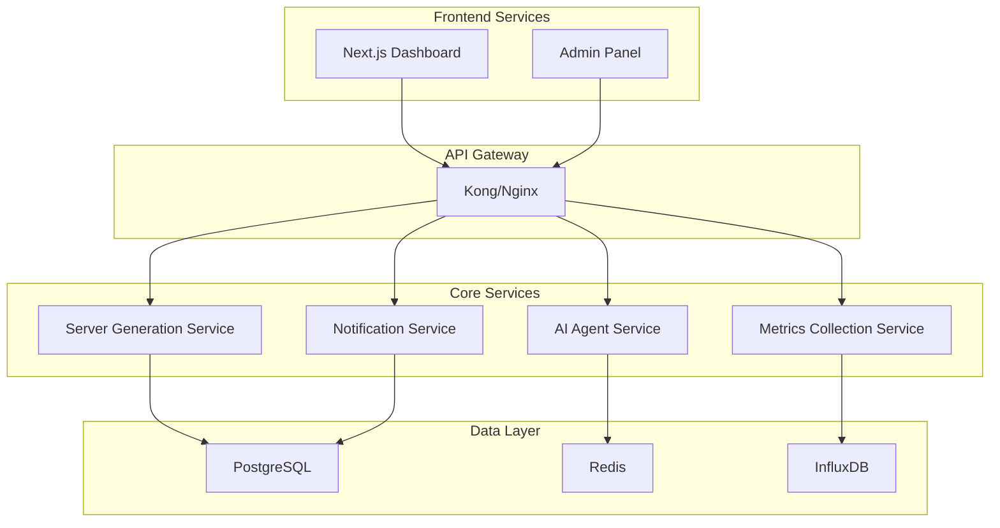

# 🔬 OpenManager Vibe V5 - 고급 기능 가이드

> **프로젝트**: OpenManager Vibe V5 - 지능형 AI 기반 서버 모니터링 시스템  
> **대상**: 고급 개발자, AI 엔지니어, 시스템 아키텍트  
> **최종 업데이트**: 2025-01-27  

---

## 📋 **개요**

이 문서는 OpenManager Vibe V5의 고급 기능과 확장 개발 방법을 다룹니다.

### 🎯 **주요 내용**
- **AI 에이전트 확장**: 플러그인 시스템 및 커스텀 엔진
- **오프라인 AI 엔진**: 독립 실행 환경 구축
- **고급 아키텍처**: 마이크로서비스 확장
- **성능 튜닝**: 메모리 및 CPU 최적화
- **플러그인 개발**: 새로운 기능 모듈 구축

---

## 🧠 **AI 에이전트 고급 활용**

### **1. 커스텀 AI 엔진 개발**

#### **1.1 새로운 AI 엔진 생성**
```typescript
// src/modules/ai-agent/core/CustomAIEngine.ts
import { BaseAIEngine } from './BaseAIEngine';

export class CustomAIEngine extends BaseAIEngine {
  constructor(config: AIEngineConfig) {
    super(config);
  }

  async processQuery(query: string, context?: any): Promise<AIResponse> {
    // 커스텀 AI 로직 구현
    const analysis = await this.analyzeQuery(query);
    const response = await this.generateResponse(analysis, context);
    
    return {
      success: true,
      response: response.text,
      metadata: {
        processingTime: response.duration,
        method: 'custom_ai_engine',
        confidence: response.confidence
      }
    };
  }

  private async analyzeQuery(query: string) {
    // 쿼리 분석 로직
    return {
      intent: this.detectIntent(query),
      entities: this.extractEntities(query),
      sentiment: this.analyzeSentiment(query)
    };
  }
}
```

#### **1.2 AI 엔진 등록**
```typescript
// src/modules/ai-agent/registry/EngineRegistry.ts
export class AIEngineRegistry {
  private engines = new Map<string, BaseAIEngine>();

  registerEngine(name: string, engine: BaseAIEngine) {
    this.engines.set(name, engine);
    console.log(`✅ AI 엔진 등록됨: ${name}`);
  }

  getEngine(name: string): BaseAIEngine | undefined {
    return this.engines.get(name);
  }

  async processWithFallback(query: string): Promise<AIResponse> {
    const engineNames = ['optimized', 'custom', 'fallback'];
    
    for (const engineName of engineNames) {
      try {
        const engine = this.getEngine(engineName);
        if (engine) {
          return await engine.processQuery(query);
        }
      } catch (error) {
        console.warn(`🔄 ${engineName} 엔진 실패, 다음으로 이동`);
      }
    }
    
    throw new Error('모든 AI 엔진 실패');
  }
}
```

### **2. 플러그인 시스템**

#### **2.1 플러그인 인터페이스**
```typescript
// src/modules/ai-agent/plugins/Plugin.ts
export interface AIPlugin {
  name: string;
  version: string;
  description: string;
  
  initialize(context: PluginContext): Promise<void>;
  process(input: PluginInput): Promise<PluginOutput>;
  cleanup(): Promise<void>;
}

export interface PluginContext {
  config: Record<string, any>;
  logger: Logger;
  storage: StorageService;
}
```

#### **2.2 서버 분석 플러그인 예시**
```typescript
// src/modules/ai-agent/plugins/ServerAnalysisPlugin.ts
export class ServerAnalysisPlugin implements AIPlugin {
  name = 'server-analysis';
  version = '1.0.0';
  description = '서버 메트릭 고급 분석';

  async initialize(context: PluginContext): Promise<void> {
    this.context = context;
    this.context.logger.info('서버 분석 플러그인 초기화 완료');
  }

  async process(input: PluginInput): Promise<PluginOutput> {
    const { serverData, query } = input;
    
    // 고급 분석 로직
    const trends = this.analyzeTrends(serverData.metrics);
    const anomalies = this.detectAnomalies(serverData.metrics);
    const predictions = this.predictFuture(serverData.metrics);
    
    return {
      analysis: {
        trends,
        anomalies,
        predictions
      },
      recommendations: this.generateRecommendations(trends, anomalies),
      confidence: this.calculateConfidence(trends, anomalies)
    };
  }

  private analyzeTrends(metrics: ServerMetrics[]) {
    // 트렌드 분석 로직
    return {
      cpu: this.calculateTrend(metrics.map(m => m.cpu)),
      memory: this.calculateTrend(metrics.map(m => m.memory)),
      disk: this.calculateTrend(metrics.map(m => m.disk))
    };
  }
}
```

---

## 🚀 **오프라인 AI 엔진 설정**

### **1. 독립 실행 환경**

#### **1.1 Python 환경 설정**
```bash
# Python 가상환경 생성
python3 -m venv ai-engine-env
source ai-engine-env/bin/activate  # Windows: ai-engine-env\Scripts\activate

# 필수 패키지 설치
pip install -r requirements-offline.txt
```

**requirements-offline.txt**
```txt
numpy==1.24.3
pandas==2.0.3
scikit-learn==1.3.0
transformers==4.30.0
torch==2.0.1
fastapi==0.100.0
uvicorn==0.22.0
```

#### **1.2 독립 AI 서버**
```python
# python-analysis/offline_ai_server.py
from fastapi import FastAPI, HTTPException
from pydantic import BaseModel
import numpy as np
import pandas as pd
from typing import Dict, List, Optional

app = FastAPI(title="OpenManager Offline AI Engine")

class ServerMetrics(BaseModel):
    cpu: float
    memory: float
    disk: float
    timestamp: str

class AnalysisRequest(BaseModel):
    query: str
    metrics: List[ServerMetrics]
    context: Optional[Dict] = None

class AnalysisResponse(BaseModel):
    success: bool
    analysis: str
    recommendations: List[str]
    confidence: float
    processing_time: float

@app.post("/analyze", response_model=AnalysisResponse)
async def analyze_server_data(request: AnalysisRequest):
    start_time = time.time()
    
    try:
        # 메트릭 데이터 분석
        df = pd.DataFrame([m.dict() for m in request.metrics])
        
        # 이상 감지
        anomalies = detect_anomalies(df)
        
        # 트렌드 분석
        trends = analyze_trends(df)
        
        # 추천사항 생성
        recommendations = generate_recommendations(anomalies, trends)
        
        # 자연어 응답 생성
        analysis = generate_natural_response(request.query, anomalies, trends)
        
        processing_time = time.time() - start_time
        
        return AnalysisResponse(
            success=True,
            analysis=analysis,
            recommendations=recommendations,
            confidence=calculate_confidence(anomalies, trends),
            processing_time=processing_time
        )
        
    except Exception as e:
        raise HTTPException(status_code=500, detail=str(e))

def detect_anomalies(df: pd.DataFrame) -> Dict:
    """이상 감지 알고리즘"""
    from sklearn.ensemble import IsolationForest
    
    features = ['cpu', 'memory', 'disk']
    clf = IsolationForest(contamination=0.1)
    
    anomaly_scores = clf.fit_predict(df[features])
    anomalies = df[anomaly_scores == -1]
    
    return {
        'count': len(anomalies),
        'data': anomalies.to_dict('records'),
        'severity': 'high' if len(anomalies) > 3 else 'low'
    }

if __name__ == "__main__":
    import uvicorn
    uvicorn.run(app, host="0.0.0.0", port=8001)
```

#### **1.3 Next.js와 오프라인 AI 연동**
```typescript
// src/services/ai/OfflineAIService.ts
export class OfflineAIService {
  private baseUrl: string;
  
  constructor(baseUrl = 'http://localhost:8001') {
    this.baseUrl = baseUrl;
  }

  async analyzeServerData(
    query: string,
    metrics: ServerMetrics[]
  ): Promise<AIResponse> {
    try {
      const response = await fetch(`${this.baseUrl}/analyze`, {
        method: 'POST',
        headers: { 'Content-Type': 'application/json' },
        body: JSON.stringify({ query, metrics })
      });

      if (!response.ok) {
        throw new Error('오프라인 AI 서버 오류');
      }

      const result = await response.json();
      
      return {
        success: true,
        response: result.analysis,
        metadata: {
          processingTime: result.processing_time * 1000,
          method: 'offline_ai_engine',
          confidence: result.confidence
        },
        recommendations: result.recommendations
      };
    } catch (error) {
      console.error('오프라인 AI 연결 실패:', error);
      return this.getFallbackResponse();
    }
  }

  private getFallbackResponse(): AIResponse {
    return {
      success: true,
      response: '오프라인 AI 엔진이 일시적으로 사용불가합니다. 기본 분석을 제공합니다.',
      metadata: {
        processingTime: 100,
        method: 'fallback',
        confidence: 0.5
      }
    };
  }
}
```

---

## 🏗️ **고급 아키텍처 확장**

### **1. 마이크로서비스 분리**

#### **1.1 서비스 분할 계획**


#### **1.2 서버 생성 마이크로서비스**
```typescript
// services/server-generation/src/server.ts
import express from 'express';
import { ServerGenerationController } from './controllers/ServerGenerationController';

const app = express();
app.use(express.json());

const controller = new ServerGenerationController();

app.post('/api/servers/generate', controller.generateServer.bind(controller));
app.get('/api/servers/status', controller.getStatus.bind(controller));
app.post('/api/servers/reset', controller.reset.bind(controller));

app.listen(3001, () => {
  console.log('🚀 서버 생성 서비스 시작: http://localhost:3001');
});
```

```typescript
// services/server-generation/src/controllers/ServerGenerationController.ts
export class ServerGenerationController {
  private serverManager = VirtualServerManager.getInstance();

  async generateServer(req: Request, res: Response) {
    try {
      const { currentCount, reset } = req.body;
      
      if (reset) {
        await this.serverManager.reset();
      }
      
      const result = await this.serverManager.generateNext(currentCount);
      
      res.json({
        success: true,
        server: result.server,
        currentCount: result.currentCount,
        isComplete: result.isComplete,
        progress: (result.currentCount / 20) * 100
      });
    } catch (error) {
      res.status(500).json({
        success: false,
        error: error.message
      });
    }
  }
}
```

### **2. 메시지 큐 시스템**

#### **2.1 Redis 기반 작업 큐**
```typescript
// src/services/queue/RedisQueue.ts
import Redis from 'ioredis';

export class RedisQueue {
  private redis: Redis;
  
  constructor(redisUrl: string) {
    this.redis = new Redis(redisUrl);
  }

  async addJob(queueName: string, jobData: any, options?: JobOptions) {
    const job = {
      id: generateId(),
      data: jobData,
      createdAt: new Date().toISOString(),
      attempts: 0,
      ...options
    };

    await this.redis.lpush(queueName, JSON.stringify(job));
    console.log(`✅ 작업 추가: ${queueName} - ${job.id}`);
  }

  async processJobs(queueName: string, processor: JobProcessor) {
    while (true) {
      try {
        const jobData = await this.redis.brpop(queueName, 5); // 5초 대기
        
        if (jobData) {
          const job = JSON.parse(jobData[1]);
          await processor(job);
          console.log(`✅ 작업 완료: ${job.id}`);
        }
      } catch (error) {
        console.error('작업 처리 오류:', error);
        await new Promise(resolve => setTimeout(resolve, 1000));
      }
    }
  }
}

// 사용 예시
const queue = new RedisQueue(process.env.REDIS_URL);

// AI 분석 작업 추가
await queue.addJob('ai-analysis', {
  query: '서버 상태 분석',
  serverData: metrics,
  priority: 'high'
});

// 작업 처리
queue.processJobs('ai-analysis', async (job) => {
  const result = await aiEngine.processQuery(job.data.query, job.data.serverData);
  await notificationService.send(result);
});
```

---

## ⚡ **성능 최적화**

### **1. 메모리 최적화**

#### **1.1 객체 풀링**
```typescript
// src/utils/ObjectPool.ts
export class ObjectPool<T> {
  private pool: T[] = [];
  private createFn: () => T;
  private resetFn: (obj: T) => void;

  constructor(createFn: () => T, resetFn: (obj: T) => void, initialSize = 10) {
    this.createFn = createFn;
    this.resetFn = resetFn;
    
    // 초기 객체 생성
    for (let i = 0; i < initialSize; i++) {
      this.pool.push(this.createFn());
    }
  }

  acquire(): T {
    if (this.pool.length > 0) {
      return this.pool.pop()!;
    }
    return this.createFn();
  }

  release(obj: T): void {
    this.resetFn(obj);
    this.pool.push(obj);
  }
}

// 서버 객체 풀링 사용
const serverPool = new ObjectPool(
  () => ({
    id: '',
    hostname: '',
    metrics: { cpu: 0, memory: 0, disk: 0 }
  }),
  (server) => {
    server.id = '';
    server.hostname = '';
    server.metrics = { cpu: 0, memory: 0, disk: 0 };
  }
);
```

#### **1.2 메모리 사용량 모니터링**
```typescript
// src/utils/MemoryMonitor.ts
export class MemoryMonitor {
  private interval: NodeJS.Timeout | null = null;

  start(intervalMs = 10000) {
    this.interval = setInterval(() => {
      const usage = process.memoryUsage();
      
      console.log('📊 메모리 사용량:', {
        rss: `${Math.round(usage.rss / 1024 / 1024)}MB`,
        heapTotal: `${Math.round(usage.heapTotal / 1024 / 1024)}MB`,
        heapUsed: `${Math.round(usage.heapUsed / 1024 / 1024)}MB`,
        external: `${Math.round(usage.external / 1024 / 1024)}MB`
      });

      // 메모리 사용량이 임계값 초과 시 경고
      if (usage.heapUsed > 512 * 1024 * 1024) { // 512MB
        console.warn('⚠️ 높은 메모리 사용량 감지!');
        this.triggerGarbageCollection();
      }
    }, intervalMs);
  }

  stop() {
    if (this.interval) {
      clearInterval(this.interval);
      this.interval = null;
    }
  }

  private triggerGarbageCollection() {
    if (global.gc) {
      global.gc();
      console.log('🗑️ 가비지 컬렉션 실행됨');
    }
  }
}
```

### **2. CPU 최적화**

#### **2.1 워커 스레드 활용**
```typescript
// src/workers/AIWorker.ts
import { Worker, isMainThread, parentPort, workerData } from 'worker_threads';

if (isMainThread) {
  // 메인 스레드에서 워커 생성
  export class AIWorkerPool {
    private workers: Worker[] = [];
    private currentWorker = 0;

    constructor(workerCount = 2) {
      for (let i = 0; i < workerCount; i++) {
        const worker = new Worker(__filename, {
          workerData: { workerId: i }
        });
        this.workers.push(worker);
      }
    }

    async processQuery(query: string, data: any): Promise<any> {
      return new Promise((resolve, reject) => {
        const worker = this.workers[this.currentWorker];
        this.currentWorker = (this.currentWorker + 1) % this.workers.length;

        worker.postMessage({ type: 'process', query, data });
        
        worker.once('message', (result) => {
          if (result.error) {
            reject(new Error(result.error));
          } else {
            resolve(result.data);
          }
        });
      });
    }
  }
} else {
  // 워커 스레드에서 실행
  parentPort?.on('message', async (message) => {
    try {
      const { type, query, data } = message;
      
      if (type === 'process') {
        // CPU 집약적인 AI 처리 작업
        const result = await performHeavyAIAnalysis(query, data);
        parentPort?.postMessage({ data: result });
      }
    } catch (error) {
      parentPort?.postMessage({ error: error.message });
    }
  });
}
```

---

## 🔌 **플러그인 개발 가이드**

### **1. 커스텀 플러그인 생성**

#### **1.1 플러그인 템플릿**
```typescript
// src/modules/ai-agent/plugins/CustomPlugin.ts
import { AIPlugin, PluginContext, PluginInput, PluginOutput } from './Plugin';

export class CustomPlugin implements AIPlugin {
  name = 'custom-plugin';
  version = '1.0.0';
  description = '커스텀 플러그인 설명';

  private context: PluginContext;

  async initialize(context: PluginContext): Promise<void> {
    this.context = context;
    
    // 플러그인 초기화 로직
    await this.loadConfiguration();
    await this.setupResources();
    
    this.context.logger.info(`${this.name} 플러그인 초기화 완료`);
  }

  async process(input: PluginInput): Promise<PluginOutput> {
    const { query, data, options } = input;
    
    try {
      // 메인 처리 로직
      const result = await this.processData(data, options);
      
      return {
        success: true,
        data: result,
        metadata: {
          processingTime: Date.now() - input.timestamp,
          plugin: this.name,
          version: this.version
        }
      };
    } catch (error) {
      return {
        success: false,
        error: error.message,
        metadata: {
          plugin: this.name,
          error: error.name
        }
      };
    }
  }

  async cleanup(): Promise<void> {
    // 리소스 정리
    await this.releaseResources();
    this.context.logger.info(`${this.name} 플러그인 정리 완료`);
  }

  private async loadConfiguration() {
    // 설정 로드 로직
  }

  private async setupResources() {
    // 리소스 설정 로직
  }

  private async processData(data: any, options: any) {
    // 데이터 처리 로직
    return data;
  }

  private async releaseResources() {
    // 리소스 해제 로직
  }
}
```

#### **1.2 플러그인 등록**
```typescript
// src/modules/ai-agent/PluginManager.ts
export class PluginManager {
  private plugins = new Map<string, AIPlugin>();
  private initialized = false;

  async registerPlugin(plugin: AIPlugin, config?: any) {
    try {
      const context: PluginContext = {
        config: config || {},
        logger: this.getLogger(plugin.name),
        storage: this.getStorageService()
      };

      await plugin.initialize(context);
      this.plugins.set(plugin.name, plugin);
      
      console.log(`✅ 플러그인 등록됨: ${plugin.name} v${plugin.version}`);
    } catch (error) {
      console.error(`❌ 플러그인 등록 실패: ${plugin.name}`, error);
    }
  }

  async executePlugin(
    pluginName: string,
    input: PluginInput
  ): Promise<PluginOutput> {
    const plugin = this.plugins.get(pluginName);
    
    if (!plugin) {
      throw new Error(`플러그인을 찾을 수 없음: ${pluginName}`);
    }

    return await plugin.process(input);
  }

  async shutdown() {
    for (const [name, plugin] of this.plugins) {
      try {
        await plugin.cleanup();
        console.log(`✅ 플러그인 정리됨: ${name}`);
      } catch (error) {
        console.error(`❌ 플러그인 정리 실패: ${name}`, error);
      }
    }
  }
}

// 플러그인 사용 예시
const pluginManager = new PluginManager();

// 플러그인 등록
await pluginManager.registerPlugin(new CustomPlugin(), {
  apiKey: 'your-api-key',
  timeout: 5000
});

// 플러그인 실행
const result = await pluginManager.executePlugin('custom-plugin', {
  query: '데이터 분석 요청',
  data: serverMetrics,
  timestamp: Date.now()
});
```

---

## 🎯 **고급 사용 사례**

### **1. 예측 분석 시스템**
```typescript
// src/modules/ai-agent/analytics/PredictiveAnalytics.ts
export class PredictiveAnalytics {
  async predictServerLoad(
    historicalData: ServerMetrics[],
    timeHorizon: number = 24 // 시간
  ): Promise<LoadPrediction> {
    // 시계열 데이터 전처리
    const processedData = this.preprocessTimeSeriesData(historicalData);
    
    // 머신러닝 모델 적용
    const predictions = await this.applyPredictionModel(processedData, timeHorizon);
    
    // 이상 상황 예측
    const anomalies = this.predictAnomalies(predictions);
    
    return {
      predictions,
      anomalies,
      confidence: this.calculateConfidence(predictions),
      recommendations: this.generateRecommendations(predictions, anomalies)
    };
  }

  private async applyPredictionModel(data: any[], timeHorizon: number) {
    // TensorFlow.js 또는 외부 ML API 활용
    // 실제 구현에서는 더 정교한 모델 사용
    return data.map((point, index) => ({
      timestamp: new Date(Date.now() + (index + 1) * 3600000), // 1시간씩 증가
      cpu: this.extrapolateTrend(point.cpu, index),
      memory: this.extrapolateTrend(point.memory, index),
      disk: this.extrapolateTrend(point.disk, index)
    }));
  }
}
```

### **2. 실시간 알림 시스템**
```typescript
// src/modules/ai-agent/notifications/SmartNotificationSystem.ts
export class SmartNotificationSystem {
  private rules: NotificationRule[] = [];
  private channels: NotificationChannel[] = [];

  addRule(rule: NotificationRule) {
    this.rules.push(rule);
  }

  async processServerMetrics(metrics: ServerMetrics) {
    for (const rule of this.rules) {
      if (await rule.evaluate(metrics)) {
        const notification = await this.createNotification(rule, metrics);
        await this.sendNotification(notification);
      }
    }
  }

  private async createNotification(
    rule: NotificationRule,
    metrics: ServerMetrics
  ): Promise<Notification> {
    // AI 기반 알림 메시지 생성
    const aiResponse = await this.generateAIMessage(rule, metrics);
    
    return {
      id: generateId(),
      type: rule.type,
      severity: rule.severity,
      title: aiResponse.title,
      message: aiResponse.message,
      recommendations: aiResponse.recommendations,
      timestamp: new Date(),
      metadata: {
        server: metrics.serverId,
        rule: rule.id,
        confidence: aiResponse.confidence
      }
    };
  }
}
```

---

**🎯 이제 OpenManager Vibe V5의 모든 고급 기능을 활용할 수 있습니다!**

더 자세한 정보나 특정 기능에 대한 질문이 있으시면 개발팀에 문의해주세요.

---

*최종 업데이트: 2025년 1월 27일* 