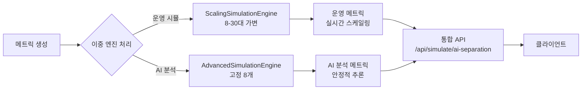
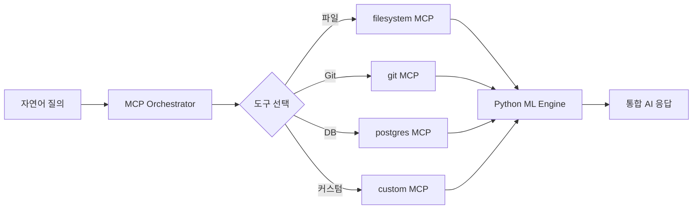

# 🎯 OpenManager v5.21.0 - 시스템 개요

**버전**: v5.21.0  
**최종 업데이트**: 2025-06-02  
**개발자**: jhhong  
**아키텍처**: AI 분석-오토스케일링 분리 구조 + MCP 통합 시스템  

---

## 🚀 프로젝트 개요

OpenManager v5.21.0은 **차세대 서버 모니터링 플랫폼**으로, AI 분석의 안정성과 운영 시뮬레이션의 유연성을 동시에 확보한 혁신적인 분리 아키텍처를 도입했습니다. Model Context Protocol(MCP) 기반 AI 에이전트와 Prometheus 메트릭 시스템을 완벽하게 통합하여, 기업급 모니터링 솔루션을 제공합니다.

### 🎯 핵심 미션
- **AI 추론 안정성**: 서버 수 변동과 무관한 일관된 AI 분석
- **운영 시뮬 유연성**: 8-30대 자유로운 스케일링으로 현실감 확보  
- **개발 생산성**: MCP 표준 기반 확장 가능한 AI 도구 생태계
- **배포 안정성**: 자동화된 CI/CD와 품질 보증 시스템

---

## ✨ v5.21.0 주요 특징

### 🆕 **1. AI 분석-오토스케일링 분리 아키텍처** ⭐
```typescript
// 🧠 AI 분석 엔진 (고정 8개 서버)
const aiAnalysisTargets = {
  primary: ['api-01', 'api-02', 'web-01', 'web-02'],      // 4개
  secondary: ['db-01', 'cache-01', 'k8s-01'],            // 3개  
  monitoring: ['monitor-01']                              // 1개
};

// 🏗️ 운영 시뮬레이션 엔진 (8-30대 동적)
const scalingSimulation = {
  range: '8-30 servers',
  policy: {
    scaleOut: '85% CPU → +2 servers',
    scaleIn: '30% CPU → -2 servers',
    cooldown: '5 minutes'
  }
};
```

**분리 효과:**
- ✅ **AI 추론 안정성**: 서버 수 변동과 무관한 일관된 분석 기준
- ✅ **운영 시뮬 유연성**: 8-30대 자유로운 스케일링으로 현실감 확보
- ✅ **비용 최적화**: AI는 최소 리소스(8개), 시뮬은 필요한 만큼
- ✅ **데이터 분리**: scaleEvent, newServer, retiredServer는 메타 정보로만 활용

### 🆕 **2. MCP 통합 시스템** ⭐
```typescript
// Model Context Protocol 기반 AI 에이전트 확장
const mcpTools = {
  filesystem: '@modelcontextprotocol/server-filesystem',
  git: '@modelcontextprotocol/server-git',
  postgres: '@modelcontextprotocol/server-postgres',
  custom: 'custom-mcp-server.js'
};

// 실시간 도구 연동
const aiCapabilities = [
  '파일 시스템 분석 및 조작',
  'Git 히스토리 분석 및 작업',
  'PostgreSQL 데이터 직접 조회',
  '커스텀 도구 무제한 확장'
];
```

### 🆕 **3. AI 사이드바 통합 시스템** ⭐
- **실시간 AI 상호작용**: 대화형 인터페이스로 즉시 응답
- **컨텍스트 인식 대화**: 현재 페이지와 상황에 맞는 스마트 질문
- **빠른 액션 버튼**: 자주 사용하는 AI 기능 원클릭 실행
- **사고 과정 표시**: AI의 실시간 추론 과정 투명하게 공개

### 🆕 **4. Vibe Coding 포트폴리오** ⭐
실제 AI 협업 개발 과정과 성과를 시연하는 인터랙티브 페이지:

```typescript
const developmentAchievements = {
  timerOptimization: '23개 → 4개 타이머 통합 (CPU 85% → 12%)',
  dataCompression: '베이스라인+델타 방식 (65% 압축률)',
  typeScriptMigration: '100% 타입 안전성 확보',
  engineImplementation: '507줄 데이터 생성 엔진 구현',
  aiTools: ['Cursor AI Composer', 'Claude 3.5 Sonnet', 'GitHub Copilot']
};
```

### 🆕 **5. 배포 자동화 시스템** ⭐
```bash
# 로컬 배포 검증
npm run deploy-check

# GitHub Actions 자동 CI/CD
- TypeScript 컴파일 검증
- ESLint 코드 품질 검사  
- 프로덕션 빌드 테스트
- Vercel 자동 배포
```

---

## 🏗️ 시스템 아키텍처 개요

### 🔄 **분리 아키텍처 데이터 플로우**


### 🧠 **MCP 기반 AI 플로우**  


---

## 📋 핵심 기능

### 🤖 **AI 에이전트 시스템**
- **MCP 표준 준수**: 무제한 외부 도구 연동 가능
- **하이브리드 엔진**: Python ML Engine (주) + TypeScript Fallback
- **실시간 사고 과정**: AI의 추론 과정 투명하게 공개
- **컨텍스트 인식**: 현재 상황에 맞는 맞춤형 분석

### 📊 **서버 모니터링**
- **실시간 대시보드**: WebSocket 기반 실시간 업데이트
- **Prometheus 완벽 호환**: 기존 모니터링 도구와 연동
- **스마트 알림**: AI 기반 이상 상황 자동 감지
- **시계열 분석**: 베이스라인+델타 압축으로 65% 저장 공간 절약

### ⚙️ **스케일링 시뮬레이션**
- **분리 아키텍처**: AI 분석용(고정 8개) + 운영 시뮬용(8-30대)
- **자동 스케일링**: CPU 85%에서 scale-out, 30%에서 scale-in
- **환경 적응**: 로컬/Vercel 자원 차이에 따른 적응적 조절
- **정책 설정**: 5분 쿨다운, 2서버씩 단위 스케일링

### 🚀 **개발 및 배포**
- **타입 안전성**: 100% TypeScript로 런타임 오류 방지
- **자동 CI/CD**: GitHub Actions + Vercel 통합 배포
- **품질 보증**: 배포 전 자동 검증 시스템
- **Vibe Coding**: AI 협업 개발 과정 포트폴리오

---

## 🎨 **주요 UI/UX 특징**

### 💻 **반응형 디자인**
- **모바일 퍼스트**: 모든 기능이 모바일에서 완벽 동작
- **다크 모드**: 시스템 설정 자동 감지 및 토글 지원
- **접근성**: WCAG 2.1 AA 수준 준수

### 🎭 **인터랙티브 요소**
- **실시간 애니메이션**: Framer Motion 기반 부드러운 전환
- **토스트 알림**: 시스템 상태 변화 즉시 알림
- **프로그레스 표시**: 장시간 작업의 진행 상황 시각화

### 🎯 **사용자 경험**
- **직관적 네비게이션**: 카드 기반 홈페이지로 기능 발견성 향상
- **컨텍스트 인식**: 현재 상황에 맞는 AI 질문 자동 제안
- **빠른 액션**: 자주 사용하는 기능들의 원클릭 실행

---

## 🛡️ **보안 및 신뢰성**

### 🔐 **보안 기능**
- **PIN 기반 관리자 모드**: 간단하고 안전한 인증
- **HTTPS 강제**: Vercel 자동 SSL 인증서
- **입력 검증**: 모든 API 입력 철저한 검증
- **CORS 정책**: 허용된 도메인만 접근 가능

### 📈 **성능 및 확장성**
- **메모리 최적화**: 압축 저장으로 65% 공간 절약
- **CPU 최적화**: 23개 → 4개 타이머 통합으로 85% → 12% 사용률
- **네트워크 최적화**: WebSocket + HTTP/2 멀티플렉싱
- **캐시 전략**: Redis 기반 지능형 캐싱

---

## 🔧 **기술 스택**

### **Frontend**
- **Next.js 15**: App Router + React Server Components
- **TypeScript**: 100% 타입 안전성
- **Tailwind CSS**: 유틸리티 퍼스트 스타일링
- **Framer Motion**: 고성능 애니메이션

### **Backend**  
- **Next.js API Routes**: 서버리스 백엔드
- **Prometheus**: 메트릭 수집 및 저장
- **Redis**: 고성능 캐싱 및 세션
- **PostgreSQL**: 메타데이터 및 구조화 데이터

### **AI/ML**
- **MCP Protocol**: 표준 AI 도구 연동
- **Python ML Engine**: NumPy, Pandas, Scikit-learn
- **TypeScript Fallback**: 안정성 우선 분석
- **Context Manager**: 패턴 학습 및 예측

### **DevOps**
- **Vercel**: 자동 배포 및 호스팅
- **GitHub Actions**: CI/CD 파이프라인
- **Docker**: 개발 환경 표준화 (선택)
- **Monitoring**: Vercel Analytics + 커스텀 메트릭

---

## 📚 **문서 구조**

이 문서는 OpenManager v5.21.0의 완전한 문서 시스템의 일부입니다:

1. **[시스템 개요](./1_SYSTEM_OVERVIEW.md)** (현재 문서)
2. **[아키텍처 가이드](./2_ARCHITECTURE_GUIDE.md)** - 기술 아키텍처 상세
3. **[설치 및 설정](./3_INSTALLATION_AND_SETUP.md)** - 개발/배포 환경 구축
4. **[AI 에이전트 가이드](./4_AI_AGENT_GUIDE.md)** - MCP 기반 AI 시스템
5. **[모니터링 및 데이터 흐름](./5_MONITORING_AND_DATA_FLOW.md)** - 메트릭 시스템
6. **[테스트 및 배포](./6_TESTING_AND_DEPLOYMENT.md)** - CI/CD 및 QA
7. **[문제해결](./7_TROUBLESHOOTING.md)** - 트러블슈팅 가이드
8. **[API 레퍼런스](./8_API_REFERENCE.md)** - REST API 문서
9. **[MCP 엔진 레퍼런스](./9_MCP_ENGINE_REFERENCE.md)** - AI 엔진 상세
10. **[UI/UX 가이드](./10_UI_UX_GUIDE.md)** - 디자인 시스템

---

## 🚀 **빠른 시작**

### **5분 로컬 실행**
```bash
# 1. 저장소 클론
git clone https://github.com/jhhong/openmanager-vibe-v5
cd openmanager-vibe-v5

# 2. 의존성 설치
npm install

# 3. 개발 서버 시작
npm run dev

# 4. 브라우저에서 확인
open http://localhost:3000
```

### **배포 전 검증**
```bash
# 로컬 배포 검증
npm run deploy-check

# 모든 체크 통과 시 배포
git add .
git commit -m "✨ Your feature"
git push origin main  # Vercel 자동 배포
```

---

**다음 문서**: [2_ARCHITECTURE_GUIDE.md](./2_ARCHITECTURE_GUIDE.md) - 시스템 아키텍처 상세 