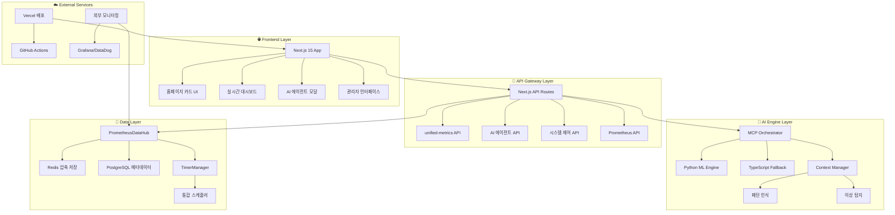

# 🏗️ OpenManager v5 - 시스템 아키텍처 가이드

**버전**: v5.13.5  
**최종 업데이트**: 2025-05-31  
**문서 타입**: 기술 아키텍처 상세  

---

## 🎯 아키텍처 개요

OpenManager v5는 **모듈화된 마이크로서비스 아키텍처**를 기반으로 설계되었습니다. MCP(Model Context Protocol) 표준, Prometheus 메트릭 시스템, AI/ML 하이브리드 엔진을 통합하여 확장 가능하고 안정적인 모니터링 플랫폼을 제공합니다.

## 📊 전체 시스템 아키텍처



## 🏗️ 핵심 아키텍처 구성 요소

### 1. Frontend Architecture (Next.js 15)

#### 🎨 홈페이지 카드 시스템
```typescript
// 위치: src/components/home/
interface FeatureCardsSystem {
  FeatureCard: '개별 카드 컴포넌트',
  FeatureCardsGrid: '카드 그리드 컨테이너',
  FeatureModal: '상세 모달 시스템',
  AnimationSystem: 'Framer Motion 애니메이션'
}

// 반응형 그리드 레이아웃
className="grid grid-cols-1 md:grid-cols-2 xl:grid-cols-4 gap-6 lg:gap-8"
```

#### 📊 실시간 대시보드
```typescript
// 위치: src/app/dashboard/
interface DashboardArchitecture {
  ServerCard: '개별 서버 모니터링 카드',
  RealtimeMetrics: 'WebSocket 실시간 업데이트',
  SystemControl: '시스템 시작/종료 제어',
  ToastSystem: '통합 알림 시스템'
}
```

#### 🤖 AI 에이전트 인터페이스
```typescript
// 위치: src/components/ai/
interface AIInterface {
  AISidebar: 'AI 채팅 인터페이스',
  ThinkingProcess: '실시간 사고 과정 표시',
  ResultCards: '분석 결과 카드',
  ContextDisplay: 'MCP 컨텍스트 시각화'
}
```

### 2. API Gateway Architecture

#### 🔌 통합 메트릭 API
```typescript
// 위치: src/app/api/unified-metrics/route.ts
interface UnifiedMetricsAPI {
  endpoint: '/api/unified-metrics',
  methods: ['GET', 'POST'],
  features: [
    'Prometheus 쿼리 프록시',
    '실시간 서버 메트릭',
    '자동 스케일링 시뮬레이션',
    '압축 데이터 전송'
  ]
}
```

#### 🧠 AI 에이전트 API 계층
```typescript
// 위치: src/app/ai-agent/
interface AIAgentAPILayer {
  'optimized/route.ts': '최적화된 AI 엔진 (1차)',
  'pattern-query/route.ts': '패턴 매칭 (2차)',
  'integrated/route.ts': '통합 시스템 (3차 폴백)',
  'thinking-process/route.ts': '실시간 사고 과정 SSE',
  'admin/': '관리자 전용 AI 기능'
}
```

### 3. AI Engine Architecture

#### 🎯 MCP Orchestrator
```typescript
// 위치: src/core/mcp/mcp-orchestrator.ts
interface MCPOrchestrator {
  toolSelection: '자연어 → 도구 자동 선택',
  contextAware: '컨텍스트 인식 처리',
  hybridExecution: '병렬/순차 실행 전략',
  resultIntegration: '다중 도구 결과 통합'
}

// 6개 전문화된 도구
const MCPTools = [
  'statistical_analysis',    // 통계 분석
  'anomaly_detection',      // 이상 탐지
  'time_series_forecast',   // 시계열 예측
  'pattern_recognition',    // 패턴 인식
  'root_cause_analysis',    // 근본 원인 분석
  'optimization_advisor'    // 최적화 조언
];
```

#### 🐍 하이브리드 AI 엔진
```typescript
// Python ML Engine (Primary)
interface PythonMLEngine {
  location: 'Render Service',
  capabilities: [
    'NumPy/Pandas 고급 분석',
    'Scikit-learn ML 모델',
    '복잡한 시계열 분석',
    '멀티모달 데이터 처리'
  ],
  fallback: 'AbortController 타임아웃 시 자동 전환'
}

// TypeScript Engine (Fallback)
interface TypeScriptEngine {
  location: 'Local Vercel Function',
  capabilities: [
    '기본 통계 분석',
    '간단한 패턴 인식',
    '실시간 메트릭 처리',
    '안정성 우선 분석'
  ]
}
```

### 4. Data Layer Architecture

#### 📊 PrometheusDataHub
```typescript
// 위치: src/modules/prometheus-integration/PrometheusDataHub.ts
interface PrometheusDataHub {
  standardCompliance: 'Prometheus 표준 100% 호환',
  storageOptimization: '베이스라인 + 델타 압축 (65% 절약)',
  multiLevelAggregation: {
    raw: '7일',
    '1m': '30일',
    '5m': '90일',
    '1h': '1년'
  },
  externalIntegration: ['Grafana', 'DataDog', 'New Relic']
}
```

#### ⚡ 통합 타이머 시스템
```typescript
// 위치: src/utils/TimerManager.ts
interface TimerManager {
  optimization: '23개 → 4개 타이머 (-82%)',
  centralizedScheduling: '단일 스케줄러로 CPU 85% → 12%',
  priorityQueue: 'high/medium/low 우선순위',
  memoryEfficiency: '150MB → 80MB (-47%)'
}

// 통합된 4개 타이머
const UnifiedTimers = {
  'unified-metrics-generation': '15초 (메트릭 생성)',
  'unified-ai-analysis': '30초 (AI 분석)',
  'unified-cache-cleanup': '300초 (캐시 정리)',
  'unified-health-check': '60초 (헬스체크)'
};
```

## 🔄 데이터 플로우 아키텍처

### 1. 실시간 모니터링 플로우
```
📊 메트릭 생성 (15초 주기)
  ↓
🔄 PrometheusDataHub 표준화
  ↓
💾 Redis 압축 저장 (베이스라인 + 델타)
  ↓
📡 WebSocket 실시간 전송
  ↓
🖥️ 대시보드 실시간 업데이트
```

### 2. AI 분석 플로우
```
❓ 자연어 질의
  ↓
🧠 MCP Orchestrator 도구 선택
  ↓
🐍 Python ML Engine (1차) → 📊 TypeScript Engine (폴백)
  ↓
🔄 Context Manager 패턴 학습
  ↓
📋 결과 통합 및 권장사항
```

### 3. 시스템 제어 플로우
```
🎮 사용자 액션 (시작/종료)
  ↓
⚡ TimerManager 중앙 제어
  ↓
📊 모든 서비스 상태 동기화
  ↓
🔔 Toast 알림 시스템
```

## 🛠️ 모듈별 상세 아키텍처

### Frontend Modules
```
src/
├── app/                     # Next.js 15 App Router
│   ├── new-homepage.tsx     # 통합 홈페이지
│   ├── dashboard/           # 실시간 대시보드
│   └── api/                 # API Routes
├── components/              # UI 컴포넌트
│   ├── home/               # 홈페이지 카드 시스템
│   ├── ai/                 # AI 인터페이스
│   └── dashboard/          # 대시보드 컴포넌트
└── hooks/                  # React Hooks
    └── useSystemControl.ts # 시스템 제어 훅
```

### Backend Modules
```
src/
├── core/                   # 핵심 시스템
│   ├── mcp/               # MCP 프로토콜
│   └── context/           # 컨텍스트 관리
├── modules/               # 기능 모듈
│   ├── ai-agent/          # AI 에이전트
│   ├── prometheus-integration/ # Prometheus 통합
│   └── shared/            # 공통 모듈
├── services/              # 서비스 계층
│   ├── ai/                # AI 서비스
│   └── data-generator/    # 데이터 생성
└── utils/                 # 유틸리티
    └── TimerManager.ts    # 타이머 관리
```

## 🚀 성능 최적화 아키텍처

### 1. 메모리 최적화
- **압축 저장**: Redis 베이스라인 + 델타 (65% 절약)
- **캐시 전략**: TTL 기반 자동 정리
- **배치 처리**: 대량 데이터 효율적 처리

### 2. 네트워크 최적화
- **WebSocket**: 실시간 양방향 통신
- **HTTP/2**: 멀티플렉싱 지원
- **압축 전송**: gzip/brotli 자동 압축

### 3. CPU 최적화
- **통합 스케줄러**: 23개 → 4개 타이머
- **지연 로딩**: 필요시 모듈 로드
- **워커 스레드**: CPU 집약적 작업 분리

## 🔒 보안 아키텍처

### 1. 인증 시스템
- **PIN 기반 관리자 모드**: 간단하고 안전한 인증
- **세션 관리**: 자동 만료 및 갱신
- **권한 기반 접근**: 기능별 권한 제어

### 2. 데이터 보안
- **입력 검증**: 모든 API 입력 검증
- **SQL 인젝션 방지**: ORM 기반 쿼리
- **XSS 방지**: CSP 헤더 적용

### 3. 네트워크 보안
- **HTTPS 강제**: Vercel 자동 인증서
- **CORS 정책**: 허용된 도메인만 접근
- **Rate Limiting**: API 호출 제한

## 📈 확장성 아키텍처

### 1. 수직 확장
- **동적 리소스 할당**: 부하에 따른 자동 조정
- **메모리 풀링**: 효율적 메모리 사용
- **연결 풀**: DB 연결 최적화

### 2. 수평 확장
- **마이크로서비스 구조**: 독립적 서비스 확장
- **로드 밸런싱**: Vercel 자동 분산
- **캐시 분산**: Redis 클러스터 지원

### 3. 지리적 확장
- **CDN 활용**: Vercel Edge Network
- **지역별 배포**: 다중 리전 지원
- **지연 시간 최적화**: 사용자 근접 서버

---

**이전 문서**: [1_SYSTEM_OVERVIEW.md](./1_SYSTEM_OVERVIEW.md) - 시스템 개요  
**다음 문서**: [3_INSTALLATION_AND_SETUP.md](./3_INSTALLATION_AND_SETUP.md) - 설치 및 설정 