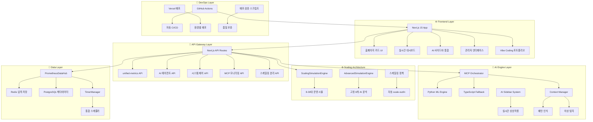

# 🏗️ OpenManager v5 - 시스템 아키텍처 가이드

**버전**: v5.21.0  
**최종 업데이트**: 2025-06-02  
**개발자**: jhhong  
**문서 타입**: 기술 아키텍처 상세  

---

## 🎯 아키텍처 개요

OpenManager v5.21.0은 **AI 분석-오토스케일링 분리 구조**와 **MCP 통합 시스템**을 기반으로 설계된 차세대 모니터링 플랫폼입니다. Model Context Protocol 표준, Prometheus 메트릭 시스템, AI/ML 하이브리드 엔진을 통합하여 확장 가능하고 안정적인 모니터링 플랫폼을 제공합니다.

## 📊 전체 시스템 아키텍처



## 🏗️ 핵심 아키텍처 구성 요소

### 1. **🆕 MCP 통합 시스템** ⭐

#### 📡 Model Context Protocol 아키텍처
```typescript
// 위치: src/core/mcp/
interface MCPSystemArchitecture {
  OfficialMCPClient: 'MCP 표준 프로토콜 구현',
  MCPOrchestrator: 'AI 에이전트 도구 연동 오케스트레이터',
  MCPMonitoring: 'MCP 연결 상태 및 성능 모니터링',
  ExternalTools: 'filesystem, git, postgres 도구 연동'
}

// MCP 클라이언트 구성
const mcpConfig: MCPStandardConfig = {
  servers: {
    filesystem: { command: 'npx', args: ['@modelcontextprotocol/server-filesystem'] },
    git: { command: 'npx', args: ['@modelcontextprotocol/server-git'] },
    postgres: { command: 'npx', args: ['@modelcontextprotocol/server-postgres'] },
    custom: { command: 'node', args: ['custom-mcp-server.js'] }
  },
  options: {
    timeout: 30000,
    retryAttempts: 3,
    keepAlive: true
  }
};
```

#### 🔧 MCP 모니터링 시스템
```typescript
// 위치: src/app/admin/mcp-monitoring/
interface MCPMonitoringSystem {
  ConnectionStatus: 'MCP 서버 연결 상태 실시간 추적',
  PerformanceMetrics: '도구 호출 성능 및 응답 시간',
  HealthCheck: 'MCP 서버 헬스체크 및 자동 복구',
  ErrorTracking: 'MCP 관련 오류 추적 및 알림'
}
```

### 2. **🆕 AI 분석-오토스케일링 분리 아키텍처** ⭐

#### ⚖️ 이중 구조 설계
```typescript
// 1. 운영 시뮬레이션 엔진 (가변)
// 위치: src/services/ScalingSimulationEngine.ts
interface ScalingSimulationEngine {
  serverRange: '8-30대 서버 동적 스케일링',
  scalingPolicy: {
    scaleOutThreshold: '85% CPU 사용률',
    scaleInThreshold: '30% CPU 사용률',
    cooldownPeriod: '5분',
    scalingUnit: '2서버씩 증감'
  },
  resourceOptimization: '환경별 자원 소모량 적응적 조절'
}

// 2. AI 분석 엔진 (고정)
// 위치: src/services/AdvancedSimulationEngine.ts v4.0
interface AdvancedSimulationEngine {
  fixedTargets: '8개 서버 고정 (primary 4개, secondary 3개, monitoring 1개)',
  aiAnalysisStability: '서버 수 변동과 무관한 일관된 AI 추론',
  separationMethod: 'AI 분석 대상과 운영 시뮬 완전 분리'
}
```

#### 🔄 분리 아키텍처 API
```typescript
// 위치: src/app/api/simulate/ai-separation/
interface AISeparationAPI {
  endpoint: '/api/simulate/ai-separation',
  viewModes: [
    'ai-only: AI 분석 전용 데이터',
    'scaling-only: 스케일링 시뮬레이션 전용',
    'integrated: 통합 뷰',
    'comparison: 분리 효과 비교'
  ],
  testingFeatures: [
    'stress-test: 분리 구조 스트레스 테스트',
    'consistency-check: AI 분석 일관성 검증'
  ]
}
```

### 3. **🆕 AI 사이드바 통합 시스템** ⭐

#### 🎨 실시간 AI 상호작용
```typescript
// 위치: src/modules/ai-sidebar/
interface AISidebarSystem {
  IntegratedAIResponse: '대화형 AI 인터페이스',
  RealTimeThinking: '실시간 AI 사고 과정 표시',
  ContextualChat: '현재 상황 기반 스마트 대화',
  QuickActions: '즉시 실행 가능한 AI 액션'
}

// AI 에이전트와 통합
interface AIAgentIntegration {
  modalInterface: 'AIAgentModal.tsx와 연동',
  thinkingProcess: 'ThinkingProcessor.ts 공유',
  contextSharing: '컨텍스트 매니저 공통 활용'
}
```

### 4. **🆕 Vibe Coding 포트폴리오 시스템** ⭐

#### 🎨 AI 협업 개발 성과 시연
```typescript
// 위치: src/app/vibe-coding/
interface VibeCodingPortfolio {
  developmentShowcase: {
    'Timer Optimization': '23개 → 4개 타이머 통합 (CPU 40% 절약)',
    'Data Compression': '베이스라인+델타 방식 (65% 압축률)',
    'TypeScript Migration': '100% 타입 안전성 확보',
    'Engine Implementation': '507줄 데이터 생성 엔진 구현'
  },
  aiToolsUsed: [
    'Cursor AI Composer: 멀티파일 동시 편집',
    'Claude 3.5 Sonnet: 아키텍처 설계 및 분석',
    'GitHub Copilot: 코드 자동 완성'
  ],
  interactiveDemo: '4단계 개발 과정 인터랙티브 시연'
}
```

### 5. **🆕 배포 자동화 시스템** ⭐

#### 🚀 CI/CD 파이프라인
```typescript
// 위치: .github/workflows/deploy-check.yml
interface DeploymentAutomation {
  cicdPipeline: {
    typeCheck: 'TypeScript 컴파일 검증',
    eslintCheck: '코드 품질 검사',
    buildTest: '프로덕션 빌드 테스트',
    deploymentReady: '배포 준비 완료 검증'
  },
  localVerification: {
    script: 'scripts/deploy-check.js',
    purpose: '로컬 배포 전 검증 자동화'
  }
}
```

## 🔄 데이터 플로우 아키텍처

### 1. **🆕 MCP 기반 AI 플로우**
```
❓ 자연어 질의
  ↓
🧠 MCP Orchestrator 도구 선택 (filesystem, git, postgres)
  ↓
🔧 외부 도구 실행 및 컨텍스트 수집
  ↓
🐍 Python ML Engine (1차) → 📊 TypeScript Engine (폴백)
  ↓
🔄 Context Manager 패턴 학습
  ↓
📋 결과 통합 및 권장사항
```

### 2. **🆕 분리 아키텍처 플로우**
```
📊 메트릭 생성 (15초 주기)
  ↓
🔄 이중 엔진 처리
  ├── 🏗️ ScalingSimulationEngine (8-30대 운영 시뮬)
  └── 🧠 AdvancedSimulationEngine (고정 8개 AI 분석)
  ↓
💾 분리된 데이터 저장
  ├── 📈 운영 시뮬레이션 메트릭
  └── 🎯 AI 분석 전용 메트릭
  ↓
📡 통합 API 응답 (/api/simulate/ai-separation)
```

### 3. **🆕 배포 자동화 플로우**
```
🏠 로컬 개발
  ↓
✅ scripts/deploy-check.js (로컬 검증)
  ↓
📤 Git Push → GitHub
  ↓
🤖 GitHub Actions (.github/workflows/deploy-check.yml)
  ↓
🔍 자동 품질 검사 (타입, ESLint, 빌드)
  ↓
🚀 Vercel 자동 배포
```

## 🛠️ 모듈별 상세 아키텍처

### **🆕 MCP 통합 모듈**
```
src/
├── core/mcp/                        # MCP 핵심 시스템
│   ├── official-mcp-client.ts      # MCP 표준 클라이언트
│   └── mcp-orchestrator.ts         # MCP 오케스트레이터
├── modules/mcp/                     # MCP 래퍼 시스템
│   ├── adapters/                   # 외부 도구 어댑터
│   └── utils/                      # MCP 유틸리티
└── app/admin/mcp-monitoring/        # MCP 모니터링 UI
    └── page.tsx                    # MCP 상태 대시보드
```

### **🆕 분리 아키텍처 모듈**
```
src/
├── services/
│   ├── ScalingSimulationEngine.ts   # 운영 시뮬레이션 (8-30대)
│   └── AdvancedSimulationEngine.ts  # AI 분석 (고정 8개)
└── app/api/simulate/
    └── ai-separation/              # 분리 아키텍처 API
        └── route.ts               # GET/POST/PUT 엔드포인트
```

### **🆕 AI 사이드바 모듈**
```
src/
├── modules/ai-sidebar/             # AI 사이드바 시스템
│   ├── components/                # 사이드바 컴포넌트
│   ├── hooks/                     # 사이드바 전용 훅
│   └── types/                     # 사이드바 타입 정의
└── components/ai/                 # 기존 AI 컴포넌트와 통합
    ├── AIAgentModal.tsx          # 메인 AI 모달
    └── ThinkingView.tsx          # 사고 과정 표시
```

### **🆕 배포 자동화 모듈**
```
.github/
└── workflows/
    └── deploy-check.yml          # GitHub Actions CI/CD

scripts/
└── deploy-check.js              # 로컬 배포 검증 스크립트

src/app/
└── vibe-coding/                 # Vibe Coding 포트폴리오
    └── page.tsx                # AI 협업 개발 성과 시연
```

## 🚀 v5.21.0 성능 최적화 아키텍처

### 1. **🆕 AI 분석 안정성 확보**
- **분리 구조**: AI 분석과 오토스케일링 완전 분리
- **일관된 추론**: 고정 8개 서버 기반 안정적 AI 분석
- **리소스 최적화**: 환경별 자원 소모량 적응적 조절

### 2. **🆕 MCP 성능 최적화**
- **연결 풀링**: MCP 서버 연결 효율적 관리
- **비동기 처리**: 외부 도구 호출 논블로킹 실행
- **캐시 활용**: MCP 응답 결과 캐싱으로 성능 향상

### 3. **🆕 배포 안정성 향상**
- **자동 검증**: 배포 전 필수 체크리스트 자동 실행
- **타입 안전성**: 100% TypeScript로 런타임 오류 방지
- **점진적 배포**: Vercel Preview → Production 단계적 배포

## 🔒 보안 아키텍처

### 1. 인증 시스템
- **PIN 기반 관리자 모드**: 간단하고 안전한 인증
- **세션 관리**: 자동 만료 및 갱신
- **권한 기반 접근**: 기능별 권한 제어

### 2. 데이터 보안
- **입력 검증**: 모든 API 입력 검증
- **SQL 인젝션 방지**: ORM 기반 쿼리
- **XSS 방지**: CSP 헤더 적용

### 3. 네트워크 보안
- **HTTPS 강제**: Vercel 자동 인증서
- **CORS 정책**: 허용된 도메인만 접근
- **Rate Limiting**: API 호출 제한

## 📈 확장성 아키텍처

### 1. 수직 확장
- **동적 리소스 할당**: 부하에 따른 자동 조정
- **메모리 풀링**: 효율적 메모리 사용
- **연결 풀**: DB 연결 최적화

### 2. 수평 확장
- **마이크로서비스 구조**: 독립적 서비스 확장
- **로드 밸런싱**: Vercel 자동 분산
- **캐시 분산**: Redis 클러스터 지원

### 3. 지리적 확장
- **CDN 활용**: Vercel Edge Network
- **지역별 배포**: 다중 리전 지원
- **지연 시간 최적화**: 사용자 근접 서버

---

## 📋 v5.21.0 주요 변경사항

### ✅ **추가된 핵심 모듈**
1. **MCP 통합 시스템** - AI 에이전트 확장성 대폭 향상
2. **스케일링 분리 아키텍처** - AI 추론 안정성과 운영 유연성 확보
3. **AI 사이드바 시스템** - 실시간 AI 상호작용 UX 혁신
4. **Vibe Coding 포트폴리오** - AI 협업 개발 성과 시연
5. **배포 자동화 시스템** - CI/CD 파이프라인 및 품질 보증

### 🔄 **업그레이드된 기존 모듈**
1. **AdvancedSimulationEngine v4.0** - AI 분석 전용으로 역할 변경
2. **TimerManager** - 23개 → 4개 타이머 통합 최적화
3. **PrometheusDataHub** - 베이스라인+델타 압축 (65% 절약)

### 🗑️ **정리 예정 모듈**
1. **backup/dev-sandbox/** - 임시 개발 파일들
2. **backup/legacy-stores/** - 사용되지 않는 레거시 백업
3. **중복 컴포넌트** - AI 사이드바 통합으로 제거 예정

**이전 문서**: [1_SYSTEM_OVERVIEW.md](./1_SYSTEM_OVERVIEW.md) - 시스템 개요  
**다음 문서**: [3_INSTALLATION_AND_SETUP.md](./3_INSTALLATION_AND_SETUP.md) - 설치 및 설정 