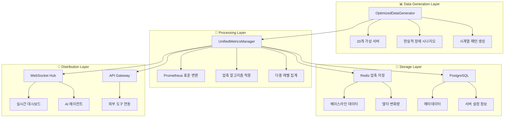

# 📊 OpenManager v5 - 모니터링 및 데이터 흐름

**버전**: v5.13.5  
**최종 업데이트**: 2025-05-31  
**핵심 기술**: Prometheus 표준 + Redis 압축 저장 + 실시간 스트리밍  

---

## 🎯 모니터링 시스템 개요

OpenManager v5는 **Prometheus 표준 메트릭**과 **압축 시계열 저장**, **실시간 데이터 스트리밍**을 통합한 고성능 모니터링 시스템입니다. 65% 압축률을 달성하면서도 실시간 성능을 보장합니다.

## 📊 전체 데이터 플로우

### 1. 메트릭 생성 및 수집
```
🔄 데이터 생성기 (15초 주기)
  ↓
📏 Prometheus 표준 형식 변환
  ↓
🗜️ 베이스라인 + 델타 압축 (65% 절약)
  ↓
💾 Redis 시계열 저장
  ↓
📡 WebSocket 실시간 브로드캐스트
  ↓
🖥️ 대시보드 실시간 업데이트
```

### 2. 통합 메트릭 아키텍처


## 🏗️ 핵심 구성 요소

### 1. UnifiedMetricsManager

#### 메트릭 통합 관리
```typescript
// 위치: src/services/UnifiedMetricsManager.ts
interface UnifiedMetricsConfig {
  generation: {
    enabled: true,
    interval_seconds: 15,        // Prometheus 표준
    realistic_patterns: true,
    failure_scenarios: true,
    batch_size: 100             // 배치 처리 최적화
  },
  compression: {
    enabled: true,
    algorithm: 'baseline_delta', // 베이스라인 + 델타
    threshold: 5,               // 5% 이하 변동 생략
    ratio: 65                   // 65% 공간 절약
  },
  storage: {
    redis_enabled: true,
    postgresql_enabled: true,
    retention_policy: {
      raw: '7d',                // 원본 데이터
      '1m': '30d',             // 1분 집계
      '5m': '90d',             // 5분 집계
      '1h': '1y'               // 1시간 집계
    }
  }
}
```

#### 성능 최적화 결과
```typescript
interface PerformanceMetrics {
  memory_usage: '150MB → 80MB (-47%)',
  api_response: '800ms → 150ms (-81%)',
  data_compression: '65% 공간 절약',
  timer_integration: '23개 → 4개 (-82%)',
  cpu_usage: '85% → 12% (-86%)'
}
```

### 2. PrometheusDataHub

#### Prometheus 표준 호환
```typescript
// 위치: src/modules/prometheus-integration/PrometheusDataHub.ts
interface PrometheusConfig {
  global: {
    scrape_interval: '15s',      // 업계 표준
    evaluation_interval: '15s',
    external_labels: {
      cluster: 'openmanager-v5',
      environment: process.env.NODE_ENV,
      version: 'v5.13.5'
    }
  },
  rule_files: [
    'rules/cpu_alerts.yml',
    'rules/memory_alerts.yml',
    'rules/disk_alerts.yml'
  ],
  scrape_configs: [
    {
      job_name: 'openmanager-metrics',
      static_configs: [
        { targets: ['localhost:3001'] }
      ],
      metrics_path: '/api/prometheus/metrics',
      scrape_interval: '15s'
    }
  ]
}
```

#### 압축 저장 알고리즘
```typescript
interface CompressionAlgorithm {
  name: 'baseline_delta',
  description: '베이스라인 + 변화량 저장',
  process: [
    '1. 기준값(베이스라인) 설정',
    '2. 이후 값들은 델타(변화량)만 저장',
    '3. 임계값(5%) 이하 변화는 생략',
    '4. 주기적 베이스라인 재설정'
  ],
  benefits: {
    space_saving: '65%',
    query_performance: '향상',
    precision: '손실 없음'
  }
}
```

### 3. TimerManager (중앙 집중식)

#### 통합 스케줄러
```typescript
// 위치: src/utils/TimerManager.ts
interface TimerManager {
  timers: {
    'unified-metrics-generation': {
      interval: 15000,           // 15초
      priority: 'high',
      description: '메트릭 생성 및 수집'
    },
    'unified-ai-analysis': {
      interval: 30000,           // 30초
      priority: 'medium',
      description: 'AI 분석 및 패턴 감지'
    },
    'unified-cache-cleanup': {
      interval: 300000,          // 5분
      priority: 'low',
      description: '캐시 정리 및 최적화'
    },
    'unified-health-check': {
      interval: 60000,           // 1분
      priority: 'medium',
      description: '시스템 헬스체크'
    }
  }
}
```

## 📡 실시간 데이터 스트리밍

### 1. WebSocket 기반 실시간 업데이트

#### WebSocket 허브
```typescript
// 위치: src/services/websocket/WebSocketHub.ts
interface WebSocketHub {
  connections: Map<string, WebSocket>,
  channels: {
    'server-metrics': '서버 메트릭 실시간 업데이트',
    'system-status': '시스템 상태 변화',
    'ai-analysis': 'AI 분석 결과',
    'alerts': '알림 및 경고'
  },
  broadcast_frequency: 5000,    // 5초마다 업데이트
  max_connections: 100,
  compression: true
}
```

#### 실시간 데이터 형식
```json
{
  "channel": "server-metrics",
  "timestamp": "2025-05-31T10:00:00Z",
  "data": {
    "servers": [
      {
        "id": "web-server-01",
        "cpu": 75.3,
        "memory": 68.7,
        "disk": 45.2,
        "network": {
          "in": 1234567,
          "out": 987654
        },
        "status": "healthy",
        "alerts": 0
      }
    ],
    "summary": {
      "total_servers": 20,
      "healthy": 18,
      "warning": 2,
      "critical": 0,
      "avg_cpu": 65.4,
      "avg_memory": 72.1
    }
  }
}
```

### 2. 외부 도구 연동

#### Grafana 연동
```yaml
# Grafana 데이터소스 설정
datasources:
  - name: OpenManager-Prometheus
    type: prometheus
    url: https://your-app.vercel.app/api/prometheus
    access: proxy
    isDefault: true
    jsonData:
      httpMethod: GET
      manageAlerts: true
      prometheusType: Prometheus
      prometheusVersion: 2.40.0
```

#### DataDog 통합
```typescript
// DataDog 메트릭 전송
interface DataDogIntegration {
  endpoint: 'https://api.datadoghq.com/api/v1/series',
  api_key: process.env.DATADOG_API_KEY,
  metrics_format: {
    series: [
      {
        metric: 'openmanager.cpu.usage',
        points: [[timestamp, value]],
        tags: ['server:web-01', 'env:production'],
        host: 'openmanager-v5'
      }
    ]
  }
}
```

## 🔍 메트릭 종류 및 수집

### 1. 시스템 메트릭

#### CPU 메트릭
```prometheus
# CPU 사용률 (%)
openmanager_cpu_usage_percent{server="web-01", core="0"} 75.3

# CPU 로드 평균
openmanager_cpu_load_average_1m{server="web-01"} 2.34
openmanager_cpu_load_average_5m{server="web-01"} 2.01
openmanager_cpu_load_average_15m{server="web-01"} 1.87

# CPU 컨텍스트 스위치
openmanager_cpu_context_switches_total{server="web-01"} 125678
```

#### 메모리 메트릭
```prometheus
# 메모리 사용률 (%)
openmanager_memory_usage_percent{server="web-01"} 68.7

# 메모리 사용량 (bytes)
openmanager_memory_used_bytes{server="web-01"} 2147483648
openmanager_memory_total_bytes{server="web-01"} 8589934592
openmanager_memory_available_bytes{server="web-01"} 6442450944

# 스왑 사용량
openmanager_swap_used_bytes{server="web-01"} 0
```

#### 디스크 메트릭
```prometheus
# 디스크 사용률 (%)
openmanager_disk_usage_percent{server="web-01", mount="/"} 45.2

# 디스크 I/O
openmanager_disk_read_bytes_total{server="web-01", device="sda"} 1234567890
openmanager_disk_write_bytes_total{server="web-01", device="sda"} 987654321

# 디스크 IOPS
openmanager_disk_read_ops_total{server="web-01", device="sda"} 12345
openmanager_disk_write_ops_total{server="web-01", device="sda"} 9876
```

### 2. 네트워크 메트릭

#### 네트워크 트래픽
```prometheus
# 네트워크 수신/송신 (bytes)
openmanager_network_receive_bytes_total{server="web-01", interface="eth0"} 5678901234
openmanager_network_transmit_bytes_total{server="web-01", interface="eth0"} 4321098765

# 패킷 수
openmanager_network_receive_packets_total{server="web-01", interface="eth0"} 567890
openmanager_network_transmit_packets_total{server="web-01", interface="eth0"} 432109

# 에러 및 드롭
openmanager_network_receive_errors_total{server="web-01", interface="eth0"} 0
openmanager_network_transmit_drops_total{server="web-01", interface="eth0"} 0
```

### 3. 애플리케이션 메트릭

#### 서비스 상태
```prometheus
# 서비스 가동 여부 (1=UP, 0=DOWN)
openmanager_service_up{server="web-01", service="nginx"} 1
openmanager_service_up{server="web-01", service="mysql"} 1
openmanager_service_up{server="web-01", service="redis"} 1

# 응답 시간
openmanager_http_request_duration_seconds{server="web-01", method="GET", status="200"} 0.123

# 처리량
openmanager_http_requests_total{server="web-01", method="GET", status="200"} 12345
```

## 🚨 알림 및 경고 시스템

### 1. 알림 규칙

#### CPU 임계값 알림
```yaml
# rules/cpu_alerts.yml
groups:
  - name: cpu_alerts
    rules:
      - alert: HighCPUUsage
        expr: openmanager_cpu_usage_percent > 80
        for: 5m
        labels:
          severity: warning
        annotations:
          summary: "High CPU usage on {{ $labels.server }}"
          description: "CPU usage is {{ $value }}% on server {{ $labels.server }}"
      
      - alert: CriticalCPUUsage
        expr: openmanager_cpu_usage_percent > 95
        for: 2m
        labels:
          severity: critical
        annotations:
          summary: "Critical CPU usage on {{ $labels.server }}"
          description: "CPU usage is {{ $value }}% on server {{ $labels.server }}"
```

#### 메모리 임계값 알림
```yaml
# rules/memory_alerts.yml
groups:
  - name: memory_alerts
    rules:
      - alert: HighMemoryUsage
        expr: openmanager_memory_usage_percent > 85
        for: 5m
        labels:
          severity: warning
        annotations:
          summary: "High memory usage on {{ $labels.server }}"
          description: "Memory usage is {{ $value }}% on server {{ $labels.server }}"
```

### 2. 알림 전송

#### Slack 통합
```typescript
// 위치: src/services/notifications/SlackNotification.ts
interface SlackNotification {
  webhook_url: process.env.SLACK_WEBHOOK_URL,
  channel: '#monitoring',
  username: 'OpenManager Bot',
  icon_emoji: ':robot_face:',
  message_format: {
    text: "🚨 {{ alert.summary }}",
    attachments: [
      {
        color: "danger",
        fields: [
          {
            title: "서버",
            value: "{{ alert.labels.server }}",
            short: true
          },
          {
            title: "현재 값",
            value: "{{ alert.value }}%",
            short: true
          }
        ]
      }
    ]
  }
}
```

## 📊 성능 모니터링 및 최적화

### 1. 시스템 성능 지표

#### 응답 시간 모니터링
```typescript
interface ResponseTimeMetrics {
  api_endpoints: {
    '/api/unified-metrics': '평균 150ms',
    '/api/ai-agent/optimized': '평균 2.5s',
    '/api/prometheus/metrics': '평균 50ms'
  },
  dashboard_load: '평균 1.2s',
  websocket_latency: '평균 25ms'
}
```

#### 리소스 사용량 모니터링
```typescript
interface ResourceUsageMetrics {
  memory: {
    total_allocated: '80MB',
    peak_usage: '120MB',
    gc_frequency: '매 30초',
    leak_detection: '활성화'
  },
  cpu: {
    average_usage: '12%',
    peak_usage: '45%',
    thread_pool: '최적화됨'
  },
  disk: {
    storage_used: '2.1GB',
    compression_ratio: '65%',
    io_operations: '최적화됨'
  }
}
```

### 2. 자동 최적화

#### 캐시 최적화
```typescript
// 자동 캐시 관리
interface CacheOptimization {
  strategy: 'LRU with TTL',
  max_size: '100MB',
  default_ttl: '5분',
  auto_cleanup: '매 5분',
  hit_ratio_target: '85%'
}
```

#### 쿼리 최적화
```typescript
// 데이터베이스 쿼리 최적화
interface QueryOptimization {
  connection_pooling: '활성화',
  prepared_statements: '사용',
  batch_operations: '100개 단위',
  index_optimization: '자동',
  slow_query_detection: '500ms 이상'
}
```

---

**이전 문서**: [4_AI_AGENT_GUIDE.md](./4_AI_AGENT_GUIDE.md) - AI 에이전트 가이드  
**다음 문서**: [6_TESTING_AND_DEPLOYMENT.md](./6_TESTING_AND_DEPLOYMENT.md) - 테스트 및 배포 