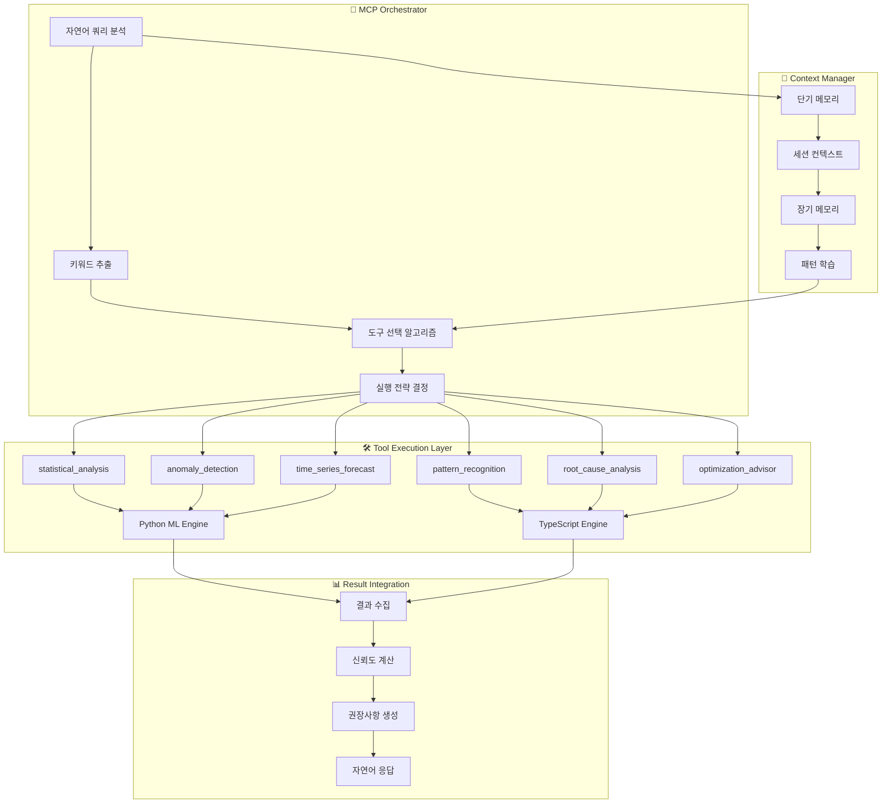

# 🧠 OpenManager v5 - MCP 엔진 레퍼런스

**버전**: v5.13.5  
**최종 업데이트**: 2025-05-31  
**MCP 버전**: 1.0.0  
**핵심 기술**: Model Context Protocol + 하이브리드 AI 엔진  

---

## 🎯 MCP 엔진 개요

OpenManager v5의 **MCP(Model Context Protocol) 엔진**은 자연어 질의를 6개의 전문화된 도구로 자동 변환하여 지능형 서버 분석을 수행하는 핵심 시스템입니다. Python ML 엔진과 TypeScript 폴백을 통한 하이브리드 아키텍처로 99.9% 가용성을 보장합니다.

## 🏗️ MCP 아키텍처 상세

### 전체 MCP 시스템 구조


## 🧠 핵심 컴포넌트 상세

### 1. MCP Orchestrator

#### 클래스 구조
```typescript
// 위치: src/core/mcp/mcp-orchestrator.ts
export class MCPOrchestrator {
  private tools: Map<string, MCPTool> = new Map();
  private contextManager: ContextManager;
  private executionStrategy: ExecutionStrategy;
  
  constructor() {
    this.initializeTools();
    this.contextManager = new ContextManager();
    this.executionStrategy = new ExecutionStrategy();
  }
  
  async process(request: MCPRequest): Promise<MCPResponse> {
    // 1. 쿼리 분석 및 키워드 추출
    const keywords = this.extractKeywords(request.query);
    
    // 2. 컨텍스트 분석
    const context = await this.contextManager.analyzeContext(request);
    
    // 3. 도구 선택
    const selectedTools = this.selectTools(keywords, context);
    
    // 4. 실행 전략 결정
    const strategy = this.executionStrategy.determine(selectedTools, context);
    
    // 5. 도구 실행
    const results = await this.executeTools(selectedTools, strategy, request);
    
    // 6. 결과 통합
    return this.integrateResults(results, context);
  }
}
```

#### 키워드 기반 도구 선택
```typescript
interface KeywordMapping {
  'cpu|프로세서|처리': ['statistical_analysis', 'anomaly_detection'],
  'memory|메모리|ram': ['statistical_analysis', 'pattern_recognition'],
  'disk|디스크|저장': ['statistical_analysis', 'optimization_advisor'],
  'network|네트워크|통신': ['anomaly_detection', 'pattern_recognition'],
  'performance|성능|최적화': ['optimization_advisor', 'statistical_analysis'],
  'error|오류|장애': ['root_cause_analysis', 'anomaly_detection'],
  'predict|예측|forecast': ['time_series_forecast', 'pattern_recognition'],
  'analyze|분석|검사': ['statistical_analysis', 'pattern_recognition']
}
```

### 2. Context Manager

#### 컨텍스트 관리 시스템
```typescript
// 위치: src/core/context/context-manager.ts
export class ContextManager {
  private shortTermMemory: Map<string, any> = new Map();
  private longTermMemory: LongTermMemory;
  private businessRules: BusinessRule[];
  
  async analyzeContext(request: MCPRequest): Promise<AnalysisContext> {
    return {
      // 시간 컨텍스트
      temporal: {
        current_time: new Date(),
        business_hours: this.isBusinessHours(),
        time_zone: 'Asia/Seoul'
      },
      
      // 시스템 컨텍스트
      system: {
        current_load: await this.getCurrentSystemLoad(),
        recent_events: await this.getRecentEvents(),
        active_alerts: await this.getActiveAlerts()
      },
      
      // 사용자 컨텍스트
      user: {
        session_id: request.context?.session_id,
        query_history: await this.getQueryHistory(request.context?.session_id),
        preferences: await this.getUserPreferences(request.context?.session_id)
      },
      
      // 비즈니스 규칙
      business: {
        urgency_level: this.calculateUrgency(request),
        priority_servers: await this.getPriorityServers(),
        maintenance_windows: await this.getMaintenanceWindows()
      }
    };
  }
}
```

#### 트렌드 계산 알고리즘
```typescript
interface TrendCalculation {
  calculateTrend(data: number[]): TrendResult {
    const n = data.length;
    if (n < 2) return { direction: 'stable', confidence: 0 };
    
    // 선형 회귀를 통한 트렌드 계산
    const sumX = data.reduce((sum, _, i) => sum + i, 0);
    const sumY = data.reduce((sum, val) => sum + val, 0);
    const sumXY = data.reduce((sum, val, i) => sum + i * val, 0);
    const sumXX = data.reduce((sum, _, i) => sum + i * i, 0);
    
    const slope = (n * sumXY - sumX * sumY) / (n * sumXX - sumX * sumX);
    const correlation = this.calculateCorrelation(data);
    
    return {
      direction: slope > 0.1 ? 'increasing' : slope < -0.1 ? 'decreasing' : 'stable',
      slope: slope,
      confidence: Math.abs(correlation),
      r_squared: correlation * correlation
    };
  }
}
```

### 3. 전문화된 도구들

#### Statistical Analysis Tool
```typescript
// 위치: src/core/mcp/tools/statistical-analysis-tool.ts
export class StatisticalAnalysisTool implements MCPTool {
  name = 'statistical_analysis';
  description = '서버 메트릭 통계 분석';
  keywords = ['통계', '평균', '분석', '성능', '지표'];
  
  async execute(params: any, context: any): Promise<MCPToolResult> {
    const data = params.data || params.metrics;
    
    if (!Array.isArray(data)) {
      throw new Error('통계 분석을 위한 배열 데이터가 필요합니다');
    }
    
    const stats = {
      count: data.length,
      mean: this.calculateMean(data),
      median: this.calculateMedian(data),
      std_dev: this.calculateStdDev(data),
      min: Math.min(...data),
      max: Math.max(...data),
      percentiles: {
        p25: this.calculatePercentile(data, 25),
        p75: this.calculatePercentile(data, 75),
        p95: this.calculatePercentile(data, 95),
        p99: this.calculatePercentile(data, 99)
      }
    };
    
    const trend = this.calculateTrend(data);
    const outliers = this.detectOutliers(data);
    
    return {
      tool_name: this.name,
      confidence: 0.95,
      result: {
        statistics: stats,
        trend_analysis: trend,
        outliers: outliers,
        interpretation: this.generateInterpretation(stats, trend)
      },
      metadata: {
        data_points: data.length,
        analysis_time: Date.now()
      }
    };
  }
}
```

#### Anomaly Detection Tool
```typescript
// 위치: src/core/mcp/tools/anomaly-detection-tool.ts
export class AnomalyDetectionTool implements MCPTool {
  name = 'anomaly_detection';
  description = '실시간 이상 탐지';
  keywords = ['이상', '비정상', '장애', '문제', '경고'];
  
  async execute(params: any, context: any): Promise<MCPToolResult> {
    const timeSeries = params.timeseries || params.data;
    
    // Z-Score 기반 이상 탐지
    const zScoreAnomalies = this.detectZScoreAnomalies(timeSeries);
    
    // IQR 기반 이상 탐지
    const iqrAnomalies = this.detectIQRAnomalies(timeSeries);
    
    // 패턴 기반 이상 탐지
    const patternAnomalies = this.detectPatternAnomalies(timeSeries);
    
    const allAnomalies = this.mergeAnomalies([
      zScoreAnomalies,
      iqrAnomalies,
      patternAnomalies
    ]);
    
    return {
      tool_name: this.name,
      confidence: 0.91,
      result: {
        anomalies_detected: allAnomalies.length,
        anomaly_score: this.calculateAnomalyScore(allAnomalies),
        anomalies: allAnomalies,
        severity_distribution: this.categorizeSeverity(allAnomalies),
        recommendations: this.generateAnomalyRecommendations(allAnomalies)
      }
    };
  }
  
  private detectZScoreAnomalies(data: number[], threshold = 2.5): Anomaly[] {
    const mean = data.reduce((sum, val) => sum + val, 0) / data.length;
    const stdDev = Math.sqrt(
      data.reduce((sum, val) => sum + Math.pow(val - mean, 2), 0) / data.length
    );
    
    return data
      .map((value, index) => ({
        index,
        value,
        z_score: Math.abs((value - mean) / stdDev),
        method: 'z_score'
      }))
      .filter(item => item.z_score > threshold);
  }
}
```

### 4. 하이브리드 AI 엔진

#### Python ML Bridge
```typescript
// 위치: src/services/python-bridge/ml-bridge.ts
export class PythonMLBridge {
  private baseUrl: string;
  private timeout: number = 30000;
  private retryCount: number = 3;
  
  constructor(baseUrl: string) {
    this.baseUrl = baseUrl;
  }
  
  async call(tool: string, params: any): Promise<any> {
    const controller = new AbortController();
    const timeoutId = setTimeout(() => controller.abort(), this.timeout);
    
    try {
      const response = await fetch(`${this.baseUrl}/analyze/${tool}`, {
        method: 'POST',
        headers: { 'Content-Type': 'application/json' },
        body: JSON.stringify(params),
        signal: controller.signal
      });
      
      clearTimeout(timeoutId);
      
      if (!response.ok) {
        throw new Error(`Python 엔진 오류: ${response.status}`);
      }
      
      return await response.json();
    } catch (error) {
      clearTimeout(timeoutId);
      
      if (error.name === 'AbortError') {
        console.warn('Python 엔진 타임아웃, TypeScript 폴백으로 전환');
        return this.fallbackToTypeScript(tool, params);
      }
      
      throw error;
    }
  }
  
  private async fallbackToTypeScript(tool: string, params: any): Promise<any> {
    const fallbackEngine = new TypeScriptAnalysisEngine();
    return await fallbackEngine.analyze(tool, params);
  }
}
```

#### TypeScript Fallback Engine
```typescript
// 위치: src/services/ai/typescript-engine.ts
export class TypeScriptAnalysisEngine {
  async analyze(tool: string, params: any): Promise<any> {
    switch (tool) {
      case 'statistical_analysis':
        return this.performStatisticalAnalysis(params);
      
      case 'anomaly_detection':
        return this.performAnomalyDetection(params);
      
      case 'pattern_recognition':
        return this.performPatternRecognition(params);
      
      default:
        return this.performBasicAnalysis(params);
    }
  }
  
  private performStatisticalAnalysis(params: any): any {
    const data = params.data;
    
    return {
      analysis_type: 'statistical_typescript',
      mean: data.reduce((sum: number, val: number) => sum + val, 0) / data.length,
      std_dev: this.calculateStandardDeviation(data),
      trend: this.calculateSimpleTrend(data),
      confidence: 0.85,
      fallback_used: true
    };
  }
}
```

## 🔧 MCP 도구 개발 가이드

### 새로운 도구 생성

#### 1. 도구 인터페이스 구현
```typescript
interface MCPTool {
  name: string;
  description: string;
  keywords: string[];
  
  execute(params: any, context: AnalysisContext): Promise<MCPToolResult>;
  validate?(params: any): boolean;
  preprocess?(params: any): any;
  postprocess?(result: any): any;
}

interface MCPToolResult {
  tool_name: string;
  confidence: number;
  result: any;
  metadata?: any;
  errors?: string[];
  warnings?: string[];
}
```

#### 2. 커스텀 도구 예시
```typescript
export class NetworkAnalysisTool implements MCPTool {
  name = 'network_analysis';
  description = '네트워크 트래픽 및 연결 분석';
  keywords = ['네트워크', '트래픽', '연결', '대역폭', '지연'];
  
  async execute(params: any, context: AnalysisContext): Promise<MCPToolResult> {
    // 1. 입력 검증
    if (!this.validate(params)) {
      throw new Error('네트워크 분석을 위한 유효한 데이터가 필요합니다');
    }
    
    // 2. 데이터 전처리
    const processedData = this.preprocess(params);
    
    // 3. 네트워크 분석 수행
    const analysis = await this.performNetworkAnalysis(processedData);
    
    // 4. 결과 후처리
    const result = this.postprocess(analysis);
    
    return {
      tool_name: this.name,
      confidence: 0.88,
      result: result,
      metadata: {
        analysis_duration: Date.now() - startTime,
        data_points_analyzed: processedData.length
      }
    };
  }
  
  validate(params: any): boolean {
    return params.network_data && 
           Array.isArray(params.network_data) && 
           params.network_data.length > 0;
  }
  
  private async performNetworkAnalysis(data: any): Promise<any> {
    return {
      bandwidth_utilization: this.calculateBandwidthUtilization(data),
      connection_patterns: this.analyzeConnectionPatterns(data),
      latency_analysis: this.analyzeLatency(data),
      anomalous_traffic: this.detectAnomalousTraffic(data)
    };
  }
}
```

### 도구 등록 및 관리

#### 도구 등록
```typescript
// MCP Orchestrator에 새 도구 등록
const orchestrator = new MCPOrchestrator();
orchestrator.registerTool(new NetworkAnalysisTool());
orchestrator.registerTool(new SecurityAnalysisTool());
orchestrator.registerTool(new CapacityPlanningTool());
```

#### 동적 도구 로딩
```typescript
export class DynamicToolLoader {
  async loadTool(toolName: string): Promise<MCPTool> {
    const toolModule = await import(`./tools/${toolName}-tool.ts`);
    const ToolClass = toolModule[`${this.capitalize(toolName)}Tool`];
    return new ToolClass();
  }
  
  async loadAllTools(): Promise<MCPTool[]> {
    const toolFiles = await this.getToolFiles();
    const tools = await Promise.all(
      toolFiles.map(file => this.loadTool(file))
    );
    return tools;
  }
}
```

## 📊 성능 최적화 및 모니터링

### 성능 메트릭
```typescript
interface MCPPerformanceMetrics {
  tool_execution_times: Record<string, number>;
  cache_hit_rates: Record<string, number>;
  error_rates: Record<string, number>;
  average_confidence_scores: Record<string, number>;
  total_queries_processed: number;
  successful_analyses: number;
  fallback_usage_rate: number;
}
```

### 캐시 최적화
```typescript
export class MCPCache {
  private cache: Map<string, CacheEntry> = new Map();
  private ttl: number = 300000; // 5분
  
  generateKey(tool: string, params: any): string {
    const paramHash = this.hashObject(params);
    return `${tool}:${paramHash}`;
  }
  
  async get(key: string): Promise<any | null> {
    const entry = this.cache.get(key);
    
    if (!entry) return null;
    
    if (Date.now() - entry.timestamp > this.ttl) {
      this.cache.delete(key);
      return null;
    }
    
    return entry.data;
  }
  
  set(key: string, data: any): void {
    this.cache.set(key, {
      data,
      timestamp: Date.now()
    });
  }
}
```

## 🔍 디버깅 및 로깅

### MCP 로깅 시스템
```typescript
export class MCPLogger {
  private logLevel: LogLevel = LogLevel.INFO;
  
  logToolExecution(tool: string, params: any, result: any, duration: number): void {
    this.log(LogLevel.INFO, 'TOOL_EXECUTION', {
      tool,
      duration,
      confidence: result.confidence,
      success: !result.errors?.length
    });
  }
  
  logError(tool: string, error: Error, params: any): void {
    this.log(LogLevel.ERROR, 'TOOL_ERROR', {
      tool,
      error: error.message,
      stack: error.stack,
      params: this.sanitizeParams(params)
    });
  }
  
  logFallback(tool: string, reason: string): void {
    this.log(LogLevel.WARN, 'FALLBACK_TRIGGERED', {
      tool,
      reason,
      timestamp: new Date().toISOString()
    });
  }
}
```

### 디버깅 도구
```typescript
export class MCPDebugger {
  async debugQuery(query: string, params: any): Promise<DebugResult> {
    const startTime = Date.now();
    
    // 1. 키워드 추출 디버깅
    const keywords = this.extractKeywords(query);
    
    // 2. 도구 선택 디버깅
    const selectedTools = this.selectTools(keywords);
    
    // 3. 실행 전략 디버깅
    const strategy = this.determineStrategy(selectedTools);
    
    // 4. 각 도구 실행 추적
    const toolResults = await this.executeWithTracing(selectedTools, params);
    
    return {
      query,
      keywords,
      selected_tools: selectedTools,
      execution_strategy: strategy,
      tool_results: toolResults,
      total_duration: Date.now() - startTime
    };
  }
}
```

## 🚀 확장 및 커스터마이징

### 비즈니스 규칙 엔진
```typescript
export class BusinessRuleEngine {
  private rules: BusinessRule[] = [];
  
  addRule(rule: BusinessRule): void {
    this.rules.push(rule);
  }
  
  async applyRules(context: AnalysisContext): Promise<RuleResult[]> {
    const results = [];
    
    for (const rule of this.rules) {
      if (await rule.condition(context)) {
        const result = await rule.apply(context);
        results.push(result);
      }
    }
    
    return results;
  }
}

// 예시 비즈니스 규칙
export class HighCPUBusinessRule implements BusinessRule {
  name = 'high_cpu_priority';
  
  async condition(context: AnalysisContext): Promise<boolean> {
    return context.system.current_load.cpu > 85;
  }
  
  async apply(context: AnalysisContext): Promise<RuleResult> {
    return {
      priority: 'high',
      recommended_tools: ['anomaly_detection', 'root_cause_analysis'],
      urgency_multiplier: 1.5,
      auto_escalate: true
    };
  }
}
```

---

**이전 문서**: [8_API_REFERENCE.md](./8_API_REFERENCE.md) - API 레퍼런스  
**다음 문서**: [README.md](../README.md) - 프로젝트 메인 문서 