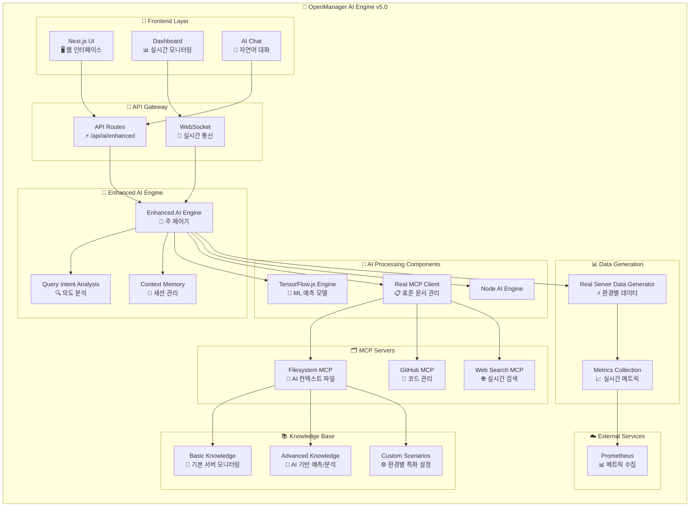

# 🧠 OpenManager AI Engine v5.0 아키텍처

> **버전**: v5.0.1  
> **업데이트**: 2024년 1월  
> **관리**: AI Engine Development Team

## 🎯 시스템 개요

### **설계 원칙**
- **정보 전달 중심**: 1차 대응자에게 실행 가능한 정보 제공
- **3단계 지식 체계**: 기본 → 고급 → 커스텀 순차 적용
- **실시간 성능**: 벡터 DB 없는 고속 검색 시스템
- **표준 준수**: MCP 2024-11-05 프로토콜 완전 구현

## 📊 아키텍처 다이어그램



## 🏗️ 계층별 구조

### **1. Frontend Layer**
```yaml
Next.js 15.3.3:
  - 반응형 웹 인터페이스
  - 실시간 서버 모니터링 대시보드
  - AI 대화 인터페이스
  - WebSocket 실시간 데이터 스트리밍
```

### **2. API Gateway**
```yaml
엔드포인트:
  - /api/ai/enhanced: 메인 AI 엔진
  - /api/websocket: 실시간 통신
  - /api/metrics: 성능 메트릭 수집
  - /api/health: 시스템 상태 확인
```

### **3. Enhanced AI Engine (핵심)**
```yaml
주요 컴포넌트:
  - Enhanced AI Engine: 주 제어기
  - Query Intent Analysis: 의도 분석
  - Context Memory: 세션 관리
  - Document Index: 고속 문서 검색
```

### **4. AI Processing Components**
```yaml
TensorFlow.js Engine:
  - 이상 탐지 모델
  - 장애 예측 모델  
  - 시계열 예측 모델
  - 클러스터링 분석

Real MCP Client:
  - JSON-RPC 2.0 통신
  - 표준 MCP 프로토콜
  - 다중 서버 관리

Node AI Engine:
  - Node.js ML 연동
  - 고성능 연산 처리

```

## 📚 3단계 지식 체계

### **기본 지식 (1순위) - 70-80% 적용**
```yaml
파일: src/modules/ai-agent/context/system-knowledge.md
내용:
  - 표준 메트릭 해석 (CPU, Memory, Disk, Network)
  - 임계값 기반 알림 체계
  - 1차 대응자 진단 가이드
  - 문제 해결 체크리스트
```

### **고급 지식 (2순위) - 15-25% 적용**
```yaml
파일: src/modules/ai-agent/context/advanced-monitoring.md
내용:
  - TensorFlow.js 예측 모델 활용
  - 이상 패턴 감지 알고리즘
  - 예방적 유지보수 권장
  - 성능 최적화 AI 분석
```

### **커스텀 지식 (3순위) - 5-15% 적용**
```yaml
파일: src/modules/ai-agent/context/custom-scenarios.md
내용:
  - 단일서버, 마스터-슬레이브, 로드밸런싱
  - GPU, 스토리지 특화 워크로드
  - 마이크로서비스, 멀티 데이터센터
  - 특수 환경별 보조 가이드
```

## 🔄 실시간 처리 흐름

```
사용자 쿼리 
    ↓
의도 분석 (Intent Analysis)
    ↓
문서 검색 (3단계 지식 체계)
    ↓
AI 예측 분석 (TensorFlow.js)
    ↓
컨텍스트 생성 (Context Memory)
    ↓
응답 생성 (자연어 처리)
    ↓
1차 대응자 전달 (정보 제공)
```

## 📈 성능 지표

### **응답 성능 목표**
```yaml
초기화 시간: < 3초 (고속 모드)
쿼리 응답: < 2초 (기본 지식)
AI 분석: < 5초 (고급 분석)
ML 예측: < 10초 (복잡한 예측)
```

### **신뢰성 지표**
```yaml
서비스 가용성: 99.9% (폴백 시스템)
정확도: 85%+ (지속적 학습)
응답률: 100% (다층 폴백)
```

## 🚨 에러 처리 및 복구

### **다층 폴백 시스템**
```yaml
1차 폴백: MCP 연결 실패 → 로컬 캐시 사용
2차 폴백: TensorFlow 미준비 → 기본 분석 모드
3차 폴백: 외부 서버 비활성 → 로컬 ML 모드
```

## 🔧 버전 관리

### **업데이트 가이드**
- **마이너 업데이트**: 성능 최적화, 버그 수정
- **메이저 업데이트**: 새로운 AI 모델, 아키텍처 변경
- **패치 업데이트**: 보안 패치, 설정 조정

### **다음 버전 (v5.1) 계획**
- 서버 직접 관리 기능 추가 (레벨 1 자동 대응)
- 더 정교한 예측 모델 도입
- 다국어 지원 확장

---

**문서 위치**: `docs/AI-ENGINE-ARCHITECTURE.md`  
**버전 추적**: 시스템 업그레이드시 함께 업데이트  
**리뷰 주기**: 분기별 아키텍처 검토 