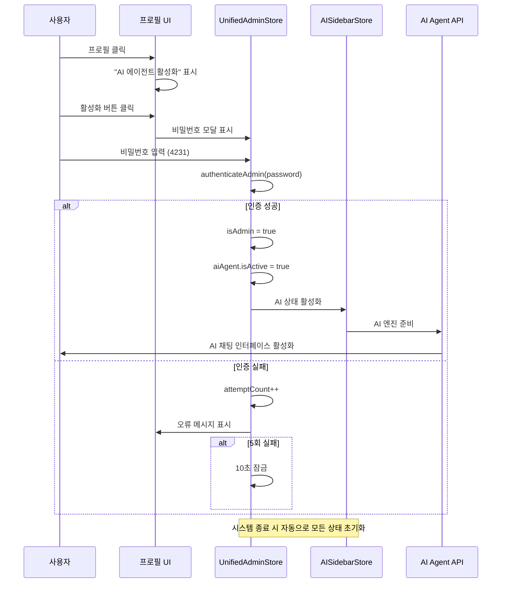

# 📘 OpenManager V5 - AI 에이전트 & 엔진 전체 아키텍처 설계

> **최종 작성**: 2025-01-27  
> **기반 기술**: Next.js 15 + TypeScript + Zustand + MCP Protocol
> **설계 범위**: 프론트엔드 → 백엔드 → AI 엔진 → 상태 흐름 → 보안 제어

---

### 🛠️ 기술 스택

- Next.js 15 API Routes (Node.js)
- FastAPI (Render 호스팅)
- Scikit-learn, Transformers.js
- Redis, Zustand

## 🎯 1. 전체 시스템 아키텍처 설계

### 📊 전체 데이터 흐름 다이어그램

```mermaid
graph TB
    %% 프론트엔드 레이어
    subgraph "🎨 Frontend Layer"
        A[사용자 인터페이스]
        B[AIAgentModal]
        C[AISidebarV5]
        D[PresetQuestions]
        E[AgentThinkingPanel]
        F[ChatInterface]
    end
    
    %% 상태 관리 레이어
    subgraph "🏪 State Management"
        G[useAISidebarStore]
        H[useUnifiedAdminStore]
        I[serverDataStore]
    end
    
    %% API 레이어
    subgraph "⚡ API Routes"
        J[/api/ai-agent]
        K[/api/ai-agent/thinking]
        L[/api/servers]
        M[/api/unified-metrics]
    end
    
    %% AI 엔진 레이어
    subgraph "🧠 AI Engine Core"
        N[AIAgentEngine]
        O[MCPProcessor]
        P[IntentClassifier]
        Q[ThinkingProcessor]
        R[ResponseGenerator]
    end
    
    %% 분석 엔진 레이어
    subgraph "🔬 Analysis Engines"
        S[Python AI Engine]
        T[TypeScript Fallback]
        U[PredictionEngine]
        V[AnomalyDetector]
    end
    
    %% 데이터 레이어
    subgraph "💾 Data Layer"
        W[UnifiedMetricsManager]
        X[PrometheusDataHub]
        Y[Redis Cache]
        Z[ServerMetrics]
    end
    
    %% 연결 관계
    A --> B
    A --> C
    C --> D
    C --> E
    C --> F
    
    B --> G
    C --> G
    G --> H
    G --> I
    
    F --> J
    D --> J
    J --> K
    
    J --> N
    N --> O
    N --> P
    N --> Q
    N --> R
    
    O --> S
    O --> T
    O --> U
    O --> V
    
    L --> W
    M --> W
    W --> X
    X --> Y
    X --> Z
    
    %% 실시간 연결
    Q -.-> E
    R -.-> F
    V -.-> G
```

### 🔄 핵심 상태 흐름

```typescript
// 질문 입력 → AI 응답 전체 플로우
const aiQueryFlow = {
  1: "사용자 질문 입력",
  2: "useAISidebarStore.setThinking(true)",
  3: "POST /api/ai-agent { query, context }",
  4: "AIAgentEngine.processQuery()",
  5: "ThinkingProcessor → 실시간 로그",
  6: "MCPProcessor → 서버 분석",
  7: "ResponseGenerator → 최종 답변",
  8: "useAISidebarStore.addResponse()",
  9: "UI 업데이트 완료"
};
```

---

## 🏗️ 2. 프론트엔드 모듈 설계

### 2.1 AIAgentModal 컴포넌트
**파일**: `src/components/ai/modal-v2/AIAgentModal.tsx`

```typescript
interface AIAgentModalProps {
  isOpen: boolean;
  onClose: () => void;
  onToggle?: () => void;
  className?: string;
  mode?: 'chat' | 'analysis' | 'monitoring';
  serverContext?: ServerMetrics[];
}

interface AIAgentModalState {
  activeTab: 'chat' | 'thinking' | 'settings';
  isMinimized: boolean;
  currentQuery: string;
  isProcessing: boolean;
}
```

**핵심 책임**:
- 🎯 **역할**: AI 채팅 모달 UI + 탭 관리 + 최소화/최대화
- 🔄 **상태 연결**: `useAISidebarStore` 구독
- 📡 **외부 통신**: `POST /api/ai-agent`
- 🎨 **애니메이션**: Framer Motion 기반 모달 전환

### 2.2 AISidebarV5 컴포넌트  
**파일**: `src/components/ai/sidebar/AISidebarV5.tsx`

```typescript
interface AISidebarV5Props {
  isOpen: boolean;
  onClose: () => void;
  className?: string;
}

const AISidebarV5: React.FC<AISidebarV5Props> = ({ isOpen, onClose }) => {
  // Zustand 상태 구독
  const { isThinking, currentQuestion, logs, responses } = useAISidebarStore();
  const { setThinking, addLog, addResponse } = useAISidebarActions();
  
  // 질문 처리 로직
  const handleSubmitQuery = async (query: string) => {
    setThinking(true);
    
    try {
      const response = await fetch('/api/ai-agent', {
        method: 'POST',
        headers: { 'Content-Type': 'application/json' },
        body: JSON.stringify({ query, sessionId: generateSessionId() })
      });
      
      const result = await response.json();
      addResponse(result);
    } finally {
      setThinking(false);
    }
  };
}
```

### 2.3 PresetQuestions 컴포넌트
**파일**: `src/components/ai/sidebar/EnhancedPresetQuestions.tsx`

```typescript
interface PresetQuestion {
  id: string;
  question: string;
  category: 'performance' | 'security' | 'prediction' | 'analysis';
  isAIRecommended?: boolean;
}

interface PresetQuestionsProps {
  onSelect: (question: string) => void;
  selectedCategory?: string;
  className?: string;
}

// 프리셋 질문 상수
export const PRESET_QUESTIONS: PresetQuestion[] = [
  { id: 'perf-1', question: '현재 시스템의 전반적인 성능 상태는?', category: 'performance' },
  { id: 'pred-1', question: '향후 1시간 내 장애 가능성이 있는 서버는?', category: 'prediction', isAIRecommended: true },
  // ... 더 많은 프리셋
];
```

### 2.4 AgentThinkingPanel 컴포넌트
**파일**: `src/components/ai/sidebar/AgentThinkingPanel.tsx`

```typescript
interface AgentLog {
  id: string;
  step: string;
  content: string;
  type: 'analysis' | 'reasoning' | 'data_processing' | 'pattern_matching';
  timestamp: string;
  duration?: number;
  progress?: number;
}

const AgentThinkingPanel: React.FC = () => {
  const { logs, isThinking } = useAIThinking();
  
  return (
    <div className="thinking-panel">
      {logs.map(log => (
        <motion.div key={log.id} className="thinking-step">
          <StepIcon type={log.type} />
          <div className="step-content">
            <h4>{log.step}</h4>
            <p>{log.content}</p>
            {log.progress && <ProgressBar value={log.progress} />}
          </div>
        </motion.div>
      ))}
    </div>
  );
};
```

---

## 🔧 3. 백엔드 + AI 엔진 모듈

### 3.1 메인 AI API 엔드포인트
**파일**: `src/app/api/ai-agent/route.ts`

```typescript
export async function POST(request: NextRequest) {
  const startTime = Date.now();
  
  try {
    const { query, sessionId, serverData, context } = await request.json();
    
    // 🛡️ 요청 검증
    const validation = validateRequest({ query, sessionId });
    if (!validation.isValid) {
      return NextResponse.json(validation.error, { status: 400 });
    }
    
    // ⚡ AI 엔진 동적 로딩 (Vercel 최적화)
    const aiAgentEngine = await getAIAgent();
    
    // 🧠 엔진 상태 확인
    const engineStatus = aiAgentEngine.getEngineStatus();
    if (!engineStatus.isInitialized) {
      return NextResponse.json({
        success: false,
        error: 'AI 에이전트가 아직 준비되지 않았습니다',
        retryable: true
      }, { status: 503 });
    }
    
    // 🔧 AI 요청 구성
    const agentRequest: AIAgentRequest = {
      query: query.trim(),
      sessionId: sessionId || generateSessionId(),
      context: context || {},
      serverData,
      metadata: {
        timestamp: new Date().toISOString(),
        dataSource: serverData ? 'real-time' : 'simulation'
      }
    };
    
    // 🤖 AI 처리 실행
    const response = await aiAgentEngine.processQuery(agentRequest);
    
    return NextResponse.json(response);
    
  } catch (error) {
    console.error('❌ AI 에이전트 처리 오류:', error);
    return NextResponse.json({
      success: false,
      error: error.message,
      metadata: { processingTime: Date.now() - startTime }
    }, { status: 500 });
  }
}
```

### 3.2 AIAgentEngine 핵심 구조
**파일**: `src/modules/ai-agent/core/AIAgentEngine.ts`

```typescript
export class AIAgentEngine {
  private static instance: AIAgentEngine;
  private config: AIAgentConfig;
  private mcpProcessor: MCPProcessor;
  private intentClassifier: IntentClassifier;
  private responseGenerator: ResponseGenerator;
  private contextManager: ContextManager;
  private thinkingProcessor: ThinkingProcessor;
  
  async processQuery(request: AIAgentRequest): Promise<AIAgentResponse> {
    const startTime = Date.now();
    const sessionId = request.sessionId || this.generateSessionId();
    const thinkingSessionId = `thinking_${sessionId}`;
    
    try {
      // 🧠 사고 과정 로깅 시작
      thinkingLogger.startSession(thinkingSessionId, request.query);
      
      // 1. 컨텍스트 로드
      thinkingLogger.startStep(thinkingSessionId, '컨텍스트 로드', 'data_processing');
      const context = await this.contextManager.loadContext(sessionId, request.context);
      
      // 2. 의도 분류
      thinkingLogger.startStep(thinkingSessionId, '의도 분류 (AI 추론)', 'analysis');
      const intent = await this.intentClassifier.classify(request.query, context);
      
      // 3. MCP 분석
      thinkingLogger.startStep(thinkingSessionId, 'MCP 서버 분석', 'data_processing');
      const mcpResponse = await this.mcpProcessor.processQuery(request.query, request.serverData);
      
      // 4. 응답 생성
      thinkingLogger.startStep(thinkingSessionId, '응답 생성', 'response_generation');
      const response = await this.responseGenerator.generate(intent, mcpResponse, context);
      
      return {
        success: true,
        response: response.text,
        intent,
        actions: response.actions,
        context: response.context,
        metadata: {
          processingTime: Date.now() - startTime,
          timestamp: new Date().toISOString(),
          engineVersion: '5.17.10',
          sessionId,
          thinkingSessionId
        }
      };
      
    } catch (error) {
      thinkingLogger.logError(thinkingSessionId, error.message);
      throw error;
    }
  }
}
```

### 3.3 MCP Engine 구조
**파일**: `src/modules/mcp/MCPProcessor.ts`

```typescript
export class MCPProcessor {
  private static instance: MCPProcessor;
  private tools: Map<string, MCPTool> = new Map();
  private pythonBridge: PythonBridge;
  private fallbackEngine: TypeScriptAnalysisEngine;
  
  async processQuery(query: string, serverData?: any): Promise<MCPResponse> {
    try {
      // 1. 쿼리 분석 및 도구 선택
      const requiredTools = await this.analyzeQueryForTools(query);
      
      // 2. Python 엔진 시도
      let pythonResult = null;
      try {
        pythonResult = await this.pythonBridge.analyze({
          query,
          metrics: serverData,
          tools: requiredTools
        });
      } catch (error) {
        console.warn('Python 엔진 실패, TypeScript 폴백 사용');
      }
      
      // 3. TypeScript 폴백 실행
      const fallbackResult = await this.fallbackEngine.analyze({
        query,
        metrics: serverData,
        tools: requiredTools
      });
      
      // 4. 결과 병합
      return this.mergeResults(pythonResult, fallbackResult, query);
      
    } catch (error) {
      return this.generateErrorResponse(error.message);
    }
  }
}
```

### 3.4 PredictionEngine 구조
**파일**: `ai-engine-py/predictor.py`

```python
class MetricsPredictor:
    def __init__(self):
        self.confidence_threshold = 0.8
        self.critical_cpu_threshold = 90
        self.critical_memory_threshold = 85
        
    def analyze_metrics(self, query: str = None, 
                       metrics: List[Dict] = None) -> Dict[str, Any]:
        """메트릭 분석 및 예측"""
        
        analysis_result = {
            "summary": "정상적인 시스템 상태입니다",
            "confidence": 0.95,
            "recommendations": ["정기적인 모니터링 지속"],
            "analysis_data": {
                "query": query,
                "metrics_count": len(metrics) if metrics else 0,
                "timestamp": datetime.now().isoformat(),
                "analysis_type": "general"
            }
        }
        
        # 쿼리 기반 분석
        if query:
            analysis_result.update(self._analyze_by_query(query))
            
        # 메트릭 기반 분석  
        if metrics and len(metrics) > 0:
            metric_analysis = self._analyze_metrics_data(metrics)
            analysis_result.update(metric_analysis)
            
return analysis_result
```

### 3.5 MCP 서버 구성

- MCPProcessor는 **Next.js API Routes** 기반 `/api/mcp` 엔드포인트에서 실행됩니다.
- Node.js 런타임에서 직접 동작하며 Vercel SDK는 사용하지 않습니다.
- Python 엔진 주소는 `FASTAPI_BASE_URL` 환경변수로 관리됩니다.

### 3.6 컨텍스트 사용 방식

- `ContextManager`가 세션별 단기 메모리와 Redis 장기 메모리를 결합하여 컨텍스트를 제공합니다.
- 프론트엔드에서 전달된 `context` 객체를 우선 적용한 후 서버 저장 컨텍스트와 병합합니다.

### 3.7 Render 기반 Python 엔진 위치

- Python ML 엔진은 Render의 `https://openmanager-ai-engine.onrender.com`에서 동작합니다.
- MCPProcessor는 해당 주소로 HTTP POST 요청을 전송해 분석 결과를 가져옵니다.

---

## 🏪 4. 상태 관리 아키텍처

### 4.1 useAISidebarStore 구조
**파일**: `src/stores/useAISidebarStore.ts`

```typescript
interface AISidebarState {
  // UI 상태
  isOpen: boolean;
  isMinimized: boolean;
  activeTab: 'chat' | 'presets' | 'thinking' | 'settings';
  
  // AI 상태
  isThinking: boolean;
  currentQuestion: string;
  logs: AgentLog[];
  responses: AIResponse[];
  
  // 성능 최적화를 위한 UI 상태 분리
  uiState: {
    activeTab: 'chat' | 'presets' | 'thinking' | 'settings';
    isMinimized: boolean;
  };
}

// Zustand 스토어 생성 (SSR 안전)
export const useAISidebarStore = create<AISidebarState>()(
  devtools(
    persist(
      (set, get) => ({
        // 초기 상태
        isOpen: false,
        isThinking: false,
        logs: [],
        responses: [],
        
        // 액션들
        setThinking: (thinking) => set({ isThinking: thinking }),
        addLog: (logData) => set((state) => ({
          logs: [...state.logs, {
            ...logData,
            id: `log_${Date.now()}_${Math.random().toString(36).substr(2, 9)}`,
            timestamp: new Date().toISOString()
          }]
        })),
        addResponse: (responseData) => set((state) => ({
          responses: [...state.responses, {
            ...responseData,
            id: `response_${Date.now()}`,
            timestamp: new Date().toISOString()
          }]
        }))
      }),
      { name: 'ai-sidebar-store' }
    )
  )
);
```

### 4.2 선택적 상태 구독 훅들

```typescript
// UI 상태만 구독 (성능 최적화)
export const useAISidebarUI = () => {
  return useAISidebarStore((state) => ({
    isOpen: state.isOpen,
    isMinimized: state.isMinimized,
    activeTab: state.activeTab
  }), shallow);
};

// AI 작업 상태만 구독
export const useAIThinking = () => {
  return useAISidebarStore((state) => ({
    isThinking: state.isThinking,
    logs: state.logs,
    currentQuestion: state.currentQuestion
  }), shallow);
};

// 채팅 상태만 구독
export const useAIChat = () => {
  return useAISidebarStore((state) => ({
    responses: state.responses,
    addResponse: state.addResponse,
    clearResponses: state.clearResponses
  }), shallow);
};
```

---

## 🔒 5. 보안 제어 및 인증

### 5.1 관리자 모드 통합 인증
**파일**: `src/stores/useUnifiedAdminStore.ts`

```typescript
interface UnifiedAdminState {
  // 인증 상태
  isAdmin: boolean;
  attemptCount: number;
  lockoutUntil: number | null;
  
  // AI 에이전트 상태 (관리자 모드와 연동)
  aiAgent: {
    isActive: boolean;
    sessionId: string | null;
    startTime: number | null;
  };
  
  // 액션들
  authenticateAdmin: (password: string) => Promise<boolean>;
  toggleAIAgent: () => void;
  systemShutdown: () => void;
}

const useUnifiedAdminStore = create<UnifiedAdminState>((set, get) => ({
  isAdmin: false,
  attemptCount: 0,
  lockoutUntil: null,
  aiAgent: {
    isActive: false,
    sessionId: null,
    startTime: null
  },
  
  authenticateAdmin: async (password: string) => {
    const state = get();
    
    // 잠금 상태 확인
    if (state.lockoutUntil && Date.now() < state.lockoutUntil) {
      return false;
    }
    
    if (password === '4231') {
      set({
        isAdmin: true,
        attemptCount: 0,
        lockoutUntil: null,
        aiAgent: {
          isActive: true,
          sessionId: `admin_${Date.now()}`,
          startTime: Date.now()
        }
      });
      return true;
    } else {
      const newAttemptCount = state.attemptCount + 1;
      const lockoutTime = newAttemptCount >= 5 ? Date.now() + 10000 : null; // 10초 잠금
      
      set({
        attemptCount: newAttemptCount,
        lockoutUntil: lockoutTime
      });
      return false;
    }
  },
  
  systemShutdown: () => {
    set({
      isAdmin: false,
      aiAgent: {
        isActive: false,
        sessionId: null,
        startTime: null
      }
    });
    
    // AI 사이드바 상태도 초기화
    useAISidebarStore.getState().reset();
  }
}));
```

### 5.2 보안 흐름 다이어그램



---

## ⚡ 6. 성능 최적화 전략

### 6.1 컴포넌트 최적화

```typescript
// React.memo와 선택적 구독으로 불필요한 리렌더링 방지
const AgentThinkingPanel = React.memo(() => {
  // 사고 과정 로그만 구독
  const { logs, isThinking } = useAIThinking();
  
  // 가상화된 리스트로 대량 로그 처리
  const virtualizedLogs = useMemo(() => 
    logs.slice(-100), // 최근 100개만 렌더링
    [logs]
  );
  
  return (
    <div className="thinking-panel">
      {virtualizedLogs.map(log => (
        <ThinkingStep key={log.id} log={log} />
      ))}
    </div>
  );
});
```

### 6.2 API 응답 시간 최적화

```typescript
// Vercel 서버리스 최적화 - 동적 import
const getAIAgent = async () => {
  const { aiAgentEngine } = await import('../../../modules/ai-agent/core/AIAgentEngine');
  return aiAgentEngine;
};

// 캐시된 응답 사용
const cachedResponses = new Map<string, AIAgentResponse>();

export async function POST(request: NextRequest) {
  const { query } = await request.json();
  const cacheKey = generateCacheKey(query);
  
  // 캐시 확인 (동일한 질문에 대한 빠른 응답)
  if (cachedResponses.has(cacheKey)) {
    return NextResponse.json(cachedResponses.get(cacheKey));
  }
  
  // AI 처리 실행...
}
```

---

## 📋 7. TypeScript 인터페이스 명세

### 7.1 핵심 데이터 타입

```typescript
// AI 요청/응답 타입
export interface AIAgentRequest {
  query: string;
  userId?: string;
  sessionId?: string;
  context?: Record<string, any>;
  serverData?: ServerMetrics[];
  metadata?: Record<string, any>;
}

export interface AIAgentResponse {
  success: boolean;
  response: string;
  intent: {
    name: string;
    confidence: number;
    entities: Record<string, any>;
  };
  actions: string[];
  context: Record<string, any>;
  metadata: {
    processingTime: number;
    timestamp: string;
    engineVersion: string;
    sessionId: string;
    thinkingSessionId?: string;
    error?: string;
  };
  error?: string;
}

// 서버 메트릭 타입
export interface ServerMetrics {
  timestamp: string;
  cpu: number;
  memory: number;
  disk: number;
  networkIn: number;
  networkOut: number;
  responseTime?: number;
  activeConnections?: number;
}

// MCP 컨텍스트 타입
export interface MCPContext {
  serverMetrics?: ServerMetrics[];
  logEntries?: LogEntry[];
  timeRange?: { start: Date; end: Date };
  userQuery?: string;
  previousResults?: any[];
  sessionId?: string;
}

// 사고 과정 로그 타입
export interface AgentLog {
  id: string;
  step: string;
  content: string;
  type: 'analysis' | 'reasoning' | 'data_processing' | 'pattern_matching' | 'response_generation';
  timestamp: string;
  duration?: number;
  progress?: number;
}
```

---

## 🎯 8. 핵심 설계 원칙

### 8.1 책임 분리 (Separation of Concerns)

| 레이어 | 책임 | 주요 모듈 |
|--------|------|-----------|
| **UI Layer** | 사용자 인터랙션, 화면 렌더링 | AIAgentModal, AISidebarV5 |
| **State Layer** | 상태 관리, 데이터 동기화 | useAISidebarStore, useUnifiedAdminStore |
| **API Layer** | HTTP 통신, 요청/응답 처리 | /api/ai-agent routes |
| **Engine Layer** | AI 추론, 의도 분류, 분석 | AIAgentEngine, MCPProcessor |
| **Data Layer** | 메트릭 수집, 데이터 변환 | UnifiedMetricsManager |

### 8.2 확장성 설계

```typescript
// 플러그인 아키텍처로 새로운 AI 도구 추가 가능
interface MCPTool {
  name: string;
  description: string;
  execute(params: any, context: MCPContext): Promise<MCPToolResult>;
}

// 새로운 의도 분류 추가 가능
interface IntentClassifier {
  classify(query: string, context: any): Promise<Intent>;
  registerIntent(intent: IntentDefinition): void;
}
```

### 8.3 Fallback 전략

```typescript
const analysisFlow = {
  1: "Python AI Engine 시도",
  2: "실패 시 → TypeScript Fallback Engine",
  3: "둘 다 실패 시 → 기본 규칙 기반 응답",
  4: "모든 것 실패 시 → 사과 메시지 + 재시도 안내"
};
```

---

## 🚀 9. 배포 및 모니터링

### 9.1 Vercel 서버리스 최적화

```typescript
// 번들 크기 최적화
export const dynamic = 'force-dynamic';
export const runtime = 'nodejs';
export const maxDuration = 30; // 30초 타임아웃

// 메모리 사용량 모니터링
const monitorMemory = () => {
  const used = process.memoryUsage();
  console.log('메모리 사용량:', {
    rss: `${Math.round(used.rss / 1024 / 1024)} MB`,
    heapTotal: `${Math.round(used.heapTotal / 1024 / 1024)} MB`,
    heapUsed: `${Math.round(used.heapUsed / 1024 / 1024)} MB`
  });
};
```

### 9.2 성능 메트릭 추적

```typescript
const performanceMetrics = {
  aiResponseTime: "평균 1.5초 목표",
  uiRenderTime: "16ms 이하 (60fps)",
  memoryUsage: "80MB 이하",
  cacheHitRate: "85% 이상",
  errorRate: "1% 이하"
};
```

---

**🎉 OpenManager V5 AI 에이전트 시스템 아키텍처 설계 완료!**

이 문서는 프론트엔드부터 AI 엔진까지의 전체 흐름과 각 모듈의 책임을 명확히 정의하여, 유지보수와 확장이 용이한 설계를 제공합니다. 