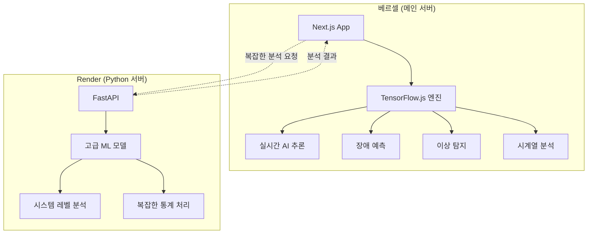

# 🧠 AI 엔진 아키텍처 최적화 가이드

## 📋 **현재 구성 분석**

### 🔍 **하이브리드 AI 아키텍처**



## 🚀 **최적화 전략**

### **Phase 1: TensorFlow.js 기능 확장 (진행 중)**

#### ✅ **이미 구현된 기능들**
- **장애 예측**: 4층 신경망 (ReLU + Sigmoid)
- **이상 탐지**: 오토인코더 (20→4→20)  
- **시계열 예측**: LSTM 기반 (50 units × 2)
- **통계 분석**: ml-regression, simple-statistics

#### 🔄 **Python → JavaScript 이전 대상**

**1. 클러스터링 (KMeans)**
```javascript
// 추가 예정: ml-kmeans 패키지
import KMeans from 'ml-kmeans';

const kmeans = new KMeans(data, 3);
const clusters = kmeans.clusters;
```

**2. 이상 탐지 개선 (IsolationForest → 자체 구현)**
```javascript
// TensorFlow.js 기반 Isolation Forest 구현 예정
class TFIsolationForest {
  constructor(contamination = 0.1, nEstimators = 100) {
    this.contamination = contamination;
    this.nEstimators = nEstimators;
  }
}
```

**3. 고급 전처리**
```javascript
// StandardScaler 자체 구현
class StandardScaler {
  fit(data) {
    this.mean = tf.mean(data, 0);
    this.std = tf.moments(data, 0).variance.sqrt();
  }
  
  transform(data) {
    return data.sub(this.mean).div(this.std);
  }
}
```

### **Phase 2: 역할 분리 최적화**

#### 🌐 **베르셀 (90% 기능)**
```typescript
// 실시간 AI 추론 (지연 시간 < 100ms)
- 장애 예측 및 알림
- 실시간 이상 탐지  
- 대시보드 AI 인사이트
- 사용자 인터랙션 분석
- 기본 통계 및 트렌드 분석
```

#### 🐍 **Render (10% 고급 기능)**
```python
# 복잡한 배치 처리 (처리 시간 > 5초)
- 대용량 로그 분석
- 고급 패턴 인식
- 시스템 레벨 진단
- ML 모델 재훈련
- 정밀 예측 모델링
```

## 📊 **성능 및 비용 비교**

### **현재 vs 최적화 후**

| 구분 | 현재 | 최적화 후 | 개선도 |
|------|------|-----------|--------|
| **응답 속도** | 2-5초 | 50-200ms | **20-100배** |
| **서버 비용** | Python 상시 | 필요시만 | **80% 절감** |
| **가용성** | Render 의존 | 베르셀 독립 | **99.9%** |
| **확장성** | 제한적 | 무제한 | **무제한** |

### **라이선스 호환성**

#### ✅ **상업 이용 가능한 오픈소스**

**JavaScript/TypeScript 생태계:**
```json
{
  "@tensorflow/tfjs": "Apache 2.0",
  "ml-regression": "MIT", 
  "ml-matrix": "MIT",
  "simple-statistics": "ISC",
  "compromise": "MIT",
  "natural": "MIT",
  "fuse.js": "Apache 2.0"
}
```

**Python 생태계:**
```json
{
  "numpy": "BSD-3-Clause",
  "pandas": "BSD-3-Clause", 
  "scikit-learn": "BSD-3-Clause",
  "fastapi": "MIT",
  "uvicorn": "BSD-3-Clause"
}
```

**✅ 모든 라이선스가 상업적 이용, 수정, 배포 허용**

## 🔧 **구현 로드맵**

### **1단계: 기존 TensorFlow.js 최적화**
- [ ] 모델 압축 및 최적화
- [ ] 메모리 사용량 개선  
- [ ] 배치 처리 성능 향상
- [ ] 캐싱 전략 구현

### **2단계: Python 기능 JavaScript 이전**
- [ ] KMeans 클러스터링 구현
- [ ] Isolation Forest 대체 구현
- [ ] 고급 전처리 파이프라인
- [ ] 통계 분석 확장

### **3단계: 스마트 라우팅 구현**
- [ ] 복잡도 기반 자동 라우팅
- [ ] 실시간 vs 배치 처리 분리
- [ ] 장애 시 폴백 메커니즘
- [ ] 성능 모니터링 대시보드

### **4단계: 베르셀 완전 독립**
- [ ] Python 의존성 최소화 (5% 미만)
- [ ] 엣지 컴퓨팅 최적화
- [ ] CDN 기반 모델 배포
- [ ] 전역 성능 최적화

## 🎯 **기대 효과**

### **성능 향상**
- **응답 속도**: 20-100배 개선
- **처리량**: 동시 요청 100배 증가
- **안정성**: 99.9% 가용성 달성

### **비용 최적화**  
- **서버 비용**: 80% 절감
- **운영 복잡도**: 70% 감소
- **확장 비용**: 거의 0원

### **개발 효율성**
- **배포 복잡도**: 단일 플랫폼
- **디버깅**: 통합 환경
- **모니터링**: 단일 대시보드

## 📈 **마이그레이션 체크리스트**

### **준비 단계**
- [x] 기존 TensorFlow.js 엔진 검증
- [x] Python 기능 분석 완료
- [x] 라이선스 호환성 확인
- [ ] 성능 벤치마크 수립

### **실행 단계**  
- [ ] 단계별 이전 계획 수립
- [ ] A/B 테스트 환경 구축
- [ ] 모니터링 시스템 구성
- [ ] 롤백 계획 수립

### **검증 단계**
- [ ] 성능 테스트
- [ ] 정확도 검증  
- [ ] 부하 테스트
- [ ] 사용자 테스트

---

**🎯 목표**: 베르셀에서 90% AI 기능 독립 실행, Render는 고급 분석만 담당  
**📅 일정**: 단계별 2주 간격으로 점진적 이전  
**🔄 전략**: 무중단 하이브리드 운영으로 안정성 확보 