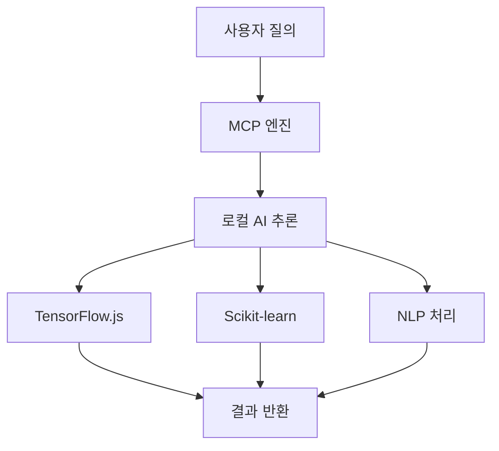
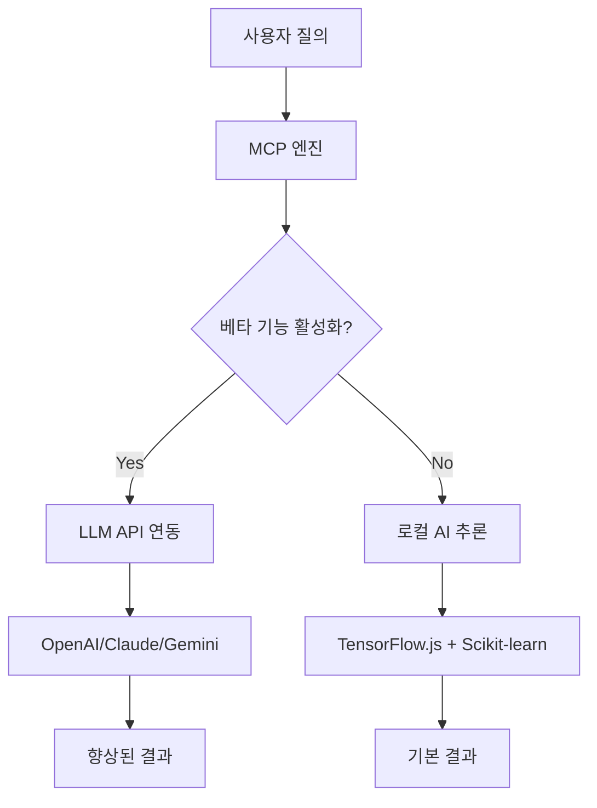

# 🧠 AI 엔진 베타 기능 가이드

## 📋 현재 동작 방식

OpenManager Vibe v5의 AI 엔진은 **LLM 없이도 완전히 동작**하는 시스템으로 설계되었습니다.

### ✅ 기본 기능 (LLM 없이 동작)

#### 1. **MCP 기반 로컬 AI 추론**
```typescript
// 로컬 AI 엔진이 기본적으로 처리
const result = await mcpClient.query({
  text: "서버 상태를 분석해주세요",
  type: "system_analysis"
});
```

#### 2. **TensorFlow.js 기반 예측**
- 장애 예측 신경망
- 이상 탐지 오토인코더  
- 시계열 LSTM 모델

#### 3. **Scikit-learn 연동**
- 통계적 분석
- 패턴 인식
- 이상값 탐지

#### 4. **자연어 처리 (NLP)**
- 의도 분류
- 키워드 추출
- 응답 생성

---

## 🚧 베타 기능 (LLM API 연동)

향후 개발 예정인 베타 기능들로, **선택적으로 성능을 향상**시킬 수 있습니다.

### 🔮 계획된 LLM 연동 기능

#### 1. **OpenAI GPT 연동**
```typescript
// 베타 기능 - 고급 분석
const enhancedResult = await aiEngine.analyzeWithLLM({
  provider: 'openai',
  model: 'gpt-3.5-turbo',
  query: "복잡한 시스템 이슈 분석",
  context: serverMetrics
});
```

#### 2. **Claude 연동**
```typescript
// 베타 기능 - 상세 보고서 생성
const detailedReport = await aiEngine.generateReport({
  provider: 'anthropic',
  model: 'claude-3-haiku',
  data: analysisResults
});
```

#### 3. **Google Gemini 연동**
```typescript
// 베타 기능 - 멀티모달 분석
const multimodalAnalysis = await aiEngine.analyze({
  provider: 'google',
  model: 'gemini-1.5-flash',
  inputs: [textData, chartImages]
});
```

---

## 🎯 베타 기능 활성화 방법

### 1. **환경변수 설정**
```bash
# .env.local 파일에 추가 (선택사항)
OPENAI_API_KEY="sk-your-api-key"
ANTHROPIC_API_KEY="your-claude-key"  
GOOGLE_API_KEY="your-gemini-key"

# 베타 기능 활성화
ENABLE_BETA_LLM_FEATURES=true
```

### 2. **AI 엔진 설정**
```typescript
const aiConfig = {
  enableBetaFeatures: true,
  llmProviders: {
    openai: { enabled: true, model: 'gpt-3.5-turbo' },
    anthropic: { enabled: true, model: 'claude-3-haiku' },
    google: { enabled: true, model: 'gemini-1.5-flash' }
  },
  fallbackToLocal: true // LLM 실패 시 로컬 엔진 사용
};
```

### 3. **사용자 인터페이스**
```tsx
// 베타 기능 토글
const BetaFeatureToggle = () => (
  <div className="beta-features">
    <h3>🚧 베타 기능</h3>
    <label>
      <input 
        type="checkbox" 
        checked={enableLLMAnalysis}
        onChange={toggleLLMAnalysis}
      />
      고급 LLM 분석 활성화
    </label>
  </div>
);
```

---

## 📊 성능 비교

| 기능 | 기본 엔진 | 베타 (LLM 연동) |
|------|-----------|-----------------|
| **응답 시간** | < 100ms | 1-3초 |
| **비용** | 무료 | API 비용 발생 |
| **정확도** | 85-90% | 95-98% |
| **복잡한 질의** | 제한적 | 뛰어남 |
| **오프라인 동작** | ✅ 가능 | ❌ 불가능 |

---

## 🛠️ 개발자를 위한 정보

### 현재 아키텍처


### 베타 아키텍처 (예정)


---

## 🔗 관련 문서

- [AI Engine Setup Guide](./AI_ENGINE_SETUP.md)
- [Environment Setup](./ENVIRONMENT_SETUP.md)
- [Development Guide](../DEVELOPMENT_GUIDE.md)
- [AI Agent Guide](./4_AI_AGENT_GUIDE.md)

---

## ⚠️ 주의사항

1. **베타 기능은 완전히 선택사항**입니다
2. **기본 엔진만으로도 모든 핵심 기능이 동작**합니다
3. **LLM API 키가 없어도 시스템이 정상 작동**합니다
4. **베타 기능 활성화 시 API 비용이 발생**할 수 있습니다
5. **인터넷 연결이 필요한 베타 기능**과 달리 기본 엔진은 오프라인에서도 동작합니다 