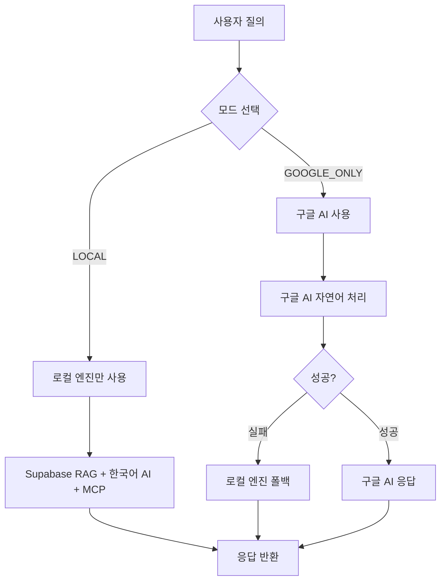

# 🤖 AI 엔진 모드 시스템

## 📋 개요

OpenManager Vibe v5는 **GCP Functions 기반 엔진을 메인**으로 하는 AI 시스템으로, 사용자가 필요에 따라 **2가지 모드 중 하나를 선택**하여 사용할 수 있습니다.

## 🎯 AI 엔진 모드

### 1. LOCAL 모드 (기본값) 🏠

- **GCP Functions + MCP + RAG 엔진 사용**
- 로컬 AI 엔진들 우선 사용
- 무료티어 최적화
- 프라이버시 보장
- 폴백 시스템 지원

**특징:**

- ✅ GCP Functions 기반 고성능 처리
- ✅ MCP 서버 폴백 지원
- ✅ 무료 사용 가능
- ✅ 개인정보 보호

### 2. GOOGLE_AI 모드 🚀

- **자연어 질의 기능에서 구글 AI 사용**
- 고급 자연어 처리 능력
- 성능 비교 및 확장성 테스트용
- 할당량 제한 적용

**특징:**

- ✅ 자연어 처리 특화
- ✅ 고급 추론 능력
- ✅ 확장성 테스트 지원
- ⚠️ 할당량 제한 (일일 10,000회, 분당 100회)

## 🔧 모드 선택 방법

### 1. UI를 통한 선택

```typescript
// AI 사이드바에서 엔진 선택 드롭다운 사용
const availableEngines = [
  {
    id: 'LOCAL',
    name: 'LOCAL 모드',
    description: '완전 구현된 로컬 AI 시스템 (기본 권장)',
    features: ['완전 구현', '프라이버시 보장', '오프라인 동작'],
  },
  {
    id: 'GOOGLE_ONLY',
    name: 'GOOGLE_ONLY 모드',
    description: '자연어 질의 전용 Google AI (성능 비교용)',
    features: ['자연어 처리 특화', '고급 추론', '확장성 테스트'],
  },
];
```

### 2. 프로그래밍 방식 선택

```typescript
// GoogleAIModeManager 사용
const modeManager = new GoogleAIModeManager({
  mode: 'LOCAL', // 또는 'GOOGLE_ONLY'
});

// 런타임에 모드 변경
modeManager.setMode('GOOGLE_ONLY');
```

## 🏗️ 시스템 구조

### 로컬 엔진 구성

```typescript
// 로컬 AI 엔진들
const localEngines = {
  supabaseRAG: 'Supabase RAG 엔진',
  koreanAI: '한국어 전용 AI 엔진',
  mcpContext: 'MCP 컨텍스트 엔진',
  transformers: 'Transformers 엔진',
  customNLP: '도메인 특화 NLP 엔진',
};
```

### 모드별 처리 흐름



## 🛡️ 베르셀 환경 최적화

### 파일 시스템 보호

```typescript
// 베르셀 환경에서 설정 저장 무력화
const isVercelEnvironment = () => {
  return !!(process.env.VERCEL || process.env.NODE_ENV === 'production');
};

// 메모리 기반 모드 관리
if (isVercelEnvironment()) {
  console.log('⚠️ 베르셀 환경에서 모드 설정 메모리 관리');
  // 파일 저장 없이 메모리에서만 관리
}
```

### 무료티어 호환성

- ✅ 파일 저장 기능 완전 제거
- ✅ 메모리 기반 설정 관리
- ✅ 구글 AI 사용량 제한 적용
- ✅ 로컬 엔진 우선 사용

## 📊 성능 비교

| 특성      | LOCAL 모드         | GOOGLE_ONLY 모드  |
| --------- | ------------------ | ----------------- |
| 응답 속도 | 빠름 (100-300ms)   | 보통 (500-2000ms) |
| 정확도    | 높음 (도메인 특화) | 매우 높음 (범용)  |
| 비용      | 무료               | 할당량 제한       |
| 오프라인  | 가능               | 불가능            |
| 개인정보  | 완전 보호          | 외부 전송         |

## 🎯 사용 권장사항

### LOCAL 모드 권장 상황

- 🏠 일반적인 시스템 관리 작업
- 📊 데이터 조회 및 분석
- 🔒 개인정보 보호가 중요한 경우
- 💰 비용 절약이 필요한 경우

### GOOGLE_ONLY 모드 권장 상황

- 🗣️ 복잡한 자연어 질의
- 🧠 고급 추론이 필요한 경우
- 🔬 성능 테스트 및 비교
- 🌐 최신 정보 활용이 필요한 경우

## 🔧 구성 옵션

### 기본 설정

```typescript
const defaultConfig = {
  mode: 'LOCAL', // 기본 모드
  fallbackTimeout: 5000, // 폴백 타임아웃
  confidenceThreshold: 0.7, // 신뢰도 임계값
  enableAutoSwitch: true, // 자동 전환 활성화
  maxRetries: 3, // 최대 재시도 횟수
  quotaLimits: {
    daily: 10000, // 일일 할당량
    perMinute: 100, // 분당 할당량
  },
};
```

### 환경 변수 설정

```bash
# 구글 AI 사용 여부
GOOGLE_AI_ENABLED=false     # LOCAL 모드 전용
GOOGLE_AI_ENABLED=true      # GOOGLE_ONLY 모드 허용

# 구글 AI API 키 (GOOGLE_ONLY 모드 사용 시)
GOOGLE_AI_API_KEY=your-api-key-here

# 기본 AI 엔진 모드
AI_ENGINE_MODE=LOCAL        # 또는 GOOGLE_ONLY
```

## 🚀 최적화 팁

### 1. 모드 전환 최적화

```typescript
// 모드 전환 시 쿨다운 적용 (30초)
const MODE_SWITCH_COOLDOWN = 30000;

// 자동 모드 전환 조건
const shouldSwitchMode = (currentMode, performance) => {
  if (performance.successRate < 0.8) {
    return currentMode === 'LOCAL' ? 'GOOGLE_ONLY' : 'LOCAL';
  }
  return currentMode;
};
```

### 2. 성능 모니터링

```typescript
const stats = {
  totalQueries: 0,
  modeUsage: { LOCAL: 0, GOOGLE_ONLY: 0 },
  averageResponseTime: 0,
  successRate: 100,
  fallbackRate: 0,
};
```

---

## 🎉 결론

OpenManager Vibe v5의 AI 엔진 시스템은 **로컬 엔진을 메인**으로 하면서도 필요에 따라 **구글 AI를 선택적으로 사용**할 수 있는 유연한 구조입니다.

- **기본값**: LOCAL 모드 (구글 AI 비활성화)
- **선택 옵션**: GOOGLE_ONLY 모드 (자연어 질의 전용)
- **베르셀 환경**: 파일 저장 없이 메모리 기반 관리
- **무료티어**: 완전 호환 및 최적화

이 시스템을 통해 사용자는 비용 효율적이면서도 필요에 따라 고급 AI 기능을 활용할 수 있습니다.
