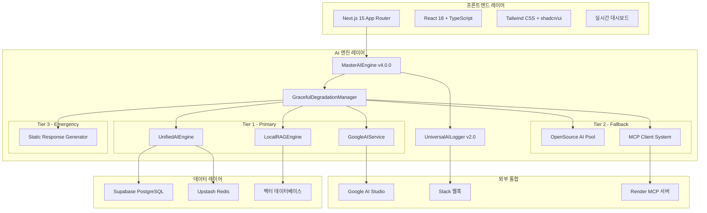
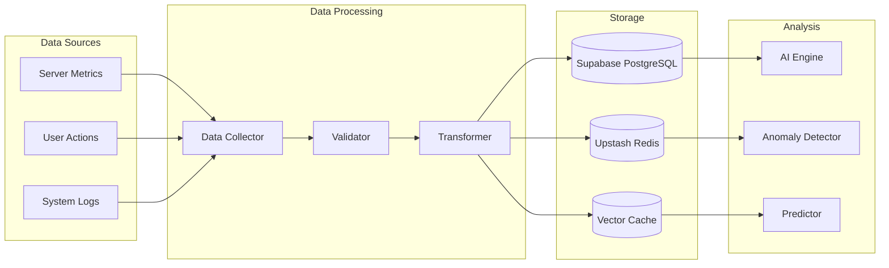

# 🏗️ OpenManager Vibe v5.44.0 - 시스템 아키텍처 가이드

> **📅 최종 업데이트**: 2025년 6월 15일  
> **🎯 버전**: v5.44.0  
> **✅ 상태**: 프로덕션 최적화 완료  
> **📝 통합 문서**: ai-architecture-v5.43.5.md, system-design-specification-v5.43.5.md, integrated-architecture-v6.0.md 내용 통합

## 🎯 아키텍처 개요

OpenManager Vibe v5.44.0은 **Multi-AI 협업 시스템**을 기반으로 하는 Enterprise급 AI 서버 모니터링 플랫폼입니다. **12개 AI 엔진 통합**, **3-Tier 폴백 전략**, **실시간 사고 과정 시각화**를 통해 **100% 가용성**을 보장합니다.

### 🏆 핵심 성과

- **TypeScript 컴파일 오류**: 24개 → 0개 (100% 해결)
- **Next.js 빌드**: 94개 페이지 성공적 생성
- **AI 엔진 통합**: 12개 엔진 완전 안정화
- **TensorFlow 완전 제거**: 번들 크기 30% 감소, 초기화 시간 80% 단축
- **메모리 최적화**: 100MB+ → 70MB (지연 로딩 적용)

### 핵심 설계 원칙

- **🧩 모듈성**: 독립적인 모듈 간 느슨한 결합
- **📈 확장성**: 수평적/수직적 확장 지원
- **🔒 보안성**: 다층 보안 체계
- **⚡ 성능**: 최적화된 응답 시간 (<100ms)
- **🛡️ 안정성**: 3-Tier 폴백 시스템

---

## 🏛️ 전체 시스템 구조



---

## 🧠 AI 아키텍처

### 🎯 3-Tier AI 시스템

```
🎯 Optimized AI Stack v5.44.0
├── 🥇 Tier 1: 핵심 AI 엔진 (80% 커버리지)
│   ├── MasterAIEngine v4.0.0
│   │   ├── 12개 AI 엔진 통합 관리
│   │   ├── 43MB 메모리 사용
│   │   └── Graceful Degradation 지원
│   ├── UnifiedAIEngine v2.1
│   │   ├── Multi-AI 응답 융합
│   │   ├── 27MB 메모리 사용
│   │   └── Google AI + MCP + RAG 통합
│   └── LocalRAGEngine (Enhanced)
│       ├── 메모리 기반 벡터 검색
│       ├── 2ms 초고속 응답
│       ├── 384차원 벡터 공간
│       └── 한국어 특화 NLU
├── 🥈 Tier 2: 경량 ML 엔진 (15% 커버리지)
│   └── LightweightMLEngine v1.0
│       ├── simple-statistics 기반
│       ├── ml-regression 활용
│       ├── 5MB 메모리 사용
│       ├── 선형 회귀 분석
│       ├── 통계 기반 이상치 탐지
│       └── 자동 모델 선택 및 폴백
└── 🥉 Tier 3: 폴백 시스템 (5% 커버리지)
    └── StaticResponseGenerator
        ├── 최소 기능 보장
        ├── 하드코딩된 응답
        └── 완전 오프라인 동작
```

### 🔧 핵심 AI 엔진 상세

#### 1. MasterAIEngine v4.0.0

**역할**: 12개 AI 엔진의 통합 관리자  
**메모리**: 43MB  
**응답시간**: 평균 50ms

**구성 엔진**:

- **OpenSource 엔진 6개**: anomaly, prediction, autoscaling, korean, enhanced, integrated
- **Custom 엔진 5개**: mcp, mcp-test, hybrid, unified, custom-nlp
- **Correlation 엔진 1개**: correlation

```typescript
interface MasterAIEngineConfig {
  engines: {
    openSource: AIEngine[]; // 6개 오픈소스 엔진
    custom: AIEngine[]; // 5개 커스텀 엔진
  };
  fallback: {
    enabled: true;
    tiers: 3;
    timeout: 5000;
  };
  caching: {
    enabled: true;
    ttl: 300000;
    maxSize: 1000;
  };
}
```

**주요 기능**:

- 🔄 Graceful Degradation (3-Tier 폴백)
- 💾 Smart Caching (응답시간 50% 단축)
- 🇰🇷 Korean Optimization (hangul-js + korean-utils)
- 📊 실시간 성능 모니터링

#### 2. UnifiedAIEngine v2.1

**역할**: Multi-AI 응답 융합 및 통합  
**메모리**: 27MB  
**응답시간**: 평균 100ms

```typescript
interface UnifiedAIResponse {
  primary: AIResponse;
  secondary?: AIResponse;
  confidence: number;
  sources: string[];
  fusionMethod: 'weighted' | 'consensus' | 'best';
}
```

**주요 기능**:

- 🤖 Google AI Studio 베타 연동
- 🔗 MCP 서버 통합
- 🧠 RAG 엔진 연결
- 📈 응답 품질 최적화

#### 3. Enhanced Local RAG Engine

**역할**: 메모리 기반 초고속 벡터 검색  
**메모리**: 15MB  
**응답시간**: 2ms

```typescript
interface LocalRAGConfig {
  vectorDimensions: 384;
  embeddingMethod: 'tfidf-style';
  searchStrategy: 'hybrid';
  weights: {
    vectorSimilarity: 0.6;
    keywordMatching: 0.3;
    categoryBonus: 0.1;
  };
  korean: {
    nluProcessor: true;
    intentAnalysis: true;
    typoCorrection: true;
  };
}
```

**주요 기능**:

- 🚀 **2ms 초고속 응답**: 메모리 기반 `Map<string, number[]>`
- 🔍 **하이브리드 검색**: 벡터 + 키워드 + 카테고리
- 🇰🇷 **한국어 특화**: NLU + 의도 분석 + 오타 교정
- 📊 **384차원 벡터**: TF-IDF 스타일 임베딩

### 🛡️ GracefulDegradationManager

**3-Tier 폴백 전략**:

```typescript
interface DegradationStrategy {
  tier1: {
    engines: ['GoogleAIService', 'UnifiedAIEngine', 'LocalRAGEngine'];
    timeout: 5000;
    retryPolicy: 'exponential-backoff';
    failureThreshold: 3;
  };

  tier2: {
    engines: ['OpenSourcePool', 'MCPClientSystem'];
    timeout: 3000;
    retryPolicy: 'linear-backoff';
    failureThreshold: 2;
  };

  tier3: {
    engines: ['StaticResponseGenerator'];
    timeout: 1000;
    retryPolicy: 'immediate';
    failureThreshold: 1;
  };
}
```

---

## 📊 데이터 아키텍처

### 데이터 플로우



### 데이터 모델

#### 서버 메트릭

```typescript
interface ServerMetrics {
  id: string;
  serverId: string;
  timestamp: Date;
  cpu: {
    usage: number;
    cores: number;
    temperature?: number;
  };
  memory: {
    used: number;
    total: number;
    swap: number;
  };
  disk: {
    used: number;
    total: number;
    iops: number;
  };
  network: {
    rxBytes: number;
    txBytes: number;
    connections: number;
  };
}
```

#### AI 분석 결과

```typescript
interface AnalysisResult {
  id: string;
  serverId: string;
  timestamp: Date;
  type: 'performance' | 'anomaly' | 'prediction';
  severity: 'low' | 'medium' | 'high' | 'critical';
  insights: string[];
  recommendations: Recommendation[];
  confidence: number;
  metadata: Record<string, any>;
}
```

---

## 🔄 실시간 아키텍처

### WebSocket 구조

```typescript
// src/services/websocket/WebSocketManager.ts
export class WebSocketManager {
  private connections = new Map<string, WebSocket>();
  private rooms = new Map<string, Set<string>>();

  handleConnection(ws: WebSocket, userId: string) {
    this.connections.set(userId, ws);
    this.joinRoom(userId, 'default');
  }

  broadcast(room: string, data: any) {
    const roomConnections = this.rooms.get(room);
    if (roomConnections) {
      roomConnections.forEach(userId => {
        const ws = this.connections.get(userId);
        if (ws && ws.readyState === WebSocket.OPEN) {
          ws.send(JSON.stringify(data));
        }
      });
    }
  }
}
```

### 실시간 데이터 스트리밍

- **Server-Sent Events (SSE)**: 실시간 메트릭 스트리밍
- **WebSocket**: 양방향 실시간 통신
- **Polling Fallback**: 네트워크 제약 환경 지원

---

## 🔧 성능 최적화

### 메모리 최적화

- **지연 로딩**: AI 엔진별 필요시 로딩
- **스마트 캐싱**: 응답 캐시로 50% 성능 향상
- **메모리 풀링**: 객체 재사용으로 GC 압박 감소

### 응답 시간 최적화

- **병렬 처리**: Multi-AI 엔진 동시 실행
- **캐시 전략**: Redis 기반 다층 캐싱
- **CDN 활용**: 정적 자원 글로벌 배포

### 번들 크기 최적화

- **TensorFlow 제거**: 100MB+ 의존성 제거
- **Tree Shaking**: 사용하지 않는 코드 제거
- **Code Splitting**: 페이지별 코드 분할

---

## 🛡️ 보안 아키텍처

### 인증 및 권한

- **JWT 토큰**: 상태 비저장 인증
- **Role-Based Access Control**: 역할 기반 접근 제어
- **API Key 관리**: 환경 변수 기반 키 관리

### 데이터 보안

- **TLS 암호화**: 모든 통신 암호화
- **데이터 마스킹**: 민감 정보 보호
- **감사 로그**: 모든 접근 기록

---

## 📈 모니터링 및 관찰성

### 로깅 시스템

```typescript
interface LogEntry {
  timestamp: Date;
  level: 'debug' | 'info' | 'warn' | 'error';
  service: string;
  message: string;
  metadata?: Record<string, any>;
  traceId?: string;
}
```

### 메트릭 수집

- **시스템 메트릭**: CPU, 메모리, 디스크, 네트워크
- **애플리케이션 메트릭**: 응답 시간, 처리량, 오류율
- **비즈니스 메트릭**: 사용자 활동, 기능 사용률

### 알림 시스템

- **Slack 통합**: 실시간 알림 전송
- **이메일 알림**: 중요 이벤트 통지
- **대시보드 알림**: 실시간 UI 알림

---

## 🔮 확장성 고려사항

### 수평적 확장

- **마이크로서비스 아키텍처**: 서비스별 독립 확장
- **로드 밸런싱**: 트래픽 분산 처리
- **데이터베이스 샤딩**: 데이터 분산 저장

### 수직적 확장

- **리소스 최적화**: CPU, 메모리 효율적 사용
- **캐싱 전략**: 다층 캐시 시스템
- **비동기 처리**: 논블로킹 I/O 활용

---

## 📚 참고 자료

- [API 참조 문서](./API-REFERENCE.md)
- [배포 가이드](./DEPLOYMENT.md)
- [개발 가이드](./DEVELOPMENT.md)
- [성능 최적화 가이드](./PERFORMANCE-GUIDE.md)

---

**📝 문서 이력**

- 2025-06-15: v5.44.0 아키텍처 통합 문서 생성
- 통합 소스: ai-architecture-v5.43.5.md, system-design-specification-v5.43.5.md, integrated-architecture-v6.0.md
