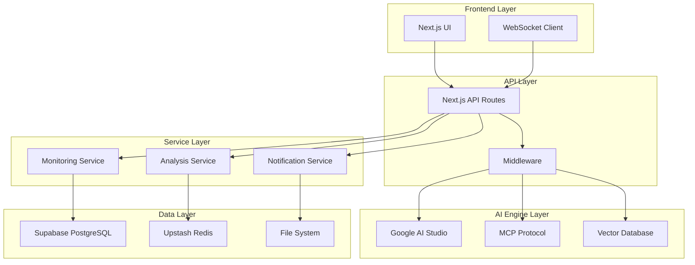
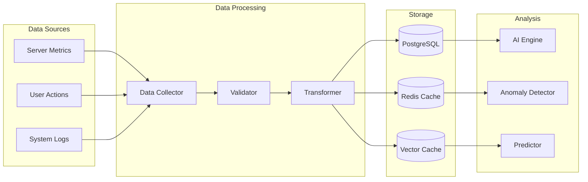

# 🏗️ Architecture Guide

OpenManager Vibe v5의 **시스템 아키텍처 완전 가이드**입니다.

## 🎯 아키텍처 개요

OpenManager Vibe v5는 **모듈형 마이크로 아키텍처**를 기반으로 구축된 AI-Driven 서버 모니터링 플랫폼입니다.

### 핵심 설계 원칙

- **🧩 모듈성**: 독립적인 모듈 간 느슨한 결합
- **📈 확장성**: 수평적/수직적 확장 지원
- **🔒 보안성**: 다층 보안 체계
- **⚡ 성능**: 최적화된 응답 시간
- **🛡️ 안정성**: 장애 복구 및 격리

## 🏛️ 전체 시스템 구조



## 🧠 AI 아키텍처

### AI 엔진 구조

```typescript
// src/services/ai/engines/UnifiedAIEngine.ts
export class UnifiedAIEngine {
  private googleAI: GoogleAIService;
  private mcpClient: MCPClient;
  private vectorDB: VectorDatabase;
  private rag: RAGEngine;

  constructor() {
    this.googleAI = new GoogleAIService();
    this.mcpClient = new MCPClient();
    this.vectorDB = new VectorDatabase();
    this.rag = new RAGEngine(this.vectorDB);
  }

  async analyze(query: AnalysisQuery): Promise<AnalysisResult> {
    // AI 분석 로직
  }
}
```

### AI 처리 파이프라인

1. **입력 처리**: 사용자 쿼리 받기
2. **컨텍스트 수집**: MCP를 통한 관련 정보 수집
3. **벡터 검색**: 유사한 패턴 검색
4. **AI 추론**: Google AI로 분석 수행
5. **결과 후처리**: 응답 포맷팅 및 검증

## 📊 데이터 아키텍처

### 데이터 플로우



### 데이터 모델

#### 서버 메트릭

```typescript
interface ServerMetrics {
  id: string;
  serverId: string;
  timestamp: Date;
  cpu: {
    usage: number;
    cores: number;
    temperature?: number;
  };
  memory: {
    used: number;
    total: number;
    swap: number;
  };
  disk: {
    used: number;
    total: number;
    iops: number;
  };
  network: {
    rxBytes: number;
    txBytes: number;
    connections: number;
  };
}
```

#### AI 분석 결과

```typescript
interface AnalysisResult {
  id: string;
  serverId: string;
  timestamp: Date;
  type: 'performance' | 'anomaly' | 'prediction';
  severity: 'low' | 'medium' | 'high' | 'critical';
  insights: string[];
  recommendations: Recommendation[];
  confidence: number;
  metadata: Record<string, any>;
}
```

## 🔄 실시간 아키텍처

### WebSocket 구조

```typescript
// src/services/websocket/WebSocketManager.ts
export class WebSocketManager {
  private connections = new Map<string, WebSocket>();
  private rooms = new Map<string, Set<string>>();

  handleConnection(ws: WebSocket, userId: string) {
    this.connections.set(userId, ws);
    this.joinRoom(userId, 'default');
  }

  broadcast(room: string, data: any) {
    const userIds = this.rooms.get(room) || new Set();
    userIds.forEach(userId => {
      const ws = this.connections.get(userId);
      if (ws?.readyState === WebSocket.OPEN) {
        ws.send(JSON.stringify(data));
      }
    });
  }
}
```

### 실시간 데이터 흐름

1. **데이터 수집**: 서버에서 메트릭 수집
2. **즉시 처리**: 임계값 체크 및 이상 탐지
3. **WebSocket 브로드캐스트**: 연결된 클라이언트에 전송
4. **UI 업데이트**: React 상태 업데이트 및 리렌더링

## 🏗️ 마이크로서비스 아키텍처

### 서비스 분할

```
services/
├── monitoring/          # 서버 모니터링
│   ├── collectors/     # 데이터 수집
│   ├── processors/     # 데이터 처리
│   └── alerting/       # 알림 시스템
├── ai/                 # AI 분석
│   ├── engines/       # AI 엔진
│   ├── analyzers/     # 분석기
│   └── predictors/    # 예측기
├── notifications/      # 알림 관리
│   ├── channels/      # 알림 채널
│   ├── templates/     # 템플릿
│   └── scheduling/    # 스케줄링
└── data-collection/    # 데이터 수집
    ├── generators/    # 데이터 생성
    ├── managers/      # 관리자
    └── factories/     # 팩토리
```

### 서비스 간 통신

```typescript
// 서비스 레지스트리
export class ServiceRegistry {
  private services = new Map<string, ServiceInterface>();

  register(name: string, service: ServiceInterface) {
    this.services.set(name, service);
  }

  get<T extends ServiceInterface>(name: string): T {
    return this.services.get(name) as T;
  }
}

// 서비스 인터페이스
export interface ServiceInterface {
  name: string;
  version: string;
  status: 'active' | 'inactive' | 'error';
  health(): Promise<HealthStatus>;
  start(): Promise<void>;
  stop(): Promise<void>;
}
```

## 🔒 보안 아키텍처

### 보안 계층

1. **네트워크 보안**: HTTPS, TLS 1.3
2. **인증/인가**: JWT, API 키 관리
3. **데이터 암호화**: 저장/전송 시 암호화
4. **입력 검증**: SQL 인젝션, XSS 방지
5. **감사 로깅**: 모든 액세스 로깅

### 보안 미들웨어

```typescript
// src/middleware/security.ts
export function securityMiddleware(
  req: Request,
  res: Response,
  next: NextFunction
) {
  // CORS 설정
  res.setHeader('Access-Control-Allow-Origin', allowedOrigins);

  // 보안 헤더
  res.setHeader('X-Content-Type-Options', 'nosniff');
  res.setHeader('X-Frame-Options', 'DENY');
  res.setHeader('X-XSS-Protection', '1; mode=block');

  // API 키 검증
  const apiKey = req.headers['x-api-key'];
  if (!validateApiKey(apiKey)) {
    return res.status(401).json({ error: 'Invalid API key' });
  }

  next();
}
```

## ⚡ 성능 아키텍처

### 캐싱 전략

```typescript
// 다층 캐싱 구조
export class CacheManager {
  private l1Cache = new Map(); // 메모리 캐시
  private l2Cache: RedisClient; // Redis 캐시

  async get(key: string): Promise<any> {
    // L1 캐시 확인
    if (this.l1Cache.has(key)) {
      return this.l1Cache.get(key);
    }

    // L2 캐시 확인
    const l2Value = await this.l2Cache.get(key);
    if (l2Value) {
      this.l1Cache.set(key, l2Value);
      return l2Value;
    }

    return null;
  }
}
```

### 로드 밸런싱

```typescript
// 로드 밸런서
export class LoadBalancer {
  private servers: Server[] = [];
  private currentIndex = 0;

  getNextServer(): Server {
    const server = this.servers[this.currentIndex];
    this.currentIndex = (this.currentIndex + 1) % this.servers.length;
    return server;
  }

  async healthCheck() {
    for (const server of this.servers) {
      try {
        await server.ping();
        server.healthy = true;
      } catch (error) {
        server.healthy = false;
      }
    }
  }
}
```

## 🔧 배포 아키텍처

### Vercel 배포 구조

```yaml
# vercel.json
{
  'functions': { 'src/app/api/*/route.ts': { 'maxDuration': 30 } },
  'regions': ['icn1', 'pdx1'],
  'env': { 'NODE_ENV': 'production', 'GOOGLE_AI_API_KEY': '@google_ai_key' },
}
```

### 환경별 구성

```typescript
// 환경 설정
export const config = {
  development: {
    database: {
      url: process.env.DATABASE_URL_DEV,
      maxConnections: 10,
    },
    ai: {
      model: 'gemini-1.5-flash',
      temperature: 0.9,
    },
  },
  production: {
    database: {
      url: process.env.DATABASE_URL_PROD,
      maxConnections: 100,
    },
    ai: {
      model: 'gemini-1.5-flash',
      temperature: 0.7,
    },
  },
};
```

## 📈 모니터링 아키텍처

### 메트릭 수집

```typescript
// 메트릭 수집기
export class MetricsCollector {
  private metrics = new Map<string, Metric>();

  record(name: string, value: number, tags?: Record<string, string>) {
    const metric: Metric = {
      name,
      value,
      timestamp: Date.now(),
      tags: tags || {},
    };

    this.metrics.set(`${name}_${Date.now()}`, metric);
    this.sendToPrometheus(metric);
  }

  private async sendToPrometheus(metric: Metric) {
    // Prometheus로 메트릭 전송
  }
}
```

### 로깅 구조

```typescript
// 구조화된 로깅
export class Logger {
  private logLevel: LogLevel;

  info(message: string, context?: any) {
    this.log('INFO', message, context);
  }

  error(message: string, error?: Error, context?: any) {
    this.log('ERROR', message, { error: error?.stack, ...context });
  }

  private log(level: LogLevel, message: string, context?: any) {
    const logEntry = {
      timestamp: new Date().toISOString(),
      level,
      message,
      context,
      service: 'openmanager-vibe',
      version: process.env.APP_VERSION,
    };

    console.log(JSON.stringify(logEntry));
  }
}
```

## 🔄 확장성 설계

### 수평적 확장

- **API 서버**: 다중 인스턴스 실행
- **데이터베이스**: 읽기 복제본 활용
- **캐시**: Redis 클러스터
- **파일 저장**: CDN 활용

### 수직적 확장

- **메모리 최적화**: 효율적인 데이터 구조
- **CPU 최적화**: 비동기 처리
- **I/O 최적화**: 연결 풀링
- **네트워크 최적화**: 압축 및 캐싱

## 🧪 테스트 아키텍처

### 테스트 피라미드

```
         /\
        /  \
       /E2E \      <- 적은 수의 E2E 테스트
      /______\
     /        \
    /Integration\ <- 적당한 수의 통합 테스트
   /__________\
  /            \
 /   Unit Tests  \ <- 많은 수의 단위 테스트
/________________\
```

### 테스트 환경

```typescript
// 테스트 설정
export class TestEnvironment {
  async setup() {
    // 테스트 DB 초기화
    await this.setupTestDatabase();

    // Mock 서비스 설정
    await this.setupMockServices();

    // 테스트 데이터 생성
    await this.seedTestData();
  }

  async teardown() {
    // 정리 작업
    await this.cleanupTestData();
    await this.closeConnections();
  }
}
```

## 📚 아키텍처 문서

### 관련 문서

- [🚀 Quick Start](QUICK_START.md) - 빠른 시작
- [🛠️ Development](DEVELOPMENT.md) - 개발 가이드
- [🤖 AI Setup](AI_SETUP.md) - AI 설정
- [☁️ Deployment](DEPLOYMENT.md) - 배포 가이드

### 아키텍처 결정 기록 (ADR)

| 날짜    | 결정             | 이유                     | 상태 |
| ------- | ---------------- | ------------------------ | ---- |
| 2025-01 | Next.js 15 채택  | App Router, Edge Runtime | ✅   |
| 2025-01 | Google AI Studio | 비용 효율성, 성능        | ✅   |
| 2025-01 | Supabase 선택    | PostgreSQL + 실시간      | ✅   |
| 2025-01 | MCP 프로토콜     | AI 컨텍스트 관리         | ✅   |

## 🔮 미래 아키텍처

### 계획된 개선사항

1. **마이크로서비스 분리**: 서비스별 독립 배포
2. **이벤트 드리븐 아키텍처**: 비동기 메시징
3. **CQRS 패턴**: 읽기/쓰기 분리
4. **서버리스 확장**: Edge Functions 활용
5. **AI 모델 파이프라인**: MLOps 구축

### 기술 로드맵

- **Q2 2025**: Kubernetes 배포
- **Q3 2025**: GraphQL API 도입
- **Q4 2025**: AI 모델 자체 훈련
- **Q1 2026**: 멀티 클라우드 지원
