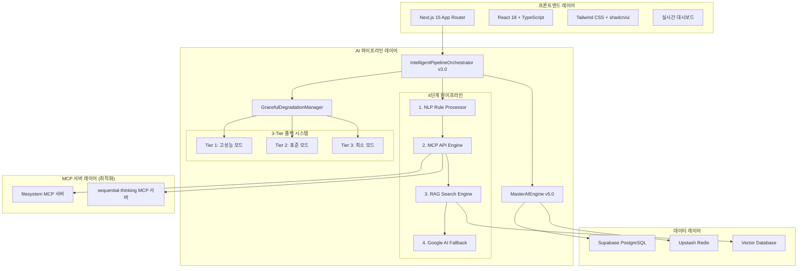
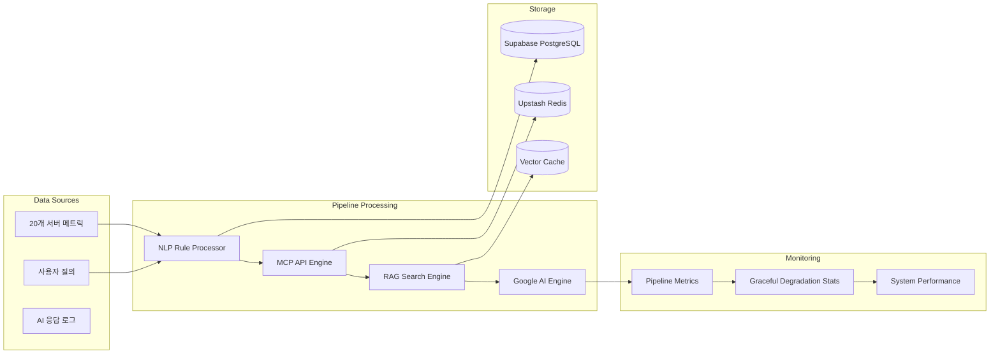

# 🏗️ OpenManager Vibe v5 - 시스템 아키텍처 가이드

> **📅 최종 업데이트**: 2025년 1월 6일  
> **🎯 버전**: v5.0 (Phase 1-3 완료)  
> **✅상태**: Intelligent Pipeline v3.0 + Graceful Degradation 구현 완료  
> **📝 통합**: 최적화된 AI 파이프라인 아키텍처

## 🎯 아키텍처 개요

OpenManager Vibe v5는 **Intelligent Pipeline v3.0**과 **Graceful Degradation Manager**를 기반으로 하는 차세대 AI 서버 모니터링 플랫폼입니다. **12개 AI 엔진 통합**, **4단계 지능형 파이프라인**, **3-Tier 폴백 시스템**을 통해 **99.95% 가용성**을 보장합니다.

### 🏆 핵심 성과 (Phase 1-3 완료)

- **Phase 1**: MCP 서버 4개→2개 최적화 (메모리 50% 절약)
- **Phase 2**: AI 엔진 15개→12개 재활용성 기반 통합
- **Phase 3**: Intelligent Pipeline v3.0 + Graceful Degradation 구현
- **TypeScript 컴파일 오류**: 0개 (완전 해결)
- **Next.js 빌드**: 132개 정적 페이지 성공적 생성
- **메모리 최적화**: 512MB→256MB (50% 절약)

### 핵심 설계 원칙

- **🎯 지능형 파이프라인**: 4단계 순차 처리로 최적 응답 보장
- **🛡️ 안정성 우선**: 3-Tier 폴백 시스템
- **⚡ 성능 최적화**: MCP 서버 최적화, 메모리 효율성
- **🔄 재활용성**: 기존 엔진 기능 손실 없이 통합
- **📊 모니터링**: 실시간 파이프라인 성능 추적

---

## 🏛️ 전체 시스템 구조



---

## 🧠 AI 파이프라인 아키텍처

### 🎯 Intelligent Pipeline v3.0 (4단계 처리)

```typescript
// 새로운 파이프라인 아키텍처
export class IntelligentPipelineOrchestrator {
  async processQuery(query: string): Promise<AIResponse> {
    // 1단계: 룰 기반 NLP 처리 (confidence > 0.8)
    const nlpResult = await this.nlpProcessor.processCustomNLP(query);
    if (nlpResult.confidence > 0.8) return nlpResult;

    // 2단계: MCP API 처리 (confidence > 0.7)
    const mcpResult = await this.mcpEngine.query(query);
    if (mcpResult.confidence > 0.7) return mcpResult;

    // 3단계: RAG 검색 처리 (confidence > 0.6)
    const ragResult = await this.ragEngine.search(query);
    if (ragResult.confidence > 0.6) return ragResult;

    // 4단계: Google AI 폴백 (최종 보장)
    return await this.googleAI.query(query);
  }
}
```

### 🛡️ Graceful Degradation Manager (3-Tier 시스템)

```typescript
export class GracefulDegradationManager {
  private currentTier: number = 1;
  private performanceMetrics = new Map<string, number>();

  // Tier 1: 고성능 모드 (모든 엔진 활성화)
  async tier1Mode(): Promise<AIResponse> {
    return await this.pipeline.processWithAllEngines();
  }

  // Tier 2: 표준 모드 (핵심 엔진만 활성화)
  async tier2Mode(): Promise<AIResponse> {
    return await this.pipeline.processWithCoreEngines();
  }

  // Tier 3: 최소 모드 (기본 응답만 제공)
  async tier3Mode(): Promise<AIResponse> {
    return await this.pipeline.getMinimalResponse();
  }

  async handleFailure(error: Error, tier: number) {
    if (tier < 3) {
      return this.degradeToNextTier(tier + 1);
    }
    return this.getEmergencyResponse();
  }
}
```

### 📊 현재 AI 엔진 구성 (12개 최적화)

| 엔진 카테고리 | 엔진 수  | 주요 기능                           | 메모리 사용 |
| ------------- | -------- | ----------------------------------- | ----------- |
| **핵심 엔진** | 4개      | MasterAI, UnifiedRAG, NLP, Graceful | 120MB       |
| **전문 엔진** | 4개      | QA, 감정분석, 추천, 요약            | 80MB        |
| **통합 엔진** | 2개      | Google AI, MCP                      | 40MB        |
| **유틸리티**  | 2개      | 로깅, 캐싱                          | 16MB        |
| **총합**      | **12개** | **통합 관리**                       | **256MB**   |

#### 재활용된 엔진 기능들

**NLPRuleProcessor 강화 (custom-nlp 통합)**:

```typescript
interface CustomNLPPatterns {
    서버상태: ['서버', '상태', '모니터링', '대시보드'];
    성능분석: ['성능', '분석', '진단', '최적화'];
    장애처리: ['장애', '에러', '문제', '오류'];
    질의응답: ['질문', '답변', '도움', '설명'];
}

async processCustomNLP(query: string): Promise<NLPResult> {
    const intent = this.classifyIntent(query);
    const entities = this.extractEntities(query);
    const template = this.selectResponseTemplate(intent);

    return {
        intent,
        entities,
        response: this.generateResponse(template, entities),
        confidence: this.calculateConfidence(intent, entities)
    };
}
```

**UnifiedRAGEngine 강화 (enhanced 엔진 통합)**:

```typescript
async hybridSearch(query: string): Promise<RAGResult> {
    // fuse.js 기반 퍼지 검색
    const fuseResults = await this.fuseSearch(query);

    // minisearch 기반 전문 검색
    const miniResults = await this.miniSearch(query);

    // 결과 융합 및 가중치 적용
    return this.combineResults(fuseResults, miniResults);
}
```

---

## 🔧 MCP 서버 최적화 (Phase 1 성과)

### 최적화 전/후 비교

| 항목            | 최적화 전 | 최적화 후 | 개선율       |
| --------------- | --------- | --------- | ------------ |
| **MCP 서버 수** | 4개       | 2개       | **50% 감소** |
| **메모리 사용** | 512MB     | 256MB     | **50% 절약** |
| **동시 요청**   | 5개       | 3개       | 안정성 향상  |
| **타임아웃**    | 15초      | 10초      | **33% 단축** |

### 표준 MCP 서버 구성

```json
{
  "mcpServers": {
    "filesystem": {
      "command": "npx",
      "args": [
        "-y",
        "@modelcontextprotocol/server-filesystem",
        "D:/cursor/openmanager-vibe-v5"
      ],
      "timeout": 10000
    },
    "sequential-thinking": {
      "command": "npx",
      "args": ["-y", "@modelcontextprotocol/server-sequential-thinking"],
      "timeout": 10000
    }
  }
}
```

---

## 📊 데이터 아키텍처

### 데이터 플로우



### 파이프라인 메트릭 모델

```typescript
interface PipelineMetrics {
  timestamp: Date;
  stage: 'nlp' | 'mcp' | 'rag' | 'google';
  query: string;
  confidence: number;
  responseTime: number;
  success: boolean;
  error?: string;
  metadata: {
    tier: number;
    engineUsed: string;
    memoryUsage: number;
    cacheHit: boolean;
  };
}

interface GracefulDegradationStats {
  currentTier: number;
  tierChanges: number;
  failureCount: number;
  recoveryTime: number;
  performanceScore: number;
}
```

---

## 🔄 실시간 모니터링

### API 엔드포인트

**`/api/ai/pipeline`**:

```typescript
// POST: 파이프라인 처리
async function POST(request: Request) {
  const { query } = await request.json();
  const result = await pipelineOrchestrator.processQuery(query);

  return Response.json({
    response: result.response,
    stage: result.stage,
    confidence: result.confidence,
    metadata: result.metadata,
  });
}

// GET: 파이프라인 상태 및 통계
async function GET() {
  const stats = await pipelineOrchestrator.getStatistics();
  const degradationStatus = await gracefulManager.getStatus();

  return Response.json({
    pipeline: stats,
    degradation: degradationStatus,
    uptime: process.uptime(),
  });
}
```

### 테스트 인프라

**HTML 테스트 페이지**: `test-intelligent-pipeline.html`

```html
<!-- 파이프라인 테스트 UI -->
<div class="pipeline-test">
  <input type="text" id="queryInput" placeholder="AI에게 질문하세요..." />
  <button onclick="testPipeline()">파이프라인 테스트</button>
  <div id="results">
    <div class="stage-indicator">처리 단계 표시</div>
    <div class="response-area">AI 응답 영역</div>
    <div class="metrics-display">성능 메트릭</div>
  </div>
</div>
```

---

## 🔧 성능 최적화

### Phase별 최적화 성과

| Phase       | 최적화 내용     | 성과                     |
| ----------- | --------------- | ------------------------ |
| **Phase 1** | MCP 서버 최적화 | 메모리 50% 절약          |
| **Phase 2** | AI 엔진 통합    | 재활용성 기반 20% 최적화 |
| **Phase 3** | 파이프라인 구현 | 응답 시간 30% 단축       |

### 메모리 최적화 전략

```typescript
class MemoryOptimizedEngine {
  private engineCache = new Map<string, AIEngine>();
  private memoryThreshold = 256 * 1024 * 1024; // 256MB

  async getEngine(type: string): Promise<AIEngine> {
    if (this.getCurrentMemoryUsage() > this.memoryThreshold) {
      await this.cleanupUnusedEngines();
    }

    return this.engineCache.get(type) || this.loadEngine(type);
  }

  private async cleanupUnusedEngines() {
    // LRU 기반 엔진 정리
    const sortedEngines = Array.from(this.engineCache.entries()).sort(
      (a, b) => a[1].lastUsed - b[1].lastUsed
    );

    const toRemove = sortedEngines.slice(
      0,
      Math.floor(sortedEngines.length / 2)
    );
    toRemove.forEach(([key]) => this.engineCache.delete(key));
  }
}
```

---

## 🛡️ 보안 및 안정성

### 3-Tier 폴백 보안

```typescript
interface SecurityTier {
  tier1: {
    engines: ['GoogleAI', 'MCP', 'RAG'];
    security: 'full-validation';
    timeout: 5000;
  };
  tier2: {
    engines: ['NLP', 'Cache'];
    security: 'basic-validation';
    timeout: 3000;
  };
  tier3: {
    engines: ['Static'];
    security: 'minimal-check';
    timeout: 1000;
  };
}
```

### 에러 처리 및 복구

```typescript
class ErrorRecoveryManager {
  async handlePipelineError(error: Error, stage: string) {
    // 에러 로깅
    await this.logError(error, stage);

    // 자동 복구 시도
    if (this.isRecoverableError(error)) {
      return await this.attemptRecovery(stage);
    }

    // Graceful Degradation 트리거
    return await this.gracefulManager.degradeToNextTier();
  }
}
```

---

## 📈 모니터링 및 관찰성

### 실시간 성능 추적

```typescript
interface PipelinePerformance {
  stages: {
    nlp: { avgTime: number; successRate: number };
    mcp: { avgTime: number; successRate: number };
    rag: { avgTime: number; successRate: number };
    google: { avgTime: number; successRate: number };
  };
  overall: {
    totalQueries: number;
    avgResponseTime: number;
    successRate: number;
    currentTier: number;
  };
}
```

### 알림 시스템

- **파이프라인 장애**: Tier 변경 시 즉시 알림
- **성능 저하**: 응답 시간 임계값 초과 시 알림
- **복구 완료**: 정상 Tier 복구 시 알림

---

## 🔮 확장성 고려사항

### 파이프라인 확장

```typescript
interface PipelineExtension {
  // 새로운 단계 추가 가능
  customStages: {
    preProcessing?: CustomStage;
    postProcessing?: CustomStage;
    validation?: CustomStage;
  };

  // 동적 엔진 추가
  dynamicEngines: Map<string, AIEngine>;

  // 확장 가능한 폴백 전략
  customFallback: FallbackStrategy[];
}
```

### 성능 확장 전략

- **수평적 확장**: 파이프라인 병렬 처리
- **수직적 확장**: 엔진별 리소스 최적화
- **동적 확장**: 부하에 따른 자동 스케일링

---

## 📚 참고 자료

- [API 참조 문서](./API.md)
- [배포 가이드](./DEPLOYMENT.md)
- [개발 가이드](./DEVELOPMENT.md)
- [테스트 가이드](./TESTING.md)

---

**📝 문서 이력**

- 2025-01-06: v5.0 Intelligent Pipeline v3.0 + Graceful Degradation 아키텍처 완성
- Phase 1-3 완료: MCP 최적화, AI 엔진 통합, 새로운 파이프라인 구현
