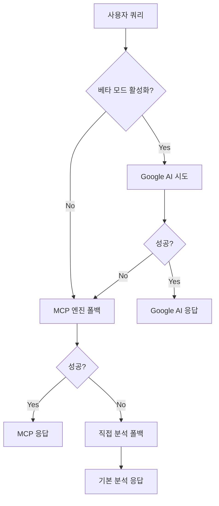

# 🤖 Google AI Studio (Gemini) 베타 모드 통합 가이드

## 📋 **개요**

OpenManager Vibe v5에 Google AI Studio (Gemini) API를 베타 모드로 통합하여 고급 AI 분석 기능을 제공합니다.

### **✨ 주요 특징**

- 🎯 **베타 모드 온/오프**: 기존 시스템과 독립적으로 동작
- 🧠 **고급 분석**: Gemini 1.5 Flash/Pro 모델 지원
- 🔄 **폴백 시스템**: Google AI 실패 시 기존 엔진으로 자동 전환
- 💰 **무료 할당량**: 무료 API 할당량 최적화
- 📊 **실시간 모니터링**: 사용량 및 성능 추적

---

## 🚀 **설정 가이드**

### **1단계: Google AI Studio API 키 생성**

1. **Google AI Studio 접속**

   ```
   https://aistudio.google.com
   ```

2. **API 키 생성**

   - "Get API key" 클릭
   - "Create API key" 선택
   - 프로젝트 선택 또는 새 프로젝트 생성
   - API 키 복사 (형태: `AIza...`)

3. **무료 할당량 확인**

   ```yaml
   Gemini 1.5 Flash:
     - 분당 요청: 15 RPM
     - 일일 요청: 1,500개
     - 무료 지속: 계속 무료

   Gemini 1.5 Pro:
     - 분당 요청: 2 RPM
     - 일일 요청: 50개
     - 무료 지속: 계속 무료
   ```

### **2단계: 환경변수 설정**

```bash
# .env.local 파일에 추가
GOOGLE_AI_API_KEY=AIza...your-api-key-here
GOOGLE_AI_MODEL=gemini-1.5-flash
GOOGLE_AI_ENABLED=true
GOOGLE_AI_BETA_MODE=true
```

### **3단계: UI에서 베타 모드 활성화**

1. **AI 사이드바 열기**

   - 우측 하단 AI 아이콘 클릭
   - 또는 단축키 `Ctrl + K`

2. **설정 메뉴 접근**

   - 세로 메뉴에서 "설정" (⚙️) 클릭
   - "Google AI Studio" 섹션 찾기

3. **베타 모드 활성화**
   - "베타 모드 활성화" 토글 ON
   - API 키 입력
   - 모델 선택 (Flash 권장)
   - "연결 테스트" 실행
   - "설정 저장" 클릭

---

## 🧠 **AI 엔진 통합 아키텍처**

### **처리 우선순위**



### **베타 모드 특징**

1. **0순위 처리**: Google AI가 최우선으로 처리
2. **스마트 폴백**: 실패 시 기존 엔진으로 자동 전환
3. **독립적 동작**: 베타 모드 OFF 시 기존 방식 그대로 유지
4. **성능 최적화**: 캐싱 및 할당량 관리

---

## 💡 **사용 시나리오**

### **서버 모니터링 분석**

```typescript
// 자동으로 Google AI가 우선 처리
const query = '현재 서버 상태를 분석해주세요';

// Google AI 응답 예시:
// 🎯 핵심 요약: 전체 10대 서버 중 8대 정상, 2대 주의 필요
// 📊 상세 분석: CPU 평균 45%, 메모리 62% 안정적
// ⚠️ 주의사항: WEB-03 서버 디스크 85% 도달
// 💡 권장 조치: 디스크 정리 및 로그 로테이션 설정
// 🔮 예측: 3일 내 디스크 95% 도달 예상
```

### **고급 예측 분석**

```typescript
const query = '향후 리소스 사용량을 예측해주세요';

// Google AI 베타 기능:
// - 패턴 분석 기반 예측
// - 계절성 요인 고려
// - 비즈니스 로직 이해
// - 구체적인 수치 제시
```

---

## 🔧 **API 사용법**

### **직접 API 호출**

```typescript
// Google AI 테스트
const testResponse = await fetch('/api/ai/google-ai/test', {
  method: 'POST',
  headers: { 'Content-Type': 'application/json' },
  body: JSON.stringify({
    apiKey: 'AIza...',
    model: 'gemini-1.5-flash',
  }),
});

// 설정 저장
const configResponse = await fetch('/api/ai/google-ai/config', {
  method: 'POST',
  headers: { 'Content-Type': 'application/json' },
  body: JSON.stringify({
    enabled: true,
    apiKey: 'AIza...',
    model: 'gemini-1.5-flash',
  }),
});

// 상태 조회
const statusResponse = await fetch('/api/ai/google-ai/status');
const status = await statusResponse.json();
```

### **UnifiedAIEngine 사용**

```typescript
import { UnifiedAIEngine } from '@/core/ai/UnifiedAIEngine';

const aiEngine = UnifiedAIEngine.getInstance();
await aiEngine.initialize(); // Google AI 자동 초기화

const response = await aiEngine.processQuery({
  query: "서버 성능 분석해주세요",
  context: {
    serverMetrics: [...],
    urgency: 'high'
  }
});

// 베타 모드 활성화 시 Google AI가 처리
// 비활성화 시 기존 MCP/직접분석 처리
```

---

## 📊 **모니터링 및 디버깅**

### **상태 확인**

```bash
# 환경변수 확인
echo $GOOGLE_AI_ENABLED
echo $GOOGLE_AI_BETA_MODE

# 로그 확인 (Next.js 콘솔)
# ✅ Google AI Studio 베타 모드 초기화 완료
# 🤖 Google AI 베타 모드로 분석 완료
# ⚠️ Google AI 베타 분석 실패, MCP로 폴백
```

### **사용량 모니터링**

```typescript
// UI에서 실시간 사용량 확인
// - 분당 요청: 12/15
// - 일일 요청: 450/1500
// - 응답 시간: 1.2초
// - 캐시 효율: 85%
```

---

## ⚡ **성능 최적화**

### **캐싱 전략**

- **일반 응답**: 1분 캐시
- **서버 분석**: 5분 캐시
- **예측 분석**: 15분 캐시
- **캐시 크기**: 최대 100개 항목

### **할당량 관리**

```typescript
// 자동 할당량 관리
// - RPM 초과 시 대기
// - 일일 한도 근접 시 알림
// - 할당량 초과 시 폴백 엔진 사용
```

### **에러 처리**

```typescript
// 스마트 폴백 시스템
try {
  return await googleAI.analyze(query);
} catch (error) {
  if (error.includes('quota')) {
    return await mcpEngine.analyze(query);
  }
  throw error;
}
```

---

## 🧪 **테스트 가이드**

### **연결 테스트**

```bash
# 1. UI에서 "연결 테스트" 버튼 클릭
# 2. 콘솔에서 확인
curl -X POST http://localhost:3000/api/ai/google-ai/test \
  -H "Content-Type: application/json" \
  -d '{"apiKey": "AIza...", "model": "gemini-1.5-flash"}'
```

### **기능 테스트**

```typescript
// AI 사이드바에서 테스트 질문
const testQueries = [
  '현재 서버 상태는?',
  '성능 문제가 있는 서버 찾아줘',
  '메모리 사용량 트렌드 분석해줘',
  '향후 1주일 리소스 예측해줘',
];
```

### **폴백 테스트**

```typescript
// 1. 잘못된 API 키로 테스트
// 2. 할당량 초과 시뮬레이션
// 3. 네트워크 오류 시뮬레이션
// 4. 기존 엔진으로 정상 폴백 확인
```

---

## 🔒 **보안 고려사항**

### **API 키 보안**

- ✅ 클라이언트에 노출되지 않음
- ✅ 서버 환경변수로만 관리
- ✅ UI에서 마스킹 처리
- ✅ 로그에 기록되지 않음

### **사용량 제한**

- ✅ 자동 할당량 관리
- ✅ 과도한 요청 방지
- ✅ 캐싱을 통한 최적화
- ✅ 폴백 시스템으로 가용성 보장

---

## 🚨 **문제 해결**

### **일반적인 오류**

1. **API 키 오류**

   ```
   ❌ "Google AI API Error: Invalid API key"
   ✅ API 키 재확인 및 재생성
   ```

2. **할당량 초과**

   ```
   ❌ "Google AI 할당량 초과"
   ✅ 시간 경과 후 재시도 또는 폴백 엔진 사용
   ```

3. **연결 타임아웃**

   ```
   ❌ "Google AI 요청 시간 초과"
   ✅ 네트워크 상태 확인 및 재시도
   ```

### **디버깅 방법**

```bash
# 1. 환경변수 확인
env | grep GOOGLE_AI

# 2. API 상태 확인
curl http://localhost:3000/api/ai/google-ai/status

# 3. 로그 확인
tail -f logs/ai-analysis/*.log
```

---

## 📈 **향후 개발 계획**

### **Phase 1 (완료)**

- ✅ Google AI Studio 기본 통합
- ✅ 베타 모드 UI 구현
- ✅ 폴백 시스템 구축
- ✅ 사용량 모니터링

### **Phase 2 (예정)**

- 🔄 멀티모달 지원 (이미지 + 텍스트)
- 🔄 학습 기능 강화
- 🔄 커스텀 프롬프트 템플릿
- 🔄 A/B 테스트 시스템

### **Phase 3 (계획)**

- 📅 다중 AI 모델 동시 사용
- 📅 개인화된 AI 분석
- 📅 예측 모델 고도화
- 📅 자동화 워크플로우

---

## 💬 **지원 및 피드백**

베타 모드 사용 중 문제가 발생하면:

1. **GitHub Issues**: 버그 리포트 및 기능 요청
2. **Discord 채널**: 실시간 지원 및 토론
3. **이메일**: 직접 지원 요청

**베타 테스트에 참여해주셔서 감사합니다! 🚀**
