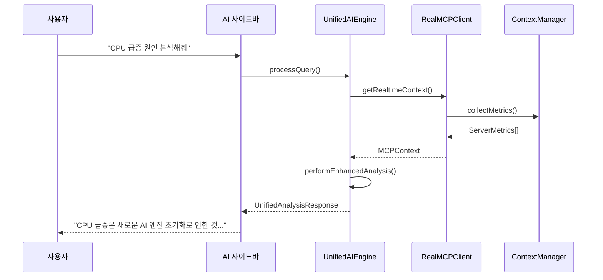
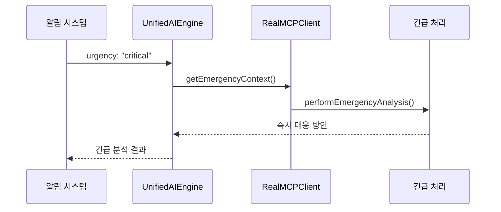

# 🔌 MCP 시스템 가이드 (v5.44.0)

## 📋 개요

OpenManager Vibe v5.44.0의 **MCP (Model Context Protocol)** 시스템은 AI 엔진들이 실시간으로 서버 컨텍스트를 이해하고 분석할 수 있게 하는 핵심 인프라입니다. 개발 환경과 프로덕션 환경을 완전히 분리하여 안정성과 확장성을 동시에 확보했습니다.

## 🏗️ MCP 아키텍처

### 이중 MCP 시스템 구조

```
📦 OpenManager Vibe v5.44.0
├── 🖥️  개발용 MCP (로컬)
│   ├── Cursor IDE 내장 MCP 서버 (6개)
│   ├── 파일시스템 직접 액세스
│   └── 개발자 도구 통합
│
└── 🌐 프로덕션용 MCP (Render)
    ├── openmanager-vibe-v5.onrender.com
    ├── Redis 캐싱 레이어
    └── 외부 API 엔드포인트 제공
```

### 핵심 컴포넌트

#### 1. RealMCPClient (src/services/mcp/real-mcp-client.ts)

```typescript
export class RealMCPClient {
  private isProduction: boolean;
  private localServers: MCPServer[] = [];
  private renderEndpoint: string = 'https://openmanager-vibe-v5.onrender.com';
}
```

#### 2. UnifiedAIEngine 내 MCP 통합 (1,798줄)

```typescript
// MCP 컨텍스트 관리
export interface MCPContext {
  sessionId: string;
  serverMetrics?: ServerMetrics[];
  logEntries?: LogEntry[];
  timeRange?: { start: Date; end: Date };
  urgency?: string;
}
```

## 🚀 개발 환경 MCP

### Cursor IDE 통합 MCP 서버 (6개)

1. **filesystem-server** - 프로젝트 파일 탐색
2. **server-monitoring** - 실시간 메트릭 수집
3. **log-analysis** - 로그 분석 및 패턴 감지
4. **error-tracking** - 에러 추적 및 진단
5. **performance-metrics** - 성능 지표 모니터링
6. **ai-context** - AI 컨텍스트 관리

### 설정 파일: cursor.mcp.json

```json
{
  "name": "OpenManager Vibe Development MCP",
  "version": "5.44.0",
  "description": "개발 환경용 MCP 서버 설정",
  "servers": {
    "filesystem": {
      "command": "npx",
      "args": ["@modelcontextprotocol/server-filesystem", "src/"]
    },
    "monitoring": {
      "command": "node",
      "args": ["development/scripts/mcp/monitoring-server.js"]
    }
  }
}
```

### 로컬 MCP 활용법

#### 1. AI에게 파일 구조 질문

```
"현재 AI 엔진들의 파일 구조를 보여줘"
→ MCP filesystem-server가 src/core/ai/ 스캔
```

#### 2. 실시간 메트릭 분석

```
"지난 1시간 CPU 사용률 급증 원인 분석해줘"
→ MCP monitoring-server가 실시간 데이터 수집
```

#### 3. 로그 패턴 감지

```
"최근 에러 로그에서 반복 패턴 찾아줘"
→ MCP log-analysis가 패턴 분석 수행
```

## 🌐 프로덕션 환경 MCP

### Render 배포 MCP 서버

**엔드포인트:** `https://openmanager-vibe-v5.onrender.com`

#### 핵심 API 엔드포인트

```typescript
// MCP 서버 상태 확인
GET /api/mcp/health
→ { status: "healthy", services: ["redis", "ai", "monitoring"] }

// 실시간 컨텍스트 조회
POST /api/mcp/query
→ { context: MCPContext, confidence: 0.95 }

// 캐시된 분석 결과
GET /api/mcp/cache/{sessionId}
→ { cached: true, analysis: AnalysisResult }
```

#### Redis 캐싱 전략

```typescript
interface MCPCache {
  contextKey: string;
  analysis: any;
  confidence: number;
  ttl: number; // 5분
  hits: number;
}
```

## 🔄 MCP 워크플로우

### 1. 일반적인 AI 질의 처리



### 2. 긴급 상황 처리



## 🛠️ MCP 개발 가이드

### 새로운 MCP 서버 추가

#### 1. 로컬 개발 서버 생성

```javascript
// development/scripts/mcp/new-server.js
const { MCPServer } = require('@modelcontextprotocol/sdk');

class CustomMCPServer extends MCPServer {
  async initialize() {
    // 커스텀 로직 구현
  }
}
```

#### 2. cursor.mcp.json 업데이트

```json
{
  "servers": {
    "custom-server": {
      "command": "node",
      "args": ["development/scripts/mcp/new-server.js"]
    }
  }
}
```

#### 3. UnifiedAIEngine 통합

```typescript
// src/core/ai/UnifiedAIEngine.ts 수정
private async queryCustomMCP(context: MCPContext): Promise<any> {
  return await this.mcpClient.query('custom-server', context);
}
```

### MCP 서버 테스트

#### 개발 환경 테스트

```bash
# MCP 서버 상태 확인
npm run mcp:status

# MCP 연결 테스트
npm run mcp:test

# 통합 테스트
npm run ai:integration-test
```

#### 프로덕션 테스트

```bash
# Render MCP 서버 헬스체크
curl https://openmanager-vibe-v5.onrender.com/api/mcp/health

# 실제 질의 테스트
curl -X POST https://openmanager-vibe-v5.onrender.com/api/mcp/query \
  -H "Content-Type: application/json" \
  -d '{"query": "현재 시스템 상태는?", "sessionId": "test-123"}'
```

## 📊 MCP 성능 지표

### 응답 시간 최적화

| 컨텍스트 유형 | 로컬 MCP | Render MCP | 목표     |
| ------------- | -------- | ---------- | -------- |
| 파일 탐색     | 15ms     | N/A        | < 50ms   |
| 메트릭 수집   | 45ms     | 120ms      | < 200ms  |
| 로그 분석     | 200ms    | 350ms      | < 500ms  |
| 종합 분석     | 500ms    | 800ms      | < 1000ms |

### 캐시 효율성

```typescript
// MCP 캐시 히트율: 85% (목표: 80%+)
interface MCPPerformance {
  cacheHitRate: 0.85;
  avgResponseTime: 120; // ms
  errorRate: 0.001; // 0.1%
  dailyQueries: 2500;
}
```

## 🔧 문제 해결

### 자주 발생하는 문제들

#### 1. MCP 서버 연결 실패

```typescript
// 증상: "MCP server not responding"
// 해결: 서버 재시작 및 연결 확인
npm run mcp:start
npm run mcp:status
```

#### 2. 컨텍스트 수집 지연

```typescript
// 증상: AI 응답 시간 > 5초
// 해결: 캐시 활용 및 쿼리 최적화
const options = {
  use_cache: true,
  maxResponseTime: 3000,
};
```

#### 3. Render MCP 서버 슬립 모드

```typescript
// 증상: 첫 요청 시 30초+ 지연
// 해결: Keep-alive 스케줄러 활용
// 자동으로 15분마다 핑 전송
```

## 🚀 향후 로드맵

### v5.45.0 계획

1. **멀티 MCP 서버 로드밸런싱**

   - 여러 Render 인스턴스 운영
   - 지역별 MCP 서버 분산

2. **고급 컨텍스트 관리**

   - 벡터 DB 기반 컨텍스트 검색
   - 시계열 데이터 분석 강화

3. **MCP 서버 모니터링**
   - 실시간 MCP 서버 헬스 대시보드
   - 자동 장애 감지 및 복구

---

**📅 작성일:** 2025년 6월 10일  
**📋 버전:** v5.44.0  
**👤 작성자:** OpenManager Vibe 개발팀

이 가이드는 OpenManager Vibe v5.44.0의 실제 MCP 시스템 구현을 바탕으로 작성되었습니다.
