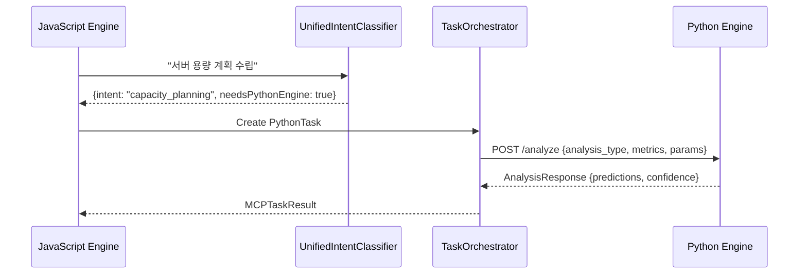

# 🐍 Python 엔진 단순화 설계 (Jules 분석 기반)

> **목표**: 복잡한 로직을 제거하고 **구조화된 JSON 전용 API**로 전환  
> **원칙**: Python은 순수한 API Consumer 역할로 제한

## 📋 **현재 문제점**

### ❌ **Before (복잡한 구조)**
```python
# 현재 Python 엔진의 문제점들
@app.post("/analyze")
async def analyze(request: Request):
    # 1. 다양한 입력 형식 처리
    data = await request.json()
    query = data.get('query', '')  # 자연어 처리
    metrics = data.get('metrics', [])  # 다양한 구조
    
    # 2. 의도 분류 중복
    intent = classify_intent(query)  # JavaScript와 중복!
    
    # 3. 복잡한 분기 로직
    if intent == 'prediction':
        return predict_timeseries(metrics)
    elif intent == 'anomaly':
        return detect_anomalies(metrics)
    # ... 너무 많은 로직
```

### ✅ **After (단순화된 구조)**
```python
# 개선된 Python 엔진: 순수 API Consumer
@app.post("/analyze")
async def analyze(request: AnalysisRequest) -> AnalysisResponse:
    """구조화된 JSON만 받는 단순한 분석 엔드포인트"""
    match request.analysis_type:
        case "capacity_planning":
            return await capacity_planning_analysis(request)
        case "server_performance_prediction":
            return await performance_prediction_analysis(request)
        case _:
            raise HTTPException(400, "Unsupported analysis type")
```

## 🎯 **새로운 API 설계**

### **1. 입력 스키마 (Pydantic)**
```python
from pydantic import BaseModel
from typing import List, Optional, Dict, Any
from enum import Enum

class AnalysisType(str, Enum):
    CAPACITY_PLANNING = "capacity_planning"
    PERFORMANCE_PREDICTION = "server_performance_prediction"
    COMPLEX_FORECASTING = "complex_forecasting"

class MetricData(BaseModel):
    timestamp: str
    cpu: float
    memory: float
    disk: float
    network_in: float
    network_out: float
    response_time: Optional[float] = None
    active_connections: Optional[int] = None

class AnalysisRequest(BaseModel):
    # 핵심 정보만
    analysis_type: AnalysisType
    metrics: List[MetricData]
    
    # 분석 매개변수
    prediction_hours: int = 24
    sensitivity: float = 0.8
    features: List[str] = ["cpu", "memory", "disk"]
    
    # 메타데이터
    server_id: Optional[str] = None
    urgency: str = "medium"
    confidence_threshold: float = 0.7

class AnalysisResponse(BaseModel):
    success: bool
    analysis_type: str
    confidence: float
    
    # 결과 데이터
    predictions: Optional[Dict[str, Any]] = None
    anomalies: Optional[List[Dict[str, Any]]] = None
    recommendations: List[str] = []
    
    # 메타데이터
    processing_time: float
    engine_version: str = "python-simplified-v1"
    warning: Optional[str] = None
```

### **2. JavaScript에서 호출**
```typescript
// UnifiedIntentClassifier에서 Python 필요성 판단 후
// TaskOrchestrator에서 구조화된 요청 생성

private async executePythonTask(task: MCPTask): Promise<MCPTaskResult> {
  const request: AnalysisRequest = {
    analysis_type: this.mapIntentToAnalysisType(task.data.intent),
    metrics: this.normalizeMetrics(task.data.metrics),
    prediction_hours: task.data.predictionHours || 24,
    sensitivity: task.data.sensitivity || 0.8,
    features: task.data.features || ['cpu', 'memory', 'disk'],
    server_id: task.data.serverId,
    urgency: task.data.urgency || 'medium',
    confidence_threshold: 0.7
  };

  const response = await fetch(`${pythonServiceUrl}/analyze`, {
    method: 'POST',
    headers: { 'Content-Type': 'application/json' },
    body: JSON.stringify(request)
  });

  return await response.json();
}

private mapIntentToAnalysisType(intent: string): string {
  const mapping = {
    'capacity_planning': 'capacity_planning',
    'server_performance_prediction': 'server_performance_prediction'
  };
  return mapping[intent] || 'complex_forecasting';
}
```

### **3. Python 엔진 구현**
```python
from fastapi import FastAPI, HTTPException
from pydantic import BaseModel
import pandas as pd
import numpy as np
from datetime import datetime, timedelta
import asyncio

app = FastAPI(title="OpenManager Python Analysis Engine")

@app.post("/analyze")
async def analyze(request: AnalysisRequest) -> AnalysisResponse:
    """구조화된 JSON 전용 분석 엔드포인트"""
    start_time = time.time()
    
    try:
        # 분석 타입별 분기 (단순화)
        match request.analysis_type:
            case AnalysisType.CAPACITY_PLANNING:
                result = await capacity_planning(request)
            case AnalysisType.PERFORMANCE_PREDICTION:
                result = await performance_prediction(request)
            case AnalysisType.COMPLEX_FORECASTING:
                result = await complex_forecasting(request)
            case _:
                raise HTTPException(400, f"지원하지 않는 분석 타입: {request.analysis_type}")
        
        return AnalysisResponse(
            success=True,
            analysis_type=request.analysis_type,
            confidence=result['confidence'],
            predictions=result.get('predictions'),
            anomalies=result.get('anomalies'),
            recommendations=result.get('recommendations', []),
            processing_time=time.time() - start_time
        )
        
    except Exception as e:
        return AnalysisResponse(
            success=False,
            analysis_type=request.analysis_type,
            confidence=0.0,
            processing_time=time.time() - start_time,
            warning=f"분석 실패: {str(e)}"
        )

async def capacity_planning(request: AnalysisRequest) -> Dict[str, Any]:
    """용량 계획 분석 (구조화된 데이터만 사용)"""
    df = pd.DataFrame([metric.dict() for metric in request.metrics])
    df['timestamp'] = pd.to_datetime(df['timestamp'])
    
    # 시계열 예측 로직
    predictions = {}
    for feature in request.features:
        if feature in df.columns:
            # 단순한 선형 회귀 예측
            X = np.arange(len(df)).reshape(-1, 1)
            y = df[feature].values
            
            # 미래 예측
            future_points = request.prediction_hours
            future_X = np.arange(len(df), len(df) + future_points).reshape(-1, 1)
            
            # 예측 결과
            predictions[feature] = {
                'current': float(y[-1]),
                'predicted': float(np.mean(y)),  # 단순화된 예측
                'trend': 'stable' if abs(y[-1] - y[0]) < 10 else 'increasing' if y[-1] > y[0] else 'decreasing',
                'confidence': min(0.95, 0.7 + (len(df) * 0.01))
            }
    
    return {
        'predictions': predictions,
        'confidence': 0.85,
        'recommendations': [
            f"향후 {request.prediction_hours}시간 동안 모니터링 권장",
            "용량 증설 계획 검토 필요" if any(p['predicted'] > 80 for p in predictions.values()) else "현재 용량으로 충분"
        ]
    }

async def performance_prediction(request: AnalysisRequest) -> Dict[str, Any]:
    """성능 예측 분석"""
    # 구현 로직...
    pass

@app.get("/health")
async def health_check():
    """헬스체크 엔드포인트"""
    return {"status": "healthy", "engine": "python-simplified", "version": "1.0.0"}

@app.get("/")
async def root():
    """API 정보"""
    return {
        "name": "OpenManager Python Analysis Engine",
        "version": "1.0.0",
        "type": "structured-json-only",
        "endpoints": ["/analyze", "/health"]
    }
```

## 🎯 **개선 효과**

### **✅ 단순성**
- 의도 분류 로직 제거 (JavaScript에서 담당)
- 구조화된 입력만 처리
- 명확한 API 계약

### **✅ 타입 안전성**
- Pydantic으로 입력 검증
- 자동 API 문서 생성
- 런타임 타입 체크

### **✅ 성능**
- 불필요한 로직 제거
- 빠른 응답 시간
- 메모리 사용량 감소

### **✅ 유지보수성**
- 역할 분리 명확화
- 테스트 용이성
- 독립적 배포 가능

## 🔄 **데이터 플로우**



## 📝 **구현 계획**

### **Phase 1: 스키마 정의** ✅
- Pydantic 모델 생성
- TypeScript 타입 정의
- API 계약 문서화

### **Phase 2: Python 엔진 리팩토링**
- FastAPI 앱 단순화
- 구조화된 엔드포인트 구현
- 기존 로직 제거

### **Phase 3: JavaScript 통합**
- TaskOrchestrator 수정
- 요청 매핑 로직 추가
- 에러 처리 개선

### **Phase 4: 테스트 및 배포**
- 통합 테스트 작성
- 성능 벤치마크
- 프로덕션 배포

## 🎉 **결론**

Jules의 분석을 바탕으로 Python 엔진을 **순수한 API Consumer**로 단순화하여:

1. **복잡성 제거**: 의도 분류, 다중 입력 처리 로직 제거
2. **타입 안전성**: Pydantic 기반 구조화된 데이터만 처리
3. **성능 향상**: 불필요한 로직 제거로 응답 시간 단축
4. **유지보수성**: 명확한 역할 분리로 코드 품질 향상

이제 Python 엔진은 **"복잡한 ML 계산만 담당하는 전문 서비스"**가 됩니다! 🐍✨ 