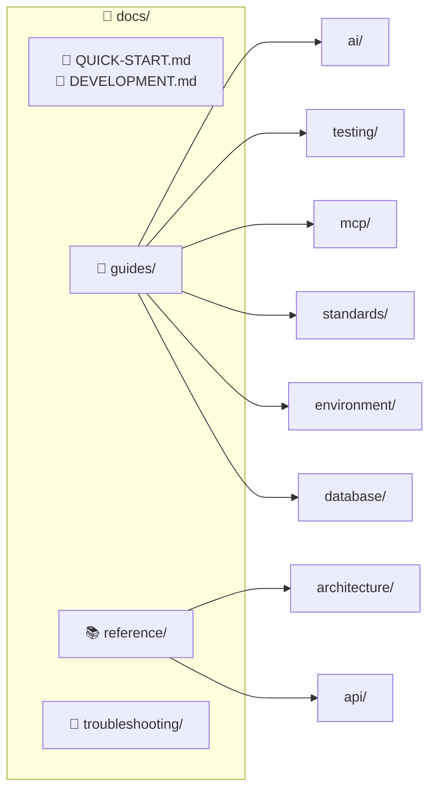

# OpenManager VIBE Documentation

> **프로젝트 버전**: v5.88.0 | **Updated**: 2026-01-16

---

## Quick Navigation

| 섹션 | 설명 | 바로가기 |
|------|------|----------|
| 🚀 **Quick Start** | 빠른 시작 | [→ QUICK-START.md](./QUICK-START.md) |
| 🔧 **Development** | 개발 가이드 | [→ DEVELOPMENT.md](./DEVELOPMENT.md) |
| 📖 **Guides** | How-to 가이드 | [→ guides/](./guides/) |
| 📚 **Reference** | 기술 레퍼런스 | [→ reference/](./reference/) |
| 🔧 **Troubleshooting** | 문제 해결 | [→ troubleshooting/](./troubleshooting/) |

---

## Documentation Structure

### 폴더 구조

| 폴더 | 설명 | 문서 수 |
|------|------|:-------:|
| `guides/` | How-to 가이드 | 12개 |
| `reference/` | 기술 레퍼런스 | 18개 |
| `troubleshooting/` | 문제 해결 | 2개 |
| **합계** | | **35개** |

---

## Essential Documents

### Getting Started
- [Quick Start](./QUICK-START.md) - 5분 만에 시작
- [Development Guide](./DEVELOPMENT.md) - 개발 환경 설정

### AI Development
- [AI Standards](./guides/ai/common/ai-standards.md) - AI 도구 표준
- [MCP Setup](./guides/mcp/setup-guide.md) - MCP 서버 설정
- [AI Model Policy](./ai-model-policy.md) - 모델 정책

### Architecture
- [AI Engine Architecture](./reference/architecture/ai/ai-engine-architecture.md) - AI 엔진 상세 명세
- [System Architecture](./reference/architecture/system/system-architecture-current.md) - 시스템 구조

### Testing
- [Test Strategy](./guides/testing/test-strategy.md) - 테스트 전략
- [E2E Testing](./guides/testing/e2e-testing-guide.md) - E2E 테스트

---

## By Role

### Developer (개발자)
1. [Quick Start](./QUICK-START.md) - 환경 설정
2. [Development Guide](./DEVELOPMENT.md) - 개발 워크플로우
3. [Testing Guide](./guides/testing/) - 테스트 작성법

### AI/ML Engineer
1. [AI Engine Architecture](./reference/architecture/ai/ai-engine-architecture.md) - AI 엔진 아키텍처
2. [AI Model Policy](./ai-model-policy.md) - 모델 정책

### DevOps
1. [Hybrid Architecture](./reference/architecture/infrastructure/hybrid_split.md) - Vercel + Cloud Run
2. [Deployment](./reference/architecture/infrastructure/deployment.md) - 배포 가이드
3. [Troubleshooting](./troubleshooting/) - 문제 해결

---

## Status

| 문서 | 설명 |
|------|------|
| [Project Status](./status.md) | 현재 프로젝트 상태 |
| [Changelog](../CHANGELOG.md) | 변경 이력 (루트) |
| [AI Model Policy](./ai-model-policy.md) | AI 모델 정책 |
| [llms.txt](./llms.txt) | AI 최적화 컨텍스트 |

---

## External Resources

- [GitHub Repository](https://github.com/skyasu2/openmanager-vibe-v5)
- [Vercel Dashboard](https://vercel.com)
- [Supabase Dashboard](https://supabase.com)
