# OpenManager VIBE Documentation

> **Version**: v5.84.1

---

## Quick Navigation

| 섹션 | 설명 | 바로가기 |
|------|------|----------|
| 🚀 **Getting Started** | 시작 가이드 | [→ getting-started/](./getting-started/) |
| 📖 **Guides** | How-to 가이드 | [→ guides/](./guides/) |
| 📚 **Reference** | 기술 레퍼런스 | [→ reference/](./reference/) |
| 🔧 **Troubleshooting** | 문제 해결 | [→ troubleshooting/](./troubleshooting/) |

---

## Documentation Structure

```mermaid
flowchart LR
    subgraph docs["📁 docs/"]
        direction TB
        GS["🚀 getting-started/"]
        GU["📖 guides/"]
        RF["📚 reference/"]
        TS["🔧 troubleshooting/"]
        AR["📦 archive/"]
    end

    GS --> QS["quick-start.md"]
    GS --> DV["development.md"]

    GU --> AI["ai/"]
    GU --> TEST["testing/"]
    GU --> MCP["mcp/"]

    RF --> ARCH["architecture/"]
    RF --> API["api/"]
    RF --> PLAT["platforms/"]
```

### 폴더 설명

| 폴더 | 설명 | 문서 수 |
|------|------|---------|
| `getting-started/` | 시작 가이드 | 3개 |
| `guides/` | How-to 가이드 | ~50개 |
| `reference/` | 기술 레퍼런스 | ~60개 |
| `troubleshooting/` | 문제 해결 | 3개 |
| `archive/` | 보관 문서 | ~20개 |

---

## Essential Documents

### Getting Started
- [Quick Start](./getting-started/quick-start.md) - 5분 만에 시작
- [Development Guide](./getting-started/development.md) - 개발 환경 설정

### AI Development
- [AI Standards](./guides/ai/common/ai-standards.md) - AI 도구 표준
- [AI Workflow](./guides/ai/common/ai-workflow.md) - 협업 워크플로우
- [MCP Setup](./guides/mcp/setup-guide.md) - MCP 서버 설정

### Architecture
- [AI Engine 5W1H](./reference/architecture/ai/ai-engine-5w1h.md) - 아키텍처 요약
- [AI Engine Architecture](./reference/architecture/ai/ai-engine-architecture.md) - 상세 명세
- [System Overview](./reference/architecture/system/) - 시스템 구조

### Testing
- [Test Strategy](./guides/testing/test-strategy.md) - 테스트 전략
- [E2E Testing](./guides/testing/e2e-testing-guide.md) - E2E 테스트

---

## By Role

### Developer (개발자)
1. [Quick Start](./getting-started/quick-start.md) - 환경 설정
2. [Development Guide](./getting-started/development.md) - 개발 워크플로우
3. [Testing Guide](./guides/testing/) - 테스트 작성법

### AI/ML Engineer
1. [AI Engine 5W1H](./reference/architecture/ai/ai-engine-5w1h.md) - 아키텍처 요약
2. [AI Engine Architecture](./reference/architecture/ai/ai-engine-architecture.md) - 상세 명세
3. [AI Model Policy](./ai-model-policy.md) - 모델 정책

### DevOps
1. [Vercel Deploy](./reference/platforms/vercel/) - 프론트엔드 배포
2. [Cloud Run](./reference/platforms/gcp/) - AI Engine 배포
3. [Troubleshooting](./troubleshooting/) - 문제 해결

---

## Status

| 문서 | 설명 |
|------|------|
| [Project Status](./status.md) | 현재 프로젝트 상태 |
| [Changelog](./CHANGELOG.md) | 변경 이력 |
| [AI Model Policy](./ai-model-policy.md) | AI 모델 정책 |
| [llms.txt](./llms.txt) | AI 최적화 컨텍스트 |

---

## Metrics

| 지표 | 값 |
|------|-----|
| 활성 문서 수 | ~80개 |
| 아카이브 문서 | ~45개 |
| 마지막 업데이트 | 2025-12-31 |

> 문서 개선 계획: [DOCS-BASELINE.md](./DOCS-BASELINE.md)

---

## External Resources

- [GitHub Repository](https://github.com/skyasu2/openmanager-vibe-v5)
- [Vercel Dashboard](https://vercel.com)
- [Supabase Dashboard](https://supabase.com)
