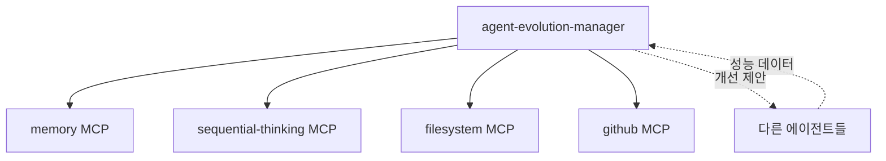

# agent-evolution-manager 삭제 영향 분석 및 개선 방안

## 📋 개요

`agent-evolution-manager` 서브 에이전트가 삭제됨에 따른 영향 분석 및 대체 방안을 제시합니다.

**삭제일**: 2025-01-27  
**원래 역할**: 에이전트 진화 관리 - 모든 에이전트의 성능 메트릭 분석 및 자동 개선

## 🚨 사이드 이펙트 분석

### 1. 상실된 기능

- ❌ **자동 성능 모니터링**: 에이전트들의 실행 메트릭 자동 수집 중단
- ❌ **자동 개선 제안**: 성능 저하 패턴 감지 및 개선안 자동 생성 중단
- ❌ **에이전트 간 협업 최적화**: 에이전트 조합 패턴 분석 중단
- ❌ **주기적 성능 리뷰**: 주간/월간 자동 성능 리포트 생성 중단

### 2. 영향받는 워크플로우

- 에이전트 성능 최적화 프로세스
- 새로운 에이전트 추가 시 통합 테스트
- 에이전트 사용 패턴 분석
- 성능 병목점 자동 감지

### 3. 의존성 체인



## 💡 대체 방안

### 1. 기능 분산 전략

#### A. **doc-structure-guardian** 확장

```yaml
추가 역할:
  - 에이전트 문서 품질 모니터링
  - 사용 가이드 자동 업데이트
  - 베스트 프랙티스 문서화
```

#### B. **issue-summary** 확장

```yaml
추가 역할:
  - 에이전트 실행 로그 분석
  - 성능 이슈 자동 감지
  - 주간 성능 리포트 생성
```

#### C. **mcp-server-admin** 확장

```yaml
추가 역할:
  - MCP 서버 성능 모니터링
  - 에이전트-MCP 매핑 최적화
  - 리소스 사용량 추적
```

### 2. 수동 프로세스 도입

#### 주간 성능 리뷰 체크리스트

```bash
# 1. 에이전트 사용 통계 수집
grep -r "Task(subagent_type=" .claude/logs/ | analyze

# 2. 실행 시간 분석
find .claude/agents -name "*.log" -mtime -7 | check_performance

# 3. 에러 패턴 확인
grep -r "ERROR\|FAILED" .claude/issues/ | summarize

# 4. 개선 제안 문서화
echo "## 주간 에이전트 성능 리뷰 $(date +%Y-%m-%d)" >> docs/agent-performance-reviews.md
```

### 3. 자동화 스크립트 생성

#### `scripts/agent-performance-monitor.sh`

```bash
#!/bin/bash
# 에이전트 성능 모니터링 스크립트

# 기본 성능 메트릭 수집
collect_metrics() {
    echo "📊 에이전트 성능 메트릭 수집 중..."
    # 각 에이전트별 실행 횟수
    # 평균 실행 시간
    # 성공/실패율
}

# 성능 이슈 감지
detect_issues() {
    echo "🔍 성능 이슈 분석 중..."
    # 느린 실행 감지
    # 반복적 실패 패턴
    # 리소스 과다 사용
}

# 리포트 생성
generate_report() {
    echo "📄 성능 리포트 생성 중..."
    # Markdown 형식 리포트
    # 개선 제안 포함
}

# 메인 실행
main() {
    collect_metrics
    detect_issues
    generate_report > "docs/agent-performance-$(date +%Y%m%d).md"
}

main "$@"
```

## 📋 즉시 실행 가능한 조치

### 1. CLAUDE.md 업데이트

```bash
# agent-evolution-manager 관련 내용 제거
sed -i '/agent-evolution-manager/d' CLAUDE.md

# 서브 에이전트 수 업데이트 (10개 → 9개)
sed -i 's/Sub Agents (10개)/Sub Agents (9개)/' CLAUDE.md
```

### 2. 성능 모니터링 대체 프로세스

```yaml
책임 분담:
  doc-structure-guardian:
    - 에이전트 문서 품질 추적
    - 사용 패턴 문서화

  issue-summary:
    - 에이전트 에러 추적
    - 성능 저하 감지

  code-review-specialist:
    - 에이전트 코드 품질 검토
    - 개선 제안
```

### 3. 주기적 리뷰 일정

```markdown
## 에이전트 성능 리뷰 일정

### 일일 (자동)

- issue-summary: 에러 로그 확인

### 주간 (수동)

- 월요일 10:00: 성능 메트릭 수집
- 개선 필요 에이전트 식별

### 월간 (수동)

- 첫째 주 월요일: 종합 성능 분석
- 에이전트 구조 개선 계획
```

## 🎯 장기적 개선 방향

### 1. 경량화된 모니터링 시스템

- 각 에이전트에 자체 성능 추적 기능 내장
- 중앙 집중식 대신 분산형 모니터링

### 2. 사용자 주도 개선

- 사용자 피드백 기반 개선
- 실제 사용 패턴에 따른 최적화

### 3. 선택적 자동화

- 핵심 기능만 자동화
- 나머지는 필요 시 수동 실행

## 📌 결론

`agent-evolution-manager` 삭제로 자동 진화 기능은 상실되었지만, 핵심 기능을 다른 에이전트들에 분산하고 수동 프로세스를 도입함으로써 충분히 대체 가능합니다. 오히려 이를 통해:

1. **시스템 단순화**: 복잡한 자동화 대신 명확한 책임 분담
2. **유연성 향상**: 필요에 따른 선택적 최적화
3. **투명성 증가**: 명시적인 성능 리뷰 프로세스

향후 필요 시 경량화된 성능 모니터링 기능을 기존 에이전트에 추가하는 방향으로 진행하는 것이 바람직합니다.
