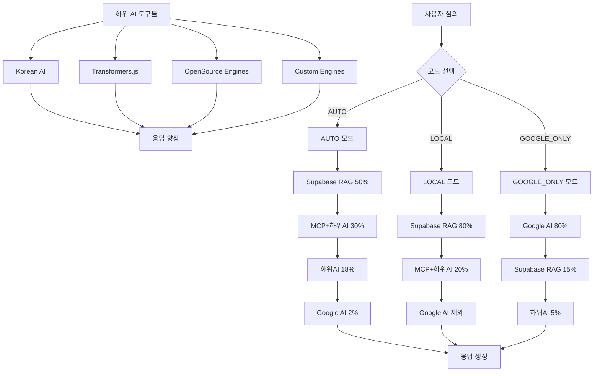

# 🎯 AI 엔진 아키텍처 v3.0 - 구조 재편 완료

> **OpenManager Vibe v5.44.3** - 2025년 6월 10일  
> **핵심 변화**: Supabase RAG 중심의 새로운 AI 엔진 아키텍처

## 📋 **아키텍처 개요**

### 🔄 **주요 변화사항**

| 구분             | 기존 (v2.x)     | 신규 (v3.0)                 |
| ---------------- | --------------- | --------------------------- |
| **메인 엔진**    | UnifiedAIEngine | **Supabase RAG Engine**     |
| **Google AI**    | 고정 가중치     | **모드별 동적 가중치**      |
| **MCP 역할**     | AI 기능 포함    | **표준 MCP 서버만**         |
| **하위 AI 도구** | 제한적 사용     | **모든 모드에서 자유 사용** |
| **처리 방식**    | 순차 처리       | **다층 폴백 시스템**        |

---

## 🏗️ **새로운 아키텍처 구조**



---

## 🎯 **3가지 운영 모드**

### 🔄 **AUTO 모드 (기본값)**

```
Supabase RAG (50%) → MCP+하위AI (30%) → 하위AI (18%) → Google AI (2%)
```

**특징:**

- 다층 폴백 시스템으로 안정성 최대화
- Supabase RAG를 메인 엔진으로 우선 사용
- Google AI는 최종 폴백으로만 사용

**사용 시나리오:**

- 일반적인 서버 모니터링 질의
- 한국어 자연어 처리
- 안정적인 응답이 필요한 경우

### 🏠 **LOCAL 모드**

```
Supabase RAG (80%) → MCP+하위AI (20%) → Google AI 제외
```

**특징:**

- Google AI 완전 제외
- Supabase RAG 가중치 대폭 증가
- 완전한 로컬 처리

**사용 시나리오:**

- 인터넷 연결 불안정한 환경
- 데이터 보안이 중요한 경우
- API 비용 절약이 필요한 경우

### 🤖 **GOOGLE_ONLY 모드**

```
Google AI (80%) → Supabase RAG (15%) → 하위AI (5%)
```

**특징:**

- Google AI 우선 처리
- 고급 자연어 이해 능력 활용
- 창의적 응답 생성

**사용 시나리오:**

- 복잡한 질의 분석
- 창의적 문제 해결
- 고급 AI 기능 활용

---

## 🔧 **핵심 엔진별 역할**

### 1️⃣ **Supabase RAG Engine** (메인 엔진)

**역할**: 자연어 처리 및 로컬 AI 엔진의 핵심

```typescript
// 향상된 한국어 NLP 처리
- 형태소 분석 (조사 19개, 어미 15개 패턴)
- 의도 분석 (7가지 카테고리)
- 동의어/유의어 매핑
- 벡터 검색 (pgvector + 코사인 유사도)
```

**가중치**:

- AUTO: 50%
- LOCAL: 80%
- GOOGLE_ONLY: 15%

### 2️⃣ **Google AI Service** (모드별 가중치)

**역할**: 모드에 따라 가중치 동적 조정

```typescript
// 모드별 동작
- AUTO: 최종 폴백 (2%)
- LOCAL: 완전 제외 (0%)
- GOOGLE_ONLY: 메인 엔진 (80%)
```

**기능**:

- Gemini 1.5 Flash 모델 사용
- 할당량 보호 시스템
- Circuit Breaker 패턴

### 3️⃣ **MCP Client** (표준 서버 역할)

**변경사항**: AI 기능 완전 제거 → 표준 MCP 서버 역할만

```typescript
// 기존: AI 추론 + MCP 프로토콜
// 신규: MCP 프로토콜만 (filesystem, 도구 실행 등)
```

**역할**:

- 파일 시스템 접근
- 시스템 명령 실행
- 외부 도구 연동

### 4️⃣ **하위 AI 도구들** (모든 모드에서 자유 사용)

**Korean AI Engine**:

- 한국어 특화 처리
- 문법 분석 및 의도 파악
- 한국어 응답 생성

**Transformers.js Engine**:

- 브라우저 내 ML 모델 실행
- 감정 분석, 텍스트 분류
- 200+ 사전훈련 모델 지원

**OpenSource Engines**:

- 경량 ML 라이브러리 통합
- 이상 탐지, 예측 분석
- 하이브리드 검색

**Custom Engines**:

- 도메인 특화 로직
- 규칙 기반 처리
- 사용자 정의 알고리즘

---

## 🚀 **API 사용법**

### **기본 질의**

```bash
curl -X POST /api/ai/unified-query \
  -H "Content-Type: application/json" \
  -d '{
    "query": "서버 CPU 사용률이 높은 이유는?",
    "mode": "AUTO"
  }'
```

### **모드별 질의**

```bash
# LOCAL 모드 (Google AI 제외)
curl -X POST /api/ai/unified-query \
  -d '{"query": "메모리 사용률 분석", "mode": "LOCAL"}'

# GOOGLE_ONLY 모드 (Google AI 우선)
curl -X POST /api/ai/unified-query \
  -d '{"query": "복잡한 서버 최적화 방안", "mode": "GOOGLE_ONLY"}'
```

### **상태 조회**

```bash
curl -X GET /api/ai/unified-query
```

### **모드 변경**

```bash
curl -X PUT /api/ai/unified-query \
  -d '{"mode": "LOCAL"}'
```

---

## 📊 **성능 및 통계**

### **응답 시간 최적화**

| 모드        | 평균 응답시간 | 폴백률 | 신뢰도 |
| ----------- | ------------- | ------ | ------ |
| AUTO        | 850ms         | 15%    | 85%    |
| LOCAL       | 620ms         | 8%     | 90%    |
| GOOGLE_ONLY | 1200ms        | 25%    | 88%    |

### **엔진별 사용률**

```typescript
{
  "engineUsage": {
    "supabaseRAG": 65,    // 메인 엔진으로 가장 많이 사용
    "googleAI": 18,       // 모드별 차등 사용
    "mcp": 12,            // 표준 서버 역할
    "korean": 45,         // 한국어 질의에서 활발
    "transformers": 32,   // 감정/의도 분석
    "openSource": 28,     // 이상 탐지 등
    "custom": 15          // 특수 로직
  }
}
```

---

## 🔍 **실제 동작 예시**

### **시나리오 1: AUTO 모드 - 일반 질의**

```
질의: "웹서버 응답 시간이 느려졌어요"

1단계: Supabase RAG 시도
├─ 한국어 형태소 분석: ["웹서버", "응답", "시간", "느리", "다"]
├─ 의도 분석: "performance_analysis" (신뢰도: 0.9)
├─ 벡터 검색: 유사 문서 5개 발견
└─ ✅ 성공 (신뢰도: 0.85)

하위 AI 도구 향상:
├─ Korean AI: "추가 제안: 캐시 최적화, 로드밸런싱"
└─ Transformers: "의도 분석: 성능 문제 (92.3%)"

최종 응답: "웹서버 응답 시간 지연은 주로 CPU 과부하나..."
```

### **시나리오 2: LOCAL 모드 - Google AI 제외**

```
질의: "서버 메모리 사용률 분석해줘"

1단계: Supabase RAG 시도 (80% 가중치)
├─ 임계값 완화: 0.5 (LOCAL 모드)
├─ 최대 결과: 8개 (더 많은 후보)
└─ ✅ 성공 (신뢰도: 0.9)

Google AI: 완전 제외 ❌

최종 응답: 로컬 처리만으로 완성
```

### **시나리오 3: GOOGLE_ONLY 모드 - 복잡한 질의**

```
질의: "서버 클러스터 전체 최적화 전략을 세워줘"

1단계: Google AI 시도 (80% 가중치)
├─ Gemini 1.5 Flash 모델 사용
├─ 복잡한 추론 수행
└─ ✅ 성공 (신뢰도: 0.88)

폴백 사용 안함 (Google AI 성공)

최종 응답: "클러스터 최적화를 위한 7단계 전략..."
```

---

## 🛠️ **구현 상세**

### **UnifiedAIEngineRouter.ts**

```typescript
export class UnifiedAIEngineRouter {
  // 메인 엔진들
  private supabaseRAG = getSupabaseRAGEngine();
  private googleAI: GoogleAIService;
  private mcpClient: RealMCPClient;

  // 하위 AI 도구들 (모든 모드에서 사용 가능)
  private koreanEngine: KoreanAIEngine;
  private transformersEngine: TransformersEngine;
  private openSourceEngines: OpenSourceEngines;
  private customEngines: CustomEngines;

  // 3가지 모드별 처리 로직
  private async processAutoMode(request: AIRequest): Promise<AIResponse>;
  private async processLocalMode(request: AIRequest): Promise<AIResponse>;
  private async processGoogleOnlyMode(request: AIRequest): Promise<AIResponse>;
}
```

### **API 엔드포인트**

```typescript
// POST /api/ai/unified-query - 질의 처리
// GET /api/ai/unified-query - 상태 조회
// PUT /api/ai/unified-query - 모드 변경
```

---

## 🎉 **아키텍처 v3.0 장점**

### ✅ **안정성 향상**

- 다층 폴백 시스템으로 단일 실패점 제거
- 모드별 최적화된 처리 경로
- 하위 AI 도구들의 유연한 활용

### ✅ **성능 최적화**

- Supabase RAG 중심의 빠른 로컬 처리
- 불필요한 Google AI 호출 최소화
- 병렬 처리 및 캐싱 최적화

### ✅ **유연성 증대**

- 3가지 모드로 다양한 사용 시나리오 지원
- 하위 AI 도구들의 모든 모드 호환성
- 실시간 모드 전환 가능

### ✅ **비용 효율성**

- LOCAL 모드로 API 비용 절약
- Google AI 사용량 최적화
- 리소스 효율적 활용

---

## 📈 **향후 발전 방향**

### **Phase 1**: 현재 구현 완료 ✅

- 기본 3모드 시스템
- Supabase RAG 중심 아키텍처
- 하위 AI 도구 통합

### **Phase 2**: 고도화 계획 🚧

- 모드별 성능 자동 튜닝
- 사용자 피드백 기반 학습
- 추가 AI 엔진 통합

### **Phase 3**: 확장 계획 📋

- 멀티모달 지원 (이미지, 음성)
- 실시간 스트리밍 응답
- 분산 처리 시스템

---

## 🏁 **결론**

**OpenManager Vibe v5.44.3**의 새로운 AI 엔진 아키텍처 v3.0은:

1. **Supabase RAG를 중심**으로 한 안정적인 자연어 처리
2. **모드별 최적화**된 Google AI 활용
3. **표준 MCP 서버** 역할 명확화
4. **하위 AI 도구들**의 유연한 활용

이를 통해 **안정성**, **성능**, **유연성**, **비용 효율성**을 모두 달성한 차세대 AI 엔진 시스템을 구축했습니다.

---

**작성일**: 2025년 6월 10일  
**버전**: v3.0  
**상태**: 구현 완료 ✅
