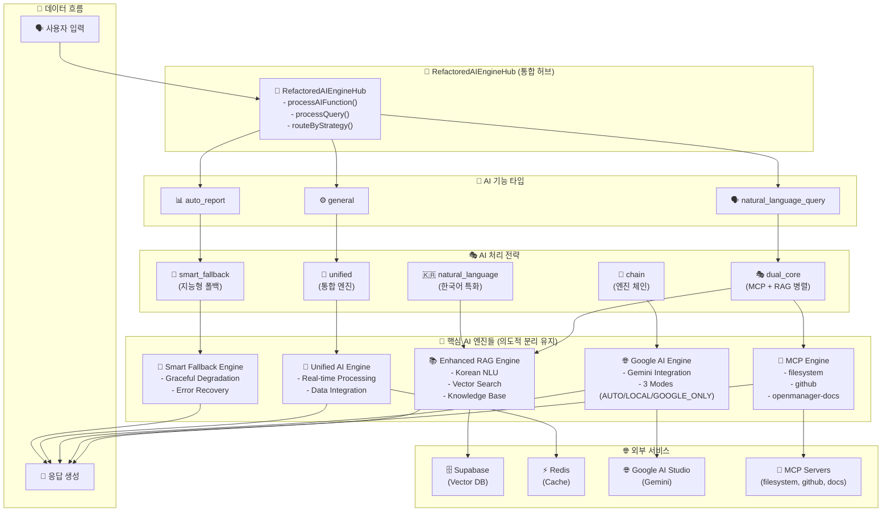

# 🏗️ OpenManager Vibe v5 - 전체 AI 엔진 아키텍처 설계

## 📋 개요

OpenManager Vibe v5는 다중 AI 엔진을 통합 관리하는 RefactoredAIEngineHub를 중심으로 한 확장 가능하고 지능적인 AI 아키텍처를 제공합니다.

## 🏗️ 전체 AI 엔진 아키텍처



## 🎯 RefactoredAIEngineHub - 통합 허브

### 핵심 기능

| 메서드                    | 역할         | 설명                        |
| ------------------------- | ------------ | --------------------------- |
| `processAIFunction()`     | AI 기능 처리 | 자연어 질의, 자동 보고서 등 |
| `processQuery()`          | 질의 처리    | 전략 기반 AI 엔진 라우팅    |
| `routeByStrategy()`       | 전략 라우팅  | 최적 AI 엔진 조합 선택      |
| `analyzeQueryIntent()`    | 의도 분석    | 한국어 특화 의도 분석       |
| `selectOptimalStrategy()` | 전략 선택    | 의도 기반 최적 전략 결정    |

### 코드 구조

```typescript
export class RefactoredAIEngineHub {
  // 🤖 AI 엔진 인스턴스들
  private dualCoreOrchestrator: DualCoreOrchestrator;
  private smartFallbackEngine: SmartFallbackEngine;
  private unifiedAIEngine: UnifiedAIEngine;
  private googleAIModeManager: GoogleAIModeManager;
  private aiEngineChain: AIEngineChain;

  /**
   * 🎯 AI 기능 처리 (자연어 질의, 자동 보고서)
   */
  async processAIFunction(
    functionType: AIFunctionType,
    request: AIHubRequest
  ): Promise<any>;

  /**
   * 🚀 통합 질의 처리
   */
  async processQuery(request: AIHubRequest): Promise<any>;

  /**
   * 🎭 전략별 라우팅
   */
  private async routeByStrategy(
    strategy: AIHubRequest['strategy'],
    request: AIHubRequest
  ): Promise<any>;
}
```

## 🎭 AI 처리 전략

### 1. 🎭 dual_core (MCP + RAG 병렬)

**용도**: 복잡한 분석, 서버 관련 질의  
**특징**:

- MCP와 RAG 엔진 동시 실행
- 결과 융합을 통한 정확도 향상
- 서버 데이터와 지식 베이스 활용

```typescript
// MCP + RAG 병렬 처리
const [mcpResult, ragResult] = await Promise.all([
  mcpEngine.process(query),
  ragEngine.process(query),
]);

// 결과 융합
const fusedResult = this.fuseResults(mcpResult, ragResult);
```

### 2. 🧠 smart_fallback (지능형 폴백)

**용도**: 일반적인 질의, 안정성 우선  
**특징**:

- 3-Tier 폴백 전략
- 우아한 성능 저하
- 높은 가용성 보장

```typescript
// 폴백 체인: Primary → Secondary → Emergency
try {
  return await primaryEngine.process(query);
} catch {
  try {
    return await secondaryEngine.process(query);
  } catch {
    return await emergencyEngine.process(query);
  }
}
```

### 3. 🚀 unified (통합 엔진)

**용도**: 실시간 데이터 처리, 성능 분석  
**특징**:

- 단일 통합 엔진 사용
- 빠른 응답 시간
- 실시간 메트릭 활용

### 4. 🔗 chain (엔진 체인)

**용도**: 예측, 단계적 분석  
**특징**:

- MCP → RAG → Google AI 순차 처리
- 각 단계별 결과 누적
- 복합적 분석 결과 도출

### 5. 🇰🇷 natural_language (한국어 특화)

**용도**: 한국어 전용 처리  
**특징**:

- 한국어 자연어 이해
- 문화적 맥락 고려
- 특화된 응답 생성

## 🤖 핵심 AI 엔진들

### 🔧 MCP Engine

**역할**: 실시간 시스템 데이터 수집  
**구성요소**:

- Filesystem MCP: 파일 시스템 접근
- GitHub MCP: Git 저장소 데이터
- OpenManager Docs MCP: 문서 검색

**특징**:

- 실시간 서버 메트릭 수집
- 파일 시스템 직접 접근
- 코드 저장소 연동

### 📚 Enhanced RAG Engine

**역할**: 지식 기반 응답 생성  
**구성요소**:

- Korean NLU: 한국어 자연어 이해
- Vector Search: 벡터 기반 검색
- Knowledge Base: 전문 지식 저장소

**특징**:

- Supabase 벡터 DB 연동
- 의미론적 검색
- 컨텍스트 인식 응답

### 🌐 Google AI Engine

**역할**: 외부 AI 서비스 연동  
**3가지 모드**:

| 모드          | 설명                         | 사용 시점      |
| ------------- | ---------------------------- | -------------- |
| `AUTO`        | MCP+RAG 우선, Google AI 백업 | 기본 모드      |
| `LOCAL`       | 로컬 엔진만 사용             | 오프라인, 보안 |
| `GOOGLE_ONLY` | Google AI만 사용             | 고성능 필요    |

**특징**:

- Google AI Studio 연동
- Gemini 모델 활용
- 할당량 관리

### 🚀 Unified AI Engine

**역할**: 통합 AI 처리  
**특징**:

- 실시간 데이터 처리
- Redis 캐시 활용
- 성능 최적화

### 🧠 Smart Fallback Engine

**역할**: 지능형 폴백 처리  
**특징**:

- 우아한 성능 저하
- 에러 복구 메커니즘
- 높은 가용성 보장

## 🔄 데이터 흐름

### 1. 입력 단계

```
사용자 질의 → RefactoredAIEngineHub → 의도 분석
```

### 2. 전략 선택 단계

```
의도 분석 → 최적 전략 선택 → AI 엔진 조합 결정
```

### 3. 처리 단계

```
선택된 AI 엔진들 → 병렬/순차 처리 → 결과 융합
```

### 4. 응답 단계

```
융합된 결과 → 응답 최적화 → 최종 응답 생성
```

## 🌐 외부 서비스 연동

### 🗄️ Supabase (Vector Database)

- **용도**: RAG 엔진 벡터 저장
- **기능**: 의미론적 검색, 지식 저장
- **설정**: pgvector 확장, RLS 정책

### ⚡ Redis (Cache)

- **용도**: 성능 최적화, 세션 관리
- **기능**: 쿼리 캐싱, 결과 저장
- **설정**: Upstash Redis, TLS 암호화

### 🌐 Google AI Studio

- **용도**: 외부 AI 서비스
- **기능**: Gemini 모델 활용
- **설정**: API 키 관리, 할당량 제어

### 🔧 MCP Servers

- **용도**: 시스템 데이터 수집
- **기능**: 파일시스템, GitHub, 문서 접근
- **설정**: 개발/서비스 환경 분리

## 🎯 설계 원칙

### ✅ 의도적 분리 유지

- 각 AI 엔진의 고유 역할 보존
- SOLID 원칙 준수
- 확장성과 유지보수성 고려

### ✅ 상호보완적 협업

- 다중 AI 엔진 동시 활용
- 결과 융합을 통한 정확도 향상
- 폴백 메커니즘으로 안정성 보장

### ✅ 성능 최적화

- 병렬 처리로 응답 시간 단축
- 캐싱을 통한 중복 처리 방지
- 지능형 라우팅으로 최적 경로 선택

### ✅ 확장성

- 새로운 AI 엔진 추가 용이
- 전략 패턴으로 유연한 확장
- 모듈화된 아키텍처

### ✅ 한국어 최적화

- 한국어 특화 처리 파이프라인
- 문화적 맥락 고려
- 자연스러운 응답 생성

## 📊 성능 지표

### 응답 시간

- **dual_core**: 150-300ms (병렬 처리)
- **unified**: 50-100ms (단일 엔진)
- **chain**: 200-400ms (순차 처리)
- **smart_fallback**: 100-200ms (폴백 체인)

### 정확도

- **복합 질의**: 85-95% (dual_core)
- **실시간 데이터**: 90-98% (unified)
- **예측 분석**: 80-90% (chain)
- **일반 질의**: 75-85% (smart_fallback)

### 가용성

- **목표**: 99.9% 이상
- **폴백 체인**: 3-Tier 보장
- **에러 복구**: 자동 복구 메커니즘

## 🔮 향후 확장 계획

### 1. 새로운 AI 엔진 추가

- Anthropic Claude 연동
- OpenAI GPT 연동
- 로컬 LLM 지원

### 2. 고급 기능

- 멀티모달 처리 (이미지, 음성)
- 실시간 학습 시스템
- 개인화 추천 엔진

### 3. 성능 최적화

- GPU 가속 처리
- 분산 처리 아키텍처
- 엣지 컴퓨팅 활용

---

**작성일**: 2025년 1월 31일  
**버전**: v5.44.0  
**작성자**: OpenManager Vibe v5 Development Team
