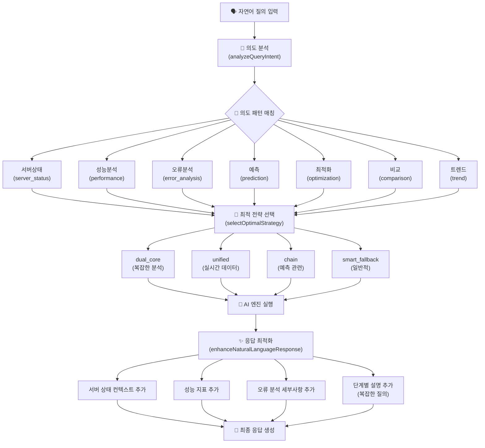

# 🧠 OpenManager Vibe v5 - 자연어 처리 방식 설계

## 📋 개요

OpenManager Vibe v5의 자연어 처리 시스템은 한국어 특화 의도 분석과 지능형 AI 엔진 라우팅을 통해 사용자의 자연어 질의를 효과적으로 처리합니다.

## 🗣️ 자연어 처리 파이프라인



## 🧠 의도 분석 시스템

### 7가지 의도 패턴

| 의도             | 패턴                           | 전략             | 설명                |
| ---------------- | ------------------------------ | ---------------- | ------------------- |
| `server_status`  | 서버\|상태\|모니터링\|헬스     | `dual_core`      | 서버 상태 관련 질의 |
| `performance`    | 성능\|퍼포먼스\|속도\|응답시간 | `unified`        | 성능 분석 관련 질의 |
| `error_analysis` | 오류\|에러\|장애\|문제         | `unified`        | 오류 분석 관련 질의 |
| `prediction`     | 예측\|예상\|forecast           | `chain`          | 예측 관련 질의      |
| `optimization`   | 최적화\|개선\|향상             | `smart_fallback` | 최적화 관련 질의    |
| `comparison`     | 비교\|차이\|대비               | `dual_core`      | 비교 분석 질의      |
| `trend`          | 트렌드\|추세\|변화\|경향       | `smart_fallback` | 트렌드 분석 질의    |

### 의도 분석 로직

```typescript
/**
 * 🧠 자연어 의도 분석
 */
private async analyzeQueryIntent(query: string): Promise<any> {
  // 한국어 특화 의도 분석
  const intentPatterns = {
    server_status: /서버|상태|모니터링|헬스|health|status/i,
    performance: /성능|퍼포먼스|속도|응답시간|latency|performance/i,
    error_analysis: /오류|에러|장애|문제|error|failure|issue/i,
    prediction: /예측|예상|forecast|predict|미래/i,
    optimization: /최적화|개선|향상|optimize|improve/i,
    comparison: /비교|차이|대비|compare|vs/i,
    trend: /트렌드|추세|변화|경향|trend/i,
  };

  const detectedIntents = Object.entries(intentPatterns)
    .filter(([_, pattern]) => pattern.test(query))
    .map(([intent, _]) => intent);

  return {
    primary: detectedIntents[0] || 'general',
    secondary: detectedIntents.slice(1),
    confidence: detectedIntents.length > 0 ? 0.8 : 0.3,
    isComplex: detectedIntents.length > 1,
    requiresData: ['server_status', 'performance', 'error_analysis'].includes(
      detectedIntents[0]
    ),
  };
}
```

## 🎯 전략 선택 알고리즘

### 의도 기반 최적 전략 선택

```typescript
/**
 * 🎯 의도 기반 최적 전략 선택
 */
private selectOptimalStrategy(intentAnalysis: any): AIHubRequest['strategy'] {
  const { primary, requiresData, isComplex } = intentAnalysis;

  // 복잡한 분석이 필요한 경우
  if (isComplex) {
    return 'dual_core'; // MCP + RAG 병렬 처리
  }

  // 실시간 데이터가 필요한 경우
  if (requiresData) {
    return 'unified'; // 통합 엔진 처리
  }

  // 예측 관련 질의
  if (primary === 'prediction') {
    return 'chain'; // 체인 처리
  }

  // 일반적인 질의
  return 'smart_fallback';
}
```

### 전략별 특징

| 전략               | 용도        | 엔진 조합             | 적용 상황            |
| ------------------ | ----------- | --------------------- | -------------------- |
| `dual_core`        | 복잡한 분석 | MCP + RAG 병렬        | 복합 의도, 서버 관련 |
| `unified`          | 실시간 처리 | 통합 엔진             | 실시간 데이터 필요   |
| `chain`            | 연쇄 처리   | MCP → RAG → Google AI | 예측, 단계적 분석    |
| `smart_fallback`   | 일반 질의   | 지능형 폴백           | 단순 질의, 기본 응답 |
| `natural_language` | 한국어 특화 | Korean NLU + RAG      | 한국어 전용 처리     |

## ✨ 응답 최적화 시스템

### 의도별 응답 강화

```typescript
/**
 * ✨ 자연어 응답 최적화
 */
private async enhanceNaturalLanguageResponse(
  result: any,
  intentAnalysis: any
): Promise<any> {
  const { primary, isComplex } = intentAnalysis;

  let enhancedResponse = result.response;

  // 의도별 응답 개선
  if (primary === 'server_status') {
    enhancedResponse = this.addServerStatusContext(enhancedResponse, result);
  } else if (primary === 'performance') {
    enhancedResponse = this.addPerformanceMetrics(enhancedResponse, result);
  } else if (primary === 'error_analysis') {
    enhancedResponse = this.addErrorAnalysisDetails(enhancedResponse, result);
  }

  // 복잡한 질의의 경우 단계별 설명 추가
  if (isComplex) {
    enhancedResponse = this.addStepByStepExplanation(
      enhancedResponse,
      result
    );
  }

  return {
    ...result,
    response: enhancedResponse,
    enhanced: true,
    enhancementType: primary,
  };
}
```

### 응답 강화 방법

1. **서버 상태 컨텍스트 추가**

   ```
   📊 현재 서버 상태 요약:
   - 모니터링 대상: N대
   - 정상 작동: N대
   ```

2. **성능 지표 추가**

   ```
   ⚡ 성능 지표:
   - 평균 응답시간: Nms
   - CPU 사용률: N%
   ```

3. **오류 분석 세부사항 추가**

   ```
   🔍 오류 분석 결과:
   - 감지된 이슈: N개
   - 해결 우선순위: 상/중/하
   ```

4. **단계별 설명 추가** (복잡한 질의)

   ```
   📝 분석 과정:
   1. 데이터 수집
   2. 패턴 분석
   3. 결론 도출
   ```

## 🔄 처리 흐름

### 1. 질의 입력

```typescript
await aiEngineHub.processAIFunction('natural_language_query', {
  query: 'CPU 사용률이 높은 서버를 찾아주세요',
  mode: 'AUTO',
  strategy: 'dual_core',
});
```

### 2. 의도 분석

- 정규표현식 기반 패턴 매칭
- 다중 의도 탐지 (primary/secondary)
- 복잡도 및 데이터 요구사항 분석

### 3. 전략 선택

- 의도 분석 결과 기반 최적 전략 선택
- 복잡도, 데이터 요구사항 고려
- AI 엔진 조합 결정

### 4. AI 엔진 실행

- 선택된 전략에 따른 AI 엔진 실행
- 병렬 처리 또는 체인 처리
- 폴백 메커니즘 적용

### 5. 응답 최적화

- 의도별 컨텍스트 추가
- 복잡한 질의의 경우 단계별 설명
- 사용자 친화적 응답 생성

## 🎯 설계 원칙

### ✅ 한국어 최적화

- 한국어 특화 의도 패턴
- 자연스러운 한국어 응답 생성
- 문화적 맥락 고려

### ✅ 지능형 라우팅

- 의도 기반 자동 AI 엔진 선택
- 복잡도에 따른 적응적 처리
- 최적 성능 보장

### ✅ 확장성

- 새로운 의도 패턴 추가 용이
- 전략 및 AI 엔진 확장 가능
- 모듈화된 아키텍처

### ✅ 사용성

- 직관적인 자연어 질의
- 풍부한 컨텍스트 제공
- 단계별 설명 지원

---

**작성일**: 2025년 1월 31일  
**버전**: v5.44.0  
**작성자**: OpenManager Vibe v5 Development Team
