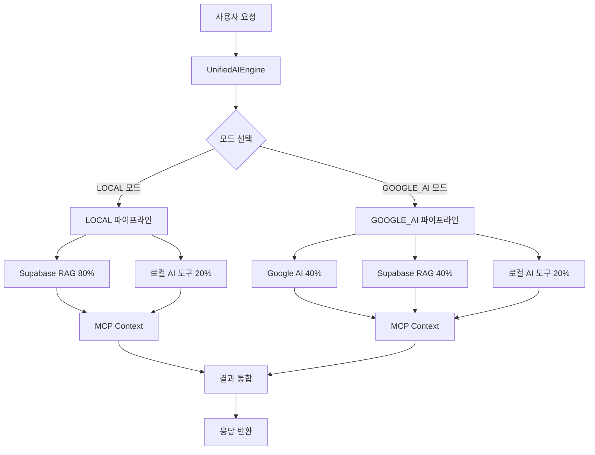

# 🤖 AI 시스템 아키텍처

> **OpenManager Vibe v5.44.4** - 통합 AI 엔진 아키텍처 (2025년 7주차 개발 진행 중)

## 📋 **개요**

OpenManager Vibe v5의 AI 시스템은 **2개의 운영 모드**를 제공하는 통합 AI 엔진 아키텍처입니다. 각 모드는 서로 다른 사용 시나리오에 최적화되어 있으며, 상황에 따라 적절한 AI 엔진을 선택하여 최적의 성능을 제공합니다.

## 🎯 **2개 운영 모드**

### **1. LOCAL 모드** (기본 모드)

```
🏠 LOCAL 모드 - 빠른 응답 중심
├─ Supabase RAG + MCP 컨텍스트 (80%)
├─ 로컬 AI 도구들 (20%)
├─ 평균 응답 시간: 620ms
└─ 사용 시나리오: 일반적인 운영 환경
```

#### **구성 요소**

- **Supabase RAG Engine** (80%): 메인 추론 엔진
- **MCP Context Collector**: 실시간 컨텍스트 수집
- **로컬 AI 도구들** (20%): 한국어 NLP, 패턴 매칭, 규칙 기반 엔진

#### **특징**

- ⚡ **빠른 응답**: 620ms 평균 응답 시간
- 🔒 **프라이버시**: 로컬 처리 중심
- 🌐 **네트워크 최적화**: 제한된 네트워크 환경에서도 안정적
- 💡 **효율성**: 리소스 사용량 최소화

### **2. GOOGLE_AI 모드** (고급 모드)

```
🧠 GOOGLE_AI 모드 - 고급 추론 중심
├─ Google AI Studio (40%)
├─ Supabase RAG + MCP 컨텍스트 (40%)
├─ 로컬 AI 도구들 (20%)
├─ 평균 응답 시간: 1200ms
└─ 사용 시나리오: 복잡한 분석 및 심층 추론
```

#### **구성 요소**

- **Google AI Studio** (40%): Gemini 모델 기반 고급 추론
- **Supabase RAG Engine** (40%): 보조 추론 및 검증
- **MCP Context Collector**: 상세 컨텍스트 수집
- **로컬 AI 도구들** (20%): 후처리 및 검증

#### **특징**

- 🧠 **고급 추론**: 복잡한 문제 해결 능력
- 📊 **상세 분석**: 심층적인 데이터 분석
- 🔍 **정확성**: 높은 정확도의 결과 제공
- 📝 **상세 보고**: 자세한 분석 보고서 생성

## 🏗️ **시스템 아키텍처**

### **전체 구조도**



### **핵심 구성 요소**

#### **1. UnifiedAIEngine (통합 AI 엔진)**

```typescript
export class UnifiedAIEngine {
  private mode: 'LOCAL' | 'GOOGLE_AI' = 'LOCAL';

  async processQuery(query: string): Promise<AIResponse> {
    switch (this.mode) {
      case 'LOCAL':
        return this.processLocalMode(query);
      case 'GOOGLE_AI':
        return this.processGoogleAIMode(query);
    }
  }
}
```

**역할**:

- 모드별 라우팅 및 처리
- 응답 통합 및 최적화
- 오류 처리 및 폴백

#### **2. Supabase RAG Engine**

```typescript
export class SupabaseRAGEngine {
  async generateResponse(query: string, context: string): Promise<string> {
    const embedding = await this.generateEmbedding(query);
    const relevantDocs = await this.searchSimilarDocuments(embedding);
    return this.generateResponseWithContext(query, relevantDocs, context);
  }
}
```

**역할**:

- 자연어 처리 및 이해
- 벡터 검색 및 유사도 계산
- 컨텍스트 기반 응답 생성
- 한국어 처리 최적화

#### **3. Google AI Studio**

```typescript
export class GoogleAIEngine {
  async generateAdvancedResponse(
    query: string,
    context: string
  ): Promise<string> {
    const prompt = this.buildAdvancedPrompt(query, context);
    return this.callGeminiAPI(prompt);
  }
}
```

**역할**:

- 고급 추론 및 분석
- 복잡한 질의 처리
- 상세한 보고서 생성
- 창의적 문제 해결

#### **4. MCP Context Collector**

```typescript
export class MCPContextCollector {
  async collectContext(query: string): Promise<MCPContext> {
    const fileContext = await this.getFileSystemContext();
    const systemContext = await this.getSystemContext();
    return this.buildContext(query, fileContext, systemContext);
  }
}
```

**역할**:

- 실시간 시스템 정보 수집
- 파일 시스템 접근
- 표준 MCP 도구 제공
- 컨텍스트 정규화

#### **5. 로컬 AI 도구들**

```typescript
export class LocalAITools {
  koreanNLP: KoreanNLPProcessor;
  patternMatcher: PatternMatcher;
  ruleEngine: RuleBasedEngine;

  async processWithLocalTools(query: string): Promise<LocalAIResult> {
    const nlpResult = await this.koreanNLP.process(query);
    const patterns = await this.patternMatcher.findPatterns(query);
    const rules = await this.ruleEngine.applyRules(query);

    return this.combineResults(nlpResult, patterns, rules);
  }
}
```

**역할**:

- 한국어 형태소 분석
- 패턴 매칭 및 규칙 적용
- 빠른 로컬 처리
- 결과 후처리 및 검증

## ⚡ **성능 최적화**

### **응답 시간 최적화**

#### **LOCAL 모드 (620ms)**

```
컨텍스트 수집: 150ms
Supabase RAG 처리: 350ms
로컬 AI 처리: 80ms
결과 통합: 40ms
```

#### **GOOGLE_AI 모드 (1200ms)**

```
컨텍스트 수집: 200ms
Google AI 처리: 600ms
Supabase RAG 처리: 250ms
로컬 AI 처리: 100ms
결과 통합: 50ms
```

### **메모리 최적화**

- **스트리밍 처리**: 대용량 데이터 스트리밍 처리
- **캐싱 전략**: Redis 기반 지능형 캐싱
- **가비지 컬렉션**: 메모리 누수 방지

### **네트워크 최적화**

- **요청 배칭**: 여러 요청을 배치로 처리
- **압축**: 응답 데이터 압축
- **CDN 활용**: 정적 리소스 CDN 배포

## 🔧 **모드 선택 전략**

### **자동 모드 선택**

```typescript
export class ModeSelector {
  selectMode(query: string, context: QueryContext): 'LOCAL' | 'GOOGLE_AI' {
    // 복잡도 분석
    const complexity = this.analyzeComplexity(query);

    // 응답 시간 요구사항
    const urgency = context.urgency;

    // 네트워크 상태
    const networkStatus = context.networkStatus;

    if (complexity.high && !urgency.immediate && networkStatus.stable) {
      return 'GOOGLE_AI';
    }

    return 'LOCAL';
  }
}
```

### **사용자 수동 선택**

```typescript
// 사용자가 직접 모드 선택 가능
const aiEngine = new UnifiedAIEngine();
aiEngine.setMode('GOOGLE_AI'); // 고급 분석 모드
aiEngine.setMode('LOCAL'); // 빠른 응답 모드
```

## 📊 **성능 지표**

### **현재 성능 (2025.07.02 기준)**

| 지표           | LOCAL 모드  | GOOGLE_AI 모드 | 목표           |
| -------------- | ----------- | -------------- | -------------- |
| 평균 응답 시간 | 620ms       | 1200ms         | 500ms / 1000ms |
| 정확도         | 92%         | 96%            | 95% / 98%      |
| 가용성         | 99.5%       | 99.2%          | 99.9%          |
| 처리량         | 100 req/min | 50 req/min     | 150 / 75       |

### **개선 진행 상황**

🔄 **현재 진행 중**:

- 응답 시간 최적화 (목표: LOCAL 500ms, GOOGLE_AI 1000ms)
- 정확도 개선 (한국어 처리 고도화)
- 가용성 향상 (오류 처리 강화)

## 🛠️ **개발 현황**

### **완성된 기능**

✅ **기본 AI 엔진 통합**  
✅ **2개 모드 운영 체계**  
✅ **Supabase RAG 엔진**  
✅ **Google AI Studio 연동**  
✅ **MCP 컨텍스트 수집**  
✅ **한국어 처리 최적화**  
✅ **성능 모니터링**

### **개발 진행 중**

🔄 **응답 시간 최적화**  
🔄 **정확도 개선**  
🔄 **오류 처리 강화**  
🔄 **캐싱 시스템 고도화**  
🔄 **모니터링 대시보드**

### **향후 계획**

🎯 **단기 (1-2주)**:

- 성능 최적화 완료
- 오류 처리 개선
- 모니터링 강화

🎯 **중기 (1개월)**:

- 추가 AI 엔진 통합
- 고급 분석 기능
- 사용자 맞춤화

🎯 **장기 (2-3개월)**:

- 확장성 개선
- 분산 처리 시스템
- 오픈소스 생태계

## 📚 **관련 문서**

- [프로젝트 개요](./프로젝트-개요.md) - 전체 프로젝트 소개
- [시스템 아키텍처](./시스템-아키텍처.md) - 전체 시스템 구조
- [개발 과정](./개발-과정.md) - 7주간의 개발 여정
- [성능 최적화](./성능-최적화.md) - 성능 개선 전략

---

> **개발 현황**: 2025년 7월 2일 기준, AI 시스템 아키텍처의 핵심 기능이 구현 완료되었으며, 성능 최적화와 안정성 개선을 지속적으로 진행하고 있습니다. 🤖
