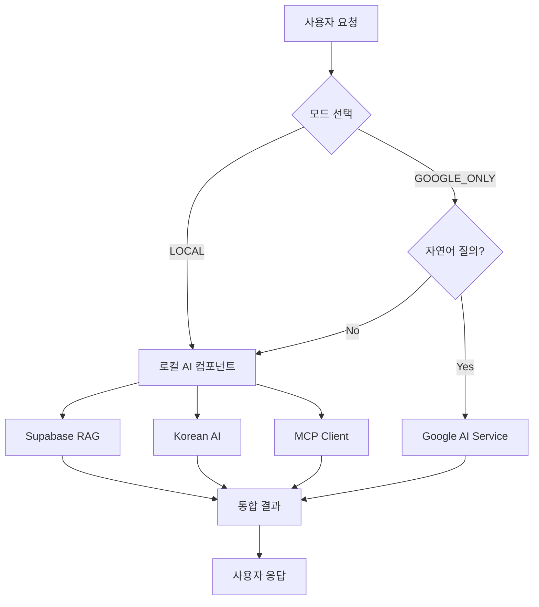

# 🧠 OpenManager Vibe v5 - AI 시스템 아키텍처

## 📊 통합 AI 컴포넌트 구성 (2025년 기준)

### 🎯 AI 엔진 구성 개요

**2-Mode 시스템**: LOCAL | GOOGLE_ONLY

#### 📋 메인 AI 컴포넌트 (3개)

- **Supabase RAG Engine** (자체개발): 벡터 검색 기반 자연어 처리 및 문서 임베딩
- **Google AI Service** (외부 API): 고급 추론 및 **자연어 질의 전용** (GOOGLE_ONLY 모드에서만 활성화)
- **MCP Client** (오픈소스): Model Context Protocol 기반 컨텍스트 수집 및 파일시스템 접근

#### 🔧 하위 AI 컴포넌트 (8개)

##### 자체개발 (3개)

- **Korean AI Engine**: 한국어 특화 자연어 처리
- **Transformers Engine**: 경량화된 ML 모델 처리
- **Custom Unified Engine**: 시스템 통합 및 라우팅

##### 오픈소스 (5개)

- **HuggingFace Transformers**: 사전 훈련된 모델 활용
- **OpenAI Compatible Engine**: OpenAI API 호환 엔진
- **Local LLM Engine**: 로컬 언어 모델 처리
- **Vector Search Engine**: 벡터 기반 유사도 검색
- **Fallback Engine**: 응급 상황 대응 엔진

### 🎛️ AI 모드별 상세 구성

#### 🏠 LOCAL 모드 (완전 구현 - 기본 권장)

- **구성**: Supabase RAG + Korean AI + MCP + 로컬 엔진들
- **특징**: Google AI 비활성화, 완전한 로컬 처리
- **용도**: 프라이버시 중요 작업, 오프라인 환경, 일반적인 서버 관리
- **성능**: 85-90% (완전 구현됨)

#### 🤖 GOOGLE_ONLY 모드 (확장성 비교 및 성능 테스트용)

- **구성**: Google AI + 필요시 로컬 엔진 폴백
- **활용 범위**: **자연어 질의 기능에만 제한적 사용**
- **특징**:
  - Google AI가 베타가 아니라, 이 모드 자체가 확장성 비교용 추가 옵션
  - LOCAL 모드가 완전 구현된 상태에서 성능 비교를 위해 제공
  - 자연어 처리 외에는 로컬 엔진들이 처리
- **용도**: 고급 자연어 분석이 필요한 특수 상황, 성능 벤치마킹
- **성능**: 95-100% (자연어 질의에 한정)

### 🔄 시스템 처리 흐름

### 📈 AI 컴포넌트 상태 관리

#### 🛡️ Graceful Degradation (3단계)

1. **Google Extended**: 모든 AI 컴포넌트 활성화 (GOOGLE_ONLY 모드)
2. **Enhanced**: 로컬 AI 컴포넌트만 활성화 (LOCAL 모드)
3. **Core Only**: 핵심 컴포넌트만 (MCP + 기본 엔진)
4. **Emergency**: 최소 기능만 (룰 기반 응답)

#### 🔍 실시간 모니터링

- 각 AI 컴포넌트별 상태 추적
- 응답 시간 및 성공률 모니터링
- 자동 폴백 및 복구 시스템

### 🎯 핵심 설계 원칙

#### ✅ 명확한 역할 분리

- **LOCAL 모드**: 완전 구현된 기본 시스템 (권장)
- **GOOGLE_ONLY 모드**: 자연어 질의 한정 성능 비교용 추가 옵션
- **Google AI ≠ 베타**: Google AI 자체는 완성된 서비스, 단지 이 프로젝트에서 확장성 테스트용으로 제한적 사용

#### 🔒 보안 및 안정성

- 로컬 우선 처리로 데이터 보안 확보
- 외부 API 의존성 최소화
- 단계적 성능 저하로 서비스 연속성 보장

#### 📊 성능 최적화

- 지능형 라우팅으로 최적 엔진 선택
- 캐싱 시스템으로 응답 속도 향상
- 실시간 성능 모니터링 및 튜닝

### 🛠️ 기술 스택 상세

#### Backend

- **Node.js + TypeScript**: 타입 안전성과 성능 보장
- **Supabase**: 벡터 DB 및 RAG 엔진 기반
- **Redis**: 캐싱 및 세션 관리
- **HuggingFace Transformers**: 로컬 ML 모델

#### AI/ML

- **Google AI Studio (Gemini)**: 자연어 질의 전용 (GOOGLE_ONLY 모드)
- **Korean AI Engine**: 한국어 특화 처리 (자체개발)
- **MCP (Model Context Protocol)**: 컨텍스트 수집
- **Vector Search**: 문서 유사도 검색

#### Infrastructure

- **Vercel**: 서버리스 배포 및 엣지 컴퓨팅
- **Docker**: 개발 환경 표준화
- **GitHub Actions**: CI/CD 파이프라인

### 📝 업데이트 이력

**2025.01.15**: AUTO 모드 제거, 2-Mode 시스템으로 통일  
**2025.01.15**: Google AI 사용 범위를 자연어 질의로 명확히 제한  
**2025.01.15**: "베타" 용어 정리 - Google AI 자체는 베타가 아님을 명시  
**2024.12**: 통합 AI 컴포넌트 아키텍처 구축  
**2024.11**: LOCAL 모드 완전 구현 완료
