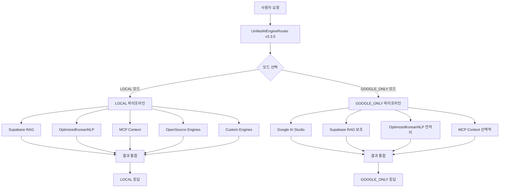

# 🤖 AI 시스템 아키텍처 v3.3.0

> **OpenManager Vibe v5** - 2모드 전용 통합 AI 엔진 아키텍처 (2025년 7월 업데이트)

## 📋 **개요**

OpenManager Vibe v5의 AI 시스템은 **2개의 명확한 운영 모드**를 제공하는 통합 AI 엔진 아키텍처입니다. AUTO 모드를 완전히 제거하여 복잡성을 줄이고, 각 모드는 명확한 처리 경로를 통해 최적의 성능을 제공합니다.

## 🎯 **2개 운영 모드 (AUTO 모드 제거)**

### **1. LOCAL 모드** (완전한 로컬 처리)

```
🏠 LOCAL 모드 - RAG + NLP + MCP + 하위 AI 엔진
├─ Supabase RAG Engine (메인 추론)
├─ OptimizedKoreanNLPEngine (한국어 처리)
├─ MCP Context Collector (실시간 컨텍스트)
├─ OpenSource Engines (보조 처리)
├─ Custom Engines (특화 처리)
├─ 평균 응답 시간: 2-6초 (복잡도별)
└─ 사용 시나리오: 완전한 로컬 환경, 프라이버시 중시
```

#### **구성 요소**

- **Supabase RAG Engine**: 메인 자연어 처리 및 추론
- **OptimizedKoreanNLPEngine**: 5단계 병렬 처리 한국어 NLP
- **MCP Context Collector**: 실시간 시스템 컨텍스트 수집
- **OpenSource Engines**: 오픈소스 AI 모델 통합
- **Custom Engines**: 특화된 커스텀 처리 엔진

#### **특징**

- 🔒 **완전한 프라이버시**: 모든 처리가 로컬에서 수행
- 🌐 **네트워크 독립**: 인터넷 연결 없이도 동작
- 📊 **포괄적 처리**: RAG + NLP + MCP + 하위 AI 엔진 모두 활용
- ⚡ **최적화된 성능**: 단순(2초), 중간(4초), 복잡(6초), 매우복잡(8초)

### **2. GOOGLE_ONLY 모드** (Google AI + 선택적 로컬)

```
🚀 GOOGLE_ONLY 모드 - Google AI + 로컬모드(필요한 부분만)
├─ Google AI Studio (메인 추론 엔진)
├─ Supabase RAG (보조 컨텍스트)
├─ OptimizedKoreanNLPEngine (한국어 전처리)
├─ MCP Context (필요시만)
├─ 평균 응답 시간: 1-3초
└─ 사용 시나리오: 고급 추론, 복잡한 분석, 창의적 문제 해결
```

#### **구성 요소**

- **Google AI Studio**: Gemini 모델 기반 고급 추론 (메인)
- **Supabase RAG**: 보조 컨텍스트 및 검증
- **OptimizedKoreanNLPEngine**: 한국어 전처리 (필요시)
- **MCP Context**: 선택적 시스템 컨텍스트

#### **특징**

- 🧠 **고급 추론**: Google AI의 강력한 추론 능력
- ⚡ **빠른 응답**: 클라우드 처리로 1-3초 응답
- 🎯 **선택적 로컬**: 필요한 부분만 로컬 처리 추가
- 📈 **확장성**: Google AI 인프라 활용

## 🏗️ **시스템 아키텍처 v3.3.0**

### **전체 구조도**



### **핵심 구성 요소**

#### **1. UnifiedAIEngineRouter v3.3.0**

```typescript
/**
 * 🚀 통합 AI 엔진 라우터 v3.3 (2모드 전용)
 *
 * 핵심 모드:
 * - LOCAL: RAG + NLP + MCP + 하위 AI 엔진 (완전한 로컬 처리)
 * - GOOGLE_ONLY: Google AI + 로컬모드(필요한 부분만)
 *
 * 제거된 기능:
 * - AUTO 모드 완전 삭제
 * - 모드 간 자동 전환 로직 제거
 * - 복잡한 가중치 시스템 단순화
 */
export class UnifiedAIEngineRouter {
  private currentMode: 'LOCAL' | 'GOOGLE_ONLY' = 'LOCAL';

  async processQuery(request: AIRequest): Promise<AIResponse> {
    const mode = this.normalizeMode(request.mode);

    switch (mode) {
      case 'LOCAL':
        return this.processLocalMode(request);
      case 'GOOGLE_ONLY':
        return this.processGoogleOnlyMode(request);
    }
  }
}
```

#### **2. LOCAL 모드 처리 파이프라인**

```typescript
private async processLocalMode(request: AIRequest): Promise<AIResponse> {
  const startTime = Date.now();

  try {
    // 1. 한국어 NLP 처리 (병렬)
    const koreanNLPPromise = this.optimizedKoreanNLP.process(request.query);

    // 2. MCP 컨텍스트 수집 (병렬)
    const mcpContextPromise = this.mcpContextCollector?.collectContext(request.query);

    // 3. Supabase RAG 처리 (메인)
    const ragContext = await Promise.all([koreanNLPPromise, mcpContextPromise]);
    const ragResponse = await this.supabaseRAG.generateResponse(
      request.query,
      this.combineContext(ragContext)
    );

    // 4. 보조 엔진들 처리 (병렬)
    const [openSourceResult, customResult] = await Promise.all([
      this.openSourceEngines.process(request.query),
      this.customEngines.process(request.query)
    ]);

    // 5. 결과 통합
    return this.combineLocalResults(ragResponse, openSourceResult, customResult);

  } catch (error) {
    return this.formatErrorResponse(error, startTime, 'LOCAL');
  }
}
```

#### **3. GOOGLE_ONLY 모드 처리 파이프라인**

```typescript
private async processGoogleOnlyMode(request: AIRequest): Promise<AIResponse> {
  const startTime = Date.now();

  try {
    // 1. 한국어 전처리 (필요시)
    const preprocessed = await this.optimizedKoreanNLP.preprocess(request.query);

    // 2. Google AI 메인 처리
    const googleResponse = await this.googleAI.generateResponse(
      preprocessed || request.query,
      request.context
    );

    // 3. 보조 컨텍스트 (선택적)
    const supportContext = await Promise.all([
      this.supabaseRAG.getRelevantContext(request.query),
      this.mcpContextCollector?.collectContext(request.query)
    ]);

    // 4. 결과 검증 및 보완
    return this.enhanceGoogleResponse(googleResponse, supportContext);

  } catch (error) {
    return this.formatErrorResponse(error, startTime, 'GOOGLE_ONLY');
  }
}
```

## ⚡ **성능 최적화**

### **LOCAL 모드 최적화**

```typescript
// 5단계 병렬 처리 파이프라인
const performanceTargets = {
  simple: 2000, // 단순 질의: 2초
  medium: 4000, // 중간 질의: 4초
  complex: 6000, // 복잡 질의: 6초
  veryComplex: 8000, // 매우 복잡: 8초
};

// 품질 목표
const qualityTargets = {
  confidence: 0.75, // 75% 이상 신뢰도
  accuracy: 0.8, // 80% 이상 정확도
  completeness: 0.85, // 85% 이상 완성도
};
```

### **GOOGLE_ONLY 모드 최적화**

```typescript
// 빠른 응답 최적화
const googleOptimization = {
  responseTime: 1000, // 1초 목표
  maxTime: 3000, // 최대 3초
  fallbackTime: 5000, // 폴백 5초
  cacheEnabled: true, // 캐싱 활성화
  streamingEnabled: true, // 스트리밍 응답
};
```

## 🔧 **설정 및 사용법**

### **모드 변경**

```typescript
// 프로그래밍 방식
const router = UnifiedAIEngineRouter.getInstance();
router.setMode('LOCAL');        // 로컬 모드
router.setMode('GOOGLE_ONLY');  // Google AI 모드

// API 호출 방식
POST /api/ai/unified-query
{
  "query": "서버 상태 확인",
  "mode": "LOCAL"  // 또는 "GOOGLE_ONLY"
}
```

### **응답 구조**

```typescript
interface AIResponse {
  success: boolean;
  response: string;
  confidence: number;
  mode: 'LOCAL' | 'GOOGLE_ONLY';
  enginePath: string[];
  processingTime: number;
  fallbacksUsed: number;
  metadata: {
    mainEngine: string;
    supportEngines: string[];
    ragUsed: boolean;
    googleAIUsed: boolean;
    mcpContextUsed: boolean;
    subEnginesUsed: string[];
    isKorean?: boolean;
    qualityScore?: number;
  };
}
```

## 📊 **모니터링 및 통계**

### **성능 메트릭**

```typescript
interface AIEngineStats {
  successfulRequests: number;
  failedRequests: number;
  averageResponseTime: number;
  lastUpdated: string;
  modeDistribution: {
    LOCAL: number;
    GOOGLE_ONLY: number;
  };
  engineUsage: {
    supabaseRAG: number;
    googleAI: number;
    optimizedKoreanNLP: number;
    openSourceEngines: number;
    customEngines: number;
  };
}
```

### **상태 조회**

```typescript
const status = router.getStatus();
console.log(status);
// {
//   router: 'UnifiedAIEngineRouter',
//   version: '3.3.0',
//   mode: 'LOCAL',
//   initialized: true,
//   availableModes: ['LOCAL', 'GOOGLE_ONLY'],
//   stats: { ... },
//   engines: { ... }
// }
```

## 🚀 **향후 계획**

### **v3.4 계획**

- 스트리밍 응답 지원 강화
- 캐싱 시스템 최적화
- 성능 모니터링 대시보드

### **v3.5 계획**

- 커스텀 엔진 플러그인 시스템
- 고급 컨텍스트 관리
- 멀티모달 지원 확장

---

> **마지막 업데이트**: 2025년 7월  
> **버전**: UnifiedAIEngineRouter v3.3.0  
> **상태**: 2모드 전용 시스템 완료
