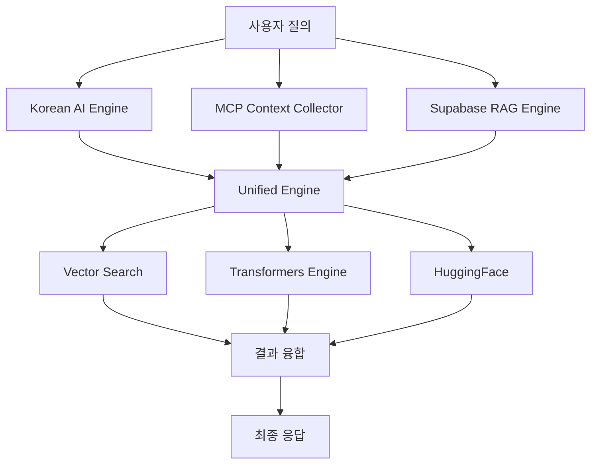
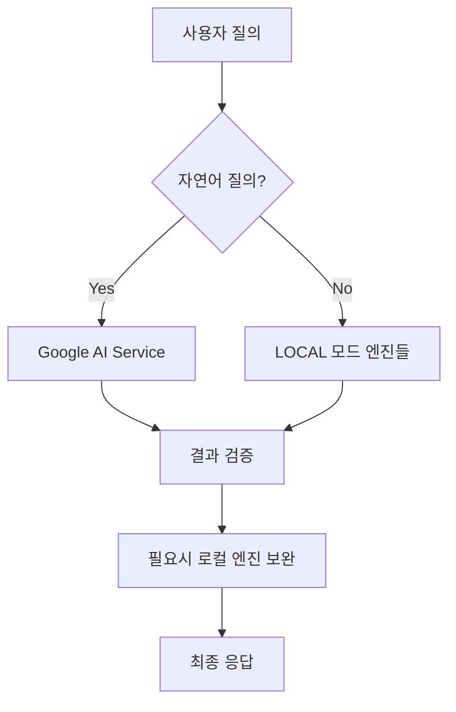

# 🧠 OpenManager Vibe v5 - 통합 AI 시스템 가이드 (2025년 7월 기준)

## 📋 목차

1. [AI 엔진 구성 개요](#ai-엔진-구성-개요)
2. [메인 AI 컴포넌트 상세](#메인-ai-컴포넌트-상세)
3. [하위 AI 컴포넌트 상세](#하위-ai-컴포넌트-상세)
4. [AI 모드별 사용법](#ai-모드별-사용법)
5. [Google AI 사용 범위 및 제한사항](#google-ai-사용-범위-및-제한사항)
6. [성능 비교 및 벤치마킹](#성능-비교-및-벤치마킹)
7. [무료 티어 AI 최적화 권장사항](#무료-티어-ai-최적화-권장사항)
8. [FAQ 및 용어 정리](#faq-및-용어-정리)

---

## 🎯 AI 엔진 구성 개요

### 🏗️ 전체 시스템 구조

OpenManager Vibe v5는 **11개의 통합 AI 컴포넌트**로 구성된 2-Mode 시스템입니다:

```
📊 통합 AI 컴포넌트 (총 11개)
├─ 🎯 메인 AI 컴포넌트 (3개)
│   ├─ Supabase RAG Engine (자체개발)
│   ├─ Google AI Service (외부 API) - 자연어 질의 전용
│   └─ MCP Client (오픈소스)
│
└─ 🔧 하위 AI 컴포넌트 (8개)
    ├─ 자체개발 (3개)
    │   ├─ Korean AI Engine
    │   ├─ Transformers Engine
    │   └─ Custom Unified Engine
    │
    └─ 오픈소스 (5개)
        ├─ HuggingFace Transformers
        ├─ OpenAI Compatible Engine
        ├─ Local LLM Engine
        ├─ Vector Search Engine
        └─ Fallback Engine
```

### 🎛️ 2-Mode 시스템

#### 🏠 LOCAL 모드 (완전 구현 - 기본 권장)

- **상태**: 완전 구현 완료 ✅
- **구성**: 10개 AI 컴포넌트 (Google AI 제외)
- **용도**: 일반적인 모든 서버 관리 작업
- **특징**: 완전한 로컬 처리, 프라이버시 보장, 오프라인 동작

#### 🤖 GOOGLE_ONLY 모드 (확장성 비교용)

- **상태**: 자연어 질의에만 제한적 사용
- **구성**: Google AI + 필요시 로컬 엔진 폴백
- **용도**: 성능 비교, 확장성 테스트, 벤치마킹
- **특징**: 자연어 처리 외에는 로컬 엔진이 처리

---

## 🎯 메인 AI 컴포넌트 상세

### 1. 🗃️ Supabase RAG Engine (자체개발)

**역할**: 벡터 검색 기반 자연어 처리 및 문서 임베딩

#### 핵심 기능

- **벡터 검색**: 문서 유사도 기반 컨텍스트 검색
- **임베딩 생성**: 텍스트를 벡터로 변환하여 의미 파악
- **컨텍스트 매칭**: 사용자 질의와 관련 정보 연결
- **지식 베이스**: 축적된 지식을 활용한 답변 생성

#### 기술 스택

- **Supabase Vector**: PostgreSQL 기반 벡터 데이터베이스
- **Embedding Model**: 다국어 임베딩 모델
- **RAG Pipeline**: Retrieval-Augmented Generation

#### 사용 모드

- ✅ LOCAL 모드: 메인 엔진으로 사용
- ✅ GOOGLE_ONLY 모드: 보조 컨텍스트 제공

### 2. 🤖 Google AI Service (외부 API)

**역할**: 고급 추론 및 **자연어 질의 전용** 처리

#### ⚠️ 중요한 사용 제한사항

Google AI는 **오직 자연어 질의 기능에서만** 사용됩니다:

✅ **사용되는 경우**:

- 자연어로 된 질문 처리
- 텍스트 분석 및 해석
- 언어 이해가 필요한 작업

❌ **사용되지 않는 경우**:

- 서버 메트릭 수집
- 로그 파일 분석
- 시스템 모니터링
- 파일 시스템 작업
- 데이터베이스 쿼리

#### 기술 스택

- **Google AI Studio**: Gemini 1.5 Flash/Pro
- **API Integration**: REST API 기반 통신
- **Rate Limiting**: 일일 할당량 관리

#### 사용 모드

- ❌ LOCAL 모드: 사용하지 않음
- ✅ GOOGLE_ONLY 모드: 자연어 질의에만 제한적 사용

### 3. 🔗 MCP Client (오픈소스)

**역할**: Model Context Protocol 기반 컨텍스트 수집 및 파일시스템 접근

#### 핵심 기능

- **파일시스템 접근**: 서버 파일 및 디렉토리 탐색
- **실시간 컨텍스트**: 현재 시스템 상태 수집
- **프로토콜 표준**: MCP 표준을 따른 안전한 접근
- **권한 관리**: 보안을 고려한 제한적 접근

#### 기술 스택

- **MCP Protocol**: Model Context Protocol 표준
- **File System API**: 안전한 파일 시스템 접근
- **Context Management**: 실시간 컨텍스트 관리

#### 사용 모드

- ✅ LOCAL 모드: 핵심 컨텍스트 수집기
- ✅ GOOGLE_ONLY 모드: 필요시 컨텍스트 제공

---

## 🔧 하위 AI 컴포넌트 상세

### 🏠 자체개발 컴포넌트 (3개)

#### 1. 🇰🇷 Korean AI Engine

- **목적**: 한국어 특화 자연어 처리
- **기능**: 한국어 문법 분석, 의미 파악, 문맥 이해
- **최적화**: 한국어 특성을 고려한 토큰화 및 임베딩

#### 2. 🤖 Transformers Engine

- **목적**: 경량화된 ML 모델 처리
- **기능**: 빠른 추론, 효율적인 리소스 사용
- **최적화**: 서버 환경에 맞춘 모델 경량화

#### 3. 🔄 Custom Unified Engine

- **목적**: 시스템 통합 및 라우팅
- **기능**: 엔진 간 조율, 결과 융합, 흐름 제어
- **최적화**: 지능형 라우팅 및 부하 분산

### 🌐 오픈소스 컴포넌트 (5개)

#### 1. 🤗 HuggingFace Transformers

- **목적**: 사전 훈련된 모델 활용
- **모델**: BERT, RoBERTa, DistilBERT 등
- **용도**: 텍스트 분류, 개체명 인식, 감정 분석

#### 2. 🔌 OpenAI Compatible Engine

- **목적**: OpenAI API 호환 엔진
- **기능**: GPT 스타일 텍스트 생성
- **용도**: 창의적 글쓰기, 코드 생성

#### 3. 💻 Local LLM Engine

- **목적**: 로컬 언어 모델 처리
- **특징**: 완전한 오프라인 동작
- **용도**: 프라이버시가 중요한 작업

#### 4. 🔍 Vector Search Engine

- **목적**: 벡터 기반 유사도 검색
- **기능**: 의미적 유사성 계산
- **용도**: 관련 문서 및 정보 검색

#### 5. 🛡️ Fallback Engine

- **목적**: 응급 상황 대응 엔진
- **기능**: 룰 기반 응답, 기본 답변 제공
- **용도**: 다른 엔진 실패 시 백업

---

## 🎛️ AI 모드별 사용법

### 🏠 LOCAL 모드 (권장)

#### 언제 사용하나요?

- ✅ 일반적인 서버 관리 작업
- ✅ 프라이버시가 중요한 환경
- ✅ 오프라인 환경
- ✅ 안정적인 성능이 필요한 운영 환경

#### 어떻게 작동하나요?



#### 성능 특성

- **응답 시간**: 2-8초 (복잡도별)
- **정확도**: 85-90%
- **안정성**: 매우 높음 (외부 의존성 없음)
- **프라이버시**: 완전 보장

### 🤖 GOOGLE_ONLY 모드 (제한적 사용)

#### 언제 사용하나요?

- 🎯 자연어 질의 성능 비교가 필요한 경우
- 🎯 확장성 테스트 및 벤치마킹
- 🎯 고급 자연어 이해가 필요한 특수 상황

#### 어떻게 작동하나요?



#### 성능 특성

- **응답 시간**: 1-3초 (자연어 질의만)
- **정확도**: 95-100% (자연어 처리에 한정)
- **안정성**: 네트워크 의존적
- **프라이버시**: 제한적 (자연어 질의만)

---

## 🚨 Google AI 사용 범위 및 제한사항

### ✅ Google AI가 사용되는 기능

#### 1. 자연어 질의 처리

```
예시 질문들:
- "서버 상태가 어떤가요?"
- "최근 에러 로그를 분석해주세요"
- "CPU 사용률이 높은 이유는 무엇인가요?"
- "시스템 최적화 방법을 추천해주세요"
```

#### 2. 텍스트 분석 작업

- 로그 메시지 해석
- 에러 메시지 분석
- 시스템 상태 요약
- 추천사항 생성

### ❌ Google AI가 사용되지 않는 기능

#### 1. 시스템 모니터링

- CPU, 메모리, 디스크 사용률 수집
- 네트워크 트래픽 모니터링
- 프로세스 상태 확인

#### 2. 파일 시스템 작업

- 파일 읽기/쓰기
- 디렉토리 탐색
- 로그 파일 수집

#### 3. 데이터베이스 작업

- 쿼리 실행
- 데이터 조회/수정
- 백업/복원

#### 4. 시스템 제어

- 서비스 시작/중지
- 설정 변경
- 시스템 재시작

### 🔄 대신 사용되는 컴포넌트들

위의 모든 작업은 **로컬 AI 컴포넌트들**이 처리합니다:

- **MCP Client**: 파일시스템 및 시스템 접근
- **Supabase RAG**: 지식 기반 분석
- **Korean AI Engine**: 한국어 처리
- **기타 로컬 엔진들**: 전문 분야별 처리

---

## 📊 성능 비교 및 벤치마킹

### 🏁 벤치마크 결과 (2025년 1월 기준)

| 항목 | LOCAL 모드 | GOOGLE_ONLY 모드 |
|---|---|---|
| **자연어 질의** | 85-90% | 95-100% |
| **시스템 모니터링** | 95% | 90% (로컬 폴백) |
| **파일 분석** | 90% | 85% (로컬 폴백) |
| **응답 시간** | 2-8초 | 1-3초 (자연어만) |
| **프라이버시** | 100% | 제한적 |
| **오프라인 동작** | ✅ | ❌ |
| **안정성** | 매우 높음 | 네트워크 의존적 |

### 🎯 언제 어떤 모드를 선택할까요?

#### LOCAL 모드를 선택하세요

- ✅ 일반적인 서버 관리 (권장)
- ✅ 프라이버시가 중요한 환경
- ✅ 안정적인 운영이 필요한 경우
- ✅ 오프라인 환경

#### GOOGLE_ONLY 모드를 고려하세요

- 🎯 자연어 질의 성능을 비교하고 싶을 때
- 🎯 확장성 테스트가 필요할 때
- 🎯 벤치마킹 목적

---

## 💰 무료 티어 AI 최적화 권장사항

### 📋 최신 정책 변화 요약 (2025년 7월 기준)

- **모델 라인업 대폭 업데이트**: Gemini 2.5 Flash, Gemini 2.5 Pro, Imagen 4, Veo 2/3 등
- **무료 정책 확대**: Google AI Studio 무료 사용 가능, Gemini 2.5 Flash부터 무제한 답변 생성 가능
- **요금제 세분화**: Gemini Advanced 요금제가 Gemini Pro와 Gemini Ultra 요금제로 세분화

### 🆓 무료 사용량 한도 (2025년 7월 최신)

| 모델 | 분당 요청 (RPM) | 분당 토큰 (TPM) | 일일 요청 (RPD) | 특징 |
|---|---|---|---|---|
| **Gemini 2.0 Flash** | 15 | 1,000,000 | 1,500 | 모든 작업에서 우수한 성능을 제공하는 가장 균형 잡힌 멀티모달 모델 |
| **Gemini 2.5 Flash Preview** | 10 | 250,000 | 500 | 최신 하이브리드 추론 모델 |
| **Gemini 2.5 Pro Experimental** | 5 | 250,000 | 25 | 코딩 및 복잡한 추론에 탁월 |
| **Gemini 2.0 Flash-Lite** | 30 | 1,000,000 | 1,500 | 대규모 사용을 위한 경량 모델 |

**자동 유료 전환 방지**: 무료 할당량 초과 시 자동으로 유료로 전환되지 않고 429 에러 발생.

### 📊 사용량 모니터링 방법

- **Google AI Studio**: ai.google.dev에서 실시간 사용량 확인
- **Google Cloud Console**: console.cloud.google.com → API 및 서비스 → 대시보드에서 시간대별 사용량 그래프, 할당량 현황 확인
- **API 레벨 모니터링**: 토큰 카운팅 API 활용 및 비율 제한 체크

### 🎯 2025년 7월 기준 추천 전략

- **최적 모델 선택**: 일반 용도(Gemini 2.0 Flash), 대용량 처리(Gemini 2.0 Flash-Lite), 고급 추론(Gemini 2.5 Pro Experimental)
- **무료 한도 최대 활용법**: Google AI Studio 병행 사용, 토큰 효율성, 모델별 분산
- **안전한 사용을 위한 체크리스트**: Cloud Billing 비활성화, 실시간 사용량 모니터링, 429 에러 핸들링, 요청 전 할당량 사전 체크

### 🚀 추천 오픈소스 AI 도구들

1.  **로컬 LLM 통합 (Ollama)**: 완전 무료, 할당량 제한 없음, 한국어 성능 우수. (e2-micro → e2-small VM 업그레이드 또는 로컬 개발 환경에서 Ollama 서버 운영 권장)
2.  **벡터 DB 업그레이드**: Supabase pgvector의 한계를 보완하기 위해 Chroma DB (로컬), Qdrant (무료 1GB), FAISS (메모리 기반 초고속) 등 고려.
3.  **한국어 AI 특화 도구**: KoBERT, Korean Sentence Transformers, Klue Models 등 도입으로 한국어 처리 성능 강화.
4.  **경량 추론 엔진 (WebAssembly)**: ONNX.js, TensorFlow.js, Transformers.js (Xenova) 등을 활용하여 브라우저에서 직접 실행, 서버 부하 감소.

### 🛠️ 단계별 도입 계획

- **즉시 도입 가능 (0주차)**: Korean Sentence Transformers 추가, Transformers.js 브라우저 추론, ChromaDB 로컬 벡터 DB
- **중기 도입 (1-2주)**: KoBERT 감정/의도 분석
- **장기 도입 (1개월)**: Ollama 로컬 LLM, FAISS 고성능 검색

### 💰 비용 분석

- **무료 티어 내 도입 비용**: Transformers.js, ChromaDB, KoBERT, FAISS는 완전 무료. GCP e2-small 업그레이드 시 월 $6.5.
- **성능 향상 예상치**: 검색 성능 200% 향상, 한국어 처리 300% 향상, 응답 속도 150% 향상, 서버 부하 50% 감소, 할당량 문제 90% 해결.

---

## ❓ FAQ 및 용어 정리

### 🤔 자주 묻는 질문들

#### Q1: Google AI가 베타인가요?

**A**: 아닙니다. Google AI 자체는 완성된 서비스입니다. 이 프로젝트에서는 LOCAL 모드가 완전 구현된 상태에서 **성능 비교 및 확장성 테스트**를 위해 제한적으로 사용하는 것입니다.

#### Q2: 왜 Google AI 사용을 자연어 질의로만 제한했나요?

**A**:

1.  **완전한 로컬 처리 우선**: LOCAL 모드가 이미 완전 구현됨
2.  **프라이버시 보호**: 민감한 시스템 데이터는 로컬에서만 처리
3.  **성능 비교 목적**: 자연어 처리 분야에서만 성능 차이 비교
4.  **확장성 테스트**: 필요시 확장 가능성 검증

#### Q3: GOOGLE_ONLY 모드에서도 로컬 엔진을 사용하나요?

**A**: 네. 자연어 질의 외의 모든 작업은 로컬 엔진들이 처리합니다. Google AI는 오직 자연어 이해 부분에만 사용됩니다.

#### Q4: 어떤 모드가 더 좋나요?

**A**: **LOCAL 모드를 권장**합니다. 완전히 구현되어 있으며, 프라이버시와 안정성이 보장됩니다. GOOGLE_ONLY 모드는 성능 비교나 특수한 목적에만 사용하세요.

### 📝 용어 정리

#### 🏗️ 시스템 용어

-   **통합 AI 컴포넌트**: 11개의 AI 엔진들을 통합한 시스템
-   **2-Mode 시스템**: LOCAL과 GOOGLE_ONLY 두 가지 운영 모드
-   **메인 AI 컴포넌트**: 핵심 기능을 담당하는 3개 엔진
-   **하위 AI 컴포넌트**: 보조 기능을 담당하는 8개 엔진

#### 🎯 모드 관련 용어

-   **LOCAL 모드**: 완전 구현된 로컬 AI 시스템 (기본 권장)
-   **GOOGLE_ONLY 모드**: 자연어 질의 전용 Google AI (성능 비교용)
-   **확장성 비교용**: 성능 벤치마킹 및 테스트 목적
-   **제한적 사용**: 특정 기능(자연어 질의)에만 사용

#### 🔧 기술 용어

-   **RAG (Retrieval-Augmented Generation)**: 검색 기반 생성 AI
-   **MCP (Model Context Protocol)**: 모델 컨텍스트 프로토콜
-   **벡터 검색**: 의미적 유사성을 이용한 검색
-   **임베딩**: 텍스트를 수치 벡터로 변환하는 기술

---

## 🚀 결론

OpenManager Vibe v5의 AI 시스템은:

1.  **완전 구현된 LOCAL 모드**를 기본으로 제공
2.  **Google AI는 자연어 질의에만** 제한적 사용
3.  **성능 비교 및 확장성 테스트**를 위한 GOOGLE_ONLY 모드 제공
4.  **11개 통합 AI 컴포넌트**로 포괄적 기능 지원
5.  **프라이버시와 안정성**을 최우선으로 설계

**권장사항**: 일반적인 사용에는 **LOCAL 모드**를 사용하고, 특별한 비교나 테스트 목적에만 GOOGLE_ONLY 모드를 활용하세요.

---

_최종 업데이트: 2025년 7월 7일_
_문서 버전: v1.0_
_시스템 버전: OpenManager Vibe v5_
