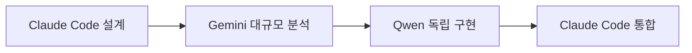
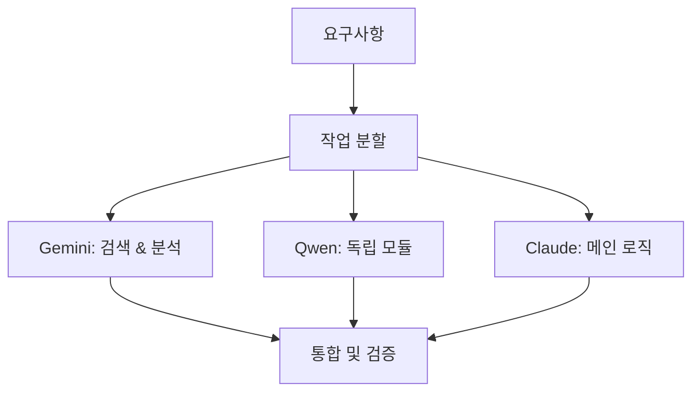
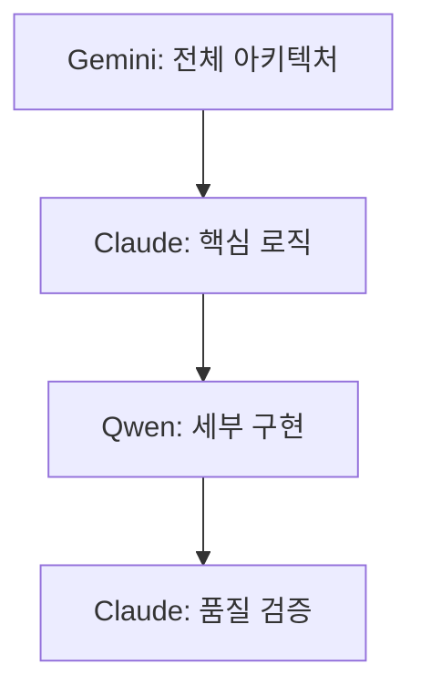

# 🔍 AI 개발 도구 상세 비교 분석

> **Claude Code vs Gemini CLI vs Qwen Code CLI**  
> **최신 업데이트**: 2025-08-15

## 📊 종합 비교표

| 항목          | Claude Code     | Gemini CLI                    | Qwen Code CLI            |
| ------------- | --------------- | ----------------------------- | ------------------------ |
| **개발사**    | Anthropic       | Google                        | Alibaba                  |
| **모델**      | Claude 3.5/4    | Gemini 2.5 Pro                | Qwen3-Coder (480B MoE)   |
| **컨텍스트**  | 표준            | 1M 토큰                       | 256K→1M 토큰             |
| **일일 한도** | 메인 도구       | 1,000회                       | 오픈소스 (무제한\*)      |
| **분당 제한** | -               | 60회                          | API 의존적               |
| **특화 영역** | 정밀 개발, 조율 | Google 생태계, 자동화         | Agentic 코딩, 프라이버시 |
| **내장 도구** | MCP 서버 11개   | Google Search, GitHub Actions | 코드 분석, PR 자동화     |
| **설치 방식** | 내장            | npx, npm, brew                | npm, 소스 클론           |
| **라이선스**  | 상용            | 오픈소스                      | Apache 2.0               |
| **보안**      | 엔터프라이즈급  | v0.1.14+ 필수                 | 로컬 실행 가능           |

## 🎯 시나리오별 최적 도구 선택

### 📝 일반 개발 작업

**추천: Claude Code**

```typescript
// 표준 개발 워크플로우
const feature = await claudeCode('새 기능 구현');
// 높은 정확도, 안정적 성능
```

**사용 사례:**

- 일상적인 코딩 작업
- 버그 수정 및 리팩토링
- 코드 리뷰 및 최적화
- 서브에이전트 활용 작업

### 🔍 대규모 코드베이스 분석

**추천: Gemini CLI**

```bash
# 500+ 파일 동시 분석
gemini analyze --files "src/**/*.ts" --context-window 1000000
```

**사용 사례:**

- 레거시 코드 분석
- 전체 아키텍처 리팩토링
- 의존성 분석 및 최적화
- 성능 병목 지점 찾기

### 🌐 실시간 웹 검색 필요

**추천: Gemini CLI**

```bash
# 최신 정보와 코드 통합
gemini search "React 19 new features" --integrate-with-code
```

**사용 사례:**

- 최신 라이브러리 정보 검색
- 호환성 확인
- 모범 사례 연구
- 트러블슈팅 솔루션 검색

### 🔒 민감한 코드 처리

**추천: Qwen Code CLI**

```bash
# 로컬 실행으로 프라이버시 보장
qwen-code analyze --local-only --secure-mode
```

**사용 사례:**

- 기업 내부 코드
- 보안이 중요한 프로젝트
- API 키 및 인증 정보 처리
- 자체 호스팅 환경

### 🚀 GitHub 자동화

**추천: Gemini CLI**

```bash
# GitHub Actions 네이티브 지원
gemini github --auto-review --create-workflow
```

**사용 사례:**

- PR 자동 리뷰
- CI/CD 파이프라인 구성
- 이슈 자동 처리
- 릴리스 노트 생성

### ⚡ 병렬 모듈 개발

**추천: Qwen Code CLI**

```bash
# 독립적인 모듈 동시 개발
qwen-code generate --module auth --parallel
```

**사용 사례:**

- 독립적인 기능 모듈 개발
- 마이크로서비스 아키텍처
- 프로토타입 빠른 생성
- A/B 테스트용 변형 구현

### 🎓 전문 영역 작업

**추천: Claude Code 서브에이전트**

```typescript
await Task({
  subagent_type: 'security-auditor',
  prompt: '보안 취약점 전문 분석',
});
```

**사용 사례:**

- 보안 감사
- 성능 최적화
- 데이터베이스 관리
- AI/ML 시스템 구축

## 💡 협업 워크플로우 패턴

### 패턴 1: 순차 처리



### 패턴 2: 병렬 처리



### 패턴 3: 계층별 처리



## 📈 성능 및 비용 분석

### 응답 속도 비교

| 작업 유형   | Claude Code | Gemini CLI | Qwen CLI   |
| ----------- | ----------- | ---------- | ---------- |
| 일반 코딩   | ⭐⭐⭐⭐⭐  | ⭐⭐⭐     | ⭐⭐⭐⭐   |
| 대규모 분석 | ⭐⭐⭐      | ⭐⭐⭐⭐⭐ | ⭐⭐⭐⭐   |
| 웹 검색     | ⭐⭐        | ⭐⭐⭐⭐⭐ | ⭐⭐       |
| 로컬 처리   | ⭐⭐⭐⭐    | ⭐⭐       | ⭐⭐⭐⭐⭐ |

### 비용 효율성

- **Claude Code**: 메인 도구, 표준 비용
- **Gemini CLI**: 1,000회/일 무료 (추가 비용 발생 가능)
- **Qwen CLI**: 완전 무료 (자체 호스팅 시)

## 🛠️ 도구별 설정 가이드

### Claude Code (기본 설정 완료)

```bash
# 이미 설정됨, MCP 서버 11개 정상 작동
ccusage statusline  # 사용량 모니터링
```

### Gemini CLI 설정

```bash
# 설치 및 인증
npm install -g @google/gemini-cli
gemini auth login

# 프로젝트 연동
gemini init --project openmanager-vibe-v5
```

### Qwen CLI 설정

```bash
# 설치
npm install -g @qwen-code/qwen-code

# 환경 설정
export QWEN_ENDPOINT=https://api.qwen.alibaba.com
export QWEN_API_KEY=your_key
```

## 🚦 사용 가이드라인

### 우선순위 원칙

1. **Claude Code**: 기본 개발 도구 (메인)
2. **Gemini CLI**: 대규모 작업 및 검색 (보조)
3. **Qwen CLI**: 병렬 개발 및 프라이버시 (특수)

### 효율적 활용법

- **작업 분할**: 복잡한 작업은 여러 도구로 분할
- **강점 활용**: 각 도구의 특화 기능 극대화
- **비용 관리**: 무료 티어 한도 모니터링
- **품질 검증**: 최종적으로 Claude Code로 통합 검증

## 🔗 관련 문서

- [Claude Code 서브에이전트 가이드](../claude/sub-agents-comprehensive-guide.md)
- [Gemini CLI 활용법](./gemini-cli-guide.md)
- [Qwen CLI 가이드](./qwen-cli-guide.md)
- [MCP 서버 설정](../MCP-SETUP-GUIDE.md)

---

> **결론**: 각 도구의 강점을 이해하고 상황에 맞게 선택하여 개발 효율성을 극대화하세요.
