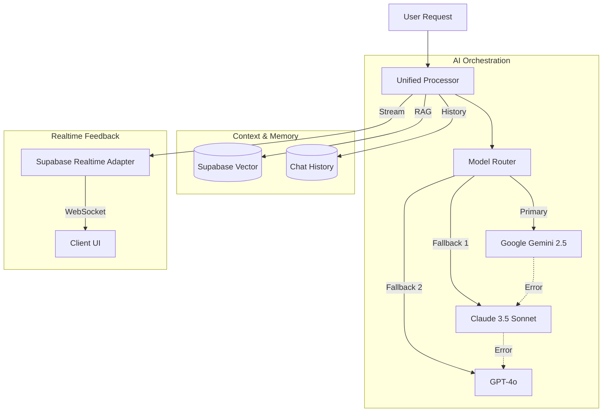

# 🧠 AI Engine Architecture

## Overview

The AI Engine is the core of the **AX (AI Experience)**, providing intelligent insights, anomaly detection, and automated troubleshooting. It uses a **Unified Processor** architecture to efficiently route requests to the best available AI model.

## 🏗️ Core Stack

| Component | Technology | Purpose |
|-----------|------------|---------|
| **Primary Model** | Google Gemini 2.5 | High performance, large context window |
| **Fallback Models** | Claude 3.5, GPT-4o | Reliability, cross-validation |
| **Orchestrator** | Unified Processor | Request routing, context management |
| **Memory** | Supabase PostgreSQL | Long-term memory, vector storage |
| **Streaming** | Supabase Realtime | Live "Thinking" steps streaming |

## 📐 Architecture Diagram

## 🧩 Key Components

### 1. Unified Processor
- **Single Entry Point**: All AI interactions go through a central processor.
- **Context Awareness**: Automatically injects relevant system metrics and logs.
- **Prompt Engineering**: Dynamic prompt construction based on task type.

### 2. Supabase Realtime Adapter
- **Streaming Thinking Process**: Instead of waiting for the full response, the AI streams its "thinking steps" (e.g., "Analyzing logs...", "Checking metrics...") to the client via Supabase Realtime.
- **Persistence**: Thinking steps are stored in PostgreSQL for audit and debugging.

### 3. Multi-Model Fallback
- **High Availability**: If the primary model (Gemini) fails or is rate-limited, the system automatically retries with secondary models (Claude, GPT).
- **Cross-Validation**: Critical decisions can be cross-validated by multiple models (optional configuration).

## 📊 RAG (Retrieval-Augmented Generation)

- **Vector Store**: Uses `pgvector` in Supabase.
- **Embeddings**: Generates embeddings for documentation and past incident reports.
- **Retrieval**: Semantically searches for similar past issues to provide context-aware solutions.
