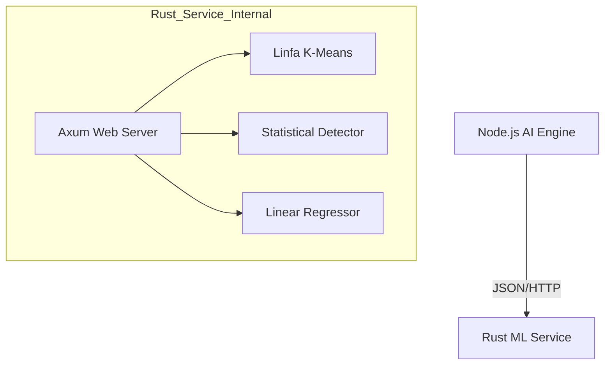

# Rust ML Inference Service Architecture

## Overview
The **Rust ML Inference Service** (`rust-inference`) is a high-performance microservice deployed on Cloud Run. It provides specialized machine learning capabilities to the AI Engine, leveraging Rust's safety and speed.

## Core Capabilities

### 1. Log Pattern Clustering (New ⭐)
*   **Library**: `linfa` (Rust Machine Learning Framework)
*   **Algorithm**: K-Means Clustering (`linfa-clustering`)
*   **Vectorization**: Hashing Trick (Fixed-size float vectors)
*   **Purpose**: Groups unstructured text logs into semantic clusters to identify patterns (e.g., "Auth Errors", "Timeouts").
*   **Endpoint**: `POST /api/clustering`

### 2. Anomaly Detection
*   **Algorithm**: Statistical Moving Average (26-hour window) + 2σ Threshold
*   **Purpose**: Detects spikes or drops in CPU/Memory usage.
*   **Endpoint**: `POST /api/anomaly`

### 3. Trend Prediction
*   **Algorithm**: Linear Regression (`linfa` or custom implementation)
*   **Purpose**: Forecasts future metric trends (1-hour horizon).
*   **Endpoint**: `POST /api/trend`

## Architecture Diagram



## Docker Deployment

The service utilizes a **Multi-stage Docker Build** optimized for Cloud Run.

### Dockerfile Highlights
*   **Base Image**: `rust:1.83-alpine` (Builder) -> `alpine:3.21` (Runtime)
*   **Size**: Optimized to < 20MB (Static linking with `musl`)
*   **Security**: Runs as non-root `appuser`.

### Build & Run
```bash
# In cloud-run/rust-inference directory
docker build -t rust-inference .
docker run -p 8080:8080 rust-inference
```

## Integration
The AI Engine (`ai-engine`) communicates via the `rust-ml-client.ts` library.
*   **Client**: `src/lib/rust-ml-client.ts`
*   **Tools**: `Analyst Agent` utilizes these endpoints via `clusterLogPatternsTool`.

## Performance
*   **Cold Start**: ~150ms
*   **Inference Time**: < 10ms for clustering 50 logs.
