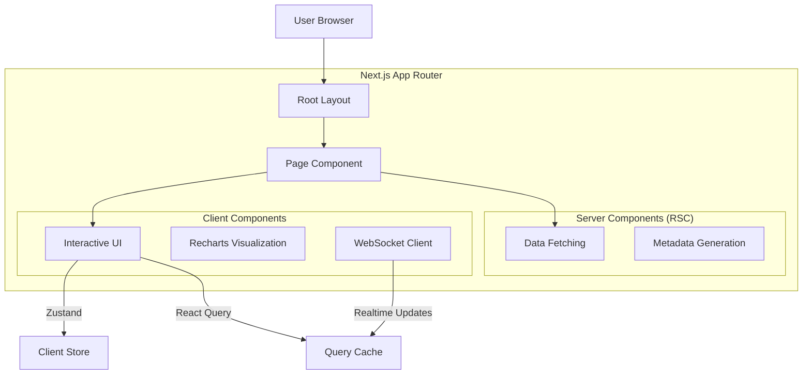

# 🌐 Web Architecture (Frontend)

## Overview

OpenManager VIBE v5 uses **Next.js 15 (App Router)** as the core framework, emphasizing **React Server Components (RSC)** for performance and **Client Components** for interactivity.

## 🏗️ Core Stack

| Component | Technology | Purpose |
|-----------|------------|---------|
| **Framework** | Next.js 15 | App Router, Server Actions, Edge Runtime |
| **Language** | TypeScript | Strict type safety, Zero `any` policy |
| **Styling** | Tailwind CSS | Utility-first styling, Dark mode support |
| **UI Library** | Shadcn/UI | Accessible, reusable components (Radix UI based) |
| **State** | Zustand | Global client state (Sidebar, UI preferences) |
| **Data Fetching** | React Query | Server state sync, caching, optimistic updates |
| **Charts** | Recharts | High-performance data visualization |

## 📐 Architecture Diagram

## 📂 Key Directory Structure

- **`src/app/`**: App Router pages and layouts.
    - `(main)/`: Authenticated routes.
    - `(auth)/`: Authentication routes.
    - `api/`: Route Handlers (Edge Functions).
- **`src/components/`**: Reusable UI components.
    - `ui/`: Shadcn/UI primitives.
    - `dashboard/`: Dashboard-specific widgets.
    - `charts/`: Recharts wrappers.
- **`src/lib/`**: Utility functions and configurations.

## ⚡ Performance Optimizations

1.  **Server Components**: Reduce client bundle size by rendering static content on the server.
2.  **Dynamic Imports**: Lazy load heavy components (e.g., Charts) using `next/dynamic`.
3.  **Edge Runtime**: API routes run on Vercel Edge Functions for low latency.
4.  **Optimistic UI**: Immediate feedback for user actions while waiting for server response.
