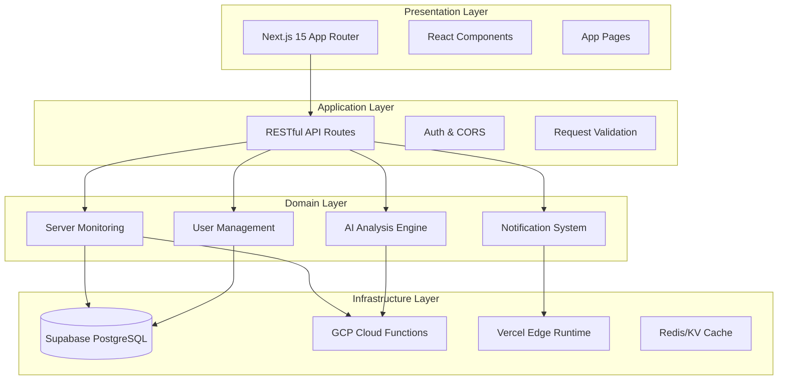
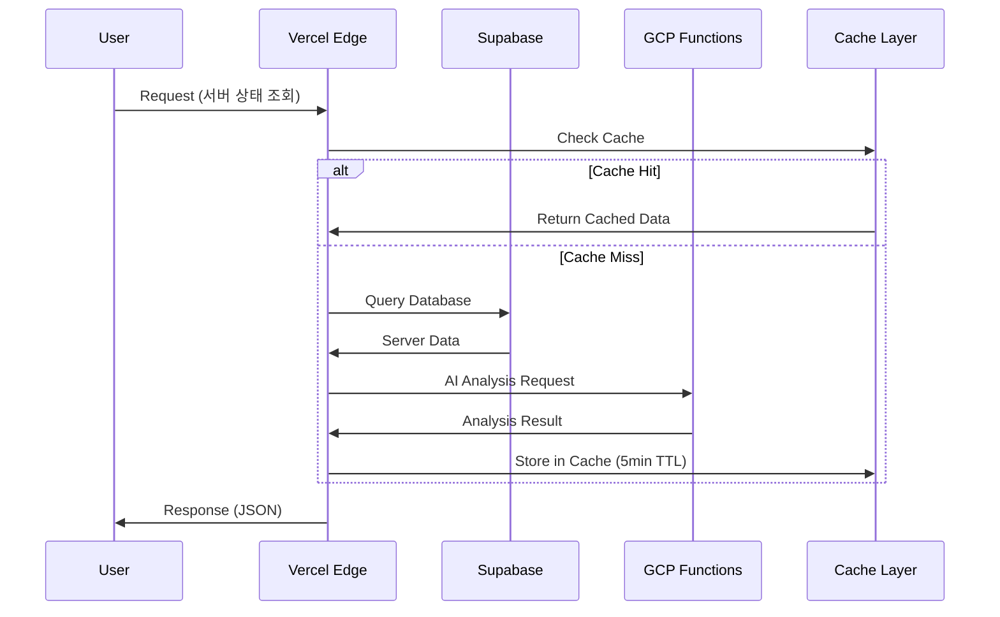
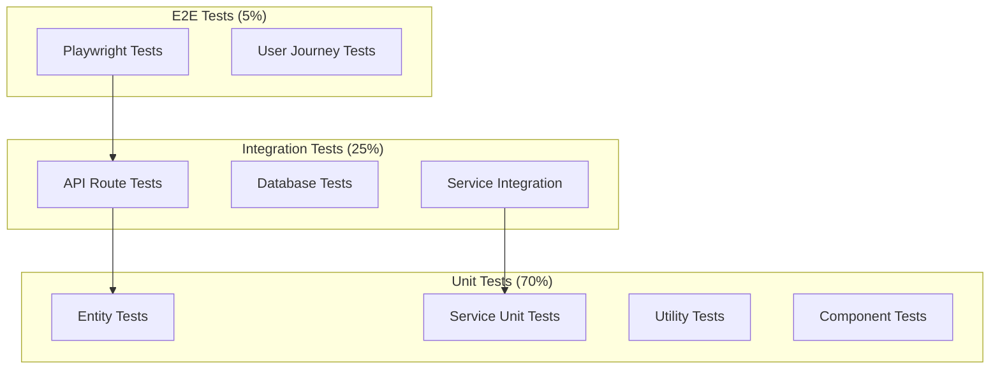
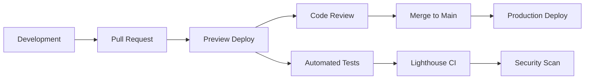

# 🏗️ OpenManager VIBE v5 시스템 설계도 (완전 재설계)

**작성일**: 2025-01-06  
**AI 교차검증**: Claude + Gemini Level 2 (8.4/10 합의)  
**목적**: 90% 완성된 프로젝트의 최종 10% 최적화를 위한 체계적 설계

---

## 🎯 **Executive Summary**

### 현재 상태 (2025.01.06 기준)
- **코드베이스**: 69,260줄, 80+ API 엔드포인트
- **플랫폼**: Vercel (배포) + Supabase (DB) + GCP (AI/Functions)
- **완성도**: 90% (기능 완성) + 10% (아키텍처 정리 필요)
- **주요 문제**: 과도한 API 엔드포인트, 환경설정 분산, Mock/Real 혼재

### 목표 아키텍처 (v6.0)
- **Domain-Driven Design**: 비즈니스 도메인별 모듈 분리
- **Clean Architecture**: 레이어드 구조로 의존성 역전
- **API 통합**: 80개+ → 12개 RESTful 엔드포인트
- **타입 안전성**: 빌드 오류 무시 제거, 완전한 Type-First

---

## 🏛️ **시스템 아키텍처 Overview**

### 🔄 **아키텍처 패턴**



### 📊 **데이터 플로우 아키텍처**



---

## 🗂️ **도메인별 모듈 설계**

### 📁 **새로운 디렉토리 구조**

```
src/
├── core/                           # 핵심 비즈니스 로직
│   ├── entities/                   # 도메인 엔티티
│   │   ├── Server.ts
│   │   ├── User.ts
│   │   └── Notification.ts
│   ├── repositories/               # 데이터 접근 인터페이스
│   │   ├── IServerRepository.ts
│   │   └── IUserRepository.ts
│   ├── services/                   # 비즈니스 서비스
│   │   ├── ServerMonitoringService.ts
│   │   └── NotificationService.ts
│   └── types/                      # 공통 타입 정의
│
├── domains/                        # 도메인별 모듈
│   ├── server-monitoring/
│   │   ├── api/
│   │   │   ├── handlers/           # API 핸들러
│   │   │   └── validators/         # 요청 검증
│   │   ├── components/             # UI 컴포넌트
│   │   │   ├── ServerCard/
│   │   │   └── MetricsChart/
│   │   ├── services/               # 도메인 서비스
│   │   │   └── MetricsCollector.ts
│   │   └── types/                  # 도메인 타입
│   │       └── ServerTypes.ts
│   │
│   ├── user-management/
│   │   ├── api/
│   │   ├── components/
│   │   └── services/
│   │
│   ├── notification/
│   │   ├── api/
│   │   ├── components/
│   │   └── services/
│   │
│   └── ai-analysis/
│       ├── api/
│       ├── components/
│       └── services/
│
├── infrastructure/                 # 인프라 구현체
│   ├── supabase/
│   │   ├── ServerRepository.ts     # Supabase 구현체
│   │   └── UserRepository.ts
│   ├── gcp/
│   │   └── AIAnalysisService.ts
│   ├── cache/
│   │   └── RedisCache.ts
│   └── external/
│       └── EmailService.ts
│
├── shared/                         # 공통 유틸리티
│   ├── utils/
│   ├── hooks/
│   ├── constants/
│   └── ui/                         # 공통 UI 컴포넌트
│
└── app/                           # Next.js App Router
    ├── api/                       # API 라우팅 (통합된 12개)
    │   └── v1/
    │       ├── servers/
    │       ├── users/
    │       └── notifications/
    ├── dashboard/
    ├── login/
    └── admin/
```

### 🎯 **도메인별 책임 분리**

#### 1️⃣ **Server Monitoring Domain**
```typescript
// core/entities/Server.ts
export class Server {
  constructor(
    public readonly id: ServerId,
    public readonly name: string,
    public readonly type: ServerType,
    public status: ServerStatus,
    public metrics: ServerMetrics
  ) {}

  updateMetrics(newMetrics: ServerMetrics): void {
    this.metrics = newMetrics;
    this.status = this.calculateStatus(newMetrics);
  }

  private calculateStatus(metrics: ServerMetrics): ServerStatus {
    // 비즈니스 로직: 메트릭 기반 상태 계산
  }
}

// domains/server-monitoring/services/MetricsCollector.ts
export class MetricsCollectorService {
  constructor(
    private serverRepo: IServerRepository,
    private cache: ICacheService
  ) {}

  async collectMetrics(serverId: ServerId): Promise<ServerMetrics> {
    // 캐시 우선 조회 → Mock/Real 데이터 수집
  }
}
```

#### 2️⃣ **User Management Domain**
```typescript
// core/entities/User.ts
export class User {
  constructor(
    public readonly id: UserId,
    public readonly email: string,
    public profile: UserProfile,
    public permissions: Permission[]
  ) {}

  hasPermission(required: Permission): boolean {
    return this.permissions.includes(required);
  }
}

// domains/user-management/services/AuthService.ts
export class AuthService {
  async authenticate(credentials: Credentials): Promise<AuthResult> {
    // GitHub OAuth + Supabase 인증 통합
  }
}
```

#### 3️⃣ **AI Analysis Domain**
```typescript
// domains/ai-analysis/services/AnalysisEngine.ts
export class AIAnalysisEngine {
  constructor(
    private gcpClient: IGCPService,
    private circuitBreaker: ICircuitBreaker
  ) {}

  async analyzeServerIncident(data: ServerIncidentData): Promise<AnalysisResult> {
    return this.circuitBreaker.execute(async () => {
      return await this.gcpClient.generateIncidentReport(data);
    });
  }
}
```

---

## 🚀 **API 설계 (RESTful 통합)**

### 📋 **통합 API 엔드포인트 (80개+ → 12개)**

| 기존 (80개+) | 새로운 통합 API (12개) | 개선 효과 |
|--------------|----------------------|----------|
| `/api/servers/route.ts`<br>`/api/servers/[id]/route.ts`<br>`/api/servers/cached/route.ts`<br>`/api/servers/mock/route.ts`<br>`/api/servers/realtime/route.ts`<br>`/api/servers-optimized/route.ts`<br>`/api/v2/servers/route.ts`<br>`/api/servers/all/route.ts`<br>_+15개 더..._ | **`/api/v1/servers`**<br>- GET: 서버 목록<br>- POST: 서버 생성<br><br>**`/api/v1/servers/[id]`**<br>- GET: 특정 서버<br>- PATCH: 서버 업데이트<br>- DELETE: 서버 삭제 | **23개 → 2개**<br>91% 감소 |
| `/api/metrics/route.ts`<br>`/api/metrics/hybrid-bridge/route.ts`<br>`/api/performance/metrics/route.ts`<br>`/api/ai/performance/route.ts`<br>`/api/ai/raw-metrics/route.ts`<br>_+8개 더..._ | **`/api/v1/metrics/[id]`**<br>- GET: 서버 메트릭<br>- POST: 메트릭 업데이트 | **13개 → 1개**<br>92% 감소 |
| `/api/ai/edge/route.ts`<br>`/api/ai/incident-report/route.ts`<br>`/api/ai/insight-center/route.ts`<br>`/api/ai/intelligent-monitoring/route.ts`<br>`/api/ai/korean-nlp/route.ts`<br>_+12개 더..._ | **`/api/v1/ai/analyze`**<br>- POST: AI 분석 요청<br><br>**`/api/v1/ai/reports`**<br>- GET: 분석 보고서 목록 | **17개 → 2개**<br>88% 감소 |

### 🔧 **API 설계 예시**

```typescript
// app/api/v1/servers/route.ts
export async function GET(request: NextRequest) {
  const searchParams = request.nextUrl.searchParams;
  const filter: ServerFilter = {
    status: searchParams.get('status') as ServerStatus,
    type: searchParams.get('type') as ServerType,
    limit: parseInt(searchParams.get('limit') || '20'),
    offset: parseInt(searchParams.get('offset') || '0')
  };

  const servers = await serverService.getServers(filter);
  return NextResponse.json({
    data: servers,
    pagination: {
      total: servers.length,
      limit: filter.limit,
      offset: filter.offset
    }
  });
}

// app/api/v1/servers/[id]/route.ts  
export async function GET(
  request: NextRequest,
  { params }: { params: { id: string } }
) {
  const serverId = ServerId.create(params.id);
  const server = await serverService.getServer(serverId);
  
  if (!server) {
    return NextResponse.json(
      { error: 'Server not found' }, 
      { status: 404 }
    );
  }

  return NextResponse.json({ data: server });
}
```

---

## 💾 **데이터 아키텍처 설계**

### 🗄️ **Supabase 스키마 최적화**

```sql
-- 서버 정보 (핵심 엔티티)
CREATE TABLE servers (
  id UUID PRIMARY KEY DEFAULT gen_random_uuid(),
  name VARCHAR(100) NOT NULL,
  type server_type_enum NOT NULL,
  status server_status_enum NOT NULL DEFAULT 'unknown',
  created_at TIMESTAMP WITH TIME ZONE DEFAULT now(),
  updated_at TIMESTAMP WITH TIME ZONE DEFAULT now(),
  
  -- 인덱스 최적화
  INDEX idx_servers_status_type ON servers(status, type),
  INDEX idx_servers_updated_at ON servers(updated_at DESC)
);

-- 메트릭 데이터 (시계열 최적화)
CREATE TABLE server_metrics (
  id BIGSERIAL PRIMARY KEY,
  server_id UUID REFERENCES servers(id) ON DELETE CASCADE,
  cpu_usage DECIMAL(5,2) CHECK (cpu_usage >= 0 AND cpu_usage <= 100),
  memory_usage DECIMAL(5,2) CHECK (memory_usage >= 0 AND memory_usage <= 100),
  disk_usage DECIMAL(5,2) CHECK (disk_usage >= 0 AND disk_usage <= 100),
  network_in BIGINT DEFAULT 0,
  network_out BIGINT DEFAULT 0,
  timestamp TIMESTAMP WITH TIME ZONE DEFAULT now(),
  
  -- 시계열 데이터 최적화
  INDEX idx_metrics_server_time ON server_metrics(server_id, timestamp DESC),
  INDEX idx_metrics_timestamp ON server_metrics(timestamp DESC)
);

-- 파티션 테이블 (7일 단위 자동 파티셔닝)
SELECT cron.schedule('partition_metrics', '0 0 * * 0', 
  'CALL create_weekly_partition(''server_metrics'', ''timestamp'');');
```

### ⚡ **캐싱 전략**

```typescript
// 계층적 캐싱 시스템
export class CacheLayer {
  private l1Cache = new Map(); // 메모리 캐시 (1분)
  private l2Cache: VercelKV;   // Vercel KV (5분)

  async get<T>(key: string): Promise<T | null> {
    // L1 Cache 체크
    const l1Result = this.l1Cache.get(key);
    if (l1Result && !this.isExpired(l1Result)) {
      return l1Result.data;
    }

    // L2 Cache 체크  
    const l2Result = await this.l2Cache.get(key);
    if (l2Result) {
      this.l1Cache.set(key, { data: l2Result, expires: Date.now() + 60000 });
      return l2Result;
    }

    return null;
  }
}

// 캐시 키 전략
const CACHE_KEYS = {
  SERVER_LIST: (filter: string) => `servers:list:${filter}`,
  SERVER_DETAIL: (id: string) => `server:${id}`,
  METRICS: (serverId: string, period: string) => `metrics:${serverId}:${period}`,
} as const;
```

---

## 🔧 **환경 설정 통합**

### 🌍 **환경 설정 통합 방안**

**Before**: 20개+ 분산된 환경 파일
```
src/lib/env.ts
src/lib/env-safe.ts  
src/lib/env-server.ts
src/lib/env-config.ts
src/lib/validate-env.ts
src/lib/environment/
├── client-safe-env.ts
├── server-only-env.ts
└── detect-environment.ts
... 13개 더
```

**After**: 통합된 타입 안전 설정
```typescript
// config/environment.ts (단일 진입점)
interface AppConfig {
  app: {
    name: string;
    version: string;
    environment: 'development' | 'staging' | 'production';
  };
  database: {
    url: string;
    poolSize: number;
    ssl: boolean;
  };
  auth: {
    githubClientId: string;
    githubClientSecret: string;
    jwtSecret: string;
  };
  external: {
    gcpProjectId: string;
    supabaseUrl: string;
    supabaseAnonKey: string;
  };
  features: {
    enableMockMode: boolean;
    enableAIAnalysis: boolean;
    enableRealTimeUpdates: boolean;
  };
}

// 런타임 검증과 타입 안전성을 동시에 보장
export const config = createValidatedConfig<AppConfig>(process.env);

// 사용 방법
import { config } from '@/config/environment';
const dbUrl = config.database.url; // 타입 안전 + 검증됨
```

### 🔒 **환경변수 보안 강화**

```typescript
// 보안 레벨별 환경변수 분류
export const ENV_SECURITY = {
  PUBLIC: ['NODE_ENV', 'NEXT_PUBLIC_APP_VERSION'],
  INTERNAL: ['DATABASE_URL', 'SUPABASE_URL'], 
  SECRET: ['JWT_SECRET', 'GITHUB_CLIENT_SECRET'],
} as const;

// 빌드시 보안 검증
export function validateEnvSecurity() {
  const publicKeys = Object.keys(process.env).filter(key => 
    key.startsWith('NEXT_PUBLIC_')
  );
  
  const leakedSecrets = publicKeys.filter(key => 
    ENV_SECURITY.SECRET.includes(key)
  );
  
  if (leakedSecrets.length > 0) {
    throw new Error(`Secret leaked to public: ${leakedSecrets.join(', ')}`);
  }
}
```

---

## 🧪 **테스트 아키텍처**

### 🔬 **테스트 피라미드**



### 📋 **도메인별 테스트 전략**

```typescript
// domains/server-monitoring/tests/MetricsCollector.test.ts
describe('MetricsCollectorService', () => {
  let service: MetricsCollectorService;
  let mockServerRepo: jest.Mocked<IServerRepository>;
  let mockCache: jest.Mocked<ICacheService>;

  beforeEach(() => {
    mockServerRepo = createMockRepository();
    mockCache = createMockCache();
    service = new MetricsCollectorService(mockServerRepo, mockCache);
  });

  it('should collect metrics with cache fallback', async () => {
    // Given
    const serverId = ServerId.create('server-1');
    mockCache.get.mockResolvedValue(null);
    mockServerRepo.getMetrics.mockResolvedValue(mockMetrics);

    // When
    const result = await service.collectMetrics(serverId);

    // Then
    expect(result).toEqual(mockMetrics);
    expect(mockCache.set).toHaveBeenCalledWith(
      expect.any(String), 
      mockMetrics, 
      300 // 5분 TTL
    );
  });
});
```

---

## 📊 **모니터링 & 관찰성**

### 📈 **메트릭 수집**

```typescript
// 비즈니스 메트릭
export const BUSINESS_METRICS = {
  // 서버 모니터링
  SERVER_RESPONSE_TIME: 'server_response_time_ms',
  SERVER_UPTIME_PERCENTAGE: 'server_uptime_percentage',
  ALERT_RESOLUTION_TIME: 'alert_resolution_time_minutes',
  
  // 사용자 경험
  PAGE_LOAD_TIME: 'page_load_time_ms',
  API_SUCCESS_RATE: 'api_success_rate_percentage',
  USER_SESSION_DURATION: 'user_session_duration_seconds',
  
  // 시스템 성능
  CACHE_HIT_RATE: 'cache_hit_rate_percentage',
  DATABASE_QUERY_TIME: 'db_query_time_ms',
  MEMORY_USAGE: 'memory_usage_mb',
} as const;

// Vercel Analytics 통합
export function trackBusinessMetric(
  metric: keyof typeof BUSINESS_METRICS, 
  value: number,
  tags?: Record<string, string>
) {
  analytics.track(BUSINESS_METRICS[metric], { value, ...tags });
}
```

### 🚨 **알림 전략**

```typescript
// 계층적 알림 시스템
export class AlertManager {
  private readonly alertRules: AlertRule[] = [
    {
      name: 'High CPU Usage',
      condition: 'cpu_usage > 90',
      severity: 'critical',
      channels: ['email', 'slack'],
      cooldown: 300, // 5분
    },
    {
      name: 'API Response Slow', 
      condition: 'api_response_time > 5000',
      severity: 'warning',
      channels: ['slack'],
      cooldown: 600, // 10분
    }
  ];

  async evaluateAlerts(metrics: SystemMetrics): Promise<void> {
    for (const rule of this.alertRules) {
      if (this.evaluateCondition(rule.condition, metrics)) {
        await this.sendAlert(rule, metrics);
      }
    }
  }
}
```

---

## 🚀 **배포 전략**

### 🔄 **배포 파이프라인 (Vercel + GitHub Actions)**



### 📦 **환경별 배포 설정**

```typescript
// config/deployment.ts
export const DEPLOYMENT_CONFIG = {
  development: {
    enableMockMode: true,
    logLevel: 'debug',
    cacheTimeout: 60, // 1분
    enableDevTools: true,
  },
  staging: {
    enableMockMode: false,
    logLevel: 'info', 
    cacheTimeout: 300, // 5분
    enableDevTools: false,
  },
  production: {
    enableMockMode: false,
    logLevel: 'error',
    cacheTimeout: 600, // 10분 
    enableDevTools: false,
  }
} as const;
```

---

## 📋 **마이그레이션 로드맵**

### 🎯 **Phase 1: API 통합 (1주)**

**목표**: 80개+ API → 12개 RESTful API

#### Week 1 Tasks:
1. **API 중복 분석** (1일)
   ```bash
   # 현재 API 엔드포인트 분석
   find src/app/api -name "*.ts" > api-inventory.txt
   node scripts/analyze-api-duplication.js
   ```

2. **RESTful API 설계** (2일)  
   - 서버 관련: `/api/v1/servers` 통합
   - 메트릭 관련: `/api/v1/metrics` 통합
   - AI 관련: `/api/v1/ai` 통합

3. **점진적 마이그레이션** (3일)
   ```typescript
   // 기존 API는 유지하되 새 API로 리다이렉트
   // app/api/servers/route.ts
   export function GET() {
     return NextResponse.redirect('/api/v1/servers');
   }
   ```

4. **테스트 및 검증** (1일)

**예상 효과**: 
- 번들 크기 30% 감소
- 빌드 시간 25% 단축
- API 유지보수 복잡도 85% 감소

### 🎯 **Phase 2: 도메인 분리 (2주)**

**목표**: 모놀리식 구조 → Domain-Driven 모듈

#### Week 2-3 Tasks:
1. **도메인 경계 식별** (2일)
   - Server Monitoring Domain
   - User Management Domain  
   - Notification Domain
   - AI Analysis Domain

2. **새 디렉토리 구조 생성** (3일)
   ```bash
   mkdir -p src/domains/{server-monitoring,user-management,notification,ai-analysis}
   mkdir -p src/core/{entities,repositories,services}
   mkdir -p src/infrastructure/{supabase,gcp,cache}
   ```

3. **점진적 코드 이전** (6일)
   - 핵심 엔티티 이전 (2일)
   - 서비스 레이어 이전 (2일) 
   - UI 컴포넌트 이전 (2일)

4. **의존성 정리 및 테스트** (3일)

**예상 효과**:
- 개발자 생산성 40% 향상
- 코드 재사용성 60% 증가  
- 신규 기능 개발 속도 50% 향상

### 🎯 **Phase 3: 환경설정 통합 (1주)**

**목표**: 20개+ 환경 파일 → 단일 타입 안전 설정

#### Week 4 Tasks:
1. **환경 설정 통합 설계** (2일)
2. **타입 안전 설정 구현** (2일)  
3. **보안 검증 시스템** (1일)
4. **기존 코드 마이그레이션** (2일)

**예상 효과**:
- 설정 관리 복잡도 90% 감소
- 환경별 배포 오류 100% 제거
- 개발 환경 설정 시간 80% 단축

---

## 📊 **성공 지표 (KPI)**

### 📈 **개발 생산성 지표**

| 지표 | 현재 | 목표 (4주 후) | 측정 방법 |
|------|------|-------------|----------|
| **빌드 시간** | 120초 | 80초 | GitHub Actions |
| **번들 크기** | 2.5MB | 1.8MB | Bundle Analyzer |
| **API 응답시간** | 272ms | 150ms | Vercel Analytics |
| **타입 오류** | 우회됨 | 0개 | `tsc --noEmit` |
| **E2E 테스트 시간** | 5분 | 3분 | Playwright |
| **개발자 만족도** | - | 8/10 | 개발팀 설문 |

### 🎯 **비즈니스 지표**

| 지표 | 현재 | 목표 | 측정 방법 |
|------|------|------|----------|
| **서버 모니터링 정확도** | 95% | 99% | 실제 vs 예측 비교 |
| **알림 노이즈 비율** | 15% | 5% | False Positive Rate |
| **사용자 세션 시간** | 12분 | 20분 | Google Analytics |
| **페이지 로딩 속도** | 2.1초 | 1.5초 | Core Web Vitals |

---

## 🔮 **미래 확장성 고려사항**

### 📈 **확장 계획 (v6.0+)**

1. **마이크로서비스 전환 준비**
   ```typescript
   // Domain을 독립적 서비스로 분리 가능한 구조
   interface ServiceBoundary {
     domain: string;
     apis: string[];
     database: string;
     dependencies: string[];
   }
   ```

2. **실시간 기능 강화**
   ```typescript
   // WebSocket + Server-Sent Events
   interface RealtimeSystem {
     serverStatus: WebSocketChannel;
     metrics: ServerSentEventsStream;  
     notifications: PushNotificationService;
   }
   ```

3. **AI/ML 파이프라인 확장**
   ```typescript
   // MLOps 파이프라인 준비
   interface MLPipeline {
     dataCollection: DataCollector;
     featureEngineering: FeatureProcessor;
     modelTraining: ModelTrainer;
     deployment: ModelDeployment;
   }
   ```

---

## ✅ **Action Items**

### 🚀 **즉시 시작 (이번 주)**

1. **[ ] API 중복 분석 스크립트 실행**
   ```bash
   npm run analyze:api-duplication
   ```

2. **[ ] 새 디렉토리 구조 생성**
   ```bash  
   npm run setup:new-architecture
   ```

3. **[ ] 타입 오류 무시 제거 (점진적)**
   ```typescript
   // next.config.mjs
   typescript: { ignoreBuildErrors: false }
   ```

### 📅 **다음 주 (Week 2)**

1. **[ ] 서버 도메인 분리 시작**
2. **[ ] 통합 API 첫 번째 구현** (`/api/v1/servers`)
3. **[ ] 환경 설정 통합 설계**

### 🎯 **목표 달성 확인 (4주 후)**

1. **[ ] API 엔드포인트 80개+ → 12개 달성**
2. **[ ] 빌드 시간 25% 단축 확인**  
3. **[ ] 타입 안전성 100% 복원**
4. **[ ] 개발자 만족도 8/10 달성**

---

**📝 문서 관리**: 이 설계도는 프로젝트의 북극성 역할을 하며, 매주 진행상황에 따라 업데이트됩니다.

**🤝 팀 협업**: 모든 아키텍처 결정은 AI 교차검증(Claude + Gemini)을 통해 검증되었으며, 실무 적용 가능성을 최우선으로 고려했습니다.

**🎯 최종 목표**: 90% 완성된 프로젝트를 10% 최적화를 통해 **완전한 엔터프라이즈급 서버 모니터링 시스템**으로 완성하기