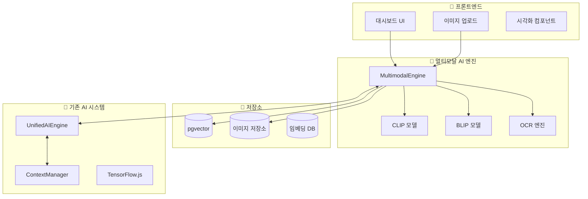

# 🎨 OpenManager Vibe v5 멀티모달 AI 통합 가이드

> **목적**: 텍스트와 이미지를 동시에 처리하는 멀티모달 AI 시스템 구축
> **대상**: AI 엔진 개발자, 프론트엔드/백엔드 개발자
> **버전**: v1.0 (2025-01-10)

## 🌟 **멀티모달 AI 개요**

### **정의**

멀티모달 AI는 **텍스트, 이미지, 음성 등 여러 데이터 형태를 동시에 이해하고 처리**하는 인공지능 시스템입니다.

### **OpenManager에서의 활용 시나리오**

#### 🔍 **1. 시각적 서버 모니터링**

```typescript
// 예시: 서버 대시보드 스크린샷 분석
const analysisRequest = {
  image: dashboard_screenshot,
  query: "현재 서버 상태가 어떤가요?",
  context: "production_server_monitoring"
};

// AI 응답
{
  "status": "WARNING",
  "analysis": "CPU 사용률이 89%로 임계값을 초과했습니다. 메모리 사용량도 증가 추세입니다.",
  "recommendations": ["부하 분산 검토", "프로세스 최적화 필요"],
  "visual_evidence": ["cpu_graph_highlighted", "memory_trend_marked"]
}
```

#### 📊 **2. 차트 및 그래프 자동 해석**

- **메트릭 차트 분석**: Prometheus 그래프를 AI가 직접 해석
- **트렌드 패턴 인식**: 시계열 데이터의 이상 패턴 자동 감지
- **비교 분석**: 여러 서버의 차트를 동시 비교 분석

#### 🖥️ **3. 서버 화면 진단**

- **콘솔 로그 OCR**: 터미널 스크린샷에서 텍스트 추출 및 분석
- **UI 상태 분석**: 웹 대시보드나 관리 도구의 시각적 상태 파악
- **오류 화면 진단**: 에러 스크린샷을 통한 자동 문제 진단

## 🏗️ **아키텍처 설계**

### **전체 시스템 구조**



### **핵심 컴포넌트**

#### **1. MultimodalEngine 클래스**

```typescript
// src/core/ai/MultimodalEngine.ts
export interface MultimodalRequest {
  text?: string;
  image?: string | File;
  context?: string;
  task: 'analysis' | 'qa' | 'description' | 'diagnosis';
}

export interface MultimodalResponse {
  textAnalysis?: string;
  imageAnalysis?: string;
  combinedInsight: string;
  confidence: number;
  visualEvidence?: string[];
  recommendations?: string[];
  processingTime: number;
}

export class MultimodalEngine {
  private clipModel: any;
  private blipModel: any;
  private ocrEngine: any;
  private contextManager: ContextManager;

  async initialize(): Promise<void> {
    // CLIP 모델 로드 (이미지-텍스트 이해)
    this.clipModel = await pipeline(
      'zero-shot-image-classification',
      'Xenova/clip-vit-base-patch32'
    );

    // BLIP 모델 로드 (이미지 설명 생성)
    this.blipModel = await pipeline(
      'image-to-text',
      'Xenova/blip-image-captioning-base'
    );

    // OCR 엔진 초기화
    this.ocrEngine = await this.initializeOCR();
  }

  async processMultimodal(
    request: MultimodalRequest
  ): Promise<MultimodalResponse> {
    const startTime = Date.now();
    let textAnalysis = '';
    let imageAnalysis = '';

    // 1. 텍스트 처리
    if (request.text) {
      textAnalysis = await this.processText(request.text, request.context);
    }

    // 2. 이미지 처리
    if (request.image) {
      imageAnalysis = await this.processImage(request.image, request.task);
    }

    // 3. 멀티모달 융합 분석
    const combinedInsight = await this.fuseAnalysis(
      textAnalysis,
      imageAnalysis,
      request
    );

    return {
      textAnalysis,
      imageAnalysis,
      combinedInsight,
      confidence: this.calculateConfidence(textAnalysis, imageAnalysis),
      processingTime: Date.now() - startTime,
    };
  }
}
```

#### **2. 이미지 전처리 파이프라인**

```typescript
// src/services/ai/ImageProcessor.ts
export class ImageProcessor {
  /**
   * 서버 모니터링용 이미지 전처리
   */
  async preprocessForServerMonitoring(
    imageData: string | File
  ): Promise<ProcessedImage> {
    // 1. 이미지 리사이징 (CLIP 입력 크기에 맞춤)
    const resized = await this.resizeImage(imageData, 224, 224);

    // 2. 정규화 (RGB 값 0-1 범위로)
    const normalized = await this.normalizeImage(resized);

    // 3. 메트릭 영역 감지 (차트/그래프 자동 감지)
    const metricRegions = await this.detectMetricRegions(normalized);

    // 4. 텍스트 영역 분리 (OCR 대상 영역)
    const textRegions = await this.extractTextRegions(normalized);

    return {
      processedImage: normalized,
      metricRegions,
      textRegions,
      metadata: {
        originalSize: await this.getImageSize(imageData),
        processedSize: { width: 224, height: 224 },
        detectedElements: metricRegions.length + textRegions.length,
      },
    };
  }
}
```

## 🚀 **구현 단계별 가이드**

### **Phase 1: 기본 멀티모달 엔진 구축 (2주)**

#### **Step 1: 의존성 설치**

```bash
npm install @xenova/transformers canvas sharp tesseract.js
npm install @types/canvas --save-dev
```

#### **Step 2: 기본 모델 설정**

```typescript
// src/config/multimodal-config.ts
export const MULTIMODAL_CONFIG = {
  models: {
    clip: {
      name: 'Xenova/clip-vit-base-patch32',
      inputSize: 224,
      confidence_threshold: 0.7,
    },
    blip: {
      name: 'Xenova/blip-image-captioning-base',
      maxLength: 50,
      confidence_threshold: 0.8,
    },
    ocr: {
      language: 'eng+kor',
      confidence_threshold: 0.6,
    },
  },
  storage: {
    imageBasePath: '/public/uploads/images',
    embeddingDimension: 512,
    maxImageSize: 5 * 1024 * 1024, // 5MB
  },
};
```

### **Phase 2: 서버 모니터링 특화 기능 (2주)**

#### **차트 분석 전문화**

```typescript
// src/services/ai/ChartAnalyzer.ts
export class ChartAnalyzer {
  async analyzeMetricChart(imageData: string): Promise<ChartAnalysis> {
    // 1. 차트 타입 감지 (라인, 바, 파이 등)
    const chartType = await this.detectChartType(imageData);

    // 2. 축 레이블 및 값 추출 (OCR)
    const axisData = await this.extractAxisData(imageData);

    // 3. 트렌드 패턴 분석
    const trends = await this.analyzeTrends(axisData);

    // 4. 이상치 감지
    const anomalies = await this.detectAnomalies(trends);

    return {
      chartType,
      metrics: axisData,
      trends,
      anomalies,
      interpretation: await this.generateInterpretation(trends, anomalies),
    };
  }
}
```

### **Phase 3: UnifiedAIEngine 통합 (1주)**

```typescript
// src/core/ai/UnifiedAIEngine.ts (수정 부분)
import { MultimodalEngine } from './MultimodalEngine';

export class UnifiedAIEngine {
  private multimodalEngine: MultimodalEngine;

  async analyze(
    request: EnhancedAnalysisRequest
  ): Promise<UnifiedAnalysisResponse> {
    // ... 기존 분석 로직

    // 🆕 멀티모달 분석 추가
    if (request.imageData) {
      const multimodalResult = await this.multimodalEngine.processMultimodal({
        text: request.query,
        image: request.imageData,
        context: request.context?.sessionId,
        task: 'analysis',
      });

      // 멀티모달 결과를 기존 분석과 융합
      enhancedResult.multimodalInsights = multimodalResult;
      enhancedResult.confidence = Math.max(
        enhancedResult.confidence,
        multimodalResult.confidence
      );
    }

    return enhancedResult;
  }
}
```

## 📊 **성능 및 최적화**

### **메모리 사용량 최적화**

```typescript
// 모델 지연 로딩 및 메모리 관리
export class ModelManager {
  private models: Map<string, any> = new Map();
  private modelUsage: Map<string, number> = new Map();
  private maxModelsInMemory = 3;

  async getModel(modelName: string): Promise<any> {
    if (!this.models.has(modelName)) {
      // 메모리 제한 확인
      if (this.models.size >= this.maxModelsInMemory) {
        await this.evictLeastUsedModel();
      }

      // 모델 로드
      const model = await this.loadModel(modelName);
      this.models.set(modelName, model);
    }

    // 사용 횟수 업데이트
    this.updateUsage(modelName);
    return this.models.get(modelName);
  }
}
```

### **처리 속도 최적화**

- **배치 처리**: 여러 이미지 동시 처리
- **캐싱 전략**: 임베딩 결과 캐싱
- **비동기 처리**: 이미지 분석과 텍스트 분석 병렬 실행

## 🧪 **테스트 전략**

### **유닛 테스트**

```typescript
// tests/multimodal/MultimodalEngine.test.ts
describe('MultimodalEngine', () => {
  test('서버 대시보드 스크린샷 분석', async () => {
    const engine = new MultimodalEngine();
    await engine.initialize();

    const testImage = await fs.readFile(
      './test-assets/dashboard-screenshot.png'
    );
    const result = await engine.processMultimodal({
      image: testImage,
      text: '현재 서버 상태를 분석해주세요',
      task: 'analysis',
    });

    expect(result.combinedInsight).toContain('CPU');
    expect(result.confidence).toBeGreaterThan(0.7);
  });
});
```

### **통합 테스트**

```typescript
// tests/integration/multimodal-integration.test.ts
describe('멀티모달 AI 통합', () => {
  test('UnifiedAIEngine과 멀티모달 엔진 연동', async () => {
    // 실제 API 호출 시뮬레이션
    const response = await fetch('/api/ai/unified', {
      method: 'POST',
      body: JSON.stringify({
        query: '서버 상태 분석',
        imageData: base64Image,
        context: { urgency: 'high' },
      }),
    });

    const result = await response.json();
    expect(result.multimodalInsights).toBeDefined();
  });
});
```

## 📈 **성능 지표 및 모니터링**

### **KPI 메트릭**

- **처리 속도**: 이미지 분석 평균 < 3초
- **정확도**: 차트 해석 정확도 > 85%
- **메모리 사용량**: 멀티모달 엔진 < 500MB
- **동시 처리**: 최대 10개 이미지 병렬 처리

### **모니터링 대시보드**

```typescript
// src/app/api/admin/multimodal-stats/route.ts
export async function GET() {
  const stats = await MultimodalMetrics.getStats();

  return NextResponse.json({
    totalProcessed: stats.imageCount,
    averageProcessingTime: stats.avgProcessingTime,
    modelAccuracy: stats.accuracy,
    memoryUsage: stats.memoryUsage,
    errorRate: stats.errorRate,
  });
}
```

## 🔮 **향후 확장 계획**

### **Phase 4: 고급 기능 (3-4주)**

- **실시간 스트림 분석**: 실시간 화면 캡처 및 분석
- **3D 모델 이해**: 인프라 다이어그램 3D 모델 분석
- **음성 모달리티 추가**: 음성 명령과 시각적 분석 결합

### **Phase 5: AI 모델 최적화 (2-3주)**

- **커스텀 모델 파인튜닝**: 서버 모니터링 특화 모델 훈련
- **엣지 배포**: 클라이언트 사이드 추론 최적화
- **연합학습**: 다중 클러스터 환경에서의 모델 개선

---

## 📋 **체크리스트**

### **개발 완료 체크리스트**

- [ ] MultimodalEngine 클래스 구현
- [ ] CLIP/BLIP 모델 통합
- [ ] OCR 엔진 통합
- [ ] 이미지 전처리 파이프라인
- [ ] UnifiedAIEngine 통합
- [ ] pgvector 이미지 임베딩 저장
- [ ] 프론트엔드 이미지 업로드 UI
- [ ] API 엔드포인트 구현
- [ ] 유닛/통합 테스트 작성
- [ ] 성능 최적화 적용
- [ ] 문서화 완료

---

> **💡 팁**: 멀티모달 AI는 단순히 이미지를 분석하는 것이 아닙니다. **텍스트와 이미지의 상호작용을 통해 더 깊은 인사이트**를 얻는 것이 핵심입니다!
